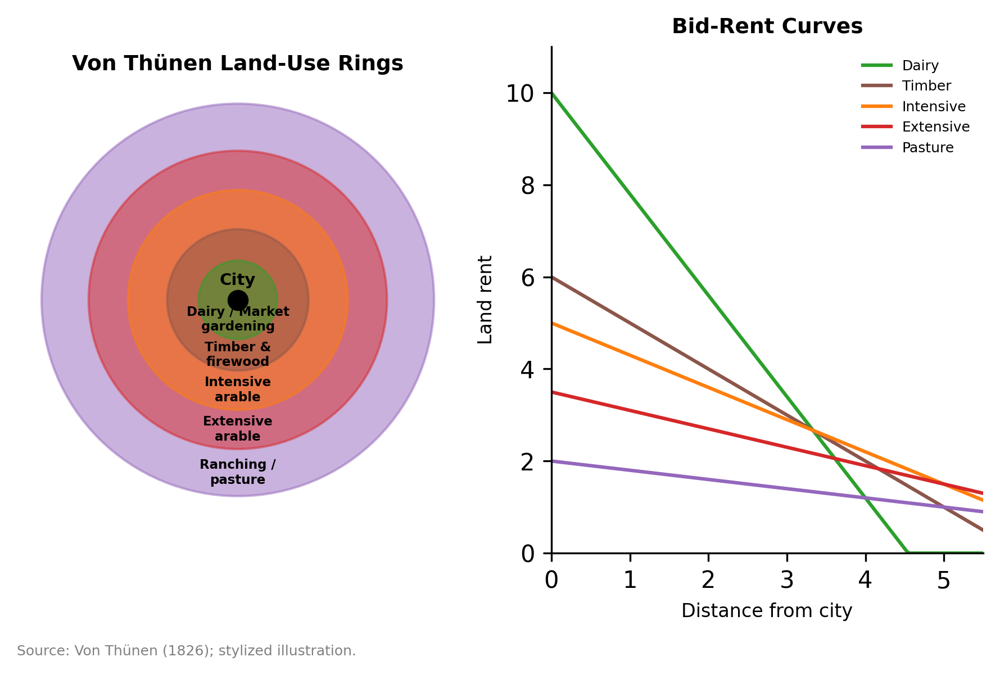
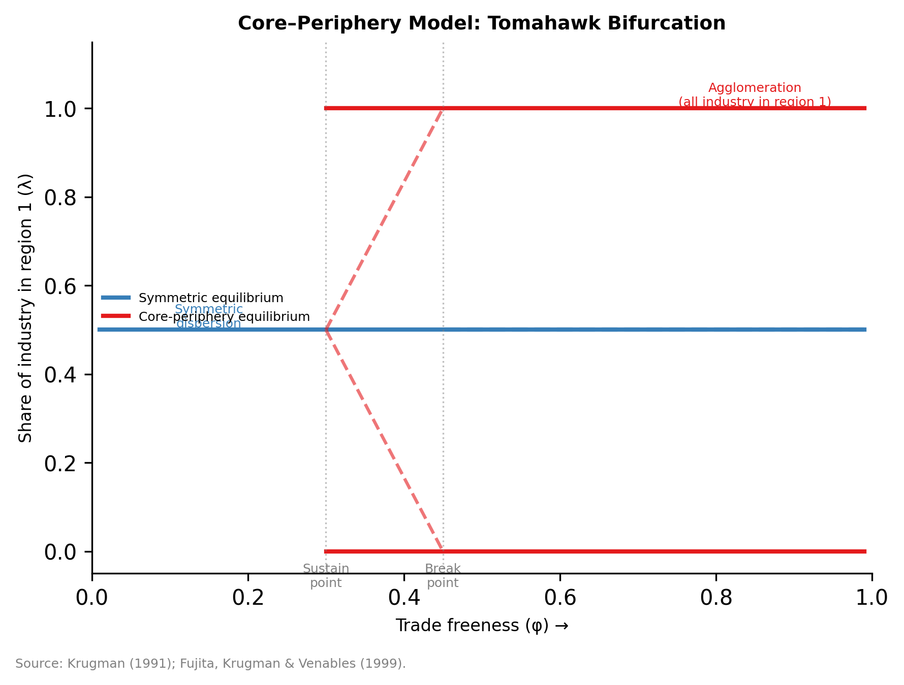

# Chapter 1: The Micro-Foundations of Space — From Classical to New Economic Geography

---

## Opening Case: Bangalore and Kolkata — An Equilibrium Puzzle

In 1947, Calcutta was the obvious candidate for India's first technology metropolis. The capital of British India until the colonial government's symbolic retreat to New Delhi in 1911, it had the subcontinent's most sophisticated financial infrastructure, its densest concentration of universities and research institutes, and a cosmopolitan industrial workforce built around jute milling, precision engineering, and colonial commerce. Its port connected Bengal to global trade routes. The Indian Institute of Technology at Kharagpur, established in 1951 as the first of its kind, was a short rail journey to the west. If you had asked an economist in 1970 to predict which Indian city would emerge as Asia's premier software hub, Calcutta would have been a defensible first answer.

The answer turned out to be Bangalore, located eight hundred kilometers to the south on the Mysore Plateau — a garden city of modest size whose prior claims to distinction were a mild climate, a nineteenth-century Maharaja's taste for botanical gardens, and a cluster of government defense laboratories. What changed? The sequence matters more than any single cause. The Indian Institute of Science, established in Bangalore in 1909 with an endowment from Jamsetji Tata and the Mysore royal family, had spent four decades producing engineers and physicists who fed into the public-sector defense and aerospace complex the Indian government built there during the 1940s and 1950s: Hindustan Aeronautics Limited (1940), the Defence Research and Development Organisation, Bharat Electronics Limited. By the early 1980s, Bangalore had an unusually dense concentration of technically trained workers — not for any market reason, but because of the geography of India's Cold War industrial policy.

Texas Instruments arrived in 1985, establishing India's first offshore chip design center and installing what was then the country's most capable private satellite uplink. That uplink solved the connectivity problem that made real-time, high-bandwidth services exports impossible from anywhere else on the subcontinent. Infosys, founded in Pune in 1981, relocated its center of gravity to Bangalore. Wipro pivoted from vegetable oil to software. Each hire thickened the labor pool; each new firm made the next recruitment easier. When India liberalized in 1991 and the government launched the Software Technology Parks of India scheme — bonded warehouses, tax exemptions, and subsidized bandwidth in exchange for export commitments — Bangalore already had the labor market depth that every other Indian city lacked. The scheme ratified an agglomeration that the defense industry had accidentally initiated.

Calcutta, meanwhile, had been governed since 1977 by the Left Front coalition, which presided over a land reform program that was arguably the most successful rural redistribution in post-independence India — and a business environment that was remorselessly hostile to private enterprise. Labour militancy, power shortages, and bureaucratic attrition drove manufacturing out of Bengal through the 1980s and 1990s. When IT arrived, the city had the educational talent — IIT Kharagpur, Jadavpur University, and Presidency College produced engineers of the first rank — but not the institutional soil in which a cluster could root. The engineers left.

By the mid-2000s, Bangalore's information technology and IT-enabled services sector employed roughly 400,000 workers — the largest concentration in India — and its software exports accounted for a substantial and growing share of the national total. By the mid-2010s, the city's IT workforce had surpassed one million. Kolkata's IT sector existed but remained an order of magnitude smaller, despite comparable access to technical graduates.

This divergence is, in a precise sense, an equilibrium phenomenon. Both cities had the underlying human capital to become IT centres. Neither had an insurmountable natural advantage. What Bangalore had was a sequence of early perturbations — IISc, the defence PSU cluster, the Texas Instruments uplink — that created just enough of a labour market head start to trigger the circular causation that Paul Krugman formalized: workers go where firms are; firms go where workers are; the resulting agglomeration is self-sustaining. Calcutta experienced a different sequence of shocks and locked into a different equilibrium. The spatial pattern of India's IT industry was not foreordained by geography. It was made by history.

The Bangalore–Kolkata comparison threads through this chapter as a concrete instance of its central questions. Why does economic activity cluster, even when the activity itself is weightless? What holds clusters together once they form? Can deliberate policy shift an economy from one spatial equilibrium to another? This chapter builds the theoretical vocabulary — classical location theory, the New Economic Geography, the Marshallian micro-mechanisms of sharing, matching, and learning — needed to answer those questions rigorously. Chapter 8 returns to South Asia's IT geography in full, tracing how the spatial logic of India's software industry is now reshaping itself under the pressures of rising Bangalore land costs, the COVID-era dispersal experiment, and the ambitions of tier-2 cities that hope to engineer the next equilibrium shift.

---

## Introduction: The Clustering Puzzle

Consider a simple fact: the Boston–Washington corridor, stretching about 700 kilometers along the US Northeast coast, accounts for roughly 20 percent of American GDP while occupying less than 2 percent of its land area. The Pearl River Delta — Guangzhou, Shenzhen, Hong Kong — has transformed from a network of fishing villages into the world's most productive manufacturing complex in less than two generations, despite being located in a subtropical estuary with no particular resource endowment. Luxembourg, a landlocked country smaller than Rhode Island, hosts more financial assets per capita than Switzerland. None of these concentrations were geographically predetermined. Natural resources are not the explanation.

This chapter is about why economic activity clusters — and what the clustering tells us about how regions develop, stagnate, and occasionally reinvent themselves. The question sounds descriptive but is actually deeply theoretical: clustering is a general equilibrium outcome, not a natural fact. It emerges from the interaction of individual decisions, and those decisions are shaped by returns to scale, transport costs, and the expectation that other people will also cluster. This circularity — the self-reinforcing nature of spatial concentration — is the core intellectual problem of regional economics, and solving it requires building from micro-foundations.

The chapter proceeds in five movements, using the Bangalore–Kolkata divergence as a running illustration. We begin with the classical location theorists — Von Thünen, Weber, Christaller, and Lösch — whose models still define the benchmark logic of land rent and transport cost. We then turn to the **New Economic Geography (NEG)**, which Krugman formalized in 1991 and which fundamentally changed how economists think about space by incorporating increasing returns and circular causation. The third movement unpacks the **Marshallian trinity** — the three micro-mechanisms through which density produces productivity — following the influential synthesis by Duranton and Puga (2004). The fourth movement argues that the right unit of analysis is the **functional economic region**, not the administrative jurisdiction — a point with large consequences for both empirical inference and policy design. The chapter closes by asking what digitalization has actually changed about the geography of economic activity, and why the answer is "less than advertised."

Throughout, we are building toward a specific policy implication: because spatial concentration is generated by micro-level decisions under increasing returns and frictions, it is potentially malleable — but only if interventions target the right mechanisms. And because multiple equilibria are a structural feature of these models, history matters in ways that standard trade or growth theory does not accommodate. These themes will echo through every regional chapter that follows.

---

## 1.1 Classical Location Theory: The First Framework

### Von Thünen and the Land Rent Gradient

The founding text of location economics is also one of the stranger intellectual products of the nineteenth century. Johann Heinrich von Thünen was a Mecklenburg landowner who spent decades systematically recording the costs and revenues of his estate, Tellow, with an obsessive precision that would have impressed a twentieth-century econometrician. From this data, he constructed, in *Der isolierte Staat* (1826), a theory of agricultural location built on a radical simplification: imagine a featureless plain, uniform in soil quality and climate, with a single market town at the center. No roads. No rivers. No natural advantages of any kind. Just distance.

In this thought experiment, how will the land be organized?

The answer turns on transport costs. A farmer located $$n$$ kilometers from the town can deliver one unit of output to market, but doing so costs $$t \cdot n$$ in transport per unit, where $$t$$ is the cost per unit-distance (think of the cost of hauling a wagon). If the market price of the commodity is $$p$$, and the farmer's production costs per unit are $$c$$ (labor, seed, etc.), then the surplus available to pay land rent is:

$$
R(n) = (p - c) - t \cdot n
$$

At the town's edge ($$n = 0$$), rent captures the full production surplus. As distance increases, transport costs eat into the surplus, and rent falls. At some distance $$n^* = (p - c)/t$$, rent hits zero — beyond that point, it does not pay to farm.

Now add multiple crops, each with different values, labor requirements, and transport costs per unit. Dairy products spoil quickly and are heavy: high $$t$$, high $$p$$. Grain is durable and lighter: lower $$t$$, lower $$p$$. Extensive livestock grazing has very low transport cost per unit of land area. The result is a set of bid-rent curves — one per crop — and the land at each distance goes to the highest bidder. The outcome is a series of concentric rings: intensive horticulture and dairy close to the market town, forestry in the second ring (wood's weight-to-value ratio made transport prohibitively expensive at greater distances — a result Von Thünen derived logically from his framework, since fuel and construction timber were essential and bulky), grain farming at middle distances, then extensive grazing at the periphery.

*Source: Von Thünen (1826); stylized illustration.*

What Von Thünen gave regional economics was not a specific prediction about agricultural rings — most of those have long since been disrupted by railroads, refrigeration, and global commodity markets. He gave it a conceptual architecture: **land rent is the capitalized value of location**, and location's value is determined by proximity to markets and the costs of overcoming distance. Every model of urban form built since — the monocentric city model, hedonic housing price regressions, commercial property valuation — is an elaboration of this architecture.

The framework still appears in contemporary urban economics almost intact. Alonso (1964) and Mills (1967) translated Von Thünen's agricultural rings into an urban model: households trade off housing space (cheaper at the periphery) against commuting costs (higher at the periphery), and the equilibrium bid-rent gradient generates the systematic pattern of density and land prices observed in virtually every major city. The same logic — proximity to the center commands a premium — explains why a square meter in Midtown Manhattan costs one hundred times more than a square meter in rural upstate New York. Distance from a market is not merely a fact of geography; it is a mechanism of economic allocation.

### Alfred Weber: Location as Cost Minimization

If Von Thünen was an obsessive farmer-turned-theorist, Alfred Weber was a more conventional German academic — but his 1909 *Über den Standort der Industrien* (Theory of the Location of Industries) introduced an equally durable framework. Weber's question was: given fixed locations for raw material sources and a market, where should an industrial firm locate to minimize transport costs?

The answer depends on the geometry of what Weber called the **locational triangle**: the three vertices are the two raw material sources and the market, and the plant should locate at the point that minimizes the weighted sum of distances, where the weights are the tons of each input and output that must be moved. Weber called the weight-minimizing point the **material index**: the ratio of localized raw material weight to final product weight.

The key insight is a distinction that still organizes industrial geography:

- **Weight-losing industries**: iron smelting requires enormous quantities of iron ore and coking coal but produces a much lighter final product. Transport costs dominate on the input side, so smelters locate near raw material sources. The Ruhr Valley became Germany's steel center because the Ruhr coal deposits were there — not because of any market advantage.

- **Weight-gaining industries**: a brewery takes water (heavy, but ubiquitous), grain (lighter), and produces beer (heavy). Transport costs dominate on the output side, so breweries locate near consumption markets. You build the brewery in the city, not in the grain field.

Weber also introduced the concept of **agglomeration savings** as a systematic deviation from the transport-cost minimum. A firm might accept higher transport costs in order to colocate with a cluster of related firms, gaining access to shared infrastructure, specialized labor, and intermediate suppliers. This was prescient: Weber had essentially anticipated the question that would occupy economic geographers for the next century, though without the formal apparatus to answer it. His concept of the **isodapane** — a line of equal transport cost premium — allowed him to define the conditions under which agglomeration savings would outweigh the transport disadvantage of moving away from the transport minimum.

Weber's model is static and partial-equilibrium, and its empirical content has eroded as transport costs have fallen relative to other location factors. But two of its insights survive: that the transport cost structure of an industry shapes its optimal location, and that agglomeration can systematically attract firms even when it is not the cost-minimizing choice.

### Christaller and Lösch: Central Places and Market Hierarchies

Von Thünen and Weber both take the market location as given. Christaller (1933) and Lösch (1940) asked the more fundamental question: why do markets arise where they do, and why do they come in a hierarchy of sizes?

The foundation of **central place theory** is an economic observation about increasing returns at the firm level. Many goods and services can only be provided profitably if they serve a minimum number of customers — what Christaller called the **threshold**. A specialized cardiac surgeon needs a patient base of hundreds of thousands to fill an operating theater. A grocery store needs a much smaller local population. But consumers are also unwilling to travel arbitrarily far for any good — Christaller called the maximum profitable catchment radius the **range**. These two parameters — threshold and range — determine which goods can be provided where.

In an idealized flat plain with uniformly distributed consumers, the competitive pressure for market areas to be equal in size and transportation to be minimized drives market areas toward hexagonal shapes (since hexagons tile a plane without overlap). The result is a nested hierarchy: a few large cities providing high-threshold, long-range goods (hospitals, universities, courts) surrounded by many smaller towns providing low-threshold, short-range goods (pharmacies, primary schools, hardware stores).

Christaller built his theory from empirical observation of settlement patterns in southern Germany, identifying three different organizational principles (K=3, K=4, K=7) corresponding to different optimization criteria — whether the settlement hierarchy is organized to minimize transportation, administrative areas, or traffic routes. Lösch (1940) constructed a more mathematically rigorous general equilibrium version with continuous consumer distributions.

Central place theory has had a complicated reception. Its predictions are most accurate in environments that match its assumptions: flat terrain, dispersed agricultural populations, pre-industrial transportation. The US Great Plains, the North German Plain, and the South Korean countryside all display something close to Christallerian hexagonal hierarchies. Dense mountainous regions, coastal agglomerations, and post-industrial metros do not. The theory's larger limitation is that it assumes away increasing returns in production — the external economies that generate industrial clusters are outside its scope. As a theory of retail and service provision in agricultural hinterlands, it remains useful. As a theory of why Detroit became a car city and Houston became an energy capital, it is silent.

### The Classical Legacy

These three frameworks — Von Thünen's land rent gradient, Weber's transport-cost triangles, Christaller and Lösch's central place hierarchies — define the classical tradition's characteristic mode: location as cost minimization under fixed geography. Each abstracts from scale economies, general equilibrium feedback, and the endogeneity of market formation. They are partial equilibrium models in which geography is a parameter, not an outcome.

Their analytical legacy is permanent. Any serious empirical work on land markets, urban structure, or retail geography still draws on this vocabulary. But the classical tradition was fundamentally unable to explain the biggest regularities of modern spatial economics: why a few locations account for a wildly disproportionate share of economic activity; why regions with no obvious natural advantages can become global centers; and why spatial patterns are so persistent over time. Answering those questions required a different kind of model — one in which geography is endogenous.

---

## 1.2 The New Economic Geography: Increasing Returns and Circular Causation

### Krugman's Core-Periphery Model

*Source: Krugman (1991); Fujita, Krugman & Venables (1999).*

Paul Krugman's 1991 paper "Increasing Returns and Economic Geography" in the *Journal of Political Economy* is one of the genuinely transformative papers in twentieth-century economics. Its contribution was not discovering that economies of scale matter — Marshall had written about industrial districts in 1890, and economic geographers had studied spatial concentration for decades. Krugman's contribution was showing how to formalize the circular causation between market size and firm location in a tractable general equilibrium model that generated fully endogenous spatial concentration without any natural advantage or historical accident built in by assumption.

The setup is deliberately spare. There are two regions, labeled 1 and 2. There are two sectors:

**Agriculture (A):** Constant returns to scale, uses only immobile agricultural workers, produces a homogeneous good traded freely between regions. The immobility of farmers is the key centrifugal force in the model — it anchors purchasing power in both regions regardless of where manufacturing locates.

**Manufacturing (M):** Increasing returns to scale at the firm level (a fixed cost $$F$$ plus a constant marginal cost $$c$$), with a Dixit-Stiglitz (1977) monopolistic competition structure. Each firm produces a unique variety, and consumers have a love-of-variety preference captured by a CES utility function:

$$
U = C_A^{\mu} \cdot C_M^{1-\mu}
$$

where $$C_M$$ is the standard CES aggregate over manufacturing varieties:

$$
C_M = \left[ \sum_i c_i^{(\sigma-1)/\sigma} \right]^{\sigma/(\sigma-1)}
$$

with $$\sigma > 1$$ as the elasticity of substitution across varieties. The share $$\mu \in (0,1)$$ governs what fraction of income goes to agriculture. Manufacturing workers are mobile across regions in the long run and move toward whichever region offers a higher real wage.

**Iceberg transport costs:** Moving one unit of a manufactured good between regions requires shipping $$\tau > 1$$ units — the excess $$(\tau - 1)$$ "melts" in transit. This is a convenient way to model transport costs that preserves the tractability of the Dixit-Stiglitz framework. When $$\tau = 1$$, trade is costless; as $$\tau \to \infty$$, regions become autarchic.

### Centripetal and Centrifugal Forces

The equilibrium dynamics of the model are driven by a competition between forces that pull economic activity together and forces that push it apart.

**Centripetal (agglomerating) forces:**

The first and most important is the **home market effect**, a concept Krugman had introduced in an earlier paper (Krugman 1980). Because of increasing returns, manufacturers prefer to locate in the large market — it is cheaper to serve nearby customers than distant ones, and the large-market location minimizes total freight costs when you have scale economies. But if manufacturers locate in region 1, they bring their workers with them, making region 1's market larger, which attracts more manufacturers, which attracts more workers. This is the circular causation Marshall described but never formalized.

Two related forces reinforce it. **Backward linkages**: each manufacturer is a customer for other manufacturers' varieties; locating near other manufacturers means buying their output without paying the iceberg transport penalty. **Forward linkages**: each manufacturer also supplies other manufacturers; locating in the cluster means the price index for manufactured inputs is lower, which raises real wages, which attracts more workers. The combination of all three generates a self-amplifying process: concentration begets concentration.

**Centrifugal (dispersing) forces:**

Against these agglomerating forces stands the immobility of farmers and the land they cultivate. Agricultural workers constitute a fraction $$\mu$$ of each region's population that cannot be lured to the manufacturing core. They represent purchasing power that remains dispersed — and dispersed demand creates an incentive for at least some manufacturing to remain near the agricultural periphery to avoid transport costs. This centrifugal force weakens as agriculture's share of the economy $$\mu$$ falls (as it has, globally, over the past century). A second centrifugal force is **local competition**: more manufacturers in a region means more intense product-market competition, which limits profit margins and wage bids.

### The Bifurcation: Transport Costs and Spatial Equilibria

The key result emerges from analyzing the equilibrium share of manufacturing $$\lambda$$ located in region 1 as a function of transport costs $$\tau$$. Define the **real wage ratio** $$\omega(\lambda) = w_1^{\text{real}} / w_2^{\text{real}}$$ as a function of the manufacturing share in region 1.

When transport costs are very high ($$\tau$$ large), the centrifugal forces dominate: it is too costly to serve dispersed agricultural demand from a concentrated location. The symmetric equilibrium $$\lambda = 0.5$$ is stable. When transport costs are very low ($$\tau$$ close to 1), the centripetal forces dominate: the home market effect is overwhelming, and all manufacturing concentrates in one region.

Between these extremes, the model generates two critical thresholds:

$$
\tau_S > \tau_B
$$

where $$\tau_S$$ is the **sustain point** (above which agglomeration cannot be maintained) and $$\tau_B$$ is the **break point** (below which the symmetric equilibrium is unstable). In the range $$\tau_B < \tau < \tau_S$$, both the symmetric equilibrium and the agglomerated equilibrium are locally stable. Which one the economy reaches depends on initial conditions and history.

This **multiple equilibria** property is the model's deepest result. Two regions with identical fundamentals — same technology, same preferences, same factor endowments — can end up in radically different spatial configurations simply because of where they started. History is not incidental; it is structural. The North of England became an industrial heartland in the nineteenth century because it had coal and reached the manufacturing equilibrium first. Its deindustrialization in the late twentieth century reflects not a change in fundamentals (the coal was still there, largely) but a shift in transport costs, technology, and the configuration of global value chains that made the previously stable agglomerated equilibrium unsustainable.

### The Bifurcation Diagram and the "Bell-Shaped" Regional Inequality

Krugman's 1991 model and its extensions (collected in Fujita, Krugman, and Venables 1999) generate a characteristic prediction about how regional inequality evolves with trade integration: a **bell-shaped pattern**. When transport costs are very high (low integration), both regions have similar manufacturing shares — dispersion. As integration deepens and transport costs fall toward $$\tau_B$$, concentration increases — the manufacturing core-periphery split widens. But as integration continues toward free trade, the centrifugal forces reassert themselves, and firms begin dispersing back to the periphery (because access to agricultural demand becomes less costly and the savings from clustering diminish when trade is nearly free). Regional inequality narrows again.

This prediction has been partially validated by European economic history (Puga 1999; Ottaviano and Puga 1998): nineteenth-century industrialization produced sharp regional concentration; the mid-twentieth century saw some convergence (partly policy-driven, partly reflecting broad manufacturing diffusion); and the late twentieth century produced renewed concentration in services and high-tech, consistent with the middle of the bell. The pattern is never clean — institutions, policies, and geography complicate the theoretical prediction — but the broad shape is recognizable.

### Extensions and Modifications

The core Krugman (1991) model has spawned an enormous literature. Before surveying extensions, it is worth noting a conceptual distinction that the model makes precise. Economic geographers distinguish between **first nature geography** — the physical endowments of a location (harbors, rivers, mineral deposits, climate) that exist independently of human activity — and **second nature geography** — the man-made agglomeration forces (market access, supplier networks, thick labor markets) that arise from the spatial decisions of firms and workers. Von Thünen and Weber were theories of first nature: location was determined by distance to fixed geographic features. The NEG is fundamentally a theory of second nature: location is determined by the endogenous distribution of economic activity itself. The distinction matters because first nature advantages are permanent (the harbor does not move), while second nature advantages are path-dependent (the cluster could, in principle, have formed elsewhere). This is why multiple equilibria are possible in the NEG but not in classical location theory — and why historical accidents can have permanent spatial consequences.

A few extensions are worth noting for their empirical relevance.

Helpman (1998) replaced the immobile agricultural sector with a non-tradeable good — housing — as the centrifugal force. This is a more plausible centrifugal mechanism for modern economies where agriculture is a tiny share of GDP. In Helpman's version, agglomeration raises local housing costs, which reduces real wages, which eventually limits further concentration. The prediction is that the largest cities are not necessarily the most manufacturing-intensive — they are the most productive per worker but face the highest cost of living, producing a trade-off between wage premiums and housing costs. This matches the experience of San Francisco and London, where extraordinarily high wages coexist with extraordinary housing costs.

Hsieh and Moretti (2019) turned Helpman's centrifugal force into a macroeconomic welfare calculation. If housing supply in the most productive cities (New York, San Francisco, San Jose) is constrained by zoning regulations, then the centrifugal mechanism operates too strongly: workers who would be more productive in the agglomerated core are deterred by housing costs that reflect regulatory scarcity, not just the natural cost of building at high density. Hsieh and Moretti estimated that reducing housing supply constraints in the most regulated US cities to the median level of regulation would have raised aggregate US GDP by approximately 8.9 percent — equivalent to over $800 billion annually — by allowing workers to relocate to where their marginal product was highest. Zoning is, in this framework, the ultimate centrifugal force: a regulatory barrier that prevents spatial equilibrium from reaching the welfare-maximizing configuration. The implication for regional policy is profound. Governments that invest in agglomeration-promoting infrastructure (transit, research universities, broadband) while simultaneously restricting housing supply through exclusionary zoning are pressing the accelerator and the brake simultaneously. The spatial misallocation that results — too few workers in the most productive cities, too many in less productive locations — is a deadweight loss whose magnitude rivals that of conventional trade barriers.

Redding and Venables (2004) connected the NEG framework to international trade by showing that a country's market access — measured by its distance-weighted access to world markets — predicts its manufacturing wages and export volumes. This provided empirical tractability: market access can be estimated from bilateral trade flows and border dummies, bypassing the need to observe transport costs directly. The approach has been applied extensively in development economics to understand why landlocked and geographically remote countries persistently underperform their coastal neighbors.

---

## 1.3 The Marshallian Trinity: Why Density Raises Productivity

### Marshall's Observation, Duranton and Puga's Formalization

In a celebrated passage in *Principles of Economics* (1890), Alfred Marshall described the peculiar productivity of industrial districts:

> "When an industry has thus chosen a locality for itself, it is likely to stay there long; so great are the advantages which people following the same skilled trade get from near neighbourhood to one another. The mysteries of the trade become no mysteries; but are as it were in the air, children learn many of them unconsciously."

This "something in the air" observation haunted regional economists for a century. It was clearly real — Silicon Valley exists, as does the City of London, as does the fashion cluster around Milan's Corso Vittorio Emanuele — but it was not a mechanism. Duranton and Puga (2004) provided the mechanism, organizing Marshall's intuition into three distinct micro-foundations: **sharing**, **matching**, and **learning**. These three mechanisms are now the standard framework for analyzing agglomeration economies, and understanding them is prerequisite to evaluating any policy that tries to create, preserve, or transplant a cluster.

### Sharing

The first mechanism is the ability of large local economies to share fixed costs across a wider base of users.

**Sharing indivisible facilities.** Many economically critical inputs are lumpy: a major research hospital, an international airport, a specialized legal and financial district, a pool of specialized venture capital. These facilities require a minimum scale of economic activity to be financially viable, but once established, they create productivity advantages for all firms and workers who can access them. A pharmaceutical company in Basel benefits from proximity to Switzerland's biomedical research network and specialized regulatory legal expertise in a way that a standalone firm in a lower-density environment cannot. The facility exists because the agglomeration is large; the agglomeration is productive partly because the facility exists.

**Sharing intermediate input suppliers.** Marshall's industrial districts were notable for the extraordinary division of labor among firms. The Birmingham metal trades of the 1890s had firms specializing in screws, firms specializing in the machines that made screws, firms specializing in the steel that fed those machines, firms specializing in the dies that shaped that steel. Each specialization was only economically viable because the cluster was large enough to support it. Formally (following Duranton and Puga 2004): if producing each variety of intermediate good requires a fixed cost $$F$$, a city with $$L$$ manufacturing workers can support $$M = L/F$$ distinct intermediate varieties. Output per worker is increasing in $$M$$ (through a standard love-of-variety effect in production), so output per worker is increasing in $$L$$. This generates an agglomeration economy through the input-supplier channel even in an otherwise perfectly competitive economy.

**Sharing risk in thick labor markets.** In a large local labor market, a worker who loses her job at one firm can find comparable employment nearby without a long search and without relocating. This insurance value encourages workers to invest in firm-specific human capital — to accept lower wages early in tenure in exchange for higher productivity and wages later — because the downside risk of job loss is lower (Helsley and Strange 1990). The risk-sharing mechanism interacts with skill complementarities: Kremer's (1993) O-ring theory showed that when production requires all workers in a team to perform well, high-skill workers sort into teams with other high-skill workers — and into cities where the density of such workers makes high-quality team formation feasible. The result is that thick labor markets generate powerful sorting effects: high-skill workers cluster in high-density environments partly because the insurance against mismatch failure is better there and partly because the quality of available matches is higher.

### Matching

The second mechanism is the improvement in the quality of worker-firm matches in larger markets.

The fundamental result from search theory is that the expected value of the best match increases with the number of searchers. If a firm is looking for a software engineer with a very specific combination of skills — say, expertise in geospatial data pipelines and Bayesian inference — the probability of finding such a person in San Francisco's Bay Area is orders of magnitude higher than in a small city, even if the *proportion* of qualified people in the population is similar. The Bay Area has more searchers, and the best draw from a larger pool is, on average, better.

The classic formal treatment is Helsley and Strange (1990). In their model, workers draw their productivities from a uniform distribution, and firms post wages before observing the specific worker type. In a larger city, the expected best worker draw is higher, and the wage premium firms can offer is consequently larger. This simple mechanism generates the empirical regularity that both wages and employment growth are higher in larger cities, without requiring any technological spillovers.

A subtler matching mechanism operates through **career dynamics**. In a large urban labor market, workers can more easily switch between employers to find positions that better exploit their specific skills. The New York financial labor market, for instance, allows a fixed-income trader to move between Goldman Sachs, JP Morgan, and a hedge fund in a way that a comparable trader in Des Moines cannot — not because Des Moines lacks sophistication, but because it lacks the density of firms that would generate a deep secondary market for specialized financial labor.

The empirical challenge is separating matching gains from selection effects. Do cities make workers more productive (through better matches), or do they attract workers who are already more productive? Glaeser and Maré (2001) address this directly by tracking within-person wage changes when workers move to or from cities. If sorting alone drove the urban wage premium, workers' wages should not change systematically upon arrival or departure. They find that workers who move *to* cities see real wage gains of around 10 percent after a few years — consistent with genuine matching and human capital gains, not purely selection. Workers who move *away* from cities see wages fall, and those who return to cities see wages rise again. The match quality mechanism appears to be real.

### Learning

The third mechanism is perhaps the most important and the least tractable: knowledge spillovers.

**Geographic localization of knowledge.** Jaffe, Trajtenberg, and Henderson (1993) provided what remains the most compelling empirical demonstration of spatially bounded knowledge diffusion. They examined patent citation patterns in the United States and asked: conditional on a patent being cited at all, how much more likely is it to be cited by a patent from the same metropolitan area than one from a different metropolitan area? The answer was dramatic — patents are between two and six times more likely to be cited by local patents than by distant ones, even controlling for the technological field and the age of the patent. Since patent citations are a reasonable proxy for knowledge transmission, this finding implies that knowledge does not flow freely across space. Something stops it at the city limits.

What stops it is **tacit knowledge** — the kind of know-how that cannot be fully encoded in documents, patents, or instructions. Michael Polanyi (1966) captured the distinction precisely: "we know more than we can tell." How to build a competitive semiconductor fabrication plant, how to structure a biotech licensing deal, how to judge when a startup's technology is mature enough for Series B funding — these capabilities are transmitted through observation, collaboration, mentorship, and the dense social networks that form in specialized clusters. You learn them by being there.

**Two types of knowledge spillovers.** Marshall-Arrow-Romer (MAR) externalities flow within industries: chipmakers learn from other chipmakers, and Silicon Valley's semiconductor cluster benefits from within-industry knowledge pooling. Jacobs (1969) externalities flow *across* industries: the combination of diverse knowledge bases generates recombinant innovation. Jacobs argued that cities are creative precisely because of their diversity — that the fashion designer who lives near the industrial designer who drinks at the same bar as the material scientist generates innovations that none of them could produce in isolation.

Glaeser et al. (1992) tested both hypotheses on US city employment data and found that Jacobs externalities — diversification, not specialization — more reliably predict employment growth in urban industries. This has important policy implications: industrial strategies that try to build monocultures (a "semiconductor zone," a "biotech district") may be less effective than strategies that build ecosystems of related but distinct capabilities.

Duranton and Puga (2001) reconciled the MAR and Jacobs views through what they called the **nursery cities** hypothesis. In their model, new products and processes are born in large, diversified cities — where the cross-industry knowledge spillovers that Jacobs described generate experimentation and recombinant innovation — and then migrate to smaller, specialized cities for mass production once the optimal production process has been identified. The diversified city serves as a nursery: it incubates innovation but does not retain the mature industry. The specialized city serves as the production floor: it offers the MAR externalities (within-industry supplier networks, specialized labor pools) that drive costs down once the product design is settled. This dynamic explains a pattern visible in the Bangalore case: the city's IT cluster began as an experimental outpost where diverse defense, telecommunications, and software capabilities cross-pollinated, and then specialized as the industry matured — while new experimental activity (fintech, biotech, AI startups) continues to emerge from the remaining diversity.

### Empirical Magnitudes: The Urban Wage Premium

The three mechanisms — sharing, matching, learning — all predict that worker productivity should rise with local economic density. The empirical literature has worked hard to put numbers on this.

The canonical specification regresses log wages (or log productivity) on log employment density, controlling for worker and industry characteristics:

$$
\ln w_{irt} = \alpha \ln D_{rt} + X_{irt}'\beta + \delta_i + \gamma_t + \varepsilon_{irt}
$$

where $$w_{irt}$$ is the wage of worker $$i$$ in region $$r$$ at time $$t$$, $$D_{rt}$$ is employment density, $$X_{irt}$$ is a vector of controls, $$\delta_i$$ is a worker fixed effect, and $$\gamma_t$$ is a time effect.

Ciccone and Hall (1996) found an elasticity $$\hat{\alpha} \approx 0.05$$ using US county data: doubling employment density raises labor productivity by about 5 percent. Combes et al. (2010) refine this estimate using French worker-level panel data with individual fixed effects to purge sorting. Their preferred elasticity is around 0.025 to 0.04 — smaller than the raw estimate, as expected once sorting is controlled, but still economically significant. A worker who moves from a region in the 25th percentile to a region in the 75th percentile of the density distribution gains roughly 3 to 6 percent in wages from the density effect alone, even holding her own characteristics constant.

The **identification challenge** remains substantial. Employment density is endogenous — productive places attract people and firms, making it hard to identify whether density *causes* productivity or productivity *causes* density. Instruments used in the literature include historical population density (Ciccone and Hall 1996), geological suitability for settlement (Combes et al. 2010), and the deep historical determinants of city founding (rivers, colonial ports). The results are broadly consistent across approaches, suggesting that agglomeration economies are real and that the wage premium is not entirely an artifact of selection.

### The Consumer City

The Marshallian trinity focuses exclusively on the **production** side of agglomeration: firms are more productive in dense locations. But Glaeser, Kolko, and Saiz (2001) argued that cities also function as consumption centers — that people willingly pay the higher rents and endure the congestion of urban life not only because they earn more but because cities offer a density of amenities (restaurants, theaters, museums, social diversity, dating markets) that smaller places cannot sustain. The "consumer city" hypothesis implies that the centripetal forces holding cities together include not only the productivity advantages of sharing, matching, and learning but also the utility advantages of consumption variety. This matters for regional policy because it means that amenity investment — parks, cultural institutions, walkable neighborhoods, public safety — is not merely a quality-of-life luxury; it is a competitive factor in attracting and retaining the skilled workers on whom the production-side agglomeration economies depend. Cities that are productive but unpleasant (congested, polluted, unsafe) will lose talent to cities that are productive *and* pleasant — a dynamic visible in the competition between US Sun Belt cities and traditional Northeastern centers, and between livable Asian cities (Singapore, Tokyo) and those with severe congestion costs (Jakarta, Manila, and increasingly Bangalore, as Chapter 8 will discuss).

---

## 1.4 Functional Regions: Measurement as Theory

### The Unit of Analysis Problem

Every empirical analysis of regional economics requires a spatial unit of observation. The choice is rarely discussed carefully, but it is consequential. A worker who lives in Newark, New Jersey, commutes to Manhattan every morning, and spends her lunch breaks shopping in Midtown is functionally part of the New York City labor market — yet state-level data assigns her wage, her employer's output, and her consumer spending to New Jersey. A supply chain that spans the Germany-Czech border but operates as a single production system is treated as two separate economic units in national accounts. Administrative boundaries are convenient for government, but they are not the boundaries along which economic activity organizes itself.

The concept of a **functional economic region** — an area defined by the density of economic interactions rather than by political or administrative convention — has been central to regional economics since at least the 1960s. The core idea is that functional regions should be defined by the actual linkages that bind them: commuting flows, supply-chain transactions, knowledge spillovers, and social networks. These linkages define the relevant labor market, input market, and innovation system for firms and workers — and therefore the relevant unit for both inference and policy.

### Commuting Zones and the OECD FUA Methodology

In the United States, the most widely used functional region concept is the **commuting zone** (CZ), developed by Tolbert and Sizer (1996) using US Census commuting flow data. The procedure is hierarchical cluster analysis: counties are grouped such that a high fraction of workers who live in the zone also work in the zone, and vice versa. The result is 722 commuting zones that cover the entire continental US, including rural areas not captured by Office of Management and Budget (OMB) Metropolitan Statistical Area (MSA) definitions.

Commuting zones differ from MSAs in important ways. MSAs are defined by OMB based on a central county with high population density and surrounding counties with strong commuting linkages to the core — but MSA boundaries track administrative county lines, and counties vary enormously in geographic size. Commuting zones are defined purely by economic flows, making them more internally coherent. They also cover rural areas, which MSAs exclude, making them useful for studying spatial inequality across the full US distribution.

The OECD's **Functional Urban Area (FUA)** methodology applies a similar logic internationally. A FUA consists of a dense urban core (defined by a population density threshold) plus a surrounding functional hinterland, defined as any municipality where at least 15 percent of employed residents commute to the urban core. The OECD has delineated 1,891 FUAs in OECD and partner countries, enabling international comparisons of urban economic structure that are not confounded by differences in national administrative definitions. Without FUAs, comparing "the Paris economy" with "the Greater London economy" is treacherous — Île-de-France and Greater London Authority have been defined by political history, not by economic function.

### The Modifiable Areal Unit Problem

A technical but crucial reason to care about regional definitions is the **Modifiable Areal Unit Problem (MAUP)**, identified by Openshaw (1984) and still one of the most persistent challenges in spatial empirical work. The MAUP has two components:

**The scale effect**: the same underlying spatial pattern produces different coefficients when data are aggregated at different scales. Regressing wages on density at the county level typically yields different estimates than regressing at the metropolitan level or the commuting-zone level, because the aggregation process averages over heterogeneous within-unit variation.

**The aggregation effect**: even at the same scale, different ways of drawing boundaries produce different results. Two sets of regions covering the same geography but with boundaries drawn differently — one following administrative lines, one following economic flows — will produce different regression coefficients on spatially varying variables.

These are not merely technical inconveniences. They reflect a substantive point: the estimated effect of density on wages, or of policy on growth, depends on what spatial unit we assume is the relevant "market." If we estimate a wage-density regression at the county level and counties are not the relevant economic unit, we are estimating a misspecified model. The MAUP is thus not a problem to be corrected after the fact by robustness checks at alternative aggregations — it is a signal that the researcher needs to think carefully about what economic boundaries the model implies, before choosing a spatial unit.

### Cross-Border Functional Regions

The most striking challenge to administrative spatial definitions is the existence of **cross-border functional regions** — economic systems that span national boundaries and operate as integrated units despite the regulatory discontinuity at the border.

The Silicon Valley–Hsinchu corridor is perhaps the most studied. Silicon Valley (Santa Clara County, California) and Hsinchu Science Park (Taiwan) are located 9,000 kilometers apart. Yet they function as a single economic region for the global semiconductor industry. The mechanism is a dense network of social and professional ties — the Taiwanese engineers who trained at Stanford and Berkeley in the 1970s and 1980s, returned to Taiwan in the 1990s to build TSMC and UMC, and maintained active investment and knowledge-sharing relationships with their former Bay Area colleagues (Saxenian 2006). The network carries not just capital (venture investment flows bidirectionally) but tacit knowledge: about process chemistry, yield management, customer requirements, and technology roadmaps. This knowledge cannot be bought; it can only be accessed through membership in the social network, which in turn requires proximity (or at least periodic proximity) to the cluster.

Other cross-border functional regions include the Rhine-Ruhr-Randstad complex (Germany-Netherlands, connected by industrial supply chains and commuting flows), the Øresund region (Copenhagen-Malmö, connected by the 2000 bridge), and increasingly the Pearl River Delta (Hong Kong-Guangzhou-Shenzhen, which despite the formal border between Hong Kong and mainland China operates with enormous economic integration through capital, supply chain, and talent flows).

These cases make a strong point for policy: trade negotiations, infrastructure investment, and regulatory harmonization often have their greatest impacts at these cross-border functional boundaries — yet both the analysis and the policy machinery typically operate in national silos. A customs delay at the US-Mexico border does not just impede trade in the aggregate; it disrupts specific functional regions (the Tijuana-San Diego advanced manufacturing corridor, the Juárez-El Paso auto parts ecosystem) in ways that national trade statistics cannot capture.

---

## 1.5 Digitalization, Services, and the Persistence of Geography

### The Spatial Paradox of Intangibility

If services can be transmitted digitally at near-zero marginal cost, why do they still cluster in the most expensive cities on earth? Management consulting concentrates in Manhattan and the City of London. Software development — the activity most obviously suited to remote delivery — remains disproportionately located in the San Francisco Bay Area, Seattle, and Bangalore, not evenly distributed across the globe. Corporate law organizes into jurisdiction-bound partnerships that cluster in financial capitals. This is the spatial paradox of intangibility, and it is the central puzzle for anyone who assumed that the rise of the service economy would flatten geography.

Haskel and Westlake (2018) identify four properties of intangible assets — the "four S's" — that explain why services behave differently from goods in space:

1. **Scalability.** Once a software platform, consulting methodology, or financial product is developed, it can be deployed at near-zero marginal cost across unlimited clients. This creates winner-take-most dynamics that reward first movers in locations with deep talent pools and extensive client networks.

2. **Spillovers.** Intangible investments generate knowledge externalities that are difficult for the investing firm to appropriate. The engineer who leaves Google to start a competitor carries tacit knowledge with them. These spillovers are geographically localized — they require the kind of face-to-face contact, corridor conversations, and labor-market mobility that Storper and Venables (2004) call "buzz." Firms in intangible-intensive sectors therefore cluster to capture the spillovers generated by their neighbors, even though clustering raises their costs.

3. **Sunkenness.** Intangible investments (brand, organizational capital, regulatory relationships) are sunk — they cannot be resold or repurposed. This makes location choices sticky: once a law firm has invested in understanding a particular jurisdiction's regulatory environment, or a consulting firm has built trust relationships with a city's corporate community, relocation destroys that accumulated capital.

4. **Synergies.** Intangible assets are complementary — they are worth more in combination than in isolation. A financial services cluster produces synergies between legal services, accounting, banking, fintech, and regulatory expertise that no single firm could replicate internally. These synergies are place-based: they depend on colocation.

Together, the four S's explain why the rise of the intangible economy has *increased* spatial concentration, not decreased it. The cities that host the densest clusters of intangible-intensive services — New York, London, San Francisco, Singapore, Hong Kong — have seen their economic weight grow, not shrink, in the age of the internet.

### The Death of Distance — Premature Obituary

Frances Cairncross (1997) titled her influential book *The Death of Distance*, arguing that the internet and digital communications would reduce geography to irrelevance in economic life. Nearly three decades later, San Francisco housing costs have more than tripled, Manhattan office rents have (with a COVID detour) remained among the highest in the world, and the ten largest metro areas account for a larger share of US GDP than at any point in the previous century. Geography did not die.

Why not? The answer requires distinguishing between the kinds of information and coordination that digital technology genuinely substitutes for, and the kinds it does not.

Digital technology has dramatically reduced the cost of transmitting **codified knowledge**: data, instructions, specifications, contracts, financial transactions, and many categories of service provision. Back-office functions, software development for well-specified tasks, accounting, and routine legal work can now be produced in Manila, Kraków, or Bangalore for a fraction of the cost of doing the same work in New York or London. This has contributed to the geographic dispersion of some tradeable services that were previously anchored to the production location.

What digital technology does not effectively transmit is **tacit knowledge** — the know-how that can only be conveyed through observation, demonstration, and collaborative problem-solving. The venture capitalist who meets the startup founder for coffee and forms a judgment about her resilience and vision is doing something that a Zoom call approximates but does not replicate. The team debugging a novel materials processing problem by drawing on a whiteboard is doing something that asynchronous collaboration tools render slower and less effective. The serendipitous corridor conversation between two colleagues who are nominally working on unrelated projects — and who realize, talking over coffee, that one's problem is solved by the other's recently-acquired knowledge — does not happen over Slack.

### Patent Citation Evidence and Remote Work

Forman, Goldfarb, and Greenstein (2002) found that internet adoption in the late 1990s actually increased geographic concentration of innovation, not decreased it: firms in large tech hubs adopted the internet first and used it to coordinate more effectively within their clusters, widening the gap with peripheral locations. Subsequent work on patent citations has consistently found that geographic localization of knowledge spillovers declined modestly in the 2000s and 2010s (driven by the expansion of scientific collaboration over digital platforms) but remains far larger than random geography would predict (Agrawal, Goldfarb, and Teodoridis 2016).

The COVID-19 pandemic provided a natural experiment on the limits of remote work. A significant fraction of knowledge workers — perhaps 30 to 40 percent of US employment in 2020 — shifted to fully remote work. The subsequent geographic reallocation was real but modest: Rosenthal, Strange, and Urrego (2022) document a shift away from the densest urban cores (Manhattan, downtown San Francisco) toward lower-density suburbs and secondary cities, but not toward truly dispersed locations. People who left New York moved to nearby suburbs or to cities with comparable density and services (Austin, Miami, Denver) — not to rural Montana. The superstar city premium compressed temporarily but did not disappear.

### Long-Run Versus Short-Run Geography

The deeper point is that agglomeration is a long-run phenomenon, and the mechanisms that sustain it operate on a very long timescale. Physical capital — factories, office buildings, transportation infrastructure — depreciates over decades. Social capital — professional networks, trust relationships, shared norms — is built over careers. Public infrastructure — airports, fiber networks, research universities — takes generations to establish.

These long-run anchors mean that the short-run response of firms and workers to a temporary change in remote-work technology does not necessarily reveal the long-run equilibrium. A company that allows its employees to work from home for three years learns something about coordination costs and productivity, but it is learning under conditions (existing social relationships, pre-existing shared knowledge) that remote work does not maintain indefinitely. The real test of whether digital technology can substitute for proximity will come as organizations that were built in the remote-first era try to generate the kind of tacit knowledge transfer and recombinant innovation that historically required colocation.

The most plausible assessment is that digitalization has shifted the elasticity of agglomeration — it has raised the minimum effective scale of remote collaboration and lowered some transportation and communication frictions — without eliminating the underlying mechanisms. Sharing, matching, and learning still produce productivity advantages in dense locations; the advantages are somewhat smaller than they were in 1990, but they are far from zero. The cities and clusters that already exist, and that have accumulated the deep stocks of specialized labor, infrastructure, and institutional know-how, will be persistent features of the economic landscape for the foreseeable future.

The empirical trade literature confirms this persistence in a striking way: when researchers estimate gravity models for cross-border services trade, they find that distance elasticities are often *larger* for services than for goods (Kimura & Lee 2006; Head, Mayer & Ries 2009). This is counterintuitive — shouldn't the "weightless" economy be less constrained by distance? — but it follows directly from the tacit knowledge argument. Services that require trust, contextual understanding, and relationship-specific investment are more, not less, geographically embedded than physical goods. Language, cultural proximity, and colonial ties show up as much stronger predictors of services trade than of goods trade. The gravity of services is real, and the chapters that follow will document its regional manifestations — from the advanced producer services networks of global cities (Chapter 4, Chapter 8) to India's spatially concentrated IT services revolution (Chapter 8) to the platform economies that are tentatively rewiring these patterns (Chapter 7, Chapter 16).

---

## Data in Depth: Estimating the Urban Wage Premium

**Dataset:** American Community Survey (ACS) 1-year microdata, merged to the Tolbert-Sizer commuting zone crosswalk via county FIPS codes. Employment density constructed from the 2020 Census population grid (GHSL) divided by land area.

**Specification:** The baseline regression is:

$$
\ln w_{ict} = \alpha \ln D_{ct} + X_{ict}'\beta + \gamma_t + \varepsilon_{ict}
$$

where $$w_{ict}$$ is the weekly wage of individual $$i$$ in commuting zone $$c$$ in year $$t$$, $$D_{ct}$$ is employment density (employees per square kilometer), $$X_{ict}$$ includes education, experience, industry fixed effects, and occupation fixed effects, and $$\gamma_t$$ is a year fixed effect. The coefficient $$\alpha$$ is the agglomeration elasticity.

The raw (pooled OLS) estimate of $$\alpha$$ in US data is typically 0.04 to 0.06. Adding individual-level controls for education, experience, and occupation reduces the estimate to around 0.025 to 0.04 — indicating that roughly half the raw urban wage premium reflects worker sorting rather than the agglomeration environment itself.

**Identifying the causal effect of density.** The OLS estimate is biased upward if more productive workers sort into denser cities. Three identification strategies have been used:

*Strategy 1: Worker fixed effects (panel data).* Using longitudinal linked employer-employee datasets (LEHD in the US, DADS in France), researchers include a worker fixed effect $$\delta_i$$ that absorbs all time-invariant worker heterogeneity. The agglomeration elasticity is then identified from workers who move between cities of different densities. Combes et al. (2010) find estimates of 0.025 to 0.04 in France using this approach.

*Strategy 2: Historical instruments.* Ciccone and Hall (1996) instrument for current employment density with historical population density (e.g., 1880 county population density), arguing that historical settlement reflects agricultural productivity and pre-industrial transport access, which are plausibly unrelated to modern productivity shocks. Estimates are typically 0.04 to 0.05.

*Strategy 3: Geological features.* Combes et al. (2010) also use geological suitability for historical settlement (soil quality, terrain) as instruments. Estimates are similar to the historical instrument approach.

**Sensitivity to region definitions.** A critical robustness check is whether the estimated $$\alpha$$ varies across region definitions. Estimates using MSAs, commuting zones, and counties typically differ by 20 to 40 percent, reflecting the MAUP. The commuting-zone specification is generally preferred because it better captures the relevant labor market unit — workers within a CZ face the same local density, regardless of which county they live in.

**The remote work question.** Post-2020 estimates using ACS data show a modest decline in the urban wage premium for occupations where remote work is feasible (software, finance, professional services), and no change for occupations requiring physical presence. This is consistent with the theoretical prediction that digital technology reduces, but does not eliminate, the matching and learning components of the agglomeration premium.

---

## Institutional Spotlight: OMB Metropolitan Definitions and the OECD FUA Methodology

Every spatial comparison depends on decisions made by statistical agencies about where economic regions begin and end. These decisions are more consequential than they might appear.

In the United States, the Office of Management and Budget (OMB) defines Metropolitan Statistical Areas (MSAs) for federal statistical purposes. The current methodology, last substantially revised in 2010, designates a county as a "core" county if it contains an urban core of at least 50,000 people and meets density thresholds; surrounding counties are included if they meet commuting flow thresholds (typically 25 percent of employed residents commuting to the core). The result is 392 MSAs and 543 Micropolitan Statistical Areas (populations of 10,000 to 50,000).

The OMB definitions serve administrative purposes — they determine which communities receive federal grants under programs that target metropolitan areas, they define reporting units for the Current Population Survey and American Community Survey, and they structure the geographic presentation of BLS and BEA data. But they are not designed to optimize functional economic coherence. The 25-percent commuting threshold is conservative by European standards (the OECD uses 15 percent), and the county-based geography means that large counties (common in the South and West) create artificial size discontinuities in metro definitions.

The OECD's FUA methodology was developed precisely to enable international comparison that sidesteps differences in national administrative structures. The methodology, described in Dijkstra and Poelman (2012), defines a dense urban core using a 1,500 inhabitants per square kilometer threshold applied to 1-km² population grid cells, then adds surrounding municipalities where at least 15 percent of the working population commutes to the core. The result is 1,891 FUAs across 35 OECD countries. Crucially, FUAs are defined using the same algorithmic procedure everywhere, making the London FUA and the Seoul FUA genuinely comparable in a way that Greater London Authority and Seoul Metropolitan Area are not.

Both the OMB and OECD approaches involve trade-offs. Administrative definitions have the advantage of long time series, legal recognition, and operational simplicity. Functional definitions are more theoretically coherent but face practical challenges when administrative data (tax records, employment surveys, census) are not collected at the fine spatial resolution needed to implement them precisely. The measurement institution shapes what we can know about the economy.

---

## Conclusion: Toward a Unified Framework

This chapter has traced the intellectual genealogy of spatial economics from the classical tradition's cost-minimization logic through the NEG's general equilibrium formalization of clustering, to the Marshallian trinity's micro-behavioral foundations, to the measurement implications of functional regions. Three themes connect these threads.

**Increasing returns are the engine.** Whether in Krugman's monopolistic competition framework, Duranton and Puga's input-sharing model, or Helsley and Strange's thick-market matching, the source of spatial concentration is the same: some costs are fixed, so it is cheaper to serve large concentrated markets than small dispersed ones. Von Thünen and Weber's competitive models could not generate this dynamic because they assumed constant returns. The moment you allow increasing returns, circular causation and multiple equilibria follow naturally.

**Multiple equilibria mean history matters.** The NEG's most important policy-relevant prediction is not about where firms will locate, but about the structural role of history in locking in spatial outcomes. Two otherwise identical regions can be in radically different equilibria because of where they started. This does not mean that spatial configuration is immutable — exogenous shocks (a new technology that makes the existing agglomeration less relevant, infrastructure investment that changes relative transport costs) can displace an economy from one equilibrium to another. But it means that policy interventions need to be evaluated against the equilibrium they are trying to shift, not just against a competitive partial-equilibrium benchmark.

**Measurement units are theory, not convention.** The choice between state-level, metropolitan, and commuting-zone analysis is not merely a question of data availability. It reflects assumptions about what the relevant economic unit is — what constitutes a labor market, a supply chain, an innovation system. Choosing the wrong unit can produce systematically biased estimates of agglomeration economies, policy effects, and spatial inequality. Functional regions, defined by economic flows rather than administrative boundaries, are the theoretically appropriate unit.

Chapter 2 takes up a question this chapter has largely bracketed: once spatial concentration has occurred, what determines whether it is productivity-enhancing or rent-extracting? The NEG model is agnostic about institutions — it generates agglomeration economies regardless of the quality of local governance, contract enforcement, or regulatory environment. But empirically, the same forces that produce Silicon Valley can also produce rent-seeking clusters in natural-resource enclaves or state-patronage industries. Understanding the institutional conditions that determine which kind of cluster emerges is the subject of the next chapter.

Chapters 3-A and 3-B then provide the empirical toolkits: Chapter 3-A covers how to estimate agglomeration economies while accounting for the spatial dependence between observations, how to choose and defend a spatial weight matrix, and how to move from spatial correlation to spatial causation; Chapter 3-B covers trade measurement and the gravity model for goods and services. The measurement challenges introduced here — the identification problem in wage-density regressions, the MAUP, the endogeneity of density — all receive formal treatment in Chapter 3-A.

---

## Discussion Questions

1. Von Thünen's *Isolated State* assumes uniform terrain and a single central market. In what ways does modern urban form — with edge cities, polycentric metro areas, and e-commerce fulfillment centers — extend or contradict the bid-rent gradient logic? Can you identify an industry or land use in your own region whose location is well explained by a Von Thünen-type argument?

2. The NEG core-periphery model generates multiple equilibria: the same region can be in a concentrated or dispersed configuration depending on initial conditions. What are the policy implications of this result? Does it suggest that "big push" industrial policy can succeed, or does it suggest that agglomeration, once lost, is nearly impossible to restore?

3. Duranton and Puga (2004) distinguish sharing, matching, and learning as distinct mechanisms behind agglomeration economies. For each mechanism, identify a concrete policy intervention that would strengthen it (for example, reducing search frictions to improve matching). Are there cases where strengthening one mechanism weakens another?

4. The Modifiable Areal Unit Problem (MAUP) implies that empirical estimates of agglomeration economies depend on the spatial unit of analysis. Does this mean that agglomeration economies are a statistical artifact, or does it mean that researchers need to be more explicit about the unit of analysis their model implies? How would you defend a specific regional unit choice in a paper studying the spillovers from a new university campus?

5. Some researchers argue that post-COVID remote work has fundamentally changed the economics of urban agglomeration; others argue the core mechanisms — tacit knowledge, thick labor markets, indivisible inputs — are unchanged. How would you design an empirical test to distinguish between these views? What data would you need, and over what time horizon would you expect the effect to be detectable?

6. The opening case contrasts Bangalore and Kolkata as two equilibrium outcomes from similar initial conditions. Identify three specific institutional or policy differences that, in your reading of the case, were necessary (rather than merely sufficient) for Bangalore's emergence as an IT hub. For each, specify whether the mechanism operated primarily through the sharing, matching, or learning channel of the Marshallian trinity — and whether Kolkata's failure on that dimension was a cause of its divergence or a consequence of it.
