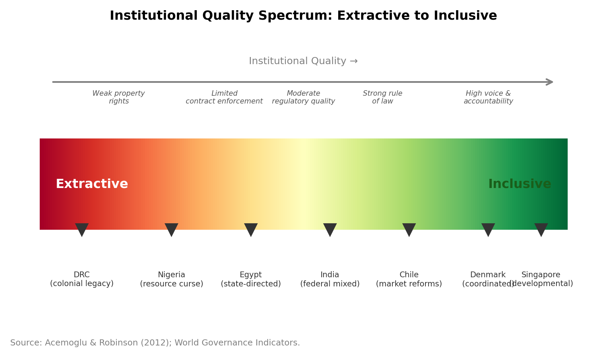

# Chapter 2: Evolutionary and Institutional Frameworks

---

## Introduction: The Institutional Puzzle

Look at the Korean peninsula from a satellite at night. The south is a blaze of light: Seoul, Busan, Incheon, the industrial corridors of the Yeongnam and Chungcheong regions. The north is almost entirely dark, lit only by the faint glow of Pyongyang. The two halves of the peninsula share the same geography, the same climate, the same ethnolinguistic culture, the same pre-1945 history of colonization and exploitation, and the same initial conditions at partition in 1945 (with separate governments established in 1948). The sole thing that differs — and differs completely — is their institutional environment. South Korea built inclusive property rights, a capable state, and eventually open markets. North Korea built a command economy under a hereditary autocracy. Seventy-five years later, South Korean GDP per capita is around thirty times North Korea's. Geography alone explains almost nothing about the divergence between the two halves. Institutions explain almost everything.

The Korean peninsula is an extreme case, but it is not unique. The cities of central Poland — Poznań, Wrocław, Kraków — that were under Prussian or Austrian administration during the nineteenth-century partitions show measurably better institutional quality, higher incomes, and stronger civic engagement today than comparable Polish cities that were under Russian administration, even after controlling for communist-era equalization policies (Grosfeld and Zhuravskaya 2015). American counties where the slave plantation economy dominated before the Civil War show persistently lower public goods provision, lower educational attainment, and higher inequality today — not because of any continuing legal discrimination, but because the institutional structures built to maintain plantation agriculture adapted and survived through Jim Crow and beyond (Engerman and Sokoloff 2000). Germany's Ruhr Valley and Ukraine's Donbas both entered the 1990s with comparable heavy industrial bases and coal resources; the Ruhr has reinvented itself as a services, culture, and clean-energy economy, while the Donbas has oscillated between industrial decay and military conflict. The difference is the institutional environment — and the political economy that sustains or undermines it.

This chapter provides the second lens through which the book analyzes regional divergence. Chapter 1 answered the question of *where* economic activity clusters, using increasing returns and transport costs as the mechanism. This chapter addresses the question of *what happens after it clusters* — and why seemingly identical geographic opportunities produce such radically different development outcomes. The answer requires two complementary frameworks.

The first is the **institutional analysis of development**, drawing on Douglass North's foundational work and its empirical extensions by Acemoglu, Johnson, and Robinson. This framework asks: what are the rules of the economic game in a given region, how did they get there, and how do they shape the incentives to invest, trade, and innovate? The second is **evolutionary economic geography**, which asks: given a region's existing capabilities, what new activities can realistically be built on them? This framework, developed around the concept of the product space and related variety, provides the micro-logic of structural transformation — how regions move from lower- to higher-value-added activities, and why that movement is constrained by capability distance.

Together, these frameworks explain a pattern that neither the NEG nor classical trade theory can account for: why regions with similar endowments, similar locations, and similar access to markets can diverge dramatically over time, and why the divergence tends to persist across generations.

---

## 2.1 What Are Institutions?

*Source: Acemoglu & Robinson (2012); World Governance Indicators.*

### North's Framework: Rules, Organizations, and Transaction Costs

Douglass North's definition of institutions, from *Institutions, Institutional Change and Economic Performance* (1990), is deceptively simple: "the rules of the game in a society or, more formally, the humanly devised constraints that shape human interaction." Rules, not players; constraints, not resources. The distinction matters because it separates the institutional environment — the framework within which economic decisions are made — from the economic actors who operate within it.

North distinguishes between **formal institutions** (constitutions, laws, property rights, contracts, regulations, and the enforcement mechanisms that give them teeth) and **informal institutions** (norms of behavior, conventions, codes of conduct, and the shared mental models through which people interpret economic situations). Formal institutions can in principle be rewritten overnight by a legislature or a constitutional convention. Informal institutions evolve slowly, through cultural transmission, socialization, and the accumulation of shared experience across generations. This asymmetry in speed of change is one reason why institutional reform is so difficult: you can rewrite the commercial code in an afternoon, but you cannot legislate away a business culture built on personal relationship networks rather than contract enforcement.

The economic rationale for institutions lies in the concept of **transaction costs**, developed by Coase (1937) and formalized by Williamson (1985). Every economic exchange involves costs beyond the price of the good itself: the cost of finding a trading partner, the cost of negotiating contract terms, the cost of monitoring compliance, and the cost of enforcing the agreement if the other party defects. In a world of zero transaction costs, Coase showed, economic exchange would achieve efficient allocations regardless of the initial distribution of property rights. In the real world, transaction costs are pervasive and often very large — particularly across long distances, across cultural boundaries, and in environments where enforcement institutions are weak. Institutions exist primarily to reduce transaction costs: property rights reduce the risk of expropriation, contract law reduces the cost of complex exchanges, financial regulation reduces information asymmetries between borrowers and lenders.

**Institutional thickness** — a concept particularly important for regional economics — refers to the density and quality of both formal and informal institutions at the local level. A thick institutional environment is one where property rights are clear and enforced, contracts are reliably honored, regulatory processes are transparent and predictable, business associations and trade organizations facilitate information sharing and collective action, and interpersonal trust lubricates economic exchange. An institutionally thin environment is the opposite: property rights are contested, contract enforcement is slow or politically compromised, regulatory capture is common, and economic exchange relies on personal relationships because formal mechanisms are unreliable. The concept, developed in economic geography by Amin and Thrift (1994) and Cooke and Morgan (1998), captures something the national-level institutional indicators used by political scientists and economists miss: the enormous subnational variation in institutional quality that exists even within countries with the same formal legal system.

North's framework also distinguishes institutions from **organizations** — the players, rather than the rules. Firms, unions, universities, government agencies, and business associations are organizations that operate within the institutional environment. This distinction matters for policy: a regional development agency (an organization) can pursue a cluster strategy, but whether that strategy succeeds depends partly on the institutional environment in which it operates. Baden-Württemberg's Steinbeis network of technology transfer centers works in part because it operates within a broader institutional ecosystem of patient capital, vocational training, and long-term supplier relationships. The same organizational model transplanted to an environment without those institutional complements would likely fail — not because the organization is poorly designed, but because the institutional environment is different.

### Colonial Origins and the Long Run: Acemoglu, Johnson, and Robinson

The most influential modern empirical test of institutional persistence is Acemoglu, Johnson, and Robinson's (2001) study of the colonial origins of development. Their argument runs as follows: European colonizers established very different institutional environments in different parts of the world, depending on whether the climate and disease environment was hospitable to large-scale European settlement. In colonies where settlers could live — temperate North America, parts of southern Africa, Australia and New Zealand — Europeans built inclusive institutions with property rights protections and rule of law, partly because they intended to stay and partly because they needed to attract more settlers. In colonies where disease made settlement costly — tropical Africa, parts of Asia and Latin America — Europeans instead built extractive institutions designed to exploit local resources and populations with a small administrative and military presence, without any intention of providing broad property rights or political representation.

The instrument for institutional quality is settler mortality — the death rate per thousand European soldiers stationed in the colony in the nineteenth century. Settler mortality is plausibly exogenous to modern economic conditions, as it reflects historical pathogen environments that have since been transformed by medicine. Using settler mortality to instrument for current institutional quality (measured by risk of expropriation), Acemoglu et al. (2001) find that institutions explain the large majority of income differences across former colonies, with geography having little additional explanatory power once institutions are controlled for. The same finding is reinforced by Rodrik, Subramanian, and Trebbi (2004), who show that in a horse race between geography, trade integration, and institutions, institutions win decisively.

The companion paper, "Reversal of Fortune" (Acemoglu, Johnson, and Robinson 2002), makes the regional argument explicit. The regions of the world that were *most* densely populated and prosperous in 1500 — the Aztec empire, the Indian subcontinent, the West African kingdoms — are now *below average* in income. The regions that were sparsely populated peripheries in 1500 — temperate North America, Australia, Argentina — are now above average. This reversal is precisely what the institutional theory predicts: dense, prosperous regions attracted extractive colonization (there was more to extract), while sparse regions attracted settler colonization. Subsequent institutional divergence drove the income reversal. Geography was not destiny; colonial institutions were.

### The Primacy of Institutions: Settling the Horse Race

The empirical debate over the relative importance of institutions, geography, and trade integration as determinants of economic development was settled — at least provisionally — by Rodrik, Subramanian, and Trebbi (2004). They constructed a three-way horse race by simultaneously instrumenting for all three candidate variables. Geography (latitude, landlockedness, disease burden) was taken as truly exogenous. Trade integration was instrumented using the Frankel-Romer (1999) geography-based instrument for bilateral trade. Institutional quality was instrumented using the Acemoglu et al. (2001) settler mortality measure.

The results were clear: in a simultaneous regression of income per capita on institutions, trade, and geography, only institutions entered with a statistically and economically significant coefficient. The partial effect of geography on income disappears once institutions are controlled for — consistent with the view that geography matters primarily through its historical effect on institutional formation, not through any contemporary direct channel. Trade integration has the expected sign but loses significance once institutions are controlled for. Institutions dominate the horse race.

The AJR findings have been contested: Albouy (2012) challenged the settler mortality instrument on data-quality grounds, while Glaeser et al. (2004) argued that what AJR actually measure is human capital rather than institutions per se. The debate remains open, and instructors may wish to assign these critiques alongside the original.

This finding does not mean geography is irrelevant — it means geography's developmental consequences flow through institutions. A landlocked country in a malarial climate has lower income not primarily because being landlocked and tropical is directly harmful to productivity, but because those geographic conditions historically produced extractive colonial institutions, which in turn produced low institutional quality today. Change the institutions (a difficult task, but not an impossible one, as Taiwan, South Korea, and Botswana have demonstrated), and geography's grip on development weakens considerably.

The regional implications of the Rodrik et al. finding are significant. Within countries — where the formal legal system is nominally shared — institutional variation at the regional level should be the primary driver of within-country income inequality, once initial conditions are controlled for. The Putnam (1993) finding on Italian regions is consistent with this prediction: the geographic north-south divide in Italy is partly a civic culture and institutional quality divide. Persistent regional inequality within countries — the US Appalachian region, the Italian Mezzogiorno, the Brazilian Northeast, the Spanish Extremadura — is in each case accompanied by measurably lower institutional quality than the national average, even within a common national legal framework.

The channel through which regional institutional quality affects development is primarily **investment and innovation**. Poor institutions reduce the expected return on investment (through expropriation risk, contract uncertainty, and regulatory arbitrariness), raise the cost of doing business (through corruption, administrative delay, and unpredictability), and reduce the incentive for long-term R&D investment (since intellectual property is more difficult to protect in institutionally thin environments). All three channels depress the productivity growth that translates agglomeration economies into sustainable regional development. Silicon Valley's venture capital ecosystem works not just because California has dense knowledge networks and a thick labor market — it works because California has predictable contract enforcement, liquid equity markets, and reliable bankruptcy law that allows failed startups to reorganize efficiently. The institutional scaffolding is largely invisible when it works, and painfully visible when it doesn't.

---

## 2.2 Path Dependence and the Long Shadow of History

### The Mechanics of Institutional Lock-In

Path dependence — the idea that current outcomes depend on history in a way that is not fully captured by current conditions — was formalized in economics through two influential contributions. Paul David's (1985) account of the QWERTY keyboard layout showed that a technically suboptimal standard can dominate the market when early adoption generates switching costs that make replacement prohibitively expensive. (Liebowitz and Margolis (1990) challenged David's interpretation, arguing that there is no good evidence QWERTY is actually suboptimal. The example remains pedagogically useful as an illustration of the path-dependence mechanism, even if the specific case is disputed.) W. Brian Arthur's (1989) model of competing technologies with increasing returns to adoption showed that small, historically contingent advantages early in a technology's diffusion can generate irreversible lock-in, even when the locked-in technology is eventually surpassed.

The same mechanisms operate in institutional evolution, with additional force. David and Arthur's technology-path-dependence mechanisms rest primarily on **coordination failure**: once enough people adopt one standard or technology, switching requires convincing everyone else to switch simultaneously, and that coordination is hard to achieve. Institutional path dependence has two additional mechanisms that make it even more persistent.

The first is **distributional conflict**. Institutions do not produce equal benefits for everyone; typically they create rents for some actors and impose costs on others. The beneficiaries of existing institutions will resist change, and because their institutional advantages often include control over political resources, their resistance is effective. The plantation-economy institutions of the American South — low public investment in education, concentrated land ownership, weak labor protections — generated persistent economic rents for a small agrarian elite that had both the incentive and the political capacity to maintain them through Reconstruction, the Progressive Era, and beyond (Engerman and Sokoloff 2000; Naidu 2010). The losers from those institutions — smallholders, tenant farmers, and African Americans — lacked the political organization to overcome the incumbents.

The second mechanism is **cultural legitimacy**. Informal institutions — norms, values, and shared mental models — change even more slowly than formal ones because they are transmitted through socialization and cultural inheritance. A region with a long history of strong civic organization, horizontal trust, and cooperative problem-solving will bring those cultural resources to bear on new challenges, while a region with a history of vertical patron-client relationships, low interpersonal trust, and extractive governance will find those cultural inheritances actively limiting its ability to adopt the institutional forms that sustained growth requires.

### Empirical Evidence for Institutional Persistence

The empirical record of institutional persistence is deep and geographically broad. Putnam (1993) showed that the density of civic associations in late-nineteenth-century Italian regions predicted regional government performance a century later — tracing the institutional divergence between northern communes and the hierarchical Mezzogiorno back to medieval political structures. Becker and Woessmann (2009) documented persistent human-capital effects of the Protestant Reformation in Prussian regions. Redding and Sturm (2008) exploited Germany's division and reunification to show that market-access shocks reshape spatial economic patterns — West German cities near the East German border lost population and economic activity after division, and partially recovered after reunification. Their finding demonstrates the causal importance of market access for spatial outcomes but also reveals that some spatial effects are *reversible* when the underlying shock is removed, complicating simple path-dependence narratives. These cases — and the Latin American institutional legacies examined in Chapter 5 — confirm that spatial-institutional persistence operates through distributional conflict, cultural legitimacy, and coordination failure, though the degree of lock-in varies with the nature of the shock.

#### Worked Example: Tracing Path Dependence in Two Coal Regions

The Ruhr Valley (Germany) and the Donbas (Ukraine) provide an instructive paired comparison for understanding how path dependence operates through the three mechanisms identified above — distributional conflict, cultural legitimacy, and coordination failure — and how institutional environments determine whether a window of opportunity is successfully exploited.

Both regions entered the postwar era as massive coal-and-steel complexes at the heart of their respective national economies. Both employed hundreds of thousands of workers in vertically integrated heavy industry. Both faced the same structural challenge from the 1960s onward: declining demand for coal, rising competition from lower-cost producers, and the secular shift of advanced economies toward services and knowledge-intensive manufacturing. The divergence in their trajectories is almost entirely institutional.

| Dimension | Ruhr (Germany) | Donbas (Ukraine) |
|---|---|---|
| **1960s baseline** | ~600,000 coal/steel workers; region produces ~65% of West German steel output; Krupp, Thyssen, Mannesmann dominate | ~350 mines; ~1 million coal/steel workers; region produces ~30% of Soviet steel; centrally planned mono-industrial complex |
| **Institutional environment** | Federal democratic system; independent judiciary; corporatist labor relations (IG Metall, works councils); Länder fiscal autonomy; Sparkassen regional banking | Soviet command economy; no independent judiciary or property rights; Party-directed labor allocation; no subnational fiscal autonomy; no private capital |
| **1980s-90s transition** | Aggressive *Strukturwandel*: state-coordinated mine closures with generous social plans; founding of five new universities (Ruhr-Universität Bochum 1962, TU Dortmund 1968, Universität Duisburg-Essen, etc.); IBA Emscher Park (1989-1999) converts industrial brownfields to cultural/ecological infrastructure; Technologiepark Dortmund seeds IT sector; logistics hubs exploit central location | Post-1991 Soviet collapse: mines privatized through opaque voucher schemes; oligarchic capture (Akhmetov, Pinchuk groups control steel/coal assets); institutional vacuum — no functioning property rights regime, no independent courts, no social safety net for displaced workers; miners' strikes (1993, 1996) suppressed or co-opted |
| **Political economy of adjustment** | Distributional conflict *managed*: IG Metall negotiated phased closures; federal/Land co-financing of retraining and early retirement; coal subsidies declined gradually (RAG Stiftung endowment model from 2007); new university graduates created constituency for post-industrial economy | Distributional conflict *entrenched*: oligarchs captured rents from underpriced assets; workers dependent on mine-owners for housing, heating, wages; no independent civic organizations to mobilize alternative coalitions; regional political machines aligned with extractive interests |
| **Cultural legitimacy** | Industrial heritage reframed: Zollverein Coal Mine becomes UNESCO World Heritage Site (2001); "industrial culture" narrative legitimizes transition; civic associations and Bürgerinitiativen provide horizontal trust networks | Soviet industrial identity persists: coal mining retains cultural prestige as "heroic labor"; no alternative narrative of regional identity emerges; vertical patron-client relationships dominate civic life; low interpersonal trust outside kinship networks |
| **2020s outcome** | GDP per capita ~€38,000 (below German average but above EU median); diversified economy: logistics, IT, health services, higher education, cultural tourism; last hard-coal mine closed 2018; population stable | Conflict zone from 2014; GDP per capita (pre-conflict) ~€2,500; economy remains coal/steel dependent where operational; massive population displacement; institutional capacity destroyed by war; pre-conflict trajectory was continued mono-industrial decline |

**Interpretation through the three mechanisms.** The Ruhr case illustrates path dependence that was *redirected* through coordinated institutional intervention at a critical juncture. The distributional conflict between coal incumbents and reform coalitions was managed through corporatist bargaining — the same institutional infrastructure that had organized industrial relations during the growth period was repurposed to manage decline. Cultural legitimacy was actively reconstructed: the industrial heritage narrative allowed the region to honor its coal past while embracing a post-coal future. Coordination failure was overcome through state investment in universities and technology parks that created new focal points for economic activity, breaking the coordination equilibrium in which all actors remained locked into the declining sector because no single actor could profitably exit alone.

The Donbas case illustrates path dependence that was *reinforced* by institutional failure. The post-Soviet critical juncture — potentially a window of opportunity comparable to the Ruhr's 1960s-1980s transition period — was captured by distributional incumbents (oligarchs) who had both the incentive and the capacity to maintain extractive arrangements. No corporatist bargaining infrastructure existed to manage the distributional conflict of transition. No civic associational culture existed to generate the horizontal trust needed for collective action by workers or small businesses. No independent judiciary existed to enforce property rights that might have attracted diversifying investment. The coordination failure was total: in the absence of credible institutional commitments, no rational investor would sink capital into non-extractive activities, and no worker would invest in retraining for industries that did not exist. The path-dependent equilibrium held until it was shattered not by institutional reform but by armed conflict — the most destructive possible form of institutional discontinuity.

The comparison underscores the chapter's central argument: path dependence is not deterministic. The same structural challenge (coal decline) produced radically different outcomes because the institutional environments differed in their capacity to manage distributional conflict, reconstruct cultural legitimacy, and overcome coordination failure. The Ruhr's advantages were not geographic or resource-based — they were institutional: a functioning democratic state, corporatist bargaining, fiscal federalism, and the political will to invest in long-horizon institutional transformation.

### Windows of Opportunity: When Path Dependence Breaks

Path dependence is strong but not absolute. Three mechanisms can open "windows of opportunity" for institutional change: **technological discontinuities** that render existing institutions obsolete (the coal-to-electricity transition); **exogenous political shocks** that break distributional lock-in (the East Asian land reforms analyzed in Chapter 6); and **institutional reform crises** where the costs of existing arrangements become politically unsustainable (the Asian financial crisis, EU accession conditionality). The key insight is that windows are rare and time-limited — institutions are most malleable immediately after a shock, before new incumbent interests consolidate. Chapter 6 develops this framework in detail through the lens of East Asia's semiconductor industry, where successive technological paradigm shifts created windows that institutionally prepared regions (Korea, Taiwan) seized while others could not.

---

## 2.3 Related Variety and the Product Space

### Capabilities, Products, and the Network of Knowledge

The evolutionary framework for regional development asks a different question than the institutional one: given where a region is now, where can it realistically go? The answer, in the product space framework of Hidalgo et al. (2007), is: to adjacent products in the network of shared capabilities.

The central insight of the product space is that making different products requires different combinations of productive capabilities — knowledge, skills, machinery, organizational routines, infrastructure, and regulatory systems. Some products share many of the same capabilities (cotton shirts and synthetic fabric shirts require similar dyeing, cutting, and sewing capabilities); others share almost none (cotton shirts and petroleum refining require almost entirely distinct capability sets). The **product space** is a network where nodes are products and links connect products that are frequently co-exported by the same countries — a revealed-preference measure of shared underlying capabilities.

Hidalgo et al. (2007) construct this network from Comtrade data on bilateral trade flows, using the **Revealed Comparative Advantage (RCA)** measure: country $$c$$ has an RCA in product $$p$$ if its share of world exports in $$p$$ exceeds its overall share of world exports. The **proximity** between products $$p$$ and $$p'$$ is:

$$
\phi_{pp'} = \min \left\{ P(RCA_p | RCA_{p'}),\, P(RCA_{p'} | RCA_p) \right\}
$$

the minimum of the conditional probabilities of having a comparative advantage in one product given comparative advantage in the other. This measures the fraction of countries that export both products with RCA — a proxy for capability overlap. Products that are frequently co-exported by the same countries are "close" in the product space; products that are rarely co-exported are "distant."

The policy implication is stark: a country or region can only move to a new product if it is sufficiently close in the product space to products it already exports competitively. Cambodia can realistically move from garments to shoes — the capability sets overlap substantially in terms of labor organization, machinery, and supply chains. Cambodia cannot realistically move from garments to semiconductors in a single step — the capability distance is too large. The product space is not flat; it has a dense, highly connected core of machinery and chemicals, and a sparse, isolated periphery of raw materials and simple commodities. Countries trapped in the periphery find that every nearby product is also in the periphery — the relatedness gradient offers few escape routes. Countries in the dense core find many nearby opportunities for upgrading.

### Economic Complexity: Diversity of Capabilities as the Engine of Growth

Hidalgo and Hausmann (2009) formalized the capability-diversity hypothesis in the **Economic Complexity Index (ECI)**, which measures the diversity and sophistication of a country's export basket, controlling for the ubiquity of each product. The ECI is calculated from the bipartite network of countries and their exported products, using a method-of-reflections algorithm that alternately refines estimates of country complexity (based on the average complexity of their exports) and product complexity (based on the average complexity of the countries that export them).

The key empirical finding is that ECI predicts future GDP growth better than standard growth regression controls. Countries with higher complexity relative to their current income tend to grow faster, because they have latent capabilities that are not yet fully reflected in their productivity. Countries with lower complexity relative to their income — often resource-rich countries whose income reflects commodity rents rather than broad capability diversification — tend to grow more slowly as commodity cycles turn. For regional economics, this is a powerful result: the *structure* of a regional economy's productive capabilities is a better predictor of its growth trajectory than its current income level.

The ECI framework has been extended to cities and regions using subnational export data and patent classifications (where patents substitute for trade data as the capability signal). Research groups at the Growth Lab (Harvard Kennedy School) and the Complexity Science Hub (Vienna) have produced regional complexity maps for the EU, the US, China, and Brazil, revealing enormous subnational variation in capability sophistication within countries — variation that national ECI measures entirely miss.

### Related Variety: The Empirical Geography of Knowledge Recombination

The product space framework emphasizes capability distance between products. The **related variety** literature, developed by Frenken, van Oort, and Verburg (2007), applies a similar logic at the industry level within regional economies. Frenken et al. distinguish between two types of industrial diversification in regional economies:

**Related variety**: a regional economy that is diversified across industries that share a common technological or knowledge base. A region with automotive manufacturing, precision machining, and hydraulic systems has related variety — the three sectors share capabilities in metalworking, tolerances, and materials science. Knowledge can flow across these sector boundaries because practitioners share enough conceptual vocabulary to communicate and collaborate.

**Unrelated variety**: a regional economy that is diversified across industries with entirely different knowledge bases. A region with textile manufacturing, financial services, and food processing has unrelated variety — the sectors are technologically distant. Diversification provides portfolio risk reduction (a shock to textiles doesn't hurt banking) but limited dynamic spillovers.

Frenken et al.'s empirical finding, using Dutch regional data, is that related variety drives employment growth while unrelated variety provides stability (reducing unemployment volatility). This distinction has become foundational in evolutionary economic geography: the relatedness of a region's industrial mix, not its specialization or diversity per se, predicts its growth and adaptation trajectory.

#### Worked Example: Computing Related Variety from Regional Employment Data

To make the related variety concept concrete, consider a hypothetical NUTS-2 region — call it "Zuid-Brabant" — for which we have employment data classified by 4-digit SBI (Standaard Bedrijfsindeling) industry codes, nested within 2-digit sectors. The region has total employment of 100,000 workers distributed across six 2-digit sectors and fifteen 4-digit subsectors, as shown in the table below.

| 2-digit sector ($$S_g$$) | 4-digit subsector ($$s_i$$) | Employment | Share of total ($$p_i$$) |
|---|---|---|---|
| **28 — Machinery** | 2811 Engines & turbines | 8,000 | 0.080 |
| | 2822 Lifting equipment | 5,000 | 0.050 |
| | 2899 Other special-purpose machinery | 7,000 | 0.070 |
| **29 — Motor vehicles** | 2910 Motor vehicle manufacturing | 12,000 | 0.120 |
| | 2932 Parts & accessories | 8,000 | 0.080 |
| **30 — Other transport equip.** | 3011 Shipbuilding | 3,000 | 0.030 |
| | 3030 Aerospace manufacturing | 5,000 | 0.050 |
| **62 — IT services** | 6201 Computer programming | 10,000 | 0.100 |
| | 6202 IT consultancy | 7,000 | 0.070 |
| | 6209 Other IT services | 3,000 | 0.030 |
| **72 — Scientific R&D** | 7211 Biotech R&D | 6,000 | 0.060 |
| | 7219 Other natural science R&D | 4,000 | 0.040 |
| **46 — Wholesale trade** | 4651 Wholesale of computers | 8,000 | 0.080 |
| | 4669 Wholesale of other machinery | 9,000 | 0.090 |
| | 4690 Non-specialized wholesale | 5,000 | 0.050 |
| **Total** | | **100,000** | **1.000** |

**Step 1: Compute total entropy (H).** Total entropy measures the overall diversity of the region's industrial mix across all 4-digit subsectors. Using Shannon entropy:

$$H = \sum_{i=1}^{15} p_i \ln\left(\frac{1}{p_i}\right)$$

Plugging in each subsector's employment share:

$$H = 0.08 \ln(12.5) + 0.05 \ln(20) + 0.07 \ln(14.29) + 0.12 \ln(8.33) + 0.08 \ln(12.5)$$
$$\quad + 0.03 \ln(33.33) + 0.05 \ln(20) + 0.10 \ln(10) + 0.07 \ln(14.29) + 0.03 \ln(33.33)$$
$$\quad + 0.06 \ln(16.67) + 0.04 \ln(25) + 0.08 \ln(12.5) + 0.09 \ln(11.11) + 0.05 \ln(20)$$

Computing term by term and summing:

$$H \approx 2.636$$

For reference, maximum entropy with 15 equally sized subsectors would be $$\ln(15) \approx 2.708$$, so this region is close to maximum diversity — the employment distribution is fairly even across subsectors.

**Step 2: Compute between-group entropy H_b (unrelated variety).** Between-group entropy measures the diversity of employment across the six 2-digit sectors, treating each sector as a single unit. First, compute each sector's aggregate employment share ($$P_g$$):

| 2-digit sector | Aggregate share ($$P_g$$) |
|---|---|
| 28 — Machinery | 0.200 |
| 29 — Motor vehicles | 0.200 |
| 30 — Other transport equip. | 0.080 |
| 62 — IT services | 0.200 |
| 72 — Scientific R&D | 0.100 |
| 46 — Wholesale trade | 0.220 |

$$H_b = \sum_{g=1}^{6} P_g \ln\left(\frac{1}{P_g}\right)$$

$$H_b = 0.20 \ln(5) + 0.20 \ln(5) + 0.08 \ln(12.5) + 0.20 \ln(5) + 0.10 \ln(10) + 0.22 \ln(4.55)$$

$$H_b \approx 0.322 + 0.322 + 0.202 + 0.322 + 0.230 + 0.333 = 1.731$$

This is the **unrelated variety** of the region. It captures the extent to which the region's employment is spread across technologically distinct macro-sectors. The maximum possible value with six sectors would be $$\ln(6) \approx 1.792$$, so unrelated variety is high — the region is not dominated by any single macro-sector.

**Step 3: Compute within-group entropy H_w (related variety).** Within-group entropy measures the diversity of 4-digit subsectors *within* each 2-digit sector, then aggregates across sectors weighted by each sector's employment share. For each sector $$g$$, define the conditional shares $$p_{i|g} = p_i / P_g$$ and compute the within-sector entropy:

$$H_g = \sum_{i \in S_g} \frac{p_i}{P_g} \ln\left(\frac{P_g}{p_i}\right)$$

For **sector 28 (Machinery)**, $$P_g = 0.20$$:
- Conditional shares: 0.08/0.20 = 0.40, 0.05/0.20 = 0.25, 0.07/0.20 = 0.35
- $$H_{28} = 0.40 \ln(2.5) + 0.25 \ln(4) + 0.35 \ln(2.857) \approx 0.366 + 0.347 + 0.367 = 1.080$$

For **sector 29 (Motor vehicles)**, $$P_g = 0.20$$:
- Conditional shares: 0.12/0.20 = 0.60, 0.08/0.20 = 0.40
- $$H_{29} = 0.60 \ln(1.667) + 0.40 \ln(2.5) \approx 0.307 + 0.366 = 0.673$$

For **sector 30 (Other transport)**, $$P_g = 0.08$$:
- Conditional shares: 0.03/0.08 = 0.375, 0.05/0.08 = 0.625
- $$H_{30} = 0.375 \ln(2.667) + 0.625 \ln(1.6) \approx 0.368 + 0.294 = 0.662$$

For **sector 62 (IT services)**, $$P_g = 0.20$$:
- Conditional shares: 0.10/0.20 = 0.50, 0.07/0.20 = 0.35, 0.03/0.20 = 0.15
- $$H_{62} = 0.50 \ln(2) + 0.35 \ln(2.857) + 0.15 \ln(6.667) \approx 0.347 + 0.367 + 0.285 = 0.999$$

For **sector 72 (Scientific R&D)**, $$P_g = 0.10$$:
- Conditional shares: 0.06/0.10 = 0.60, 0.04/0.10 = 0.40
- $$H_{72} = 0.60 \ln(1.667) + 0.40 \ln(2.5) \approx 0.307 + 0.366 = 0.673$$

For **sector 46 (Wholesale trade)**, $$P_g = 0.22$$:
- Conditional shares: 0.08/0.22 = 0.364, 0.09/0.22 = 0.409, 0.05/0.22 = 0.227
- $$H_{46} = 0.364 \ln(2.75) + 0.409 \ln(2.444) + 0.227 \ln(4.4) \approx 0.368 + 0.366 + 0.337 = 1.071$$

Now compute the weighted sum:

$$H_w = \sum_{g=1}^{6} P_g \cdot H_g = 0.20(1.080) + 0.20(0.673) + 0.08(0.662) + 0.20(0.999) + 0.10(0.673) + 0.22(1.071)$$

$$H_w \approx 0.216 + 0.135 + 0.053 + 0.200 + 0.067 + 0.236 = 0.907$$

**Step 4: Verify the decomposition.** A key property of the entropy decomposition is that total entropy equals the sum of between-group and within-group entropy:

$$H = H_b + H_w = 1.731 + 0.907 = 2.638$$

This matches our directly computed $$H \approx 2.636$$ (the small discrepancy is rounding error), confirming the decomposition.

**Interpretation.** In the Frenken et al. framework, $$H_w = 0.907$$ is the region's **related variety** — the degree to which employment is diversified across technologically related subsectors within the same 2-digit sector. A region with high related variety is expected to generate more knowledge spillovers between firms because workers, engineers, and managers in closely related subsectors share tacit knowledge, technical vocabulary, and problem-solving heuristics. When machinists move between engine manufacturing and lifting equipment, when IT programmers rotate between consulting and software development, they carry knowledge across firm and subsector boundaries. These Jacobian externalities — cross-industry knowledge recombination — are the mechanism through which related variety drives employment growth.

The region's **unrelated variety** ($$H_b = 1.731$$) captures the extent of diversification across technologically distant sectors. This provides portfolio insurance: a demand shock to motor vehicles does not directly affect IT services or wholesale trade. Unrelated variety does not generate knowledge spillovers — there is little that a shipbuilder can learn from a wholesale trader — but it stabilizes regional employment against sector-specific shocks.

For Zuid-Brabant, the ratio $$H_w / H \approx 0.34$$ indicates that about one-third of the region's total industrial diversity comes from within-sector variety (related variety) and two-thirds from between-sector variety (unrelated variety). Compared to Frenken et al.'s Dutch regional averages, this region has moderately high related variety — consistent with its concentration of manufacturing subsectors that share metalworking, engineering, and precision-machining capabilities. The policy implication is that Zuid-Brabant's industrial mix is well positioned for knowledge-driven growth: the related variety within its machinery, vehicles, and IT clusters provides the recombinant potential for innovation. The risk, as discussed below in the relatedness trap, is that this potential is only realized if the related subsectors are on an ascending rather than declining technological trajectory.

Neffke, Henning, and Boschma (2011) pushed the analysis further using Swedish plant-level data. They tracked industry entries into and exits from 81 Swedish functional regions from 1969 to 2002 and asked whether industries that entered or survived were systematically related to the industries already present. The answer is yes, and strongly so: industries that are relatedly diversified relative to a region's existing portfolio are much more likely to establish successfully, and plants in related industries are more likely to survive. The relatedness gradient is not just a statistical regularity at the country level — it operates at the plant level in regional economies, governing which new activities can be seeded from existing capability stocks.

### The Relatedness Trap

The related variety framework's central prescription — diversify into activities close to your existing capabilities — contains a risk that the literature has increasingly recognized. If a region's existing capabilities are clustered in a declining technological trajectory, then relatedness-guided diversification may lead it into activities that are slightly newer but equally doomed. A coal-mining region that diversifies into coal-fired power plant components, coal gasification equipment, and mine safety technology is following the relatedness gradient faithfully — each new activity shares capabilities with the existing base — but it is diversifying *within* a technological paradigm that climate policy and market forces are rendering obsolete. Hassink (2010) documented this dynamic in the Ruhr and Saarland, where decades of "related" diversification around coal and steel delayed the fundamental capability renewal that would have been necessary to escape the declining trajectory. The relatedness trap is the evolutionary analogue of the institutional lock-in described in Section 2.2: just as distributional politics can entrench bad institutions, capability proximity can entrench bad specializations. Breaking out requires not incremental movement along the relatedness gradient but a discontinuous leap to a distant part of the product space — which is precisely what the relatedness framework predicts is hardest to accomplish. The Smart Specialization policy discussed below attempts to navigate this tension, but the trap remains a structural risk for any region whose capability base is concentrated in sunset industries.

### Subnational Complexity: From Countries to Regions

The product space and economic complexity frameworks were originally developed and empirically validated at the country level, where trade data provide clean signals of what each country produces competitively. Extending the framework to subnational regions requires addressing two practical challenges: the absence of detailed regional export data in most countries, and the fact that regions are more open than countries (a region is more likely to be highly specialized than a country, because national economies aggregate many regions).

These challenges have been addressed through three approaches. The first uses subnational trade data where available — Brazil's SECEX regional export database, Mexico's INEGI regional manufacturing survey, and China's provincial export data have all been used to construct regional product spaces and complexity indices. The second approach uses **patent data** as a proxy for regional innovative capabilities: patents can be geocoded to the region of the applicant, and the IPC (International Patent Classification) provides a technology space analogous to the product space (Balland and Rigby 2017). Regions that hold patents across a diverse and technically complex range of IPC classes have high technological complexity. The third approach uses employment by industry (from labor force surveys or administrative tax data) to construct a "industry space" analogous to the product space, connecting industries that tend to co-locate in the same regions — a measure of the relatedness of regional industrial mixes.

All three approaches find strong within-country variation in regional complexity, and all find that complexity predicts regional employment growth and income growth, net of initial conditions. Balland, Boschma, and colleagues have applied the patent-based approach to European NUTS-2 regions and found that regions with higher technological complexity grow faster in both patenting activity and value added. The predictive power is strongest in the 10-15 year horizon — consistent with the view that complexity reflects deep capability stocks that change slowly but have persistent effects on growth trajectories.

The subnational complexity research also reveals an important within-country spatial inequality dynamic: in virtually every country studied, complexity is heavily concentrated in a small number of large, diverse metropolitan regions, while peripheral and smaller regions have much lower complexity and much narrower product spaces. This geographic concentration of capability sophistication is a key mechanism behind rising within-country spatial inequality — a phenomenon that has accelerated since the 1990s in most OECD countries and that is central to the political economy of regionalism discussed throughout this book. The regions that feel "left behind" in contemporary politics are, in the complexity framework, regions whose capability bases are narrow, whose product spaces offer few nearby upgrade opportunities, and whose institutional environments have not been upgraded to support the services and knowledge economy that now drives growth in the core.

### Smart Specialization and the Policy Implications

The EU's **Smart Specialization Strategy (S3)** is the most ambitious institutional application of the related variety and product space frameworks. Mandated as a pre-condition for access to EU Structural Funds in the 2014-2020 and 2021-2027 programming periods, S3 requires every EU region to conduct a structured process of "entrepreneurial discovery" — consultation with firms, research institutions, and civil society to identify the region's existing capabilities and the adjacent opportunities that could be built on them.

The concept, developed by Foray, David, and Hall (2009), explicitly rejects the "me-too" strategy in which every region claims it will build a Silicon Valley-style technology cluster. Instead, it asks each region to identify its distinctive capability base — even if that base is in traditional industries — and to invest in the smart application of new technologies and knowledge to those capabilities. A textile region in Catalonia does not become a biotech cluster; it becomes a smart textiles region, applying sensor technology, advanced materials, and digital manufacturing to its existing expertise. A food-processing region in Brittany does not become a financial hub; it becomes a precision agri-food cluster, applying data analytics and biotechnology to its existing agricultural science.

The implementation record is mixed. The S3 requirement has forced useful strategic discipline on some regions that previously allocated structural funds opportunistically. In others, the "entrepreneurial discovery" process has been captured by existing incumbents, who use it to direct subsidies toward their own industries rather than toward genuine innovation in adjacent spaces. The concept is sound; the institutional environment for implementation varies enormously. (The MAUP analysis in Chapter 3-A raises a direct question about whether NUTS-2 is the appropriate spatial unit for S3 capability mapping.) The Basque Country's experience — described in the Institutional Spotlight at the end of this chapter — provides the clearest example of the concept working in practice, a decade before the EU formalized it.

---

## 2.4 Varieties of Capitalism at the Regional Scale

Hall and Soskice's (2001) **Varieties of Capitalism** framework distinguishes Coordinated Market Economies (CMEs — Germany, Japan, Sweden) from Liberal Market Economies (LMEs — the US, UK, Canada). The distinction rests on **institutional complementarities**: in CMEs, patient capital, vocational training, long-term employment, and sector-level wage bargaining reinforce each other to support incremental innovation; in LMEs, fluid capital markets, general education, flexible labor, and decentralized wages reinforce each other to support radical innovation. The elements of each system are mutually dependent — extracting one component (say, imposing short-horizon capital markets on a CME labor system) degrades the whole.

The VoC framework was developed at the national level, but its logic extends to regions. Within Germany, Baden-Württemberg exemplifies the CME model (Mittelstand firms, Sparkassen banks, Fraunhofer technology transfer), while Berlin's startup ecosystem operates on LME principles. The **mismatch problem** — when a region's institutional environment clashes with the requirements of its industries — produces systematic underperformance. Post-socialist Central European economies attracted CME-type industries (automotive, electronics) into institutional environments that lacked CME infrastructure, creating what Nölke and Vliegenthart (2009) call "dependent market economies." The Mezzogiorno's patron-client institutions are mismatched with both CME coordination and LME contract enforcement — the mismatch is the trap.

Chapter 9 (Europe) develops the VoC framework's spatial implications in detail, examining how the CME-LME distinction shapes the EU's core-periphery dynamics, the post-socialist transition, and the geography of the Eurozone crisis.

The VoC framework's greatest limitation is its difficulty accommodating China — a point that readers should keep in mind as the book moves to East Asia in Chapters 6 and 7. China's institutional environment does not fit the CME-LME binary: it combines state-directed credit allocation (a CME-like feature) with ruthless inter-firm and inter-regional competition (an LME-like feature), authoritarian political stability (which provides the policy continuity that CME coordination requires) with radical policy experimentation at the local level (the SEZ model described in Chapter 7). Heilmann (2008) characterizes this as "experimentation under hierarchy" — a governance mode in which local governments are given latitude to innovate within centrally defined parameters, and successful experiments are scaled nationally. The result is an institutional system that is neither coordinated in the VoC sense (there is no sector-level bargaining, no Mittelstand equivalent, no patient-capital banking culture) nor liberal (the state allocates capital, restricts labor mobility, and directs industrial policy). The binary classification may need a third category — the developmental state with Chinese characteristics — to accommodate the institutional realities of the world's second-largest economy.

The VoC framework has particular consequences for services trade that will recur throughout this book. CMEs tend to develop strong professional and business services sectors — engineering consulting, industrial design, logistics optimization — that complement their incremental-innovation manufacturing base. LMEs tend to develop strong advanced producer services (APS) sectors — finance, law, management consulting, advertising — that serve their fluid capital markets. The mismatch problem extends to services: when CEE economies attracted CME-type manufacturing through FDI (Chapter 10), the associated business services — legal compliance, accounting, logistics coordination — were initially imported from Western European CMEs rather than developing locally. The gradual development of CEE nearshore business services hubs (Warsaw, Prague, Bucharest) represents an institutional catch-up process: building the regulatory frameworks, professional training systems, and reputational capital needed to provide these services domestically rather than importing them. This is related variety applied to services — each new service capability is built on the institutional foundation of the previous one, following a relatedness gradient analogous to the product space for goods.

A final extension is worth flagging for the chapters ahead: the concept of **digital institutional thickness**. The institutional thickness literature (Amin and Thrift 1994) was developed in an era when the relevant institutions were physical — chambers of commerce, trade unions, regional development agencies, Sparkassen banks. In the 2020s, a region's institutional environment increasingly includes its digital governance infrastructure: data protection regimes (GDPR in the EU, fragmented national laws in ASEAN), platform regulation (how ride-hailing, fintech, and gig work are governed), digital identity systems (India's Aadhaar, Estonia's e-Residency), and the data localization rules that determine where information can be stored and processed. These digital institutions shape regional competitiveness as decisively as traditional ones: a city with strong digital governance infrastructure (interoperable payment systems, trusted digital identity, transparent data rules) has lower transaction costs for digital services than a city without them — the same logic that makes institutional thickness matter for manufacturing, applied to the digital economy. Chapters 7, 8, and 13 will trace how digital institutional variation — from Singapore's integrated PayNow to Indonesia's fragmented e-wallet landscape, from India's Aadhaar Stack to Africa's mobile money ecosystems — shapes regional economic geography in ways that the traditional VoC framework does not capture.

---

## 2.5 Informal Institutions: Compensation, Entrenchment, and the Gray Zone

### De Soto and the Logic of Informality

Hernando de Soto's *The Other Path* (1989) reframed the informal economy in a way that was initially shocking to development economists trained in the view that informal activity was a residual category of economic backwardness. De Soto argued instead that informality is a rational institutional equilibrium: when formal institutions are exclusionary — when the cost of registering a business, obtaining a legal title, or accessing official credit is prohibitively high for the poor — people build their own institutional frameworks outside the formal system.

His research in 1980s Peru found that establishing a small garment workshop legally required 289 bureaucratic steps, eleven permits, and an outlay equivalent to 3.5 years of minimum-wage income — a regulatory burden that has since been substantially reduced by successive reforms, but that captured the equilibrium of institutional exclusion that characterized much of Latin America at the time. Unsurprisingly, most small manufacturers operated informally. The economic cost was not that they were doing something illegal; it was that their assets — their land, their buildings, their equipment — lacked formal legal title and therefore could not be used as collateral for credit. De Soto's phrase for this is "dead capital": productive assets that cannot be fully deployed in the formal financial system because they are not recognized by formal institutions.

The regional economic implication is that institutional thickness operates asymmetrically. In a formally thick institutional environment, small firms can access credit, enter contracts with large buyers, and scale up through formal market mechanisms. In a formally thin environment — even one that is prosperous by informal standards — firms cannot access the institutional scaffolding that supports scaling. This creates a trap: the informal sector generates employment and income, but it cannot generate the productivity growth that requires formal institutional access. Breaking out of this trap requires not just deregulation (lowering the cost of formalization) but building the enforcement and information infrastructure that makes formal contracts meaningful.

### Informal Institutions as Substitutes and Complements

Where formal institutions are weak, informal institutions often partially substitute for them — with important qualifications. Avner Greif's (1993) study of the eleventh-century Maghribi traders is the canonical economic history case. The Maghribi merchants, a network of Jewish traders operating across the Mediterranean, could not rely on formal legal enforcement across the jurisdictions in which they operated. Instead, they developed a **coalition** — an informal enforcement system based on reputation and multilateral punishment. A trader who cheated one merchant would be boycotted by all members of the network. Because the network was dense and information circulated quickly, defection was almost never profitable. The coalition enforcement mechanism was effectively as reliable as formal contract law — but only within the network.

The limitation of informal enforcement mechanisms is also visible in Greif's case: the Maghribi system was exclusive. Membership in the coalition was restricted to a specific ethnic and religious community. Non-members could not access the network's enforcement capacity, limiting the geographic and commercial reach of the trading system. Genoese traders, who developed a different, more formal enforcement system relying on bilateral reputation and legal courts, were able to trade with a much wider range of partners and eventually expanded further. Informal institutions compensate for weak formal ones but impose their own transaction costs: exclusion, limited scale, and restricted membership.

Robert Putnam's concept of **social capital** — the norms of reciprocity and trust embedded in dense civic networks — provides a regional-level measure of informal institutional thickness. Putnam (1993) found that civic associations in Italian regions generated the trust and norm compliance that sustained cooperative economic activity. Subsequent work has found that social capital is strongly correlated with regional economic performance in Europe (Beugelsdijk and van Schaik 2005), with firm-level innovation in Germany (Audretsch and Lehmann 2006), and with the recovery speed from economic shocks (Guiso, Sapienza, and Zingales 2004). Social capital is not sufficient for development — it can sustain extractive institutions as effectively as inclusive ones (the Mafia also has very high social capital, in the sense of internal trust and norm compliance) — but its absence is almost always limiting.

The **dual role** of informal institutions — compensation for weak formal institutions or entrenchment of extractive equilibria — is the key ambiguity that regional analysis must resolve case by case. Informal cross-border trade (ICBT) in Sub-Saharan Africa illustrates the ambiguity vividly. The Sahel and Great Lakes regions have extensive informal trade networks operating across formal borders — networks with their own enforcement mechanisms, credit systems, and dispute resolution procedures. In contexts where formal customs procedures add weeks of delay and large rents to formal traders, ICBT provides faster, cheaper commercial exchange. But these networks also provide the institutional infrastructure for smuggling, tax evasion, and the circumvention of phytosanitary standards that can expose consumers to health risks. They compensate for weak formal trade institutions while also providing an alternative political economy that incumbent trade officials have an interest in maintaining, since it generates rents for them. The same institutional form that facilitates trade also entrenches the institutional weakness that makes formal trade prohibitively costly.

### Transition Dynamics: Formal and Informal Institutions Co-Evolve

The interaction between formal and informal institutions is dynamic: changes in one provoke adaptations in the other. Acemoglu and Robinson's (2012) framework in *Why Nations Fail* emphasizes the role of **critical junctures** — moments when the existing institutional equilibrium is disrupted by an exogenous shock, and where the political contest over the new institutional settlement is genuinely open. In these moments, reform coalitions that would be defeated in normal times can mobilize and win. Once a new institutional settlement is established, however, organizations and interests rapidly adapt to the new rules of the game, and the new equilibrium becomes self-reinforcing.

For regional policy, this dynamic has a specific implication: institutional reform cannot be sustained by external imposition alone. The EU's structural fund conditionality has improved formal institutional capacity in Central European recipient countries, but it has also generated perverse incentives — "absorption rates" that reward spending speed over development impact, and "gold-plating" of reporting requirements that consumes the administrative capacity of small regional governments. Durable institutional improvement requires building internal political coalitions that have a stake in the new institutional environment — coalitions of firms, workers, and civic organizations that benefit from transparent contracting, reliable enforcement, and broad access to public goods.

---

## Data in Depth: Building a Regional Institutional-Thickness Index

**The measurement challenge.** Institutional quality is notoriously difficult to measure, particularly at the subnational level. National-level indices — the World Bank's Worldwide Governance Indicators, Transparency International's Corruption Perceptions Index — are built on surveys of national experts and cannot be disaggregated to regions. The best subnational institutional data come from three sources: the **Quality of Government (QoG) Regional Dataset** for European regions (Charron, Dijkstra, and Lapuente 2014), subnational World Bank Doing Business surveys (available for selected countries), and administrative data on court efficiency, contract registration, and public spending quality.

**The QoG Regional Dataset** covers 206 NUTS-1 and NUTS-2 regions across 24 EU member states with survey-based measures of three dimensions of governmental quality: impartiality (whether public services are delivered without favoritism or discrimination), quality (whether public services are of high quality and meet citizens' needs), and corruption (absence of bribery, nepotism, and misuse of public funds). The dataset reveals enormous institutional variation within countries. In Italy, the gap between the best-performing northern regions (Trentino-Alto Adige, Emilia-Romagna) and the worst-performing southern regions (Calabria, Campania) on the QoG composite index is larger than the gap between Sweden (highest national average) and Bulgaria (lowest national average). Institutional variation is as much a subnational as a cross-national phenomenon.

**Constructing a composite index.** A regional institutional-thickness index can be constructed by factor analysis of multiple indicators: the QoG survey dimensions, plus administrative efficiency measures (average time to resolve commercial disputes, days to register property), public investment quality (infrastructure condition indices), and where available, World Bank sub-national Doing Business scores. A first principal component that accounts for a substantial share of the common variance across these dimensions provides a summary institutional quality score with decent measurement properties. Such an index for EU regions correlates strongly with regional GDP per capita (r ≈ 0.6 to 0.7) but imperfectly — consistent with institutions being an important but not exclusive determinant of economic performance.

**Linking institutions to diversification.** The policy-relevant test is whether better institutions predict faster capability accumulation and diversification, conditional on initial conditions. Using the **Related Variety** measure of Frenken et al. (2007) — derived from NUTS-2 regional employment data by Eurostat industry classification — as the outcome, a baseline panel specification is:

$$
\Delta RV_{rt} = \alpha \cdot IQ_{r,t-1} + \beta \cdot \ln Y_{r,t-1} + \mu_r + \gamma_t + \varepsilon_{rt}
$$

where $$\Delta RV_{rt}$$ is the change in related variety in region $$r$$ between periods $$t-1$$ and $$t$$, $$IQ_{r,t-1}$$ is lagged institutional quality, $$\ln Y_{r,t-1}$$ is lagged GDP per capita, $$\mu_r$$ is a region fixed effect, and $$\gamma_t$$ is a period fixed effect. Consistent estimates of $$\alpha > 0$$ would provide evidence that institutional quality facilitates capability recombination — the mechanism through which institutional thickness converts agglomeration into structural upgrading.

**Caveat.** Institutional quality is potentially endogenous to economic outcomes: wealthier regions may invest more in institutional quality, rather than causality running from institutions to income. Instruments used in the cross-regional literature include deep historical variables (Romanization, medieval university presence, Protestant Reformation exposure) and geological features that predicted historical settlement patterns. The QoG dataset's within-country cross-regional variation is also useful here: historical and cultural instruments that work at the country level may not vary much within countries, requiring creative within-country instruments.

#### Worked Example: Constructing an Institutional-Thickness Index

To illustrate how a regional institutional-thickness index is constructed in practice, consider five European NUTS-2 regions that span the institutional quality spectrum. For each region, we collect data on four indicator dimensions — each scored on a 0-10 scale, where 10 represents the highest institutional quality observed in the European sample.

**Indicator dimensions:**

1. **Government effectiveness (GOV):** Composite of QoG survey scores for impartiality and quality of public services, administrative efficiency (average days to resolve commercial disputes, time to register property), and absence of corruption. High scores reflect responsive, competent, impartial public administration.
2. **Business association density (BIZ):** Number of active industry associations, chambers of commerce, employer organizations, and cluster initiatives per 100,000 economically active persons. High scores indicate a dense organizational landscape that facilitates coordination among firms on pre-competitive challenges.
3. **University-industry links (UNI):** Composite of co-patenting rates between university and industry applicants, share of university R&D funded by the private sector, and number of technology transfer offices per research university. High scores indicate that the regional knowledge infrastructure is effectively connected to the productive economy.
4. **Trust and social capital (SOC):** Survey-based measures of generalized interpersonal trust ("Would you say that most people can be trusted?"), participation in voluntary associations, and voter turnout in regional elections. High scores indicate a civic culture conducive to cooperative problem-solving and low transaction costs.

| Region | GOV | BIZ | UNI | SOC |
|---|---|---|---|---|
| Baden-Württemberg (DE) | 8.9 | 9.2 | 9.0 | 8.1 |
| Lombardy (IT) | 7.4 | 8.5 | 7.8 | 6.3 |
| Andalusia (ES) | 5.1 | 4.8 | 4.5 | 5.6 |
| Lubuskie (PL) | 4.6 | 3.2 | 3.1 | 4.4 |
| Northern Greece (EL) | 3.8 | 3.5 | 3.9 | 3.7 |

The scores reflect plausible patterns documented in the QoG Regional Dataset and related literatures. Baden-Württemberg scores consistently high across all dimensions: its Mittelstand firms are embedded in dense business associations and Fraunhofer/Steinbeis technology transfer networks; its Sparkassen banking system and works council structures generate high organizational trust; its Land government is administratively efficient. Lombardy scores high on business association density (the Italian industrial district tradition of Emilia-Romagna extends partially into Lombardy) and university-industry links (Politecnico di Milano, Bocconi) but lower on government effectiveness and social capital — reflecting the north-south Italian institutional gradient. Andalusia and Lubuskie occupy the middle-to-lower range, with Andalusia scoring somewhat higher on social capital (Mediterranean associational life) but lower on business density than its GDP might suggest. Northern Greece scores lowest on most dimensions, consistent with its position at the bottom of the QoG European regional rankings.

**Simplified principal component analysis.** To reduce these four indicators to a single composite index, we compute the first principal component (PC1). PCA identifies the linear combination of the original variables that captures the maximum variance in the data. With only five observations, this exercise is illustrative rather than statistically rigorous — in practice, PCA would be performed on hundreds of NUTS-2 regions.

*Step 1: Standardize the data.* Subtract the column mean and divide by the column standard deviation so that each indicator has mean zero and unit variance. The means and standard deviations for our five regions are:

| Indicator | Mean | Std. Dev. |
|---|---|---|
| GOV | 5.96 | 2.07 |
| BIZ | 5.84 | 2.72 |
| UNI | 5.66 | 2.55 |
| SOC | 5.62 | 1.75 |

The standardized values (z-scores) are:

| Region | GOV_z | BIZ_z | UNI_z | SOC_z |
|---|---|---|---|---|
| Baden-Württemberg | 1.42 | 1.24 | 1.31 | 1.42 |
| Lombardy | 0.70 | 0.98 | 0.84 | 0.39 |
| Andalusia | -0.41 | -0.38 | -0.45 | -0.01 |
| Lubuskie | -0.66 | -0.97 | -1.00 | -0.70 |
| Northern Greece | -1.04 | -0.86 | -0.69 | -1.10 |

*Step 2: Compute the correlation matrix and extract PC1.* The four indicators are strongly positively correlated — regions that score high on one dimension tend to score high on all four. The first principal component captures 89% of the total variance, indicating that a single latent dimension ("institutional thickness") accounts for the bulk of cross-regional variation.

The PC1 loadings — the weights that define the linear combination — are:

| Indicator | PC1 loading |
|---|---|
| GOV | 0.51 |
| BIZ | 0.51 |
| UNI | 0.50 |
| SOC | 0.48 |

The loadings are nearly equal, which means that all four dimensions contribute about equally to the composite index. This is substantively meaningful: institutional thickness is not driven by any single dimension but reflects the co-presence of capable government, dense business networks, active university-industry collaboration, and a trusting civic culture. The four dimensions reinforce each other — an instance of the institutional complementarities that Hall and Soskice (2001) emphasize at the national level, operating here at the regional scale.

*Step 3: Compute the composite index.* The institutional-thickness index for each region is the weighted sum of its standardized scores, using the PC1 loadings as weights:

$$ITI_r = 0.51 \cdot GOV\_z_r + 0.51 \cdot BIZ\_z_r + 0.50 \cdot UNI\_z_r + 0.48 \cdot SOC\_z_r$$

| Region | ITI score | Rank |
|---|---|---|
| Baden-Württemberg | 2.72 | 1 |
| Lombardy | 1.04 | 2 |
| Andalusia | -0.43 | 3 |
| Lubuskie | -1.17 | 4 |
| Northern Greece | -1.57 | 5 |

**Interpretation.** The ranking aligns with the expected institutional quality gradient in Europe. Baden-Württemberg, with its Mittelstand ecosystem, Fraunhofer technology transfer, and deep civic traditions, scores highest by a wide margin. Lombardy ranks second — strong on business networks and university-industry links but held back by lower government effectiveness and social capital relative to the northern European benchmark. Andalusia occupies the middle, reflecting Spain's intermediate position in the European institutional landscape and the region's weaker business association density relative to Catalonia or the Basque Country. Lubuskie, a peripheral Polish region, scores low across all dimensions — reflecting the ongoing institutional catch-up of post-socialist regions, where formal democratic institutions were established rapidly after 1989 but the dense organizational networks and civic trust that constitute institutional thickness accumulate much more slowly. Northern Greece scores lowest, consistent with the well-documented institutional deficits of the Greek public sector and the region's distance from the Athenian economic core.

The gap between Baden-Württemberg (ITI = 2.72) and Northern Greece (ITI = -1.57) — a span of 4.29 standard-deviation units — is striking. It quantifies in a single number the institutional distance that separates Europe's most institutionally thick regions from its thinnest. Recall from the panel regression framework above that institutional quality predicts changes in related variety: a region with Baden-Württemberg's institutional thickness has the governance capacity, business coordination infrastructure, university-industry channels, and civic trust to support continuous capability recombination. A region with Northern Greece's institutional thinness faces high transaction costs for every form of economic coordination — from starting a business to enforcing a contract to collaborating on pre-competitive R&D.

**The endogeneity caveat.** The composite index is a descriptive tool, not a causal estimate. The strong correlation between institutional thickness and GDP per capita (r = 0.6 to 0.7 across European NUTS-2 regions) does not establish the direction of causation. Baden-Württemberg may have high institutional thickness because it is wealthy — a large tax base funds competent government, prosperous firms sustain dense business associations, and wealthy citizens invest in civic life. Alternatively, institutional thickness may cause prosperity — or, most likely, the relationship is bidirectional, with virtuous cycles in high-thickness regions and vicious cycles in low-thickness ones. Identifying the causal effect requires the instrumental variable strategies described in the Caveat above: deep historical variables that predict current institutional quality but do not directly affect current economic outcomes except through the institutional channel. The index tells us *where* regions stand on the institutional quality spectrum; it does not, by itself, tell us *why* they stand there or *what would happen* if institutional quality were exogenously improved.

---

## Institutional Spotlight: The Basque Country and the Architecture of Cluster Policy

The Basque Country in northern Spain offers the clearest contemporary example of successful institutional design for regional industrial transformation — and a cautionary lesson about what makes cluster policy work versus what makes it merely expensive.

In 1975, the Basque economy was in deep crisis. The steel mills and shipyards of Bilbao's Nervión estuary — the industrial base that had made the Basque Country Spain's most prosperous region — were collapsing under competition from Korean and Japanese producers. Unemployment reached 25 percent. The political situation was complicated by ETA's campaign of violence and the broader turbulence of Spain's transition from the Franco dictatorship to democracy. It was not an obvious moment to build a world-class industrial policy.

The instrument created to manage the industrial transformation was **SPRI** (Sociedad para la Promoción y Reconversión Industrial, subsequently renamed the Basque Development Agency), established in 1981. What distinguished SPRI from the industrial policy agencies of the era was its architecture. Rather than identifying winning sectors and subsidizing them — the command-and-control model that had served Korea and Japan's developmental states — SPRI created **cluster associations**: voluntary, industry-led organizations that facilitated coordination among competitors on pre-competitive challenges (skills training, shared R&D, standards development, regulatory advocacy) while preserving competition on commercial terms.

By the mid-1990s, the Basque government had supported twenty-two cluster associations covering industries from automotive components to machine tools, energy technology, and advanced aeronautics. The Mondragón Cooperative Corporation — the world's largest worker-owned cooperative complex, headquartered in Arrasate, Basque Country — provided patient capital through its cooperative bank (Caja Laboral), technical training through its university (Mondragón Unibertsitatea), and a cooperative governance model that aligned worker interests with firm competitiveness. The Fraunhofer-modeled technology centers — TECNALIA, IK4 — translated university research into industrial applications.

The Basque transformation illustrates the related variety logic in practice. The trajectory ran from steel → machine tools (same metalworking capabilities, applied to precision production equipment) → automotive components (same precision machining, applied to vehicle systems) → energy technology (same engineering culture, applied to wind turbines and smart grids) → aeronautics components (same precision manufacturing, applied to aircraft structures). Each step moved along the relatedness gradient, repurposing existing capabilities rather than attempting capability jumps. The institutional architecture — SPRI's cluster associations, Mondragón's patient capital, the technology centers' applied research — reduced the transaction costs of this step-by-step transformation.

The Basque GDP per capita today exceeds the EU average by 30 percent and exceeds Spain's national average by some 40 percent. Unemployment, which reached 25 percent in the early 1980s, has been consistently below the Spanish national average since the mid-1990s. The institutional architecture built in the years immediately after the crisis — the critical juncture of the transition to democracy and economic reconstruction — proved durable enough to guide four decades of continuous transformation.

The lesson is not that the Basque model should be replicated everywhere. Its success depended on specific conditions: a strong preexisting industrial culture, a politically motivated regional government with meaningful fiscal autonomy (the Basque Country has unusual tax-collection powers under the Concierto Económico), and a cooperative organizational tradition with roots in the social Catholicism of the region's Jesuit educational institutions. Context specificity is the first rule of institutional analysis. But the general principle — that the key institutional intervention in cluster policy is reducing the transaction costs of coordination, not picking winners — is broadly transferable.

---

## Conclusion: Two Lenses, One Landscape

Chapter 1 provided the first lens: the spatial economics of increasing returns and transport costs, which explains why economic activity concentrates in some locations and not others. This chapter has provided the second: the institutional and evolutionary economics of capability accumulation, path dependence, and structural transformation, which explains why concentration produces prosperity in some regions and stagnation in others.

The two lenses are complementary, not competing. The NEG model explains why labor and capital are drawn to the Guangdong Special Economic Zones — market size, forward and backward linkages, the home market effect. The institutional analysis explains why the investment that arrived generated capability accumulation, upgrading, and eventually world-class manufacturing sophistication, rather than simple assembly and resource extraction: Guangdong's institutions, though far from ideal by any global standard, were sufficiently capable of securing property rights for investors, maintaining a predictable regulatory environment for export-processing, and allowing labor markets to function. The same export-processing zone model, replicated in environments with institutional deficits, has frequently failed to generate comparable upgrading. The location economics are similar; the institutional environments differ.

The evolutionary framework adds a third dimension: given the capabilities that agglomeration generates, what adjacent opportunities are accessible? The product space logic constrains development trajectories not by geography but by capability distance. A region that has built world-class garment manufacturing can move into footwear, technical textiles, and eventually medical devices — following the relatedness gradient step by step. It cannot jump directly to pharmaceuticals without traversing enormous capability distance. Understanding that constraint is essential for designing realistic industrial policy.

Chapters 3-A and 3-B now provide the empirical toolkits for operationalizing both frameworks. Chapter 3-A addresses the spatial econometric questions: How do we construct the spatial weight matrices that capture the institutional and economic linkages between regions? How do we identify the effect of a policy intervention on regional outcomes when the regions receiving the intervention differ systematically from those that do not? Chapter 3-B addresses the trade measurement questions: How do we measure services trade when the highest-value modes are invisible in standard statistics? How do we use the gravity model to quantify the cost of regulatory barriers? Together, these two chapters equip the reader for the empirical analysis in every regional chapter that follows.

---

## Discussion Questions

1. Acemoglu, Johnson, and Robinson (2001) argue that colonial institutions are the dominant explanation for cross-country income differences, dominating geography and trade integration. Critics argue that their instrument (settler mortality) captures disease environment, which could affect income through channels other than institutions (human capital, worker health). How would you design a test to distinguish between the institutional and non-institutional channels? What data would you need?

2. Path dependence implies that identical regions with different initial conditions can reach different long-run equilibria. Does this mean that regional development policy is always fighting against irreversible history, or does it mean that policy interventions that change initial conditions can be unusually powerful? Under what conditions would a large-scale infrastructure investment (a new port, a high-speed rail line) be more likely to shift a regional economy to a new equilibrium rather than simply relocating economic activity from elsewhere?

3. The related variety hypothesis predicts that regions grow faster when they diversify into industries that are technologically adjacent to their existing base, rather than into unrelated industries or by deepening specialization in a single sector. But many successful industrial transformations appear to have involved large capability jumps — South Korea from agriculture to semiconductors, Singapore from entrepôt trade to biomedical manufacturing. Are these counterexamples to the related variety framework, or can the framework accommodate them? What was the institutional mechanism?

4. Hall and Soskice (2001) argue that Coordinated Market Economies and Liberal Market Economies both represent coherent and viable institutional configurations, with different comparative advantages in different types of innovation. Does this mean that a region embedded in a CME country (Germany, Sweden) is structurally disadvantaged in high-growth sectors (software, platform businesses) that seem to favor LME institutions? Or can hybrid institutional arrangements emerge at the subnational level that combine elements of both?

5. Informal institutions can substitute for weak formal ones — Greif's Maghribi traders, rotating credit associations in West Africa — but they can also entrench extractive equilibria. What empirical test would allow you to distinguish between these two functions in a specific regional context? How might the answer change depending on whether you are studying a high-income region with weak formal enforcement in one sector, versus a low-income region where formal institutions are broadly weak?
