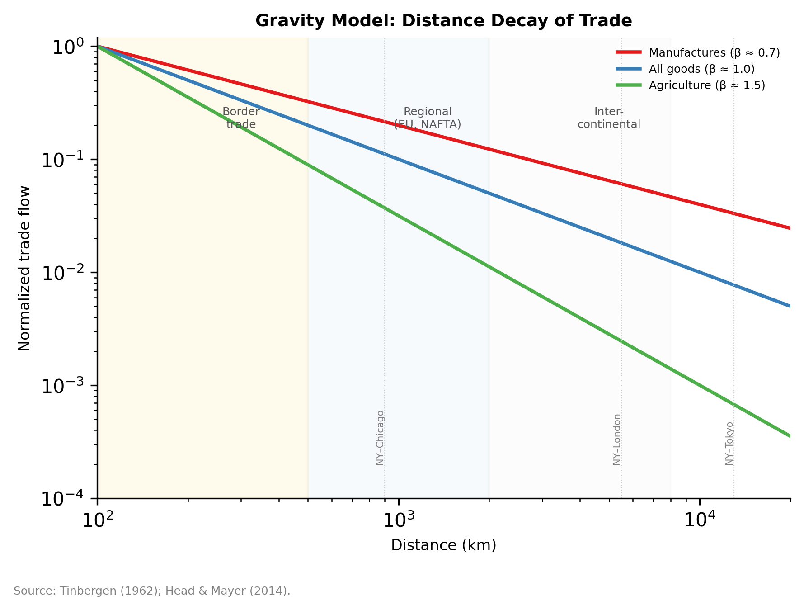

# Chapter 3-B: Trade Measurement and the Gravity Model

---

## Introduction: The Invisible Half of World Trade

Consider a single vehicle: the BMW X5, assembled at BMW's plant in Spartanburg, South Carolina — the largest BMW factory in the world by volume, shipping over 1,500 vehicles per day. When a finished X5 rolls onto a container ship at the Port of Charleston, bound for a dealership in Munich, US customs records a goods export to Germany worth roughly $65,000. But what, exactly, has been traded? The physical components — steel panels stamped in Mississippi, a transmission machined in Spartanburg, seats stitched in a supplier park in Greer — account for perhaps 40 percent of the vehicle's value. The remaining value reflects services performed across three continents: the drivetrain engineering coordinated from Munich, the adaptive-suspension software written in Portland, the supply-chain logistics managed from Spartanburg and Regensburg simultaneously, the brand equity cultivated by decades of marketing expenditure in New York and London, the dealer financing structured through BMW Financial Services in Salt Lake City. When that X5 arrives in Bavaria, German customs records a goods import. Neither country's trade statistics register the extraordinary web of service activities — spanning R&D, software development, logistics, finance, and marketing — that constitutes the majority of the vehicle's value. The same supply chain looks different depending on which direction you examine it: when Section 3B.4 traces a BMW exported *from* Germany to the United States, the service content embedded in that flow tells a story about German engineering and design sophistication. The Spartanburg X5 headed the other way tells a complementary story about American manufacturing integrated into a German-headquartered service architecture. In both directions, what customs authorities record as "goods trade" is largely services trade in disguise. The OECD estimates that roughly 30 percent of the gross export value of a typical automobile reflects service inputs — and for premium vehicles with heavy R&D, software, and brand components, the share can exceed 50 percent (Miroudot and Cadestin 2017). The BMW X5 is not an exception; it is an exemplary case of a phenomenon that pervades modern manufacturing.

This measurement problem pervades the global economy. In 2023, global services trade reached $7.9 trillion — roughly 24 percent of total world trade measured through balance-of-payments statistics. But this figure is almost certainly a dramatic undercount. When a German engineering firm establishes a subsidiary in Shanghai to provide after-sales maintenance for its machine tools, balance-of-payments statistics record the subsidiary's creation as foreign direct investment, not as a service export. When Samsung ships a smartphone from its Gyeonggi-do factory to a distributor in São Paulo, the value of the design, R&D, logistics coordination, marketing, and financing services embedded in that physical product — collectively worth far more than the physical components — is recorded as a goods export. The BOP framework, designed in an era when trade meant shipping tangible products across borders, systematically undercounts the activity that now drives the most dynamic sectors of the world economy.

This measurement problem is not merely a statistical curiosity. It has direct consequences for the analysis of regional economic geography. If services trade is larger, more geographically concentrated, and more institutionally sensitive than BOP data suggest, then the spatial economics of services — which Chapter 3-A's tools are designed to analyze — is operating on a distorted empirical foundation. A gravity model estimated on BOP services data will produce biased distance elasticities because the highest-value services transactions (Mode 3 commercial presence) are missing from the dependent variable. A regional convergence regression that omits servicification — the service value-added embedded in manufactured exports — will misattribute productivity gains to manufacturing when they actually reflect the growing sophistication of the service functions coordinated from a handful of command-center cities.

This chapter provides the trade measurement and estimation framework that all regional chapters cross-reference. It is organized in four sections:

1. **The structural gravity model.** Section 3B.1 derives the gravity equation from theory, introduces the PPML estimator, and establishes why gravity is the workhorse of empirical trade economics.

2. **Services trade: measurement and modes.** Section 3B.2 introduces the GATS four-mode framework, documents the measurement gaps that each mode creates, and explains why standard trade statistics systematically undercount services.

3. **Gravity for services.** Section 3B.3 presents the key empirical finding that distance elasticities are often *larger* for services than for goods — a counterintuitive result with profound implications for regional economics — and develops the "trading tasks" framework that explains it.

4. **Servicification and value-added trade.** Section 3B.4 introduces the TiVA decomposition framework and the concept of servicification — the service content embedded in manufactured exports — which reshapes how we think about the geography of production.

---

## 3B.1 The Structural Gravity Model

*Source: Tinbergen (1962); Head & Mayer (2014).*

### From Newton to Anderson-van Wincoop

The gravity model of trade is one of the most empirically successful relationships in all of economics. In its simplest form, bilateral trade $$X_{ij}$$ between countries $$i$$ and $$j$$ is proportional to the product of their economic masses (GDP) and inversely proportional to the trade costs between them:

$$
X_{ij} = G \cdot \frac{Y_i \cdot Y_j}{d_{ij}^\delta}
$$

where $$Y_i$$ and $$Y_j$$ are GDPs, $$d_{ij}$$ is bilateral distance (a proxy for trade costs), $$\delta$$ is the distance elasticity, and $$G$$ is a gravitational constant. This equation, first applied to trade by Tinbergen (1962), routinely explains 60–80 percent of the variation in bilateral trade flows — a fit that few other empirical relationships in economics can match.

For decades, the gravity model's theoretical foundations were uncertain: it "worked" empirically but lacked a clean derivation from trade theory. Anderson and van Wincoop (2003) resolved this by deriving the gravity equation from a general-equilibrium trade model with CES preferences and iceberg trade costs. Their key contribution was the concept of **multilateral resistance** — the idea that bilateral trade between $$i$$ and $$j$$ depends not only on the bilateral trade cost between them but also on how costly it is for each of them to trade with *all other partners*. A country that faces high trade costs with everyone will trade relatively more with any given partner, compared to a country with many low-cost alternatives.

The derivation proceeds from CES preferences. Each country's demand for imports from country $i$ is a CES share of expenditure, proportional to $(p_i \tau_{ij} / P_j)^{1-\sigma}$. Summing across destinations and imposing market clearing yields the structural gravity equation with multilateral resistance terms $P_j$ and $\Pi_i$ as the solution to a system of $2n$ nonlinear equations. Anderson and van Wincoop (2003) showed that solving this system is essential for correctly interpreting bilateral trade cost estimates — ignoring multilateral resistance biases border-effect estimates upward (as in McCallum's original 22x finding). Appendix A provides the full estimating equation.

The structural gravity equation is:

$$
X_{ij} = \frac{Y_i \cdot E_j}{Y^W} \cdot \left(\frac{t_{ij}}{P_j \cdot \Pi_i}\right)^{1-\sigma}
$$

where $$E_j$$ is country $$j$$'s total expenditure, $$Y^W$$ is world income, $$t_{ij}$$ is the bilateral trade cost, $$\sigma > 1$$ is the elasticity of substitution, and $$P_j$$ and $$\Pi_i$$ are the inward and outward multilateral resistance terms — price indices that capture each country's average trade costs with all partners.

The practical implication is that any gravity estimation that omits multilateral resistance will produce biased estimates. The standard solution is to include exporter and importer fixed effects, which absorb $$Y_i$$, $$E_j$$, $$P_j$$, and $$\Pi_i$$ entirely, leaving bilateral trade costs as the only source of identifying variation.


**Multilateral Resistance.** Bilateral trade between countries $$i$$ and $$j$$ depends not only on the trade costs between them but on how costly it is for each to trade with *all other partners*. A country surrounded by high-cost alternatives will trade more with any given partner than an otherwise identical country with many low-cost options. Omitting multilateral resistance inflated McCallum's (1995) Canada--US border effect from a factor of ~10 to ~22. The standard fix --- exporter and importer fixed effects --- absorbs multilateral resistance entirely and should be included in every gravity specification.


### The McCallum Border Puzzle

The concept of multilateral resistance was not an abstract theoretical refinement — it was developed to resolve one of the most striking empirical puzzles in the trade literature. McCallum (1995) estimated a gravity model for trade among Canadian provinces and US states and found that, controlling for distance and economic size, Canadian provinces traded roughly 22 times more with each other than with equidistant US states. This "border effect" was astonishingly large: it implied that the US-Canada border — between two wealthy, English-speaking countries with deep economic ties and a free trade agreement — imposed trade frictions equivalent to thousands of miles of additional distance.

Anderson and van Wincoop (2003) showed that McCallum's estimate was inflated by the omission of multilateral resistance. Canada is a small, open economy whose provinces have few alternative trading partners; the United States is a large economy whose states have many. When each country's overall trade cost environment is properly accounted for, the border effect falls to a factor of roughly 10 for Canada — still enormous, but less implausible than 22. Chapter 4 cites the broader "factor of 10 to 20" range from the post-McCallum literature when discussing US-Canada border friction; the key lesson here is methodological. McCallum's raw estimate and the Anderson-van Wincoop correction together motivate the entire structural gravity enterprise: bilateral trade costs cannot be interpreted in isolation from the multilateral trade cost environment. Every gravity estimate in this book includes the exporter and importer fixed effects that absorb multilateral resistance, precisely because the McCallum episode demonstrated how badly things go wrong without them. The border puzzle also carries a substantive lesson beyond methodology: even between closely integrated economies, borders impose large and persistent trade costs — a finding that sets up the analysis of border friction in Chapters 4 (USMCA), 9 (EU Single Market), and 10 (Brexit).

### The PPML Estimator

The traditional approach to estimating gravity models — log-linearizing the equation and running OLS on $$\ln X_{ij}$$ — has two well-known problems. First, it drops all zero trade flows (since $$\ln 0$$ is undefined), and zeros are informative: they represent country pairs where trade costs are too high for any trade to occur. In services trade, where zeros are far more common than in goods trade, dropping them creates severe selection bias. Second, Jensen's inequality means that $$E[\ln X] \neq \ln E[X]$$, so OLS on the log-linearized equation produces inconsistent estimates when the error term is heteroskedastic — as it almost always is with trade data.


**The Zero-Trade Problem.** Log-linearized OLS gravity drops all country pairs with zero bilateral trade (since $$\ln 0$$ is undefined). These zeros are informative --- they represent pairs where trade costs exceed the threshold for any exchange. In services trade, zeros can exceed 50 percent of observations; dropping them introduces severe selection bias and overstates the ease of trading. The PPML estimator (below) keeps zeros in the estimation by modeling trade in levels, and it is consistent under the heteroskedasticity that plagues trade data. Always prefer PPML over log-linear OLS for gravity estimation.


Santos Silva and Tenreyro (2006) proposed the **Poisson Pseudo-Maximum Likelihood (PPML)** estimator as the solution. PPML estimates the gravity equation in multiplicative form:

$$
X_{ij} = \exp(\alpha_i + \gamma_j + \beta_1 \ln d_{ij} + \beta_2 \text{contig}_{ij} + \beta_3 \text{lang}_{ij} + \cdots) \cdot \eta_{ij}
$$

where the exporter fixed effects $$\alpha_i$$ and importer fixed effects $$\gamma_j$$ absorb multilateral resistance. PPML handles zero trade flows naturally (the dependent variable remains in levels), is consistent under heteroskedasticity, and has become the standard estimator in the gravity literature.

In practice, implementing PPML for gravity requires several decisions that affect results. Standard errors should be clustered at the country-pair (dyad) level, since bilateral trade flows between the same pair are correlated over time; some researchers additionally cluster at the exporter or importer level, or use multi-way clustering (Cameron, Gelbach, and Miller 2011). When panel data are available, the specification should include exporter-time and importer-time fixed effects to absorb time-varying multilateral resistance — a demanding but necessary requirement, since multilateral resistance shifts as countries sign new trade agreements or face new competitors. Convergence can be slow when the model includes high-dimensional fixed effects alongside many zeros; the `ppmlhdfe` command in Stata (Correia, Guimarães, and Zylkin 2020) and the `fixest` package in R handle this efficiently and have become the standard implementations. Finally, PPML coefficients should be interpreted carefully: since the model is estimated in levels, the coefficients represent semi-elasticities in the exponential specification. A distance coefficient of $$-0.95$$ means that a one-unit increase in $$\ln d_{ij}$$ reduces the *level* of trade by $$\exp(-0.95) - 1 \approx -61$$ percent — not a 95-percent reduction, as a naive log-linear interpretation would suggest.

### What the Gravity Model Identifies

A correctly specified gravity model with exporter and importer fixed effects identifies the *bilateral trade cost* elasticities — how much additional distance, lack of a common language, absence of a colonial tie, or presence of a regulatory barrier reduces trade between a specific pair. It does not identify the level effects of GDP or total expenditure (which are absorbed by the fixed effects), nor does it identify the effect of unilateral trade policies (which are also absorbed). This means the gravity model is precisely the right tool for answering the question that matters most for regional economics: conditional on the characteristics of the trading partners, how much do *bilateral frictions* — distance, borders, language, regulation — reduce trade?

The canonical estimates from the goods-trade gravity literature provide a useful benchmark. Across hundreds of studies, the consensus distance elasticity for goods trade is approximately $$-0.9$$ to $$-1.1$$: doubling bilateral distance reduces trade by roughly 50 percent. Sharing a common language increases trade by 30–50 percent. Sharing a colonial tie increases trade by 50–80 percent. These estimates are remarkably stable across time periods, country samples, and commodity categories — which is itself a puzzle, since transport costs as a fraction of goods value have fallen dramatically over the past century. The persistence of the distance effect suggests that distance proxies for informational and institutional barriers, not just shipping costs.

### The CEPII Gravity Dataset

Most empirical gravity work draws bilateral variables from the CEPII (Centre d'Études Prospectives et d'Informations Internationales) GeoDist and Gravity databases, maintained by Head, Mayer, and their collaborators. The GeoDist database provides several measures of bilateral distance: simple city-to-city (capital to capital), population-weighted distance (which accounts for the internal geographic distribution of economic activity — critical for large countries like the United States, where trade costs from Seattle to Vancouver differ enormously from trade costs from Miami to Vancouver), and geodesic distance. It also provides binary indicators for contiguity (shared land border), common official language, common spoken language (at least 9 percent of the population), colonial relationship (ever/current), common colonizer, and common legal origin. The Gravity database extends this with time-varying information on preferential trade agreements, WTO membership, currency unions, and other bilateral institutional arrangements. These variables are so ubiquitous in the gravity literature that reporting gravity results without the CEPII covariates would be like running a regression without a constant — technically possible, but difficult to interpret or compare with other work.

### Gravity "Distance" as Institutional Distance

The stability of the distance elasticity despite falling transport costs points to a deeper interpretation. What gravity models call "distance" is, in substantial part, institutional distance — the accumulated differences in legal traditions, regulatory frameworks, business norms, trust networks, and information environments that correlate with geographic separation. Two countries that are geographically close tend to share colonial histories, legal systems, educational traditions, and business networks. These shared institutions reduce the cost of contracting, enforcing agreements, and exchanging tacit knowledge — frictions that matter for services trade even more than for goods (as Section 3B.3 will show). This interpretation connects the gravity model directly to the institutional framework developed in Chapter 2: the "rules of the game" that structure economic interactions vary across space in ways that are correlated with, but not reducible to, physical distance. Gravity models capture institutional distance imperfectly — through the colonial-tie and common-language indicators — but the residual distance effect almost certainly reflects institutional frictions that these crude proxies fail to measure.

---

## 3B.2 Services Trade: Measurement and Modes

### The GATS Four-Mode Framework

The General Agreement on Trade in Services (GATS), negotiated during the Uruguay Round and entering into force in 1995, provides the institutional grammar for services trade. It defines four modes of supply:

**Mode 1: Cross-border supply.** The service crosses the border; neither the supplier nor the consumer moves. Examples: a London law firm advising a client in Lagos via email; an Indian software firm delivering code to a Silicon Valley startup; a reinsurer in Zurich covering risks for a carrier in Bermuda. This is the mode most analogous to goods trade, and it is the best-captured in BOP statistics.

**Mode 2: Consumption abroad.** The consumer moves to the supplier's territory. Examples: a Saudi student studying at MIT; a German tourist receiving medical treatment in Bangkok; a Brazilian firm sending engineers to a training program in Stuttgart. Education and health tourism are the canonical Mode 2 services. BOP records capture some of this (the "travel" category), but the boundary between tourism consumption and service imports is blurred.

**Mode 3: Commercial presence.** The supplier establishes a subsidiary, branch, or affiliate in the consumer's territory. Examples: HSBC operating a retail banking network in Mexico; McKinsey maintaining an office in Mumbai; Walmart running stores in South Africa. This is the largest mode for many service sectors — particularly finance, telecommunications, and professional services — and it is the most poorly captured by trade statistics. BOP records FDI inflows and affiliate revenues, but these appear in the capital account and in FATS (Foreign Affiliates Trade in Services) statistics, not in the services trade balance. Most countries do not produce FATS data at all.

**Mode 4: Movement of natural persons.** Individual service suppliers move temporarily to the consumer's territory. Examples: a Filipino nurse working on a two-year contract in a Saudi hospital; an Indian IT consultant on an H-1B visa in the United States; a French architect supervising construction in Qatar. Mode 4 is the most politically sensitive (it intersects with immigration policy) and the most restrictively regulated.

| Mode | Definition | Example | Measurement Challenge |
|---|---|---|---|
| Mode 1: Cross-border supply | Service crosses the border; neither party moves | Indian software firm delivers code to a Silicon Valley client | Best captured by BOP; still subject to netting and routing gaps |
| Mode 2: Consumption abroad | Consumer moves to supplier's territory | Saudi student studying at MIT; medical tourism in Bangkok | Partially in BOP "travel" category; blurred boundary with tourism |
| Mode 3: Commercial presence | Supplier establishes affiliate in consumer's country | HSBC retail banking in Mexico; McKinsey office in Mumbai | Largely absent from BOP; recorded in FATS data that most countries lack |
| Mode 4: Movement of persons | Individual supplier moves temporarily | Filipino nurse on contract in Saudi Arabia; IT consultant on H-1B visa | Intersects immigration data; highly incomplete and politically sensitive |

### How Services Trade Data Are Constructed

Understanding *why* services data are weak requires understanding *how* they are compiled. For goods trade, customs declarations provide a near-census of transactions: every container passing through a port generates a record with product classification, origin, destination, weight, and value. Services leave no such paper trail. National statistical agencies construct services trade data through a patchwork of indirect methods. The core source is the International Transactions Reporting System (ITRS), which compiles cross-border payments routed through domestic banks — when a Kenyan firm pays a British consulting company, the bank records the transaction and its purpose code. But firms increasingly net out payments within multinational structures, use foreign bank accounts, or route transactions through financial centers that obscure the ultimate origin and destination. Statistical agencies supplement ITRS data with firm-level surveys — typically quarterly surveys of large enterprises known to have international operations — which capture transactions that bypass the banking system. Tourism receipts are estimated from visitor surveys at airports and hotels, combined with credit-card spending data. Transportation services are derived from port authority records and airline data. For developing countries with limited survey infrastructure, the compilation relies heavily on the banking channel alone, which means that services transactions conducted in cash, through informal networks, or through foreign-domiciled accounts simply vanish from the data.

The result is a measurement apparatus that is far less precise and far less comprehensive than its goods-trade counterpart. Even for advanced economies, revisions to services trade data are larger and more frequent than revisions to goods data — the US Bureau of Economic Analysis routinely revises services trade figures by 5–10 percent in annual benchmark revisions, as new survey responses arrive and coverage gaps are identified. When the WTO reports that Kenya's services exports totaled $7.2 billion in 2022, that figure reflects what Kenyan statistical authorities were able to capture through banking records and a modest firm survey — almost certainly an undercount, and one whose magnitude is essentially unknowable.

### The Measurement Gap

The practical consequence of the four-mode framework is that BOP-based services trade statistics capture Modes 1 and 2 reasonably well, Mode 4 partially (through "compensation of employees" and "workers' remittances"), and Mode 3 hardly at all. Since Mode 3 is the dominant delivery channel for many high-value services — financial services, telecommunications, professional and business services — the aggregate BOP figure of $7.9 trillion substantially undercounts actual services trade. Estimates that include Mode 3 activity suggest that total services trade may be 50–70 percent larger than BOP data indicate.

To put magnitudes on this gap: UNCTAD estimates that global sales through foreign affiliates in services — the Mode 3 channel — amounted to roughly $15–20 trillion annually in the early 2020s, a figure that would more than triple the BOP-recorded total of $7.9 trillion if it were included in services trade statistics. For the gravity modeler, the implication is unsettling: the dependent variable in a standard services gravity regression captures, at best, one-quarter of actual cross-border service activity. If Mode 3 trade has a different geographic pattern than Mode 1 trade — which it almost certainly does, since commercial presence requires local knowledge, regulatory approval, and physical proximity to clients — then the estimated distance elasticity from BOP data reflects the geography of *digitally tradable* services, not the geography of services trade as a whole.

This measurement gap is not uniformly distributed. It is most severe for advanced producer services (APS) — the finance, law, accounting, management consulting, and advertising firms that Sassen (2001) identified as the command-and-control functions of the global economy. These firms overwhelmingly deliver services through Mode 3, establishing offices in client markets and billing locally. Their cross-border revenue appears in BOP data; their far larger local-affiliate revenue does not. For a city like London or New York, whose economic base rests heavily on APS exports, BOP data dramatically understate the city's role as a service exporter.

The gap is also asymmetric across countries. Developed countries with large outward FDI stocks in services (the US, UK, France, Germany, Japan) have Mode 3 exports that dwarf their Mode 1 exports. Developing countries that receive FDI in services have Mode 3 *imports* that dwarf their recorded service imports. The result is that BOP data systematically understate the service trade integration of the global economy — and particularly understate the developing world's consumption of services produced by developed-country firms operating through local subsidiaries.

A telling indicator of the data quality problem is the divergence in mirror statistics. For goods trade, if Country A reports exporting $10 billion to Country B, Country B should report importing approximately $10 billion from Country A (with adjustments for CIF/FOB valuation and timing). Discrepancies exist but are typically 5–15 percent, and systematic reconciliation programs (like the UN Comtrade mirror exercise) keep them manageable. For services trade between developing-country pairs, mirror statistics can diverge by 50 percent or more — and sometimes by an order of magnitude. Nigeria's reported services imports from South Africa may bear no resemblance to South Africa's reported services exports to Nigeria, because both figures are constructed from incomplete banking records and sparse survey data. This means that the standard cross-check available to goods-trade researchers — comparing exporter-reported and importer-reported flows — is essentially uninformative for services trade among developing economies. Gravity modelers working with bilateral services data must accept a level of measurement error that would be considered disqualifying in the goods-trade literature.

For regional economics, the implication is that any analysis of services trade geography built exclusively on BOP data will understate the concentration of service production in a small number of global cities and overstate the degree to which peripheral regions are disconnected from global service networks. The APS networks documented by the GaWC (Globalization and World Cities) research group — which use firm-office location data rather than trade flows — provide a complementary picture that reveals the actual geography of service production far more accurately than BOP statistics.

---

## 3B.3 Gravity for Services: Distance, Regulation, and the Trading-Tasks Framework

### The Distance Puzzle

The most counterintuitive finding in the services gravity literature is that **distance elasticities for services trade are at least as large as — and often larger than — those for goods trade**. Kimura and Lee (2006) estimate a distance elasticity of $$-1.2$$ to $$-1.4$$ for services, compared to $$-0.9$$ to $$-1.1$$ for goods. Head, Mayer, and Ries (2009) find similar results in a meta-analysis of 2,508 gravity estimates. This is puzzling because services, by definition, have no physical weight to ship: the marginal transport cost of sending an email from Bangalore to Boston is zero, and yet the gravity model estimates suggest that services are *more* distance-sensitive than physical commodities.

The puzzle deepens when the estimates are disaggregated. Kimura and Lee's sample spans 10 service sectors across 19 OECD economies and 51 non-OECD economies, and the distance elasticity varies enormously by sector: financial services and insurance show elasticities of $$-1.5$$ or larger, while transport services (which involve physical movement) show elasticities closer to goods-trade norms. Head, Mayer, and Ries confirm that the pattern is robust to different estimation methods, country samples, and time periods, ruling out the possibility that it is an artifact of a particular dataset. What distance proxies for in services gravity is not what it proxies for in goods gravity: it captures regulatory similarity (countries with similar legal traditions regulate services similarly), trust and informational networks (which decay with geographic and cultural distance), time-zone overlap (which constrains real-time collaboration), and language compatibility (which matters more for communication-intensive services than for standardized goods). All of these frictions are *correlated* with physical distance but are not caused by it — a distinction that matters enormously for policy, since building a highway reduces physical distance costs but does nothing to harmonize financial regulation. The decomposition also varies by development level: for OECD-only samples, the services distance elasticity is smaller (around $$-1.0$$ to $$-1.2$$), while samples that include developing economies — where regulatory heterogeneity and information frictions are more severe — produce larger estimates, sometimes exceeding $$-1.5$$.

The resolution lies in the nature of the trade costs that distance proxies for. For goods, distance primarily captures transport costs — shipping, insurance, time in transit. These costs have fallen dramatically since containerization, which is why the goods distance elasticity has been roughly stable despite falling freight rates (the "distance puzzle" in the goods literature). For services, distance captures **informational and institutional barriers**: time-zone differences that reduce overlap in working hours, cultural and linguistic distance that complicates communication, differences in legal systems that increase contracting costs, and — most importantly — the regulatory barriers that fragment service markets across jurisdictions.

A lawyer in London can advise on English law anywhere in the world with near-zero marginal communication cost, but cannot practice French law in Paris, Brazilian law in São Paulo, or Japanese law in Tokyo without separate qualifications in each jurisdiction. A bank licensed in the UK cannot accept deposits in Germany without a German banking license (or the EU passporting right that Brexit revoked). An architect certified in Australia cannot sign off on building plans in Canada. These regulatory barriers — which are *correlated with distance* because nearby countries tend to share legal traditions, colonial histories, and regional trade agreements — inflate the distance elasticity for services far beyond what communication costs alone would predict.

### The Role of Regulatory Barriers

The OECD's Services Trade Restrictiveness Index (STRI) quantifies these regulatory barriers across 22 service sectors and 50+ countries. The STRI measures five categories of restrictions: (1) barriers to foreign entry (equity limits, licensing requirements, nationality conditions for board members); (2) restrictions on the movement of people (quotas on foreign professionals, non-recognition of qualifications); (3) barriers to competition (government-granted monopolies, price controls, discriminatory subsidies); (4) regulatory transparency (advance notice of proposed regulations, right to comment, publication of decisions); and (5) other discriminatory measures (discriminatory taxation, local content requirements). Each restriction is scored as a binary indicator — present or absent — and the indicators are aggregated with sector-specific weights into a composite score ranging from 0 (completely open) to 1 (completely closed). The most restricted sectors globally are professional services — accounting, legal services, and architecture — where national licensing requirements, qualification recognition barriers, and restrictions on cross-border practice create formidable walls. The least restricted are typically computer services and telecommunications, though even these show substantial variation across countries.

The World Bank's Services Trade Restrictions Database extends the STRI framework to developing economies that the OECD index does not cover — a critical extension, since many of the most restrictive services regimes are in countries outside the OECD sample. The World Bank database uses a broadly comparable methodology but with coarser sectoral detail, and its coverage of Sub-Saharan Africa and South Asia fills a gap that would otherwise make gravity estimation for these regions impossible. Together, the OECD STRI and World Bank databases allow researchers to include regulatory barriers as explicit regressors in gravity models for most of the world's bilateral service trade relationships — a significant advance over the earlier practice of treating regulatory effects as part of the unexplained distance elasticity.

When STRI scores are included as regressors in a gravity model alongside the standard distance, language, and colonial-tie variables, two things happen. First, the STRI coefficient is large and significant: a one-standard-deviation increase in the importer's STRI reduces bilateral services trade by roughly 15–25 percent, depending on the sector. Second, the distance elasticity *falls* — often substantially — indicating that a significant portion of what the standard gravity model attributes to "distance" is actually regulatory heterogeneity.

This finding has direct implications for every regional chapter in this book. When Chapter 9 (Europe) discusses the incomplete Single Market for services, the gravity model quantifies the cost: intra-EU services trade is 40–60 percent below the level that a frictionless single market would predict, with the gap concentrated in professional services and financial services where national regulatory barriers remain highest. When Chapter 4 (Americas) examines USMCA's services provisions, the gravity model provides the counterfactual: how much more services trade would flow between the US, Canada, and Mexico if regulatory barriers were reduced to intra-EU levels? When Chapter 6 (East Asia) assesses the RCEP's limited services commitments, the gravity model reveals the opportunity cost of regulatory fragmentation in a region whose goods trade is deeply integrated but whose services trade lags far behind.

### Trading Tasks: Which Services Offshore?

Grossman and Rossi-Hansberg (2008) provided the theoretical framework for understanding which service activities are tradable across distance and which are not. Their "trading tasks" model decomposes production into discrete tasks that vary along two dimensions:

**Routineness.** Routine tasks — those that can be specified by explicit rules and do not require contextual judgment — are easier to offshore because they can be communicated through codified instructions. Data entry, basic bookkeeping, standardized software testing, and call-center scripting are routine. Strategic consulting, complex litigation, and creative design are non-routine.

**Communication intensity.** Tasks that require frequent, nuanced, face-to-face communication are harder to offshore than tasks that can be communicated through asynchronous written instructions. A surgeon must be physically present; a radiologist reading an MRI can be anywhere. A manager supervising a familiar, well-defined process can do so remotely; a manager handling a crisis requires presence.

The spatial implications are profound. Tasks that are both routine and low in communication intensity — the lower-left quadrant of the Grossman-Rossi-Hansberg matrix — are highly offshorable and will migrate to the lowest-cost location with adequate infrastructure (India, the Philippines, Eastern Europe for English-language services; Morocco and Senegal for French-language services). Tasks that are non-routine and communication-intensive — the upper-right quadrant — are "sticky" and will remain in the high-cost, high-amenity cities where face-to-face interaction with clients, regulators, and other professionals is essential. This is why New York, London, and Hong Kong remain the dominant centers of investment banking despite enormous labor cost differentials: the highest-value tasks in finance require the density of face-to-face interaction that only these cities provide.

### The Persistence of Place: Buzz, Tacit Knowledge, and High-Skill Sorting

The stickiness of high-value service tasks demands a deeper explanation than communication costs alone. Storper and Venables (2004) provided one with their theory of "buzz" — the unplanned, serendipitous exchange of tacit knowledge that occurs when skilled professionals are co-located in dense urban environments. A portfolio manager overhears a conversation at a conference; a software architect sketches an idea on a napkin at lunch with a former colleague; a lawyer learns about a regulatory shift from an opposing counsel before it becomes public. These interactions cannot be replicated by Zoom or email because they are *unplanned* — the participants did not know in advance what they would learn, which means they could not have arranged a meeting to discuss it. Storper and Venables argue that buzz generates a spatial paradox: precisely because digital communication has reduced the cost of transmitting codified information to near zero, the *relative* value of tacit, face-to-face knowledge exchange has *increased*. The city premium for high-value services is not a relic of the pre-internet era; it is a consequence of digitization, which made codified knowledge ubiquitous and therefore worthless as a source of competitive advantage, while leaving tacit knowledge — accessible only through physical proximity — as the scarce input. This explains the otherwise mystifying observation that distance elasticities for services trade have not fallen as communication costs have collapsed: the services that are most valuable are the ones that require presence, and their gravity is determined by the geography of trust, reputation, and serendipity rather than the geography of bandwidth.

Diamond (2016) adds a complementary mechanism: high-skill workers sort into expensive, high-amenity cities because those cities offer thick labor markets, consumption amenities, and peer effects that raise productivity. The sorting is self-reinforcing — more skilled workers attract more firms that need skilled workers, which attracts more skilled workers — creating a spatial equilibrium in which a handful of cities (New York, London, Singapore, San Francisco) capture a disproportionate share of high-value service production. The implication for services gravity is that the "distance" variable in services trade regressions partly captures the geographic concentration of skilled labor: services trade is concentrated among a small number of city-pairs because skilled service workers are concentrated in a small number of cities. Chapter 16 returns to this mechanism in the context of digital platforms and AI, asking whether remote work technologies will finally break the spatial equilibrium that Diamond documents, or whether the buzz mechanism will prove more durable than the technology optimists expect.

The regional chapters will apply this framework repeatedly. Chapter 8 (India) traces the evolution of Indian IT services from the lower-left quadrant (routine BPO) toward the upper-right (consulting, cloud architecture, AI services), showing how Bangalore's institutional ecosystem supports the upgrading of service tasks. Chapter 10 (Europe) examines how CEE cities — Warsaw, Prague, Bucharest — have positioned themselves as nearshore hubs for financial services tasks that are routine enough to offshore but communication-intensive enough to require European time zones and cultural proximity.

---

## 3B.4 Servicification and Value-Added Trade

### The Hidden Services in Manufactured Exports

When Germany exports a BMW to the United States, the customs declaration records a goods export. But the value of the physical car — the steel, glass, rubber, and assembly labor — is a fraction of the export price. The larger share of the value reflects services: the R&D that designed the engine, the software that runs the infotainment system, the logistics that coordinated 2,500 suppliers across 30 countries, the marketing that built the brand, and the financing that funded the dealer inventory. These service activities are performed by BMW employees and contractors in Munich, by software engineers in Bangalore, by logistics coordinators in Leipzig, and by advertising agencies in New York. None of this service value appears in services trade statistics — it is all recorded as a goods export.

This phenomenon — the growing service content embedded in manufactured exports — is called **servicification**. The conceptual framework for measuring it was formalized by Koopman, Wang, and Wei (2014), who developed a complete decomposition of gross exports into value-added components that can be traced to their sector and country of origin. Their approach — implemented in the OECD's Trade in Value Added (TiVA) database — uses global input-output tables to follow value through production networks, attributing each dollar of a country's gross exports to the domestic or foreign industry that actually created the value. The current TiVA release covers 66 economies (including all OECD members plus key emerging economies) and 36 industries, with time series from 1995 to 2020. The three core measures — domestic value-added (DVA), foreign value-added (FVA), and domestic value-added that is re-exported by the partner (DVX) — together exhaust gross exports and allow researchers to identify exactly where value is created in a multi-country production chain. For any bilateral flow, the DVA share measures how much of the exporter's gross exports reflects genuine domestic production; the FVA share measures how much reflects imported intermediates that pass through the country without adding domestic value; and the DVX share captures domestic value that is re-exported by the importing country to third markets, revealing the exporter's role as an upstream supplier in global chains. TiVA decomposes gross exports into their domestic and foreign value-added components, and further decomposes domestic value-added by sector of origin. The results are striking:

- In Germany, services account for roughly 40 percent of the domestic value-added in manufactured exports — up from 30 percent in 2000.
- In the United States, the service share exceeds 50 percent for most manufacturing categories.
- Even in China, where assembly operations dominate many export sectors, the domestic service content of manufactured exports has risen from 20 percent to 30 percent over the past two decades, reflecting the growth of domestic design, engineering, and logistics capabilities.

These aggregate figures come alive when traced through specific products. A Samsung Galaxy smartphone assembled in Vietnam (Chapter 6) has a gross export value of roughly $250, of which Samsung's Vietnamese operations contribute perhaps $15 in assembly value-added. The remaining value is split between Korean R&D, design, and brand management (the largest single component), Japanese and Taiwanese component manufacturing, American software licensing, and Vietnamese logistics and administration. TiVA reveals that Korea's "electronics exports" are substantially a vehicle for exporting Korean engineering and design services — a fact invisible in gross trade data. Similarly, a Zara fast-fashion garment shipped from a Spanish distribution center to a store in Berlin (Chapter 10) embeds design services performed in A Coruna, logistics coordination managed from Arteixo, and trend-forecasting algorithms developed in-house — service activities that account for a far larger share of the retail price than the fabric cutting and stitching performed at contract manufacturers in Morocco, Turkey, or Bangladesh.

The implication is that the geography of manufacturing exports is partly a geography of services — and that countries or regions that develop sophisticated service functions (design, logistics, finance, marketing) capture a growing share of the value from global production networks, even when the physical production occurs elsewhere. This is the economic logic behind the "smile curve" of value-added distribution: the upstream (R&D, design) and downstream (marketing, after-sales service) ends of global value chains capture most of the value, while the physical production in the middle captures the least. The smile curve is a spatial phenomenon: the high-value ends are concentrated in a few cities in developed countries, while the low-value middle is distributed across factory regions in developing countries. The regional chapters trace the spatial consequences of this distribution repeatedly. Chapter 5 (Latin America) examines why Mexico and Central America have struggled to move beyond the assembly trough — trapped in the low-value middle of the smile curve by weak domestic service capabilities and a dependence on imported intermediates that limits DVA shares. Chapter 7 (ASEAN) asks whether Vietnam, Thailand, and Malaysia can use the smile curve as a ladder rather than a trap, upgrading from assembly into the design and logistics functions that capture more value — and whether the institutional prerequisites for that upgrading (education systems, IP protection, financial depth) are developing fast enough.

### TiVA Decomposition and Lab 7

The TiVA framework allows researchers to decompose any country's gross exports into:

1. **Domestic value-added in final goods exports (DVA):** The value added by domestic factors of production that is embodied in exports consumed in the importing country.

2. **Foreign value-added in exports (FVA):** The value added by foreign factors of production that is embodied in a country's gross exports — the import content of exports.

3. **Domestic value-added re-exported (DVX):** Domestic value-added that is exported to a partner, incorporated into that partner's exports, and re-exported to third countries.

For services trade analysis, the critical decomposition is the service-sector share of DVA in manufacturing exports. This measures servicification directly: how much of the value Germany creates when it exports machinery actually originates in service activities performed within Germany?

Lab 7 (Services) extends this framework by estimating a gravity model where the dependent variable is bilateral services trade (both direct BOP flows and the service component of goods trade derived from TiVA), and the key regressors include STRI scores, GATS commitment indices, and measures of digital infrastructure. The Running Gravity Results Table — first introduced in this chapter with canonical estimates from the literature — is reprinted in Lab 7 with the students' own estimates appended, allowing direct comparison with the published benchmarks.

---

## Data in Depth: Estimating a Baseline PPML Gravity Model for Services Trade

**Setting.** Estimate a cross-sectional gravity model for bilateral services trade using WTO BOP data for 80+ countries, augmented with CEPII gravity variables and OECD STRI scores.

**Protocol.** The estimation proceeds in three steps:

1. **Goods baseline.** Estimate a standard PPML gravity model for bilateral goods trade:

$$
\text{Trade}_{ij}^{goods} = \exp(\alpha_i + \gamma_j + \beta_1 \ln d_{ij} + \beta_2 \text{contig}_{ij} + \beta_3 \text{lang}_{ij} + \beta_4 \text{colony}_{ij}) \cdot \eta_{ij}
$$

Report the distance elasticity $$\hat{\beta}_1$$, which should fall in the $$-0.9$$ to $$-1.1$$ range.

2. **Services baseline.** Estimate the same specification for bilateral services trade. Report $$\hat{\beta}_1$$ for services and compare with goods. The services distance elasticity is typically $$-1.2$$ to $$-1.5$$ across the literature — larger in absolute value than goods.

3. **STRI-augmented.** Add the importer's sector-average STRI score to the services gravity specification:

$$
\text{Trade}_{ij}^{services} = \exp(\alpha_i + \gamma_j + \beta_1 \ln d_{ij} + \beta_2 \text{contig}_{ij} + \beta_3 \text{lang}_{ij} + \beta_4 \text{colony}_{ij} + \beta_5 \text{STRI}_j) \cdot \eta_{ij}
$$

The coefficient $$\hat{\beta}_5$$ measures the trade-reducing effect of regulatory barriers, and the distance elasticity should fall (in absolute value) when STRI is included — confirming that regulatory heterogeneity is part of what the distance variable captures.

**Typical findings.**

| | Goods | Services (baseline) | Services (STRI-augmented) |
|---|---|---|---|
| Distance elasticity | $$-0.95$$ | $$-1.35$$ | $$-1.10$$ |
| Common language | $0.35$ | $0.55$ | $0.48$ |
| Colonial tie | $0.62$ | $0.78$ | $0.70$ |
| STRI | — | — | $$-1.45$$ |

The STRI coefficient implies that a one-standard-deviation increase in regulatory restrictiveness reduces services imports by roughly 20 percent. The reduction in the distance elasticity from $$-1.35$$ to $$-1.10$$ when STRI is included confirms that roughly one-quarter of the "distance effect" in services gravity is actually regulatory heterogeneity.

**Takeaway for students.** The goods gravity model is well-understood and stable. The services gravity model is more sensitive to specification choices — particularly the treatment of zeros (which are more prevalent), the handling of Mode 3 (which is absent from BOP data), and the inclusion of regulatory variables. Always report both goods and services estimates side by side, so the reader can see how the bilateral cost structure differs.

---

## Institutional Spotlight: The WTO Trade in Services Division and the Frontier of Measurement

Collecting services trade data is, in the words of one WTO statistician, "like trying to measure the wind." Goods cross borders in containers that customs officials can count, weigh, and classify. Services cross borders — or don't cross borders at all, in the case of Mode 3 — through channels that leave no physical trace.

The WTO's Trade in Services Division, working with UNCTAD and national statistical agencies, maintains the most comprehensive database of bilateral services trade flows. But the database has fundamental limitations that every user should understand.

**Coverage is uneven.** Developed countries report detailed bilateral services trade by partner and by sector (transport, travel, financial services, telecommunications, etc.). Many developing countries report only aggregate services exports and imports, without bilateral or sectoral detail. For Africa, bilateral services trade data are available for fewer than 20 of 54 countries, and sectoral breakdowns are available for fewer than 10. This means that any gravity model estimated on WTO services data is implicitly weighted toward developed-country trade patterns — a selection bias that may overstate the importance of factors (like colonial ties) that primarily affect trade among the countries that report.

**Mode 3 is the elephant in the room.** The Foreign Affiliates Trade in Services (FATS) framework, which the OECD and Eurostat have developed to capture Mode 3 activity, is available for only about 30 countries — mostly OECD members. For the rest of the world, Mode 3 is invisible in the data. Since Mode 3 is the dominant delivery channel for the highest-value services (finance, telecoms, professional services), its absence means that the countries with the most Mode 3 activity look *less* service-trade-integrated than they actually are.

**Classification evolves.** The Extended Balance of Payments Services Classification (EBOPS 2010), which provides the sectoral detail in WTO data, was last updated in 2010. It does not have categories for many digitally delivered services that have grown explosively since then: cloud computing, streaming media, social media advertising, platform-mediated gig work. The revision process is slow because it requires consensus among 164 WTO members with very different statistical capacities and very different interests in how digital services are classified.

The practical advice for students is: treat services trade data as a lower bound on actual service trade integration. Supplement BOP data with FATS where available, with GaWC firm-network data for APS geography, and with TiVA for servicification. No single data source captures the full picture — and the chapters of this book will use all of them.

---

## Conclusion: Measuring What Matters

The gravity model and the trade measurement framework developed in this chapter serve a specific purpose in the book's architecture: they provide the empirical foundation for the services trade analysis that runs through every regional chapter. Without the gravity model, claims about the effect of regulatory barriers on services trade geography would be unquantified assertions. Without the GATS framework, the distinction between different modes of service delivery — and the radically different spatial implications of each — would be invisible. Without TiVA decomposition, the servicification of manufacturing would remain hidden inside goods trade statistics, and the real geography of value creation in global production networks would be misunderstood.

Three principles from this chapter should guide the services analysis in the regional chapters:

**First, specify the mode.** When a regional chapter discusses "services trade," it should identify which GATS modes are relevant. India's IT exports to the US are primarily Mode 1 (cross-border digital delivery). London's financial services exports to the EU were primarily Mode 3 (branch and subsidiary operations) before Brexit and have been partially restructured since. Saudi Arabia's education imports are Mode 2 (students traveling abroad). The spatial implications differ dramatically by mode.

**Second, use the right estimator.** PPML with exporter and importer fixed effects is the baseline. Zero trade flows contain information; dropping them biases results. Regulatory barriers (STRI) should be included whenever the question involves institutional determinants of services geography.

**Third, look for servicification.** When a regional chapter discusses manufacturing exports or value chains, it should ask: what share of the value is actually services? The answer, increasingly, is "most of it" — and the regions that capture the service value are not always the regions where the physical production occurs.

These three principles point to a broader conclusion about the relationship between institutional quality and trade geography. For goods trade, the dominant determinants of spatial structure are transport infrastructure, market access, and factor endowments — the traditional concerns of trade theory and economic geography. For services trade, the dominant determinants are institutional: regulatory frameworks, legal traditions, educational systems, trust networks, and the governance quality that enables complex contracting across jurisdictions. A country can dramatically improve its goods-trade connectivity by building a port or joining a customs union. Improving services-trade connectivity requires something harder: reforming professional licensing regimes, strengthening contract enforcement, investing in the educational infrastructure that produces skilled service workers, and building the regulatory transparency that foreign service providers need to assess market-entry costs. This asymmetry — infrastructure for goods, institutions for services — will recur in every regional chapter of this book, and it helps explain why many countries that have successfully integrated into goods-producing global value chains (Vietnam, Bangladesh, Ethiopia) have struggled to develop significant service exports: the institutional prerequisites are more demanding and slower to build.

The reader should carry three findings from this chapter into the regional analysis that follows. First, distance matters more for services than for goods, and it matters for reasons that have nothing to do with transport costs — regulatory heterogeneity, trust, tacit knowledge, and time zones all decay with distance and inflate the gravity estimate. Second, regulation shapes the geography of services trade more powerfully than physical geography shapes the geography of goods trade — a finding that makes the institutional analysis of Chapter 2 indispensable for understanding every regional pattern documented in Parts II through VI. Third, services are hidden in goods: the servicification of manufacturing means that even chapters focused on industrial geography (Chapters 5, 6, 7) are implicitly analyzing the spatial distribution of service capabilities, and the TiVA framework provides the tool for making this hidden geography visible.

Chapter 3-A provided the spatial econometric toolkit for analyzing how outcomes in one region depend on outcomes in neighboring regions. This chapter has provided the trade measurement toolkit for analyzing how goods and services flow between regions and how institutional barriers shape those flows. Together, these two chapters equip the reader to engage critically with the empirical analysis in every regional chapter that follows.

---

## Discussion Questions

1. The gravity model consistently finds that distance elasticities are larger for services than for goods. Propose two distinct mechanisms that could explain this finding, and describe an empirical test that could distinguish between them. How would the test differ for Mode 1 services (cross-border digital) versus Mode 2 services (consumption abroad)?

2. A government announces a unilateral reduction in services trade barriers (e.g., liberalizing foreign entry into telecommunications). Using the structural gravity framework, explain why the trade effect depends on the multilateral resistance terms — that is, on how the liberalizing country's trade costs compare with those of all other potential trading partners. Under what conditions would unilateral liberalization *reduce* services trade with some partners?

3. Servicification implies that a significant share of the value in manufactured exports actually originates in service activities. Does this mean that developing countries assembling manufactured goods for export are less "industrialized" than their gross export data suggest? How would you use TiVA data to assess whether a country's manufacturing export growth represents genuine capability accumulation or merely increasing participation in assembly tasks?

4. The GATS Mode 3 (commercial presence) is the largest channel for services trade in finance and professional services, but it is the most poorly measured. If a researcher estimates a gravity model using only BOP data (which captures Modes 1 and 2 well but Mode 3 poorly), in what direction would you expect the distance elasticity to be biased? Would the bias be larger for sectors where Mode 3 dominates (e.g., banking) or sectors where Mode 1 dominates (e.g., IT services)?

5. The OECD STRI measures regulatory barriers to services trade across 22 sectors. A country with a high STRI score in legal services but a low score in IT services has different regulatory postures toward different service sectors. How would you modify the standard gravity specification to capture this sector-level heterogeneity? What identification challenges arise when STRI scores are correlated with importer fixed effects?
