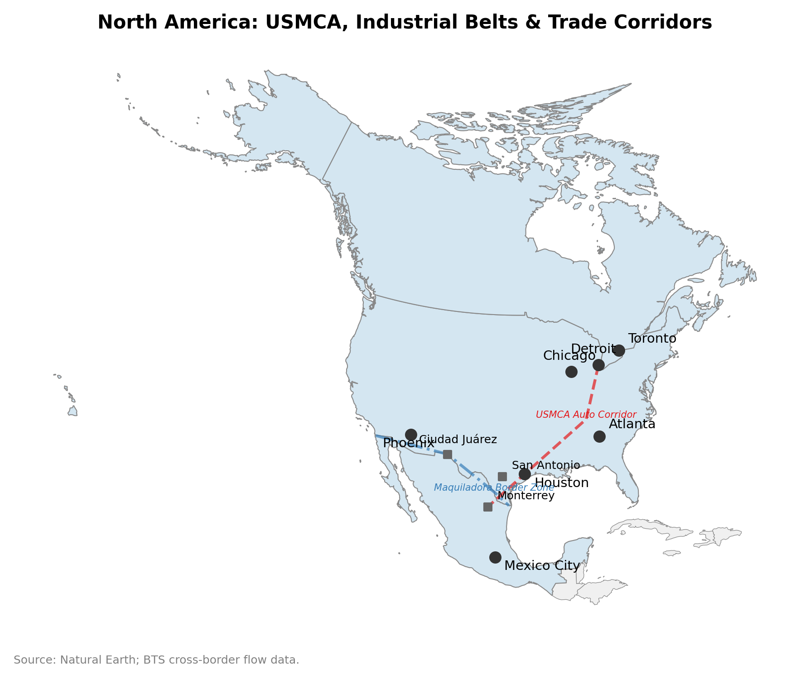
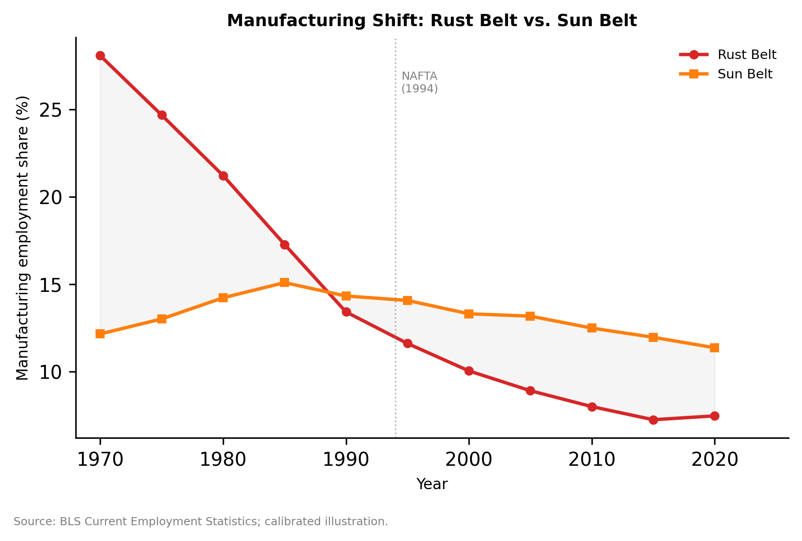

# Chapter 4: The North American Core — USMCA and the Geoeconomics of Resilience

---

## Introduction: From Efficiency to Security

On July 1, 2020, the United States-Mexico-Canada Agreement replaced NAFTA after twenty-six years of operation. The text ran to 2,300 pages — roughly four times the length of the agreement it superseded — and its centerpiece was a set of rules-of-origin provisions so intricate that the automotive chapter alone required a new army of compliance officers, customs lawyers, and origin-verification specialists across all three countries. Where NAFTA had asked firms a simple question — "Is this product made in North America?" — USMCA asked a far more demanding one: "Can you prove that 75 percent of this vehicle's value was produced in the region, that its steel and aluminum were melted and poured here, and that at least 40 percent of its labor content was performed by workers earning at least $16 per hour?"

This shift was not merely legalistic. It represented a fundamental reorientation of the economic logic governing the continent's most integrated trade corridor. Under NAFTA, the optimal strategy for a multinational manufacturer was cost minimization: locate labor-intensive assembly in Mexico, capital-intensive production in the United States and Canada, and source components globally wherever they were cheapest. Under USMCA, the optimal strategy became compliance optimization: restructure supply chains to satisfy origin requirements, invest in workforce upgrading to meet labor-value-content thresholds, and build the institutional infrastructure — customs documentation, audit trails, labor inspections — needed to prove compliance at every border crossing.

This chapter argues that the consequences of this shift are spatially uneven in ways that the standard trade literature does not predict. The gains from USMCA-era reshoring concentrate in regions with higher regulatory-compliance capacity and border-governance quality. Trade exposure alone does not predict which regions upgrade; the key interaction is between a region's position in the continental production network and its institutional capacity to execute compliance-intensive production. This is the NEG framework of Chapter 1 crossed with the institutional analysis of Chapter 2, made empirical with the spatial econometric tools of Chapter 3-A.

The stakes are large. North American goods trade exceeded $1.5 trillion in 2024, making this the world's most valuable trading corridor. More than 2 million jobs in each of the three countries depend directly on cross-border supply chains. The spatial distribution of these jobs — and of the gains and losses from the ongoing policy transition — is the core empirical question of this chapter.

The chapter proceeds in six sections. Section 4.1 traces the NAFTA-to-USMCA transition and its implications for regional specialization. Section 4.2 analyzes the border effect — the measurable friction that customs, security, and regulatory compliance impose on cross-border flows. Section 4.3 examines the CHIPS Act and semiconductor regionalism as a case study in industrial policy's spatial consequences. Section 4.4 addresses the Rust Belt paradox: the coexistence of massive public reshoring investment with persistent deindustrialization. Section 4.5 examines North America's services trade geography, including APS networks, digital trade provisions, and international education. Section 4.6 connects these threads to Lab 1, interpreting spatial econometric evidence on conditional spillovers across the Western Hemisphere.

---

*Source: Natural Earth boundaries; BTS cross-border flow data.*

## 4.1 The NAFTA-to-USMCA Transition: Compliance as the New Comparative Advantage

### The NAFTA Equilibrium

*Source: BLS Current Employment Statistics; calibrated illustration.*

For a quarter century, NAFTA created a distinctive spatial pattern in North American manufacturing. The agreement's relatively simple rules of origin — typically requiring 62.5 percent regional value content for automotive products — allowed firms to optimize production across the continent on cost grounds. The result was a three-tier spatial hierarchy:

- **The Great Lakes corridor** (Michigan, Ohio, Ontario) housed capital-intensive final assembly, leveraging deep supplier ecosystems and proximity to the continent's largest consumer market.

- **Northern Mexico's maquiladora zone** (Chihuahua, Coahuila, Nuevo León, Tamaulipas) absorbed labor-intensive assembly, exploiting nominal wage differentials of roughly 8:1. The border cities — Ciudad Juárez, Reynosa, Monterrey — grew into industrial agglomerations of continental significance.

- **Canada's resource-manufacturing belt** (Ontario, Quebec, Alberta) contributed specialized inputs: auto parts in southern Ontario, aerospace in Montreal, energy and petrochemicals in Alberta.

This equilibrium was efficient in the narrow sense that it minimized production costs given NAFTA's rules. But it was fragile in two ways.

First, global sourcing of components — particularly from China — meant that "North American" products often contained substantial non-regional content, embedded in imported intermediates that entered the supply chain below the threshold of origin verification. A "Mexican-made" auto part might contain Chinese steel, Vietnamese electronics, and Thai rubber components — all legally passing origin rules because the final assembly step occurred in Mexico. By some estimates, the non-North-American content of NAFTA-qualifying vehicles had risen to 40-50 percent by 2018, despite the 62.5 percent origin threshold — a testimony to the ingenuity of supply chain engineers and the limitations of paper-based origin verification.

Second, the cost-minimization logic concentrated gains in regions offering cheap labor or energy, not institutional quality. Mexican maquiladora wages stayed low *because* the competitive advantage was low wages; there was no mechanism to incentivize upgrading. The result was a "race to the bottom" within Mexico: states competed to attract investment by offering lower wages, weaker labor enforcement, and more generous tax holidays. Chihuahua undercut Nuevo Leon; Tamaulipas undercut Chihuahua. The wages of Mexican manufacturing workers, adjusted for productivity, were lower in 2018 than in 1994. Integration without institutional upgrading produced growth without convergence.

### The Political Economy of the Transition

The shift from NAFTA to USMCA was not a technocratic optimization exercise. It was driven by political forces that reshaped the electoral map of the United States between 2000 and 2020. The communities that bore the adjustment costs of NAFTA-era offshoring — auto workers in Michigan, furniture makers in North Carolina, steel workers in Ohio — became electorally decisive. The "China shock" literature (Autor, Dorn, and Hanson 2013) quantified what these communities experienced: regions with higher exposure to Chinese import competition lost manufacturing employment, experienced slower income growth, and saw increases in disability claims, opioid mortality, and political polarization.

USMCA was, in part, a response to this political economy. Its labor provisions and origin requirements were designed to make offshoring costlier and reshoring more attractive — to reverse, or at least slow, the spatial reallocation that NAFTA had facilitated. Whether it succeeded is an empirical question that Lab 1 is designed to address. The early evidence is mixed: the Reshoring Initiative tracked over 350,000 jobs announced for reshoring or FDI in 2022-2023, but much of this investment flows to the Sun Belt and CHIPS-eligible regions, not to the Rust Belt communities that lost jobs under NAFTA. The spatial mismatch between where jobs were lost and where they are being created is the Rust Belt paradox in its starkest form.

### What USMCA Changed

USMCA introduced three categories of provisions that fundamentally altered the payoff structure:

**Higher and more granular rules of origin.** The automotive regional value content threshold rose from 62.5 percent to 75 percent, with separate requirements for core parts (engines, transmissions: 75 percent), principal parts (suspension, steering: 70 percent), and complementary parts (batteries, seats: 65 percent). Steel and aluminum must now be "melted and poured" in North America — a process requirement, not just a value requirement. These provisions made global sourcing of intermediates costlier and raised the compliance burden on every firm in the supply chain.

**Labor Value Content (LVC) provisions.** USMCA required that 40-45 percent of automotive content be produced by workers earning at least $16 per hour — the first trade agreement to link market access directly to wage levels. The effect was asymmetric: US and Canadian workers already exceeded the threshold, while Mexican maquiladora workers typically earned $3-5 per hour. Firms faced a choice between raising Mexican wages or relocating high-value-content production steps to the US and Canada.

**Rapid Response Labor Mechanism.** USMCA's enforcement chapter included a facility-level complaint mechanism for labor rights violations, allowing a panel to impose duties on specific factories found to be suppressing worker organizing. This was not merely aspirational: by 2025, the US had filed over a dozen rapid-response actions against specific Mexican facilities, resulting in back pay, union elections, and, in some cases, loss of preferential treatment.

### The Spatial Consequences

The combined effect of these provisions was to shift the competitive margin in North American manufacturing from *cost* to *compliance capacity*. Regions that could demonstrate high regional value content, pay above the LVC threshold, and document origin across complex supply chains gained a structural advantage. Regions that could not — including, ironically, many of the maquiladora zones that had thrived under NAFTA — faced adjustment costs that the trade agreement itself imposed.

USMCA compliance capacity is a form of institutional thickness (Chapter 2): it requires functioning customs administrations, reliable documentation systems, and workforce investment programs. It clusters in regions with existing institutional endowments. Monterrey, with its university system and formal corporate sector, is better positioned than Ciudad Juárez, despite both being in Northern Mexico. Ontario is better positioned than New Brunswick.

### The Value Chain Circulation Paradigm

The USMCA transition reveals a deeper shift from "supply chain management" to "value chain circulation." Under NAFTA, optimization meant minimizing cost at each link of a linear chain. Under USMCA, components cross borders multiple times — an engine block cast in Ontario, machined in Michigan, assembled into a powertrain in Guanajuato, installed in a vehicle in Kentucky, then shipped to Toronto. Each crossing generates compliance documentation and potential delay. The total burden depends on the cumulative origin history of every component at every stage.

This has three spatial implications that the trade literature is only beginning to absorb:

**First, compliance costs are multiplicative, not additive.** A component that crosses the border three times faces three origin verifications, three customs classifications, and three potential delays. Regions located near border crossings — Laredo, Detroit-Windsor, Buffalo-Fort Erie — benefit from proximity that reduces the per-crossing time cost. But they also bear the congestion externality of concentrated crossing volumes. The net effect depends on border infrastructure capacity, which varies dramatically across ports.

**Second, the value chain circulation paradigm favors regional clusters over dispersed sourcing.** If every border crossing adds friction, firms have an incentive to consolidate production steps within a single country — reducing crossings — or to locate sequential production steps near the same border port — reducing the distance between crossings. This predicts a tightening of regional clusters around major border crossings: more auto parts production in the Monterrey-San Antonio corridor, more aerospace in the Montreal-Connecticut corridor, more agricultural processing near the Nogales and Calexico ports.

The chapter's manufacturing emphasis risks obscuring the sector that dominates several border corridors: agriculture. An estimated 60 percent of US winter produce crosses at Nogales, Arizona, through the Salinas Valley-to-Sinaloa corridor. For perishable goods, the binding trade cost is not USMCA paperwork but phytosanitary inspection — a truckload of strawberries delayed twelve hours is a truckload of compost. Agricultural corridor economics hinge on inspection capacity and cold-chain logistics at specialized ports, a bottleneck that neither the gravity model's distance term nor USMCA's rules of origin adequately capture.

**Third, compliance generates its own economies of scale.** The fixed cost of building compliance infrastructure is substantial, but the marginal cost of processing an additional shipment is low. Large firms can amortize these costs; small firms cannot — another channel through which USMCA reinforces existing spatial hierarchies.

---

## 4.2 The Border Effect: Friction, Governance, and the Shadow Cost of Compliance

### Measuring the Border

The US-Mexico border is one of the most heavily instrumented economic boundaries in the world. The Bureau of Transportation Statistics (BTS) records every inbound crossing — by truck, rail, container, and personal vehicle — at every port of entry, monthly. This data allows precise measurement of border throughput and, by extension, of the friction that security, customs, and regulatory compliance impose on cross-border flows.

Lab 1 uses this data to construct a border-friction index that enters the spatial model as a covariate. The logic is straightforward: border friction acts as a variable trade cost that can dampen spatial spillovers. If crossing the border is fast, cheap, and predictable, then economic activity on one side can spill over to the other — suppliers in Chihuahua benefit from demand in Texas, and vice versa. If crossing the border is slow, expensive, and uncertain, the spillover is attenuated. The border becomes an economic wall even when it is legally open.

The BTS data reveal several regularities:

**Port-level heterogeneity is enormous.** Laredo, the largest commercial crossing on the US-Mexico border, handles roughly 15,000 commercial truck crossings per day across its two international bridges (the World Trade Bridge and the Colombia Solidarity Bridge combined). Nearby Eagle Pass handles a fraction of that volume, despite being only 200 kilometers away. The concentration of trade at a few mega-ports creates localized congestion effects: wait times at Laredo can exceed four hours during peak periods, while smaller ports operate with minimal delays. This spatial concentration of border traffic produces its own agglomeration economics — customs brokers, warehousing, logistics firms cluster near the busiest ports, reinforcing the pattern.

**Modal composition signals supply chain structure.** A border port dominated by loaded truck containers indicates manufactured-goods trade — auto parts, electronics, agricultural equipment. A port dominated by rail containers indicates bulk commodity trade — grain, minerals, petroleum. A port dominated by empty containers indicates asymmetric trade flows (goods moving in one direction, containers returning empty). Lab 1's border-friction proxy incorporates modal composition as a signal of the economic character of cross-border linkages.

**Temporal volatility reflects policy shocks.** Border closures during COVID-19 (March–June 2020), enhanced security inspections following migration surges (2019, 2023), and USMCA-related compliance adjustments all produced measurable drops in crossing volumes that propagated into regional economic outcomes on both sides of the border. These episodes are natural experiments for estimating the trade elasticity of border friction — a parameter that gravity models typically estimate from cross-sectional variation but that the BTS panel can identify from temporal shocks.

The COVID-19 border closures are particularly instructive. When the US-Mexico land border was restricted to "essential" crossings in March 2020, commercial truck traffic — classified as essential — continued at roughly 85 percent of pre-pandemic levels, while personal vehicle crossings (which include informal cross-border commerce, maquiladora worker commuting, and family visits) dropped by over 90 percent. The divergence reveals the border economy's dual nature: formal containerized trade is relatively resilient to access restrictions, while the informal and labor-mobility channels that sustain border communities are fragile. Ciudad Juárez, which depends heavily on cross-border commuting (an estimated 30,000 workers cross daily to El Paso), experienced a more severe economic shock than Monterrey, whose linkages are primarily commercial.

**The US-Canada border tells a different story.** The northern border handles roughly 30 percent of North American cross-border trade by value but receives far less policy attention than the southern border. The Detroit-Windsor Ambassador Bridge — the single busiest commercial crossing in North America — handles over $300 million in goods per day. The February 2022 Ambassador Bridge blockade by anti-mandate protesters (lasting six days) produced estimated GDP losses of $300-500 million per day in the automotive sector alone, because the bridge carries auto parts that feed dozens of assembly plants within a 200-kilometer radius. The episode demonstrated that border infrastructure is critical infrastructure — a disruption at a single chokepoint can propagate through supply chains in ways that the spatial multiplier framework of Chapter 3-A is designed to formalize.

### Border Friction in the Gravity Framework

The canonical gravity model — trade between $$i$$ and $$j$$ is proportional to the product of their economic masses and inversely proportional to trade costs — predicts that borders matter. The "border effect" literature, initiated by McCallum (1995) and extended by Anderson and van Wincoop (2003), documented that the US-Canada border reduced bilateral trade by a factor of 10 to 20 relative to within-country trade, even after controlling for distance and market size. The US-Mexico border effect is estimated to be even larger, reflecting additional frictions of customs complexity and security inspections.

What the gravity literature typically does not capture is the heterogeneity of the border effect across space and time. The border effect at Laredo differs from Nogales, and both changed after USMCA. Lab 1 constructs a spatially varying friction measure and tests whether it interacts with institutional quality in determining growth spillovers.

In the gravity model, bilateral trade between $$i$$ and $$j$$ is:

$$
T_{ij} = A \cdot \frac{Y_i \cdot Y_j}{d_{ij}^{\gamma} \cdot B_{ij}^{\delta}}
$$

where $$Y$$ is economic mass, $$d$$ is distance, $$B$$ is the border-friction term, and $$\gamma$$ and $$\delta$$ are elasticities. The border effect $$B_{ij}$$ is typically modeled as a dummy variable (1 if $$i$$ and $$j$$ are in different countries, 0 otherwise), which produces the aggregate border-effect estimate. Lab 1's innovation is to replace the dummy with a continuous measure derived from actual crossing data, allowing the border effect to vary by port, mode, and time period.

The spatial weight matrix $$W$$ in the SAR model is constructed from these trade flows $$T_{ij}$$, which are themselves functions of border friction. This creates a theoretical link between border governance and the spatial multiplier: improving governance increases trade (lower $$B$$), strengthens the network (larger off-diagonal $$W$$ elements), and amplifies the spatial lag ($$\rho Wy$$ becomes larger for given $$\rho$$). Border governance reform is not just trade facilitation — it is a spatial connectivity intervention that changes the structure of economic interdependence.

### The LPI Extension

The original BTS-based proxy covered only three countries at a small number of border ports, severely limiting spatial scope. The World Bank's Logistics Performance Index (LPI) — scoring countries on customs efficiency, infrastructure quality, ease of shipments, tracking, and timeliness — provided an alternative that could be extended to all 34 economies in the Lab 1 sample.

The LPI-blended proxy combines BTS port-level data for the three NAFTA countries with LPI scores for the remaining Western Hemisphere economies. This extension increased border-delay coverage from 3 to 28 countries and allowed the interaction analysis to test whether logistics quality — a broader concept than border friction alone — conditions spatial spillovers across the entire hemisphere. The broader proxy did not produce a strong unconditional spillover ($$\rho \approx 0$$), but it did produce meaningful interaction terms — consistent with the argument that spillovers are conditional on institutional capacity.

---

## 4.3 Semiconductor Regionalism: The CHIPS Act and the Spatial Logic of Industrial Policy

### The Policy Shock

The CHIPS and Science Act (2022) authorized $52.7 billion in direct subsidies for semiconductor manufacturing and research in the United States, with additional tax credits worth roughly $24 billion. The guardrails were explicit: firms receiving CHIPS funding were prohibited from expanding advanced semiconductor production in China for ten years and were required to demonstrate that their investments generated domestic supply chain benefits. This was industrial policy on a scale that the United States had not attempted since the Defense Production Act mobilizations of the Cold War.

The semiconductor case illustrates a broader pattern in the geoeconomics of resilience. The decision to subsidize domestic chip production was driven not by comparative advantage — South Korea, Taiwan, and Japan produce semiconductors more cheaply — but by supply chain security. The COVID-era chip shortage, which shut down automobile assembly lines across North America, demonstrated that cost-efficient global sourcing was incompatible with production reliability when geopolitical disruptions (pandemic, export controls, tensions over Taiwan) could sever supply chains overnight.

### The Defense Production Act and Critical Minerals

The CHIPS Act does not exist in isolation. It is part of a broader suite of industrial policy tools deployed since 2020 to rebuild domestic production capacity in sectors deemed critical to national security. Title III of the Defense Production Act (DPA) — originally enacted in 1950 — has been invoked to fund rare earth processing, pharmaceutical manufacturing, and battery material production. Executive Order 14017 (February 2021) directed a comprehensive supply chain vulnerability review across six sectors.

The spatial implications parallel CHIPS: critical mineral facilities are sited near existing mining operations (Nevada, Arizona) or deep-water ports (Louisiana, Texas); battery manufacturing concentrates in the "Battery Belt" (Tennessee, Georgia, Kentucky, Michigan) where automotive supply chains provide workforce and logistics. In each case, public investment flows to regions with pre-existing production ecosystems, reinforcing agglomeration rather than dispersing it.

The overlap with USMCA is significant. Many critical mineral supply chains span USMCA borders — Canada produces nickel, cobalt, and potash; Mexico produces silver, copper, and fluorite. USMCA's rules of origin apply when these minerals enter downstream products, creating a compliance layer on top of DPA domestic-content requirements. Regions satisfying both regimes — near the US-Canada border with existing mining infrastructure — gain a double advantage.

### Spatial Concentration

CHIPS Act investments are not spatially neutral. The three largest fab investments — TSMC in Phoenix ($40 billion), Samsung in Taylor, Texas ($17 billion), and Intel in Chandler, Arizona ($20 billion) — are all in the Sun Belt, in regions with existing semiconductor infrastructure, available land, and technically educated workforces. The Phoenix corridor is a real-time example of NEG circular causation.

But the concentration illustrates the Rust Belt paradox. The CHIPS Act aimed to revitalize manufacturing in communities that had lost it. In practice, investments flow to regions with thick institutional and human-capital endowments — the superstar dynamics Moretti (2012) documented. Syracuse, where Micron announced a $100 billion long-term investment, is a partial exception, but Micron chose it for existing semiconductor research at SUNY Polytechnic and $5.5 billion in state incentives.

Of the first twenty preliminary awards, sixteen went to states that already had semiconductor operations. States with no prior presence received none — the related-variety logic of Chapter 2 at work. CHIPS subsidies, funded by all taxpayers, produce concentrated benefits in already-prosperous regions.

The international dimension adds complexity. TSMC's Arizona fab and Samsung's Taylor facility both rely on hundreds of engineers from Taiwan and Korea during ramp-up, since the specialized process knowledge does not exist in the US workforce. These labor flows create temporary migration corridors invisible in trade data but essential for diffusing manufacturing capability. The transition period — typically three to five years — means that localized benefits are delayed relative to the subsidy timeline.

### The Supply Chain Multiplication

A single advanced fab employs 1,500-3,000 workers directly but supports an estimated 10,000-15,000 jobs in the surrounding supply chain: chemical suppliers, gas delivery systems, precision machining, wafer handling, logistics, and construction. These supply chain jobs are more spatially dispersed than the fab itself — chemical suppliers may locate within a 200-kilometer radius, equipment manufacturers within 500 — creating a spatial multiplier that the SAR framework of Chapter 3-A captures.

The workforce constraint creates its own agglomeration dynamic. A modern fab requires roughly 400-600 engineers with advanced degrees in electrical engineering, chemical engineering, materials science, and computer science, plus 1,000-2,000 technicians with two-year degrees or specialized certifications. This workforce does not exist in most US regions — it must be trained locally (expensive and slow) or recruited from existing clusters (which depletes those clusters). Engineers trained in Phoenix stay in Phoenix, where the next semiconductor employer is nearby. The thick labor market of Chapter 1 — Marshallian matching — emerges rapidly around CHIPS investment sites but does not diffuse outward to regions outside the semiconductor ecosystem. The spatial multiplier thus has a steep distance decay: strong within 200 kilometers, weak beyond 500, negligible beyond 1,000.

Lab 1's finding that $$\rho$$ is small unconditionally but larger in interaction specifications suggests that CHIPS Act supply chain multipliers may be substantial in regions with strong institutional linkages to the fab location, and minimal in regions that are geographically close but institutionally disconnected.

### The Green Industrial Policy Turn: IRA and the Spatial Logic of Decarbonization

The IRA (2022) — $369 billion in clean energy provisions — creates a near-twin spatial dynamic. Its **48C Advanced Manufacturing Credits** (30 percent for solar, wind, and battery facilities), **Energy Community Bonus Credits** (10-point premium for counties with recent coal closures), and **45X Production Tax Credits** (per-unit credits for domestically manufactured clean energy components) produce explicitly place-based incentives.

The emerging spatial pattern mirrors CHIPS. Battery manufacturing concentrates in the "Battery Belt" — Tennessee, Georgia, Kentucky, Michigan — where existing automotive supply chains provide the base for rapid scaling. Rivian's Georgia facility, SK On's plants in Georgia and Kentucky, Toyota's battery factory in North Carolina, and a cluster of lithium-ion cell facilities in Tennessee collectively represent over $50 billion in announced investment, mostly in counties that already had significant manufacturing employment. The energy-community bonus partially offsets this agglomeration tendency, directing some investment to formerly coal-dependent counties in Appalachia and Wyoming — but the bonus is small relative to the cost advantages of established corridors, and the pattern of concentration persists.

**Appalachia and stranded coal regions** face the sharpest distributional challenge. The coal-dependent counties of West Virginia, eastern Kentucky, southwestern Virginia, and southern Illinois are simultaneously losing their primary industry and hoping to capture green reinvestment. The IRA's energy community provisions were designed in part for them. The Appalachian Regional Commission has invested in broadband, site preparation, and workforce certification. But structural obstacles remain: grid infrastructure is designed for baseload generation, not variable renewables or battery storage; the workforce trained in underground mining does not map cleanly onto solar installation or battery assembly; and thin supply chain ecosystems in rural counties make them less attractive than suburban sites near interstates and airports.

**CBAM implications for USMCA.** The EU's Carbon Border Adjustment Mechanism (transitional phase from October 2023) imposes a carbon price on imports of carbon-intensive products based on the carbon price paid in the country of origin. Canada has a federal carbon price ($80 per tonne CO2 in 2024, rising to $170 by 2030); the United States has none; Mexico has a limited scheme. This divergence creates a North American carbon-competitiveness problem: Canadian steel faces less CBAM exposure than US or Mexican steel in European markets, incentivizing supply chain routing toward Canada for EU-destined products — a new layer of regulatory heterogeneity atop the compliance landscape of Sections 4.1 and 4.2.

The green policy turn also has an institutional dimension at the border. USMCA Chapter 24 introduced enforceable environmental commitments subject to the same dispute-settlement machinery as commercial provisions. The North American Development Bank (NADBank) has financed over $3.4 billion in cross-border environmental infrastructure along the US-Mexico border. This "green institutional thickness" has direct implications for semiconductor clusters: TSMC and Intel fabs in the Phoenix-Chandler corridor consume enormous volumes of ultrapure water in a region where the Colorado River basin is in structural deficit. Cross-border water management — governed by the 1944 US-Mexico Water Treaty — is a binding constraint on semiconductor expansion.

North America's energy infrastructure is the continent's most deeply integrated system, yet its geography diverges from the manufacturing corridors dominating this chapter. Natural gas flows south from the Permian Basin to Mexico (exceeding 6 Bcf/d by 2024); electricity flows from Hydro-Quebec to New England; petroleum moves from Canada's oil sands to Gulf Coast refineries. This corridor runs north-south along the hydrocarbons axis rather than east-west along the auto belt. The IRA's clean energy provisions now create a new spatial overlay — hydrogen hubs, Battery Belt plants, Atlantic offshore wind — attracting investment to locations that do not coincide with existing manufacturing agglomerations. The emerging clean-energy geography may prove as consequential for regional fortunes as the auto corridor was in the twentieth century.

### CFIUS and the Geography of Foreign Investment Screening

The Committee on Foreign Investment in the United States (CFIUS), expanded under FIRRMA (2018) to cover noncontrolling investments in "critical technology, critical infrastructure, and sensitive personal data" businesses, adds another spatial dimension. Regions hosting these businesses (Silicon Valley, Boston-Cambridge, the Research Triangle, Austin) face an additional regulatory layer that can slow or block foreign investment. This may reduce total investment flows — but may also increase the value of domestic investment by reducing competition for scarce assets (talent, patents, real estate). The net effect on regional growth is ambiguous and empirically unexplored.

CFIUS also creates a continental asymmetry. Canada has a parallel mechanism (the Investment Canada Act) with different thresholds; Mexico has no comparable screening. This gap creates an arbitrage opportunity: foreign investors seeking to participate in the North American semiconductor or critical mineral supply chain may route investments through Mexico — where they face no security review — and rely on USMCA preferential access to reach the US market. Whether this arbitrage is economically significant remains an open question.

---

## 4.4 The Rust Belt Paradox: Superstar Metros and Left-Behind Regions

### The Divergence

The defining spatial fact of twenty-first-century North America is internal divergence. Between 2001 and 2024, the five largest US metropolitan areas (New York, Los Angeles, Chicago, Dallas, Houston) generated roughly 25 percent of total GDP growth, while the fifty smallest metros collectively contributed less than 3 percent. The pattern is similar in Canada, where the Toronto-Vancouver-Montreal triangle dominates growth statistics, and in Mexico, where Mexico City, Monterrey, and Guadalajara account for a disproportionate share of formal-sector value added.

Autor (2019) documented that between 1970 and 2015, the population-weighted coefficient of variation of per-capita income across US commuting zones *increased* by roughly 30 percent — reversing the convergence trend prevailing since 1880. The divergence is driven by the upper tail: the richest 10 percent pulled away while the bottom 50 percent stagnated. Ganong and Shoag (2017) showed the reversal is partly explained by housing supply constraints in productive cities — high costs reduce the migration that would otherwise equalize wages — but housing supply is itself an institutional variable, shaped by zoning and NIMBYism.

The Canadian pattern is less extreme but directionally similar. Toronto's share of national GDP has grown from 18 percent in 2001 to roughly 22 percent in 2024, driven by the financial sector, technology, and immigration-fueled population growth. Atlantic Canada — New Brunswick, Nova Scotia, Prince Edward Island, Newfoundland — has declined in relative terms, despite persistent federal transfer payments designed to reduce regional inequality. Mexico's pattern is the most dramatic: the Mexico City metropolitan zone produces roughly 17 percent of national GDP but houses only 16 percent of the population, while the southern states (Chiapas, Oaxaca, Guerrero) — home to 12 percent of the population — produce less than 5 percent of GDP and exhibit poverty rates comparable to Central America.

This divergence is not predicted by neoclassical convergence but is predicted by the NEG: once agglomeration economies exceed Krugman's "sustain point," spatial concentration becomes self-reinforcing. Superstar metros attract talent, which attracts firms, which attracts more talent. Left-behind regions lose all three in a vicious cycle that factor-price equalization cannot reverse once the equilibrium has tipped.

### The Institutional Layer

Chapter 2 argued that institutions condition which spatial equilibrium prevails. The Rust Belt paradox is a vivid illustration. Pittsburgh and Detroit were both Rust Belt manufacturing powerhouses in 1970. By 2024, Pittsburgh had reinvented itself as a technology and healthcare hub (Carnegie Mellon's AI research, UPMC's medical system), while Detroit remained trapped in the declining-auto-industry equilibrium. The geographic fundamentals are similar — both cities sit on major waterways, both have cold climates, both lost manufacturing employment massively between 1970 and 2000. The institutional histories diverged: Pittsburgh's university sector created a knowledge-economy bridge that Detroit's did not.

Pittsburgh's reinvention was not spontaneous — it was built on decades of deliberate institutional investment. Carnegie Mellon's computer science department (founded 1965) and robotics institute (founded 1979) were established long before the collapse of steel manufacturing in the 1980s. The University of Pittsburgh Medical Center (UPMC) grew from a regional hospital system into the city's largest employer (95,000 workers) through aggressive expansion into biotechnology, transplant surgery, and health insurance. The Richard King Mellon Foundation and other legacy philanthropies invested heavily in real estate redevelopment, converting former steel sites into technology parks. None of these investments were responses to deindustrialization — they were pre-existing institutional assets that provided a platform for reinvention when the old economy collapsed.

Detroit had no equivalent platform. The University of Michigan is in Ann Arbor, 45 miles away — close enough to collaborate but too far to anchor an urban reinvention. Wayne State University, within Detroit proper, has strong programs but lacked the endowment and political support to play the transformative role that Carnegie Mellon played in Pittsburgh. The auto industry's dominance was so complete that Detroit's institutional ecosystem was specialized to a single sector — related variety turned against itself, where deep automotive capabilities provided no bridge to software, biotech, or financial services.

The spatial econometric evidence from Lab 1 is consistent with this story. The interaction between institutional quality (border-governance/logistics quality) and spatial lag is significant: higher-quality institutions amplify spatial spillovers. This means that a positive demand shock in one region transmits more strongly to regions with better institutional capacity. The implication is that industrial policy (CHIPS, USMCA compliance support, infrastructure investment) is more effective when it targets regions with the institutional capacity to absorb and transmit the investment — a finding that is uncomfortable for the political rhetoric of "bringing jobs back to left-behind communities" but consistent with the economic logic of conditional spillovers.

### Canada and Mexico: Parallel Divergences

The internal divergence story extends across all three USMCA partners, though each country's version reflects its distinctive institutional geography.

**Canada's resource-knowledge divide.** The Canadian economy has long featured a tension between resource-extractive regions (Alberta, Saskatchewan, Newfoundland) and knowledge-intensive corridors (Toronto-Waterloo, Montreal, Vancouver). The 2014-2016 oil price collapse demonstrated the vulnerability: Alberta lost over 100,000 jobs and experienced negative GDP growth while Ontario and British Columbia continued expanding. Calgary has diversified into technology and clean energy, but smaller Alberta cities (Fort McMurray, Grande Prairie) have not. The pattern mirrors the resource curse that Chapter 5 analyzes for Latin America, but within a high-income, institutionally mature country: resource dependence weakens diversification incentives even when the institutional environment is otherwise strong.

**Mexico's north-south gradient.** Mexico's internal divergence is the most extreme in the OECD. Northern states (Nuevo Leon, Sonora, Chihuahua, Baja California) are deeply integrated into the continental production network, with formal-sector employment, functioning infrastructure, and GDP per capita approaching the OECD average. Southern states (Chiapas, Oaxaca, Guerrero) are effectively disconnected: large indigenous populations, subsistence agriculture, limited infrastructure, and per-capita income comparable to Honduras or Guatemala. The 2,000-kilometer north-south gradient is steeper than the income gradient between the EU's richest and poorest member states — and persists despite three decades of trade liberalization and conditional cash transfer programs.

USMCA's compliance provisions may deepen this gradient. The LVC requirements and origin documentation burden favor the already-formal, already-integrated northern economy. Southern Mexico, where informality rates exceed 70 percent and manufacturing is largely artisanal, cannot absorb compliance-intensive production. The policy implication — which the next chapter explores for Latin America more broadly — is that trade agreements designed in capitals benefit regions that are already integrated into the formal economy and leave behind those that are not.

### The Policy Tension

The spatial econometric evidence from Lab 1 is consistent with this story. The interaction between institutional quality and spatial lag is significant: higher-quality institutions amplify spatial spillovers. A positive demand shock in one region transmits more strongly to regions with better institutional capacity. The implication is that industrial policy is more effective when it targets regions with the institutional capacity to absorb and transmit the investment — a finding uncomfortable for the political rhetoric of "bringing jobs back to left-behind communities" but consistent with the economic logic of conditional spillovers.

### The Policy Tension

If spillovers are conditional on institutional quality, place-based policy faces a bootstrapping problem: the regions most needing investment are least able to absorb it. Investing in strong regions maximizes the multiplier but worsens divergence. Investing in weak regions is politically attractive but may produce smaller returns if institutional preconditions are absent.

Three approaches attempt to resolve this tension:

1. **Institutional pre-investment.** Before subsidizing factory construction, invest in the institutional prerequisites: workforce training programs, customs-compliance capacity, regulatory streamlining, and intergovernmental coordination. This is the logic behind the CHIPS Act's workforce development provisions and USMCA's labor-capacity-building commitments.

2. **Hub-and-spoke models.** Concentrate anchor investments in strong-institution regions (the "hub") but require supply chain procurement from surrounding weaker regions (the "spokes"). The CHIPS Act's supply chain multiplier naturally creates this pattern — the fab is in Phoenix, but chemical suppliers, equipment refurbishment, and logistics services can locate in less expensive surrounding regions.

3. **Graduated regional strategies.** Accept that not every region can host a semiconductor fab and design differentiated strategies: high-tech for superstar metros, supply chain support for mid-tier cities, and transitional assistance (retraining, mobility support, early retirement) for regions where the institutional gap is too large to close within a policy-relevant time horizon.

The Lab 1 interaction specifications clarify the tradeoffs. The *marginal return* to spatial connectivity is higher in institutionally strong regions — the multiplier is larger where institutions are better. This does not mean investing in weak regions has zero return; it means the spatial spillover channel is weaker there. If the objective is aggregate GDP growth, investing in strong regions is optimal. If the objective is reducing inequality, investing in weak regions is necessary — but the expected return, in terms of spatial spillovers and growth transmission, will be smaller.

A third possibility is that institutional pre-investment in weak regions can shift them from the low-multiplier regime to the high-multiplier regime. If the relationship between institutional quality and spillover strength is nonlinear — with a threshold below which spillovers are near zero and above which they are substantial — then targeted investments in customs modernization, workforce certification, and regulatory capacity might produce discontinuous gains by pushing regions across the threshold. This is "big push" logic applied to subnational regions within a high-income trading bloc. It is theoretically compelling, but the panel data needed to test it — observations of institutional change linked to time-varying $$\rho$$ estimates — do not yet exist for the Americas.

---

## 4.5 The Other Integration: Services Trade and the APS Geography of North America

The preceding sections focus on goods — automobiles, semiconductors, steel — because USMCA's most visible provisions govern physical production. But the United States is the world's largest exporter of services, and services account for a growing share of North American economic integration. The spatial economics of services trade are fundamentally different from goods, and understanding them is essential for a complete picture of continental economic geography.

### Command Centers and the GaWC Network

Sassen's (2001) "global city" thesis argued that the geographic dispersal of manufacturing required the *centralization* of command-and-control functions — corporate headquarters, financial services, corporate law, management consulting, and accounting. These "advanced producer services" (APS) cluster in a small number of cities that serve as command nodes for the global economy.

In the GaWC (Globalization and World Cities) classification, New York is the highest-ranked global city — the dominant node for financial services, corporate law, and management consulting. Toronto ranks among the top fifteen, anchoring Canadian financial services and increasingly attracting technology headquarters. Mexico City functions as the command center for Latin American operations of global APS firms. The three cities form a continental hierarchy that is not merely descriptive but functional: New York generates strategies, Toronto and Chicago implement them for Canadian and midwestern clients, and Mexico City translates them into Latin American institutional contexts.

This hierarchy has spatial multiplier consequences. Moretti (2010) estimated that each additional high-skill tradable-sector job generates approximately 2.5 additional jobs in local non-tradable services: baristas, cleaners, restaurant workers, healthcare support staff. The multiplier is larger for innovation-intensive jobs (approximately 5:1) than for manufacturing (approximately 1.6:1), because innovation workers earn more and consume more skill-intensive local services. The concentration of APS employment in superstar metros thus produces a proportional concentration of non-tradable service employment, with wages set by the interaction of high-income demand and local housing costs.

### USMCA's Digital Trade Provisions

USMCA's Chapter 19 (Digital Trade) is, by some measures, the most consequential services trade framework in any major trade agreement. Its core provisions include:

- **Prohibition of data localization requirements**: no party may require that computing facilities be located in its territory as a condition for conducting business.
- **Cross-border data flow guarantees**: parties must allow the cross-border transfer of information by electronic means for business purposes.
- **Customs duty moratorium on digital products**: no duties on content transmitted electronically.
- **Source code protection**: no party may require the transfer of source code as a condition of market access.

These provisions create a de facto North American data space contrasting sharply with the EU's GDPR-based approach and China's data sovereignty requirements.

These provisions create a regulatory geography for digital services distinct from the goods-trade regime. A software company in Toronto can serve US clients without establishing physical presence, without storing data on US servers, and without paying customs duties on its product. A Mexican fintech firm can process transactions across the border under the same data-flow protections. This is integration of a qualitatively different kind from the automotive rules of origin — it creates a continental platform for services trade that operates largely outside the compliance-intensive framework governing physical goods.

### International Education: University Towns as Mode 2 Export Clusters

International education is one of North America's largest Mode 2 services exports: roughly one million foreign students enrolled in US institutions in 2024, at an estimated value exceeding $40 billion annually. The spatial geography is concentrated not in New York or Los Angeles but in college towns — Ithaca, Ann Arbor, Champaign-Urbana, State College — where the international student premium provides a substantial export earnings stream largely independent of the local industrial economy.

Bound, Braga, Khanna, and Turner (2021) document the scale of this globalization of postsecondary education, noting strong concentration among students from China and India. Hausman (2022) uses the staggered timing of land-grant university expansions as a quasi-experiment to identify the causal effect of university size on local innovation and income: a 10 percent increase in research expenditure generates measurable wage gains and patent applications in the surrounding county, operating through the Marshallian learning and matching channels of Chapter 1.

Bound, Braga, Khanna and Turner (2021) document the scale and acceleration of this globalization of postsecondary education, noting that the US share of internationally mobile students has grown substantially since 2000, with strong concentration among students from China and India. The local economic consequences are documented by Hausman (2022), who uses the staggered timing of land-grant university expansions as a quasi-experiment to identify the causal effect of university size on local innovation and income: a 10 percent increase in a university's research expenditure generates measurable wage gains and patent applications in the surrounding county, operating through the Marshallian learning and matching channels described in Chapter 1.

The services trade policy dimension is underappreciated. USMCA's temporary entry provisions (Chapter 16) facilitate the movement of business persons and professionals, but the regulatory regime governing tuition payments, student work authorization, and credential recognition remains a patchwork of national immigration and education law rather than a coherent trade framework. A Canadian student completing a degree in the US, a Mexican student at a Canadian university, and an American student at a Mexican institution each navigate different visa regimes, work authorization rules, and recognition frameworks. North America has not fully capitalized on the services trade liberalization implicit in its geographic integration.

### Remote Work and the Spatial Redistribution of Services

The post-pandemic shift to remote work has partially disrupted APS concentration. Althoff et al. (2022) document that "remoteable" jobs shifted significantly toward lower-cost metros and exurban locations between 2020 and 2023. Delventhal, Kwon, and Parkhomenko (2022) model this in a spatial general equilibrium framework and find that permanent remote work feasibility reduces central-city rents, increases suburban and secondary-city populations, and compresses the urban wage premium — but does not eliminate it.

The North American context adds a cross-border dimension. Monterrey, Guadalajara, and Mexico City are emerging as nearshore technology and BPO hubs for US firms — offering time-zone alignment, cultural familiarity (many nearshore workers have US education or experience), and labor costs 30-40 percent below comparable US cities. This nearshore integration operates through Mode 1 (cross-border delivery) and digital platforms rather than the physical supply chains governing goods.

If remote work proves durable, Moretti's local multiplier effects may partially redistribute from superstar metros to secondary cities and cross-border locations. A management consultant who moves from Manhattan to Austin takes her consumption expenditure (and the non-tradable service jobs it supports) with her. A software team that shifts from San Francisco to Guadalajara transfers not only coding jobs but also the local multiplier from one country to another. The net effect on North American spatial inequality is ambiguous: remote work may reduce *within-country* inequality (by deconcentrating from superstar metros) while increasing *cross-border* integration (by enabling services trade that physical distance previously prevented).

---

## 4.6 Lab 1 and the Spatial Evidence: Conditional Spillovers Across the Americas

### The Lab 1 Framework

Before interpreting results, it is worth understanding the analytical choices that Lab 1 embodies.

**Sample.** The sample includes 34 Western Hemisphere economies for which GDP growth, manufacturing share, and border-friction data are jointly available. The binding constraint is manufacturing-share data: the WDI reports this variable for only 34 of the 41 economies with GDP growth data. A "macro-only" specification dropping manufacturing share includes all 41 economies.

**Dependent variable.** Annual GDP growth (WDI indicator `NY.GDP.MKTP.KD.ZG`). This is a noisy measure — one year conflates structural trends and transitory shocks — but it is the most widely available outcome at the country level.

**Covariates.** Log GDP per capita (convergence), manufacturing value added share (structural composition), and the border-friction/LPI-blend index (trade facilitation quality). Interaction specifications add border-governance quality and its interactions with other covariates.

**Spatial weight matrix.** Trade-weighted $$W$$ from UN Comtrade bilateral flows, row-standardized so that $$Wy_i$$ is the trade-weighted average growth of $$i$$'s trading partners. The matrix is dense but highly skewed — the US, Mexico, Canada, and Brazil dominate flows.

**Estimation.** Maximum likelihood with concentrated log-likelihood over $$\rho$$ and analytical solutions for $$\beta$$ and $$\sigma^2$$ conditional on $$\rho$$.

### What the Data Show

Lab 1 estimates a SAR model of GDP growth across 34 Western Hemisphere economies using a trade-weighted spatial weight matrix constructed from UN Comtrade bilateral trade flows. The key findings, documented in the lab's gate summary, are:

1. **The unconditional spatial lag is near zero.** $$\hat{\rho} \approx 0$$ in the baseline specification, meaning that trade-weighted average neighbor growth does not predict a country's own growth after controlling for standard macro variables (initial income, manufacturing share, border-friction index). This is a null result — and it is informative.

2. **Institution-interaction terms produce meaningful coefficients.** When border-governance quality is interacted with the spatial lag and other covariates, the estimates change materially. The interaction of institutional quality with log GDP per capita produces a negative coefficient ($$\beta \approx -3.7$$), suggesting that higher-quality institutions are associated with faster convergence — poorer countries with better institutions catch up more quickly. The interaction with manufacturing share produces a positive coefficient ($$\beta \approx 4.0$$), suggesting that institutional quality amplifies the growth contribution of manufacturing.

3. **The spatial lag becomes nonzero and negative in interaction specifications.** This is interpretable: after accounting for institutional heterogeneity, the residual spatial correlation is slightly negative — consistent with competitive dynamics (one country's gain is a neighbor's loss) once the complementary effects of institutional quality are modeled separately.

### Interpreting the Near-Zero $$\rho$$

The near-zero unconditional $$\rho$$ is a design signal, not a failure. The Americas include the world's largest economy (US, $25 trillion GDP) and some of its smallest (Caribbean states under $1 billion), mature democracies and fragile states, commodity exporters and manufacturing powerhouses. Expecting a single $$\rho$$ to summarize spatial interdependence across this diversity was always ambitious.

Compare this to European convergence studies, where $$\rho$$ estimates of 0.2-0.4 are common. The European estimates are larger because EU regions are more homogeneous, Eurostat data is higher-quality and more spatially granular, and contiguity-based $$W$$ matrices may proxy for correlated shocks more strongly than trade-weighted $$W$$. A "small" $$\rho$$ in the Americas and a "large" $$\rho$$ in Europe may reflect genuine differences in spillover strength, or differences in sample composition and $$W$$ construction. Chapter 3-A's injunction to report results under multiple specifications applies with full force.

The interaction specifications reveal what the unconditional specification obscures: spillovers exist but are conditional. Trade linkages transmit growth where institutional capacity allows it — where customs work, contracts are enforced, and supply chains operate reliably. Where institutions are weak, the same linkages may transmit negative shocks (Dutch Disease, competitive pressure from low-wage neighbors) more readily than positive ones. The net effect is approximately zero — the average of positive core-to-core spillovers and negative core-to-periphery competitive effects, precisely as Krugman's core-periphery model predicts for most parameter values.

### Sensitivity and Robustness

The Lab 1 results are subject to several caveats that the student should take seriously:

**Weight-matrix sensitivity.** The trade-weighted $$W$$ is constructed from contemporaneous Comtrade flows, creating the endogeneity concern discussed in Chapter 3-A. A robustness check using five-year lagged trade or gravity-predicted trade would strengthen identification. Results should be interpreted as conditional associations, not causal estimates.

**Sample size constraints.** With only 34 observations, individual influential cases (especially the US, with GDP many times larger than any other country) can drive results. The macro-only specification (41 economies) produces a slightly larger $$\rho$$ (0.033), suggesting additional covariates absorb some spatial signal. Jack-knife diagnostics — re-estimating with each country removed in turn — are the appropriate sensitivity check.

**Cross-sectional identification.** A single cross-section cannot distinguish spatial spillovers from correlated effects (shared exposure to commodity prices, common macroeconomic conditions). The interaction specifications mitigate this — the interaction between institutional quality and the spatial lag is less susceptible to the correlated-effects critique than the unconditional $$\rho$$ — but a panel specification exploiting within-country time-series variation would be more convincing. Lab 2 (Asia) uses a panel convergence design that addresses this limitation.

---

## Data in Depth: Building a Border-Friction Index from Port-Level Crossing Data

**The question.** How should we measure the economic cost of crossing an international border? The goal is not a single number but a spatially varying index that captures the friction each region faces when conducting cross-border trade.

**Data source.** The BTS Border Crossing/Entry Data records monthly truck, rail, container, and personal-vehicle crossings at every US land port of entry. Each record includes the port name, the transport mode, the measure type (truck containers full, truck containers empty, trains, rail containers, etc.), and the count.

**Construction.** The friction index for each border port combines three components:

1. *Volume concentration*: the Herfindahl-Hirschman Index of crossing volumes across ports, capturing whether a region's trade is concentrated at a single congested port or diversified across multiple ports.

2. *Modal composition*: the share of loaded truck containers in total crossings, capturing the manufactured-goods intensity of the port's traffic (higher share = more compliance-intensive trade under USMCA).

3. *Temporal stability*: the coefficient of variation of monthly crossing volumes, capturing the predictability of border throughput (lower CV = more reliable supply chain planning).

**Extension to non-border countries.** For the 28 countries in the hemisphere without direct BTS coverage, the LPI customs-efficiency sub-score proxies for border-friction quality. The two measures are positively correlated ($$r \approx 0.6$$) among the three NAFTA countries, providing confidence that the LPI captures similar variation at the country level.

**Validation.** Two checks establish the index's credibility. First, the BTS-based index correlates positively ($$r \approx 0.6$$) with the LPI customs-efficiency sub-score among the three NAFTA countries, suggesting that the two measures capture similar variation. Second, the index varies meaningfully across border ports in expected ways: Laredo (high volume, high concentration, moderate volatility) has a different score than Nogales (moderate volume, low concentration, low volatility), consistent with the ports' known commercial characteristics.

**Result.** The combined index ranges from 0 (low friction, high governance) to 1 (high friction, low governance). In the Lab 1 interaction specifications, this index enters both as a direct covariate and as an interaction term with the spatial lag, testing whether border quality conditions the strength of growth spillovers across trading partners.

**Replication exercise for students.** The BTS data is publicly available at the dataset level (`keg4-3bc2`) through the BTS website. Students can download monthly crossing counts, aggregate to annual frequency, and construct the friction index following the three-component protocol above. The comparison with LPI scores requires the World Bank's LPI dataset, which is freely available. Lab 1's `prepare_lab1_inputs.py` script automates this pipeline; students can run it with the `--help` flag to see the full set of configurable parameters.

---

## Spatial Data Challenge: The Mode 3 FDI Measurement Gap

Foreign direct investment is the primary channel through which services trade generates physical economic presence in a host country — the GATS Mode 3 pathway. A law firm opening a Toronto office, a Japanese bank establishing a trading subsidiary in New York, a German automaker building a plant in Puebla: all are Mode 3. The spatial analysis of services trade therefore depends critically on having good data about where foreign-owned firms are located, how many people they employ, and what they produce.

In the United States, this data is surprisingly incomplete at the sub-national level. The Bureau of Economic Analysis (BEA) compiles detailed surveys of US multinational enterprises operating abroad (outward FDI), tracking their employment, sales, compensation, and capital expenditure by country. The parallel data on foreign-owned affiliates operating in the United States (inward FDI) is far less granular: the BEA's benchmark survey covers broad industry categories and does not publish county- or metropolitan-level employment counts. The Census Bureau's Foreign Direct Investment Survey supplements this with establishment-level data, but access is restricted, geographic detail is suppressed to protect confidentiality, and coverage of small establishments is incomplete.

The consequence for regional analysis is a systematic undercount of FDI's spatial footprint. We know that foreign-owned manufacturers in the US automotive sector are disproportionately located in the Southeast (Toyota in Georgetown, KY; BMW in Spartanburg, SC; Mercedes in Vance, AL; Hyundai in Montgomery, AL), creating a regional production cluster that is visible in employment data but measured imprecisely as a services trade phenomenon. We know that foreign-owned APS firms cluster in New York, Chicago, and Boston, but we cannot trace the geography of Mode 3 services trade with the precision needed to estimate its local multiplier effects, compare it with Mode 1 cross-border services, or assess whether USMCA's investment provisions altered its spatial distribution.

**What this means for the analysis in this chapter.** The spatial weight matrix in Lab 1 is constructed from goods trade flows, which are measured comprehensively. The services trade dimension of North American integration — including Mode 3 FDI — is effectively excluded from the weight matrix, because sub-national Mode 3 data does not exist. To the extent that services trade linkages are stronger than goods trade linkages between some pairs of regions (New York and London are more tightly linked through APS networks than through manufactured goods flows), the Lab 1 estimates will understate the true spatial interdependence of the continental economy.

**The research frontier.** Several recent projects have attempted to fill this gap. The GaWC firm-interlocking methodology (Taylor et al. 2011) tracks APS offices across global cities as a proxy for Mode 3 services intensity, but coverage is limited to the largest cities and the largest firms. Orbis (Bureau van Dijk) provides ownership data on global corporate networks, allowing researchers to identify foreign-owned subsidiaries in principle — but the coverage of small and medium-sized enterprises is uneven, and the geographic coding relies on registered addresses rather than operational locations. A complete, granular, sub-national Mode 3 database for North America does not exist; constructing it would be a valuable data infrastructure investment with significant research and policy payoffs.

---

## Spatial Data Challenge: Measuring Remoteability at the Sub-National Level

The digital trade provisions of USMCA create a regulatory space for cross-border services delivery that has no physical goods analog. But the economic geography research on this provision's spatial consequences depends on measuring which jobs and industries can actually be delivered remotely — and current occupational classification systems were not designed for this purpose.

The Bureau of Labor Statistics' Standard Occupational Classification (SOC) system classifies jobs by function and industry, not by task content or location requirements. Dingel and Neiman (2020) pioneered mapping SOC codes to "remoteability" by analyzing O*NET task content surveys and classifying occupations as teleworkable if they do not require physical presence, handling equipment, or face-to-face interaction. Their methodology estimates that roughly 37 percent of US jobs could be performed from home.

The problem for spatial analysis is that this mapping is approximate and aggregate. Within any SOC category, heterogeneity is substantial: some software developers require physical lab access; some accountants handle sensitive physical documents. The Dingel-Neiman estimate is a national average, not a regional profile. Manhattan's remoteability share differs from rural Kansas because the occupational mix differs — Manhattan has proportionally more APS and technology workers (high remoteability); rural Kansas has more agriculture and construction (low remoteability). And *within-SOC* remoteability also varies: Manhattan's housing costs create stronger remote work incentives than lower-density environments.

**Implications for this chapter's analysis.** Estimating regional exposure to Mode 1 services trade competition requires sub-national remoteability estimates that do not exist in standardized form. Brussevich, Dabla-Norris, and Khalid (2022) show that different remoteability measures yield materially different estimates of remote work potential — a measurement uncertainty that should temper interpretation of studies using Dingel-Neiman scores as regional exposure variables.

---

## Institutional Spotlight: The USMCA Free Trade Commission and the Architecture of Compliance

Trade agreements do not implement themselves. Between the treaty text and the realized trade flow lies an institutional apparatus — customs agencies, origin-verification bodies, dispute-resolution panels, labor inspectorates — that determines whether the agreement's provisions are binding constraints or aspirational statements. In the case of USMCA, this apparatus is coordinated by the Free Trade Commission (FTC), composed of the trade ministers of the three countries, and operationalized through a network of committees and working groups.

The most consequential institutional innovation in USMCA is the Rapid Response Labor Mechanism (RRM), administered through an inter-agency process involving the US Trade Representative, the Department of Labor, and their Mexican and Canadian counterparts. The RRM allows a complaint to be filed against a specific facility — not a country, but a single factory — and for a panel to investigate and impose remedies within 120 days. This was a paradigm shift in trade enforcement: previous trade agreements could only discipline countries, not individual firms. By early 2026, the US had filed over fifteen RRM petitions, resulting in independent union elections, wage increases, and, in several cases, suspension of preferential tariff treatment for specific products from specific facilities.

The spatial implication is direct: the RRM creates a differential compliance environment across Mexican regions. Facilities in states with stronger labor institutions (Nuevo León, Querétaro) have faced fewer complaints and adapted more readily; facilities in states with weaker institutions (Tamaulipas, Chihuahua) have faced more complaints and borne higher adjustment costs. The result is a spatially uneven compliance burden that reinforces the institutional gradient already present in Mexican manufacturing — another instance of the conditional-spillover logic that this chapter documents.

The customs coordination dimension is equally important. The FTC oversees harmonization through the Committee on Rules of Origin. In principle, a shipment should receive identical treatment at Laredo, Detroit-Windsor, and Pacific Highway. In practice, classification decisions involve judgment — what counts as a "core part"? Is aluminum "melted and poured" in North America if the ingot was melted in Canada but poured in Mexico? That judgment is exercised by individual customs officers, and convergence across ports is slow.

For the student, the USMCA apparatus illustrates a principle recurring throughout this book: the distance between a trade agreement's text and its economic effects is mediated by implementing institutions. Two countries may be signatories to the same agreement, but if one has a functioning customs service and the other does not, the agreement generates different outcomes. The spatial weight matrix captures economic linkages but not the institutional friction determining how much of a shock actually transmits. That friction is what this chapter's interaction specifications measure.

The lesson extends beyond USMCA. Every trade agreement creates an institutional demand — capabilities that participating regions must possess to capture benefits. Regions with those capabilities gain; regions without them fall further behind. The institution, not the agreement, is the binding constraint.

---

## Conclusion: The Institutional Mediation of North American Integration

This is the central empirical message of Part II: the spatial structure of growth in the Americas is not a simple matter of proximity or trade volume. It is mediated by institutions — and the institutions are not uniformly distributed. The NAFTA-to-USMCA transition illustrates the mechanism at continental scale: a trade agreement that raised compliance requirements rewarded regions with strong institutional capacity (the USMCA corridor from Ontario through Michigan to Querétaro) while leaving institutionally weaker regions further behind. The CHIPS Act and IRA repeat the pattern in a different register — industrial policy that channels investment toward regions that can meet regulatory, workforce, and infrastructure prerequisites. The border-friction evidence confirms that even between closely integrated economies, institutional barriers impose trade costs equivalent to thousands of miles of additional distance. And the Lab 1 spatial analysis reveals that the growth spillovers which should flow through trade networks are conditional on institutional quality: regions below a threshold of governance capacity are connected to the continental economy but cannot absorb its growth impulses.

The next chapter extends this argument to Latin America, where the institutional fragmentation is most severe and its consequences for structural upgrading most visible. Where this chapter examined the spatial effects of a specific institutional shock (the NAFTA-to-USMCA transition) on a specific set of regions (the USMCA corridor), Chapter 5 examines the structural conditions — premature deindustrialization, informality, the resource curse — that determine whether Latin American regions can participate in the compliance-intensive economy that USMCA creates.

---

## Discussion Questions

1. USMCA's Labor Value Content provision requires that 40 percent of automotive content be produced by workers earning at least $16 per hour. How does this provision change the spatial equilibrium of North American auto production relative to NAFTA? Which Mexican regions are most likely to benefit, and which are most likely to lose? Design an empirical strategy to test your prediction.

2. The CHIPS Act concentrates semiconductor investment in regions with existing technical infrastructure. Does this represent a failure of place-based policy (reinforcing winners) or a success (maximizing the spatial multiplier)? Under what conditions would it be more efficient to invest in institutionally weak regions instead?

3. Lab 1 finds that the unconditional spatial lag coefficient $$\rho$$ is near zero across the Western Hemisphere, but interaction terms with institutional quality are significant. Does this finding support or undermine the NEG's prediction that trade integration generates positive spatial spillovers? How would you modify the NEG model to accommodate conditional spillovers?

4. The border effect at Laredo is different from the border effect at Nogales. What does this heterogeneity imply for gravity-model estimates of the "average" US-Mexico border effect? How would you estimate port-specific border effects, and what identification challenges would you face?

5. Pittsburgh reinvented itself after deindustrialization; Detroit did not. Using the institutional frameworks of Chapter 2 and the spatial tools of Chapters 3-A and 3-B, describe an empirical strategy to identify the institutional factors that distinguish regions that successfully transition from those that do not. What data would you need, and what identification assumption would be most vulnerable to criticism?

6. USMCA's digital trade provisions (Chapter 19) create a largely frictionless North American space for cross-border services trade, while its goods provisions (automotive rules of origin, LVC) create intensive compliance requirements. How might this asymmetry affect the relative geography of goods and services production in North America? Would you expect services trade to concentrate in the same cities that dominate goods trade, or in different ones? Using Moretti's local multiplier framework, what happens to a metro area's non-tradable service economy when a major APS firm relocates from New York to Austin — or from Austin to Monterrey?
