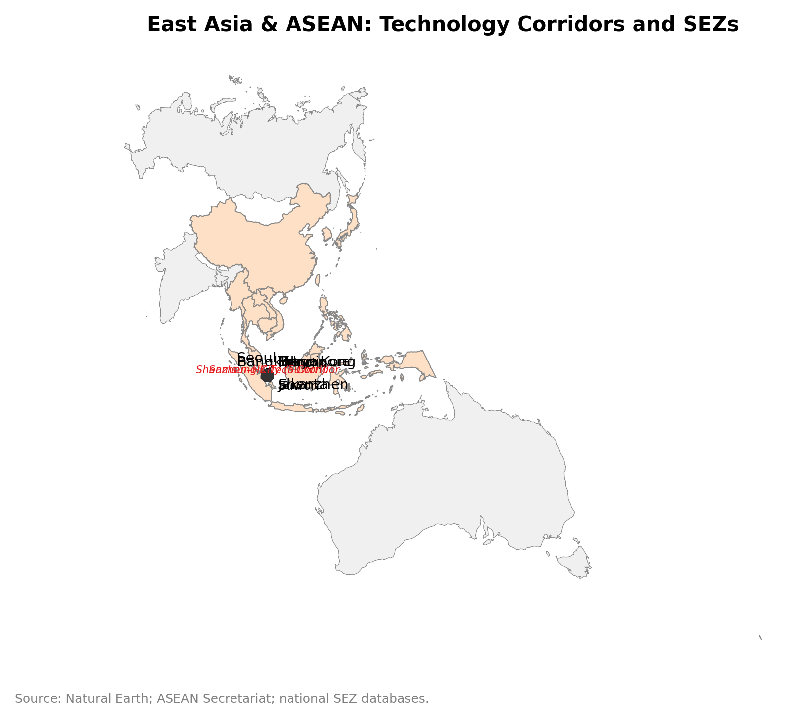
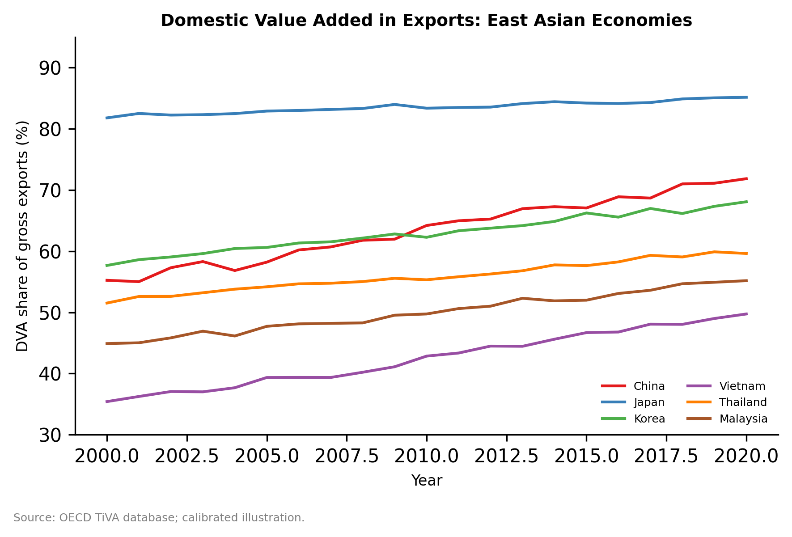

# Chapter 6: The Flying Geese and East Asia's Tech Ascendancy

*Source: Natural Earth; ASEAN Secretariat; national SEZ databases.*

---

## Introduction: The Chip That Built an Economy

In February 1983, Lee Byung-chul, chairman of Samsung Group, stood before his senior engineers and announced that Samsung would design and manufacture a 64-kilobit dynamic random-access memory chip. This was, in the understated language of technology strategy, an ambitious goal. Intel had just shipped its first 256K DRAM. NEC and Hitachi were deploying billion-dollar fabs to push toward one megabit. Samsung's semiconductor division had revenues of roughly $25 million — almost entirely from assembling finished chips designed elsewhere — and its engineers had never worked on the complex photo-lithographic processes required to fabricate DRAM at scale. The chairman was asking them to close, in four years, a technology gap that American and Japanese firms had spent fifteen years building. When they pointed this out, Lee is reported to have replied that the only way to learn how to make something is to commit publicly to making it.

By 1984, Samsung had produced its first 64K DRAM — reverse-engineered, in part, from chips purchased openly in American consumer electronics. By 1988, it had developed a four-megabit chip that was competitive with the Japanese frontier. By 1992, Samsung was the world's largest DRAM producer, a position it has held for most of the three decades since. This was not market selection at work. It was, as the developmental state theorists who studied it quickly recognized, institutional engineering of a particular kind: directed state credit from the Korea Development Bank, protected domestic procurement to seed the learning curve, public investment in the science and engineering universities (KAIST, POSTECH) that supplied the engineers, and a Ministry of Trade, Industry and Energy (MOTIE) that set strategic targets and coordinated the private sector's response to them.

Four years after Samsung's DRAM announcement, on the other side of the Taiwan Strait, a different kind of institutional gamble was unfolding. Morris Chang, a Texas Instruments veteran who had returned to Taiwan at the invitation of the government's Industrial Technology Research Institute (ITRI), proposed a manufacturing model that most semiconductor veterans thought impractical: a "pure-play foundry" that would fabricate chips designed by other companies without designing any of its own. The logic was counter-intuitive. In 1987, the received wisdom was that competitive advantage in semiconductors required vertical integration — designing and building your own chips, protecting your process technology as a proprietary asset. Chang argued the opposite: that the economics of leading-edge fabrication were so capital-intensive, and the market for custom-designed chips so large, that a specialized manufacturer serving independent design houses (the emerging "fabless" model) could achieve scale economies impossible for any vertically integrated firm. The Taiwanese government put in $135 million through the Development Fund; Philips contributed technology and a minority equity stake; and the Taiwan Semiconductor Manufacturing Company opened its first fab in Hsinchu Science Park.

TSMC today fabricates more than 90 percent of the world's most advanced logic chips — those manufactured at process nodes below seven nanometers, which power everything from iPhone processors to artificial intelligence accelerators. No other company on earth can produce these devices at volume. Taiwan, an island of 24 million people with no natural resource endowments beyond its human capital and institutional arrangements, has become the single most important geography in the global technology economy — a fact whose strategic implications are being absorbed, with varying degrees of alarm, by every government with ambitions in advanced manufacturing.

These two stories — Samsung's DRAM ascent and TSMC's foundry gamble — are the organizing cases for this chapter. Together, they illustrate the central argument: East Asia's technology upgrading is not an automatic "flying-geese" sequence in which industrialization passes naturally from advanced to less-advanced economies as costs rise. It is institutionally engineered. The regions that upgraded from assembly to frontier fabrication did so not because market forces selected them but because state-coordinated institutions — directed credit, mission-oriented public R&D, science-park governance, and strategic industrial policy — created the conditions in which private firms could take risks that purely private capital would not have funded. And the regions that failed to upgrade, despite similar factor endowments and similar exposure to the flying-geese dynamic, did so because those institutional conditions were absent.

This argument has gained new urgency from two developments that have restructured the economic geography of East Asian technology since 2020. First, the geopolitics of semiconductor supply chains — US export controls on advanced chip equipment to China, TSMC's geographic concentration risk in Taiwan, and a trillion-dollar subsidy race among the US, EU, Japan, and South Korea to build domestic chip capacity — have made the spatial economics of fabrication a first-order national security question. Second, the demographic transition is reshaping the labor-cost arithmetic that underpinned the original flying-geese dynamics: Japan's working-age population has been shrinking since the 1990s; South Korea faces the fastest aging trajectory of any OECD economy; and the demographic pressures are themselves becoming a spatial force, concentrating automation-intensive industries in ways that Baumol's cost disease helps explain.

The chapter proceeds as follows. Section 6.1 examines the flying-geese framework: its original logic, its empirical record, and the institutional critique that the data demands. Section 6.2 develops the "windows of opportunity" concept and applies it to East Asia's successive rounds of semiconductor upgrading — DRAM, foundry, and now advanced packaging. Section 6.3 analyzes science parks as spatial coordination devices, focusing on Hsinchu as the canonical case. Section 6.4 connects the upgrading narrative to the MRIO-based domestic value-added evidence and to Lab 2's empirical framework. Section 6.5 examines demographic aging as a spatial force through Baumol's cost disease. Section 6.6 develops the weaponized interdependence argument: how semiconductor chokepoints have become instruments of geopolitical leverage and what this means for the spatial reorganization of fabrication capacity. Section 6.7 links the analysis to Lab 2.

---

## 6.1 The Flying Geese: Mechanism, Evidence, and Institutional Critique

### The Original Framework

Kaname Akamatsu (1962) coined the "flying-geese" metaphor to describe the sequential industrialization of East Asia: Japan in the lead, followed by the first-tier NIEs (Korea, Taiwan, Hong Kong, Singapore), followed in turn by ASEAN-4 (Malaysia, Thailand, Indonesia, the Philippines), and eventually China. The logic was supply-side: as an economy industrializes and wages rise, its cost advantage in labor-intensive manufacturing erodes. Production migrates to the next-cheapest location, which begins to industrialize — and the former leader moves up the value chain to more technology- and capital-intensive activities. The pattern generates a "V" formation: all economies fly in the same direction (toward industrialization), with Japan at the point and successively later developers following in its wake.

The framework captured something real. Japan's shift from textiles to steel to automobiles to electronics, and the parallel industrialization of Korea and Taiwan in the 1960s and 1970s, followed this broad pattern. By the 1980s, ASEAN-4 were absorbing labor-intensive electronics assembly (circuit board stuffing, wire bonding, final test and packaging) as Korean and Taiwanese wages rose. China, after the Deng reforms, absorbed the next wave — first textiles and footwear, then electronics assembly, then increasingly sophisticated manufacturing.

But the framework has two critical limitations that the empirical record has forced upon it. First, it is purely a theory of *labor reallocation*, not of *upgrading*. It explains why production moves geographically as wages rise, but it says nothing about whether the receiving economy moves up the value chain or remains trapped at the assembly stage. The Philippines received substantial electronics production in the 1970s and 1980s — largely for semiconductor packaging and testing — but it never moved significantly up the value chain toward wafer fabrication or chip design. Malaysia received hard-disk-drive assembly and remained in assembly for decades. Vietnam is today the largest single-country exporter of Samsung phones, but Samsung does the design in Korea and the components come primarily from Samsung's Korean and Chinese suppliers. The geese are flying, but not all of them are climbing.

Second, the framework treats institutional quality as exogenous — as background conditions that either are or are not present. It cannot explain the *variation* in upgrading trajectories among economies that received similar waves of foreign investment, at similar points in Japan's wage cycle, with similar initial factor endowments. Korea and Taiwan both received waves of Japanese electronics investment in the 1960s. By the 1990s, Korea was designing and fabricating world-class memory chips and Taiwan was building the world's most advanced foundry. Thailand received similar waves and remained primarily an assembly and testing platform. The difference is not geography, endowments, or exposure to the flying-geese dynamic — it is institutions.

### The Institutional Critique

The institutional critique of flying geese has two strands. The first, associated with Alice Amsden (1989) and Robert Wade (1990), emphasizes the role of the developmental state: a state apparatus with the autonomy, capacity, and political will to direct private investment toward strategic sectors, discipline firms that receive public support to meet performance standards, and build the educational and research infrastructure on which industrial upgrading depends. Amsden's analysis of South Korea showed that the country's industrial success was not simply a matter of getting prices right or liberalizing markets — it was a matter of "getting prices wrong" in systematic ways that forced firms to move up the learning curve by subsidizing investment in sectors where learning externalities were large and where private markets would have underinvested.

The second strand, associated with the evolutionary economic geography literature discussed in Chapter 2, emphasizes path dependence and related variety. Once an economy establishes a capability base in a particular technology trajectory — say, memory chip fabrication — that capability generates knowledge spillovers that make the next step up the value chain (logic chips, custom fabrication, design tools) easier to take than it would be for an economy starting fresh. The capabilities accumulate spatially: they are embodied in workers, firms, supplier ecosystems, and research institutions that are geographically concentrated. Silicon Valley's dominance in chip design is the accumulated product of fifty years of knowledge spillovers, not a fresh market selection each decade.

What both strands share is a rejection of the automatic-upgrade story. Flying geese do not fly automatically; they need institutional thermostat-setting. The economies that upgraded were those whose institutions could coordinate the three components of upgrading: directed capital (to fund the risky early stages), human capital investment (to supply engineers who could work at the technological frontier), and knowledge infrastructure (public R&D, universities, standards bodies) that generated the spillovers the private sector could exploit.

The flying-geese model was formulated for manufacturing, but a parallel pattern may be emerging in services. Japan pioneered business process outsourcing to China and Southeast Asia in the 2000s; Korea's content industry — K-pop, K-drama, webtoons — has created production networks across Southeast Asia that rely on localized studios, dubbing facilities, and distribution partnerships; and data center construction is following a geographically sequenced pattern (Singapore to Indonesia to Vietnam) that resembles the manufacturing cascade. Whether this "services flying geese" will produce the same capability upgrading as the manufacturing version — or will remain limited to routine processing without design-level transfer — is an open empirical question. The early evidence is ambiguous: India's IT services exports suggest that services upgrading is possible under the right institutional conditions, but Southeast Asia's BPO sectors have shown less upward movement. Chapter 7's analysis of platform economies begins to address this question directly.

### The Domestic Value-Added Metric

Measuring upgrading in the flying-geese framework requires distinguishing participation in global value chains from *position* within them. The standard trade data — exports of electronics products — captures both: a country assembling iPhone final products from imported components, and a country fabricating custom chips, show up as "electronics exporters." The distinction requires decomposing export value into its domestic and foreign components.

The OECD Trade in Value Added (TiVA) database and the World Input-Output Database (WIOD) provide this decomposition. For each country-sector pair and year, TiVA reports the domestic value-added share of gross exports — the fraction of the export value that was generated domestically, rather than imported as intermediate inputs. For electronics and electrical equipment:

- Japan: approximately 65–70 percent domestic value-added share, reflecting mature, vertically integrated production;
- South Korea: approximately 55–65 percent, reflecting significant domestic component production but also reliance on Japanese capital equipment and materials in upstream stages;
- Taiwan: approximately 55–60 percent, with high design and fabrication content but significant imports of specialized materials and equipment;
- ASEAN-4: approximately 25–40 percent, reflecting predominantly assembly operations where the vast majority of value is in imported components;
- China: approximately 50–60 percent and rising, reflecting the rapid build-out of domestic component supply chains over the 2000–2020 period.

These aggregate figures mask significant intra-sector variation. A Korean fab producing DRAM has very high domestic value-added because the wafers, process chemicals, and much of the capital equipment are now produced domestically. A Malaysian electronics assembly plant has very low domestic value-added because it is essentially a labor-service operation on imported parts. The within-country, within-sector variation is what Lab 2 is designed to exploit.

---

## 6.2 Windows of Opportunity: Seizing Technological Transitions

*Source: OECD TiVA database; calibrated illustration.*

### The Concept

The "windows of opportunity" framework, associated with Carlota Perez (2002) and applied to latecomer industrialization by Malerba and Nelson (2011), argues that technological paradigm shifts create temporary openings in which the accumulated advantages of incumbent leaders are disrupted. The window is the period between when the old paradigm (and its associated skill base, capital equipment, and institutional frameworks) becomes obsolete and when the new paradigm (and its accumulated advantages) is established. During this window, latecomers face a more level playing field — the accumulated knowledge of incumbents is less valuable, new skills and new capital equipment are needed, and the organizational and institutional frameworks appropriate for the new paradigm have not yet been fully built by anyone.

The windows metaphor implies that timing matters: the window closes as incumbents adapt to the new paradigm and rebuild their advantages. Latecomers that can mobilize institutional coordination fast enough to enter during the open window can establish positions in the new paradigm that then persist as path-dependent advantages. Latecomers that cannot mobilize quickly enough remain in assembly positions, purchasing from the firms that seized the window.

### The DRAM Window (1985–1995)

The window that Samsung and Hyundai exploited in memory chips was opened by two exogenous shocks that disrupted Japanese dominance in DRAM production. First, the Plaza Accord of September 1985 caused the yen to appreciate roughly 50 percent against the dollar in the following year, sharply eroding the cost competitiveness of Japanese manufacturers whose costs were denominated in yen but whose revenues were largely in dollars. Japanese DRAM prices, which had been competitive with American equivalents, suddenly became uncompetitive — and the price of Japanese capital equipment, already the most advanced in the industry, became prohibitively expensive for competitors trying to catch up.

Second, the US-Japan Semiconductor Trade Agreement of 1986 — concluded under threat of American trade sanctions — committed Japan to open its domestic chip market to foreign suppliers (guaranteeing a 20 percent foreign market share) and to stop selling chips below cost in third markets. This agreement was, in effect, a partial cartelization of the global DRAM market: it constrained the Japanese firms' ability to compete on price and opened space for Korean entrants.

Samsung was positioned to enter through this window because the Korean government had been systematically preparing for it. The Korea Development Bank had provided heavily subsidized credit to the chaebol (conglomerates) for electronics investment since the early 1980s; KAIST (established 1971) and POSTECH (1986) were producing world-class semiconductor engineers; and the government had negotiated technology-transfer agreements with US firms (Texas Instruments, Micron) that provided the initial process know-how on which Samsung and Hynix built. The window was opened by geopolitics; it was seized by institutional preparation.

The lesson generalized from this episode is important for the flying-geese critique: the window was available to every economy in the region, not just Korea. Malaysia, Thailand, and the Philippines had labor cost advantages and had attracted significant semiconductor investment in assembly and testing. None of them seized the DRAM window, because none had built the institutional infrastructure — the directed credit, the engineering universities, the technology-transfer networks — that made frontier fab entry possible. The window opened for everyone; only the institutionally prepared could fly through it.

### The Foundry Window (1987–2000)

Morris Chang's foundry insight constituted a second window opening, this one created not by a geopolitical shock but by an endogenous technological and organizational transition: the unbundling of chip design from chip fabrication. Through the 1970s and early 1980s, integrated device manufacturers (IDMs) — Intel, TI, Motorola, NEC — both designed and fabricated their chips. Fabrication required enormous capital investment that only firms with large, captive design pipelines could justify. But the invention of electronic design automation (EDA) tools in the early 1980s made custom chip design accessible to small firms and university spin-outs that lacked fabrication capacity. The market for "fabless" chip design was nascent but clearly growing.

The pure-play foundry model exploited this opportunity directly: by aggregating design demand from many fabless clients, TSMC could justify investment in leading-edge fabs that no single fabless designer could fund independently. The model created a virtuous cycle: more fabless clients meant more fab volume, which justified investment in next-generation process technology, which attracted more fabless clients who needed leading-edge manufacturing.

TSMC's institutional advantages were different from Samsung's. Samsung seized its window through brute-force state capital and learning-by-doing in a well-established product (DRAM). TSMC created a new market architecture through an organizational innovation (the pure-play foundry) supported by public research infrastructure (ITRI's process technology was the seed from which TSMC grew) and a governance framework that made the Hsinchu Science Park the most productive per-acre concentration of semiconductor intellectual property on earth. The Taiwanese model was less about directed credit and more about ecosystem governance: creating the physical proximity, organizational structures, and intellectual property frameworks within which fabless designers and process engineers could collaborate.

### The Advanced Packaging Window (2020–Present)

The third window is currently open. The classical Moore's Law scaling of transistors on a two-dimensional silicon die is approaching physical limits: at two nanometers and below, quantum effects and thermal density create engineering challenges that are becoming prohibitively expensive to solve by further shrinking the transistor. The industry response has been to achieve effective performance scaling through *packaging* rather than shrinking — through "chiplet" architectures that connect multiple specialized dies in a single package, and through "3D stacking" that places dies vertically with dense interconnects between them.

Advanced packaging — CoWoS (Chip-on-Wafer-on-Substrate), SoIC (System on Integrated Chips), and competing approaches — is currently TSMC's most important strategic capability beyond leading-edge nodes. NVIDIA's AI accelerator chips (the H100 and H200 series) require TSMC's CoWoS packaging; the current constraint on AI infrastructure deployment is not chip design or die fabrication but advanced packaging capacity. The window is opening because advanced packaging represents a set of skills, equipment, and organizational capabilities distinct from those needed for conventional planar fabrication — creating, in principle, a new opportunity for latecomers to establish positions.

In practice, Taiwan retains dominant positions in advanced packaging through accumulated expertise at TSMC and ASE Group. But Japan has identified advanced packaging as a strategic opportunity through its Rapidus initiative (announced 2022, targeting two-nanometer fabrication and advanced packaging by 2027), and South Korea's Samsung and SK Hynix are investing in High Bandwidth Memory (HBM) — a form of stacked DRAM used in AI accelerators — where they have established early leadership. The window is narrower than the DRAM or foundry windows, because the accumulated advantages of incumbents are not being disrupted by any exogenous shock — but the technology transition is real, and the race to establish positions in the new paradigm is underway.

---

## 6.3 Science Parks as Spatial Coordination Devices

### The Hsinchu Model

Hsinchu Science Park, established by the Taiwanese government in 1980 on a campus adjacent to National Tsing Hua University and National Chiao Tung University, is widely regarded as the most successful technology cluster ever deliberately created by a government. By 2000, it housed more than 300 firms with combined revenues exceeding $30 billion. By 2010, revenues exceeded $70 billion and the park had produced more semiconductor-related patents per employee than any comparable geography in the world. TSMC, MediaTek, and ASE Group — three of the most important firms in the global semiconductor ecosystem — originated in or maintain major operations in Hsinchu.

The park's success cannot be attributed to location, tax incentives, or land subsidies alone. These features were shared by dozens of science parks established in Korea, Malaysia, Singapore, and China during the same period, with far less impressive results. What distinguished Hsinchu was a governance architecture that achieved what economists call *coordination without hierarchy*: it brought together firms, universities, research institutes, and government agencies in a shared physical space with institutional frameworks that facilitated knowledge exchange, reduced duplication of R&D effort, and coordinated the supply chain relationships that cluster economics depends on.

Three features of Hsinchu's governance were critical. First, ITRI served as a publicly funded research intermediary: it conducted basic and applied research that individual firms could not justify, patented the results, and licensed them to park tenants at terms designed to maximize technology commercialization rather than revenue. ITRI spun out TSMC, UMC (United Microelectronics Corporation), and dozens of smaller firms — it was not merely a research body but a venture-creation machine. Second, the park's tenant-selection process was managed to create what Richard Florida (drawing on related variety concepts) called "complementary heterogeneity": firms at different stages of the design-fabrication-packaging value chain, with overlapping but not identical capabilities, so that horizontal knowledge spillovers were maximized and supply chain relationships could develop within the park. Third, the park facilitated the return of Taiwan-born engineers from Silicon Valley — the so-called "astronauts" — through a deliberate repatriation mechanism whose institutional details are examined in the Institutional Spotlight below.

The contrast with comparable initiatives in Southeast Asia is instructive. Malaysia's Penang Science Park (established 1972), Malaysia's Cyberjaya (1997), and Thailand's Eastern Economic Corridor (various phases since 1989) all provided tax incentives, physical infrastructure, and government promotion. None produced indigenous chip design or foundry capabilities. The missing ingredient was the coordination device: in Hsinchu, ITRI played a role that no Malaysian or Thai agency was institutionally capable of performing. Malaysia had Petronas, which directed talent and capital into petroleum; Thailand had BOI, which offered manufacturing investment incentives. Neither had a public research intermediary with the technical expertise and organizational mandate to translate frontier knowledge into domestic capability.

### Daejeon and the Korean Innovation Cluster

Korea's analogue to Hsinchu is the Daedeok Innopolis (formerly Daedeok Science Town) in Daejeon, established as a major R&D cluster in the 1970s and 1980s. Daejeon is home to KAIST, Electronics and Telecommunications Research Institute (ETRI), Korea Research Institute of Standards and Science, and dozens of corporate research laboratories. Samsung's semiconductor research division maintains facilities there; LG, SK Hynix, and hundreds of smaller firms draw on Daejeon's engineering talent pipeline.

The Korean innovation geography differs from Taiwan's in structure. Hsinchu is a dense, high-proximity cluster where firms interact continuously; Korean innovation is more distributed, with Daejeon providing the research infrastructure but major manufacturing operations in Samsung City (Suwon-Hwaseong), SK Hynix's Icheon complex, and the Gumi industrial complex (now primarily display and electronics component production). Korean firms are more vertically integrated than Taiwanese ones — Samsung designs, fabricates, packages, and tests its own chips — which reduces some of the inter-firm knowledge spillovers but enables tighter control of the technology roadmap.

Both models are institutionally intensive. The Korean model requires MOTIE's sector targeting to remain credible and the chaebol to remain willing to accept government direction in exchange for capital support and market protection. The Taiwanese model requires ITRI to remain technically excellent and politically independent enough to perform its intermediary function without being captured by incumbent firms with interests in blocking new entrants. Both conditions have proved durable — which is itself remarkable, given that both countries democratized in the late 1980s, introducing political pressures that might have disrupted the developmental state's autonomy.

### Innovation Productivity: Beyond Cluster Size

The conventional wisdom on science parks is that bigger is better: more firms, more workers, more proximity, more spillovers. The empirical literature suggests this is at best partially true. Beaudry and Schiffauerova (2009) and Devereux, Griffith, and Simpson (2007) find that agglomeration benefits show diminishing returns past modest cluster sizes, and that *composition* — the mix of firm types, technological proximity, and institutional linkages — matters more than scale for the highest-productivity outcomes. A cluster of 500 firms in related but non-identical technology niches generates more innovation than a cluster of 500 firms all doing the same thing.

Hsinchu's composition — IC design houses, wafer fabs, packaging and testing firms, materials suppliers, EDA vendors, and university research groups — reflects something close to the "related variety" ideal. The key interactions are cross-functional: design engineers learning about process constraints from fabs; materials scientists learning about design needs from circuit designers; packaging engineers learning about thermal and electrical requirements from chip architects. These interactions require physical proximity (for tacit knowledge transfer) and institutional frameworks (for IP management and dispute resolution) that Hsinchu's governance architecture provides.

The implication for policy is sobering: the ingredients that make Hsinchu work are deeply institutional, accumulated over decades, and not easily transplanted. The CHIPS Act's $52.7 billion in US manufacturing incentives, and the EU Chips Act's €43 billion commitment, are trying to replicate Hsinchu's or Samsung City's results on a decade's timeline. Whether this is achievable is one of the most important empirical questions in the economics of industrial policy — and the early evidence from TSMC's Arizona construction delays and Intel's Ohio fab timeline extensions suggests that the institutional preconditions are as important as the capital subsidies.

The chapter's focus on hardware clusters, however, understates a dimension of East Asia's tech ascendancy that has become impossible to ignore: the software and platform economy. Korea's Pangyo Techno Valley, south of Seoul, hosts more than 1,600 IT firms including Naver and Kakao, whose platform ecosystems — search, messaging, payments, cloud — are as spatially concentrated as the semiconductor clusters in Suwon or Hsinchu. Japan's LINE and Rakuten, and China's Tencent, Alibaba, and ByteDance, have built platform infrastructures that rival the hardware value chains in economic scale. The convergence of hardware and software — where AI chip design, cloud infrastructure, and platform services are increasingly co-located, and where TSMC's customers are themselves platform companies (Apple, Google, Amazon) designing custom silicon — is blurring the boundary between "hardware cluster" and "software cluster" in ways that the flying-geese framework, with its manufacturing focus, does not capture. The spatial economics of platform co-location with semiconductor design is a frontier question that existing cluster theory has barely begun to address.

---

## 6.4 Upgrading in the MRIO Evidence

### The Domestic Value-Added Regression

The theoretical claim — that state coordination intensity and network centrality jointly determine upgrading outcomes — can be tested with MRIO data. Lab 2 is designed to implement this test, using the WIOD/TiVA framework introduced in Chapter 3-B. The estimating equation takes the form:

$$
\text{DVA_share}_{it} = \alpha + \beta_1 \text{coord_intensity}_{it} + \beta_2 \text{network_centrality}_{it} + \beta_3 (\text{coord_intensity}_{it} \times \text{network_centrality}_{it}) + \gamma X_{it} + \delta_i + \tau_t + \varepsilon_{it}
$$

where $$\text{DVA_share}_{it}$$ is the domestic value-added share of electronics exports for economy $$i$$ in year $$t$$; $$\text{coord_intensity}_{it}$$ is a proxy for state coordination capacity (public R&D expenditure share, directed-credit intensity, or a composite index); $$\text{network_centrality}_{it}$$ is the economy's centrality in the electronics MRIO network (upstreamness measure or eigenvector centrality); $$X_{it}$$ is a vector of macro controls (income level, trade openness, human capital); $$\delta_i$$ and $$\tau_t$$ are economy and year fixed effects.

The interaction term $$\beta_3$$ is the key parameter. The hypothesis is that coordination intensity raises domestic value-added more for economies that are central in the production network — because network-central economies have more opportunities to substitute domestic intermediates for imported ones and more leverage with which to demand technology transfer from downstream buyers. An economy that is peripheral in the network (primarily a final-assembly location with few supply chain relationships upstream) benefits less from coordination because there are fewer domestic content opportunities to exploit.

### The Network Centrality Measure

In the MRIO framework, an economy's position in the global production network is measured by its centrality as both a supplier and a buyer of intermediate inputs. A highly central economy — like Japan's electronics sector in the 1990s or Taiwan's semiconductor sector today — supplies critical intermediates to many downstream sectors and economies, and sources its own inputs from an upstream network that is itself sophisticated. A peripheral economy — like Vietnam's smartphone assembly sector — receives finished intermediates from elsewhere and performs primarily value-adding-by-labor assembly, with few upstream supply relationships within the domestic economy.

The WIOD sectoral MRIO tables, described in Chapter 3-B, allow construction of this centrality measure directly from the inter-country, inter-sector transaction matrices. Lab 2 implements the computation using standard network analysis procedures. The expected finding is that economies with high network centrality are better positioned to translate coordination intensity into domestic value-added gains — because they have more supply chain relationships to domesticate and more upstream sectors to develop.

### What the Evidence Shows

The aggregate TiVA trends tell a consistent story with the theoretical framework. Japan's electronics sector, which had the highest coordination intensity in the region through the 1980s (MITI-directed industrial policy, VLSI Research Association), also had the highest domestic value-added shares and the highest MRIO centrality — it was the hub of the East Asian electronics network, supplying precision components, materials, and capital equipment to every other economy in the region. As Japanese industrial policy became less directive in the 1990s, and as Korean and Taiwanese firms climbed the value chain, Japan's network centrality declined relative to its peak, though it remains the dominant supplier of "niche" high-value components (photoresist chemicals, precision bearings, specialized glass for displays) that no other economy has matched.

Korea's domestic value-added share in electronics rose sharply during the 1990s and 2000s, tracking the build-out of Samsung's vertically integrated production system. As Samsung moved from DRAM assembly to full DRAM fabrication to logic chip design, the domestic content of its exports increased — more of the value was created in Korea rather than imported from Japan or the US. The MRIO evidence shows Korea's electronics network centrality rising over this period as it became a critical supplier of memory chips to every major electronics manufacturer globally.

China presents the most complex case. Its electronics domestic value-added share was very low in the early 2000s (primarily assembly, with components from Korea, Taiwan, and Japan) and has risen substantially as domestic component supply chains developed. But the MRIO network centrality story is complicated by the fact that China's electronics sector is enormous and heterogeneous: a firm-level analysis would reveal a dual structure in which Chinese-owned firms in electronics have lower domestic value-added than foreign-owned firms (which have better access to imported technology) and lower centrality in global networks (since they primarily serve domestic markets or perform final assembly for export).

---

## 6.5 Demographic Headwinds: Aging and Baumol's Spatial Trap

### Japan's Demographic Squeeze

Japan's population peaked at approximately 128 million in 2010 and has been declining since. The share of the population aged 65 or older exceeded 29 percent in 2023 — the highest of any country in the world — and the National Institute of Population and Social Security Research projects that nearly 40 percent of the Japanese population will be 65 or older by 2060. The working-age population (15–64) has been shrinking in absolute numbers since the mid-1990s, and this shrinkage is the single most important structural fact about the Japanese economy over the past three decades.

The demographic transition has spatial implications that the aggregated national statistics obscure. Japan's regional GDP accounts (the prefectural System of National Accounts, or SNA) provide annual GDP data for all 47 prefectures, along with employment, value-added by sector, and capital stock estimates. These data reveal a stark pattern: Tokyo and the three major metropolitan areas (Tokyo-Yokohama, Osaka-Kobe-Kyoto, and Nagoya) have maintained positive population and economic growth through selective in-migration; the remaining 44 prefectures are experiencing population decline, aging at rates faster than the national average, and facing fiscal pressures that arise from the combination of declining tax revenues and rising demand for elderly care services.

The manufacturing geography is similarly polarized. Toyota's Aichi Prefecture (home of the Nagoya-Toyota manufacturing corridor) has maintained employment in automobile-related manufacturing through automation-intensive capital deepening: Toyota, Denso, and their thousands of tier-1 and tier-2 suppliers have systematically replaced labor with industrial robots, keeping production in Japan while reducing the labor content per unit of output. By contrast, prefectures in the Tohoku and Chugoku regions that were historically dependent on labor-intensive manufacturing (textiles, basic electronics, food processing) have seen plant closures as wages rose relative to productivity, and have not attracted replacement industries.

### Baumol's Cost Disease as Spatial Force

William Baumol (1967) observed that productivity growth is uneven across sectors: manufacturing and agriculture, exposed to competitive pressure and subject to capital deepening, tend to exhibit rapid productivity growth; personal services (healthcare, education, haircuts), which require physical proximity and are difficult to automate, tend to exhibit slow productivity growth. In a market economy where wages across sectors must be approximately equal (workers will not accept permanent wage differentials between sectors requiring similar skill levels), the relative cost of personal services rises continuously relative to the cost of manufactured goods — because service wages must rise with economy-wide productivity even though service productivity does not.

This has a spatial implication that is under-appreciated in the regional economics literature. In aging economies, the demand for personal services — particularly healthcare and elderly care — rises as the elderly share of the population increases. These are predominantly non-tradable services: they cannot be imported (an elderly person in Hokkaido cannot be cared for by a nurse in Vietnam), and they absorb a growing share of the regional fiscal resources that would otherwise be available for investment in tradable sectors. Regions with rapidly aging populations face a fiscal squeeze in which rising healthcare costs crowd out investment in infrastructure, education, and R&D — the public goods that support tradable-sector productivity.

The spatial manifestation of Baumol's cost disease in Japan is visible in the prefectural data. Non-metropolitan prefectures with aging populations show rising shares of healthcare and social care in total employment — in some rural prefectures, healthcare is now the largest single employer. This is not because healthcare is productive or generates agglomeration externalities; it is because the demand for non-tradable elderly care absorbs labor that would otherwise be available for tradable-sector activities. The regions most affected are precisely those that were already losing manufacturing activity to automation or offshoring — creating a compound spatial disadvantage in which demographic and structural forces reinforce each other.

South Korea faces the same trajectory on a compressed timeline. Korea's fertility rate has declined to approximately 0.72 — the lowest recorded for any country in modern history — and the population will begin shrinking in absolute terms within the next decade. The demographic divide between Seoul and its metropolitan satellites (which attract young workers through housing and employment) and the rest of the country is widening, creating a spatial two-speed Korea that echoes Japan's metropolitan-regional divide of two decades earlier.

### Automation as Institutional Response

The East Asian response to demographic pressure has been automation, and the spatial consequences of automation are themselves uneven. Industrial robots substitute primarily for routine manual labor in assembly-intensive manufacturing: the payoff to automation is highest where labor costs are high relative to robot costs, where production volumes justify the fixed cost of robot installation and programming, and where products are standardized enough for robotic manipulation.

These conditions are met primarily in large-scale, high-volume manufacturing operations — automotive assembly, semiconductor fabrication (where automation is near-total), consumer electronics assembly (where Apple's suppliers have deployed hundreds of thousands of robots since 2015). They are not met in small-batch, customized, or labor-flexible manufacturing contexts, which still require human workers with judgment and dexterity.

The spatial implication is a strengthening of agglomeration economies in automation-eligible manufacturing clusters (the Nagoya corridor, Samsung City) and a weakening of the labor-cost advantage that previously supported rural and secondary-city manufacturing. Automation turns labor into a minor input and turns process engineering, maintenance, and quality management expertise into the key scarce factors. These expertise concentrations are urban and cluster-specific — they reinforce the spatial concentration of advanced manufacturing in existing hubs rather than enabling diffusion to regions that previously competed on low wages.

The services trade dimension of East Asia's demographic transition deserves explicit attention. As aging economies spend rising shares of GDP on non-tradable care services, their tradable sectors — including tradable services — face increasing competition for labor and fiscal resources. Japan's response has included importing care workers from the Philippines and Indonesia under the Economic Partnership Agreement (EPA) framework — a Mode 4 (movement of natural persons) services trade flow that is institutionally constrained by Japan's restrictive immigration regime. The Specified Skilled Worker visa category, introduced in 2019, expanded access but remains far below the scale needed to offset demographic decline. Korea has followed a parallel but even more restrictive path with its Employment Permit System (EPS). The upshot is that East Asia's demographic challenge is partly a services trade policy challenge: countries that could import care services through Mode 4 liberalization instead bear the fiscal cost domestically, crowding out public investment in the tradable-sector infrastructure (science parks, semiconductor subsidies, R&D programs) that Sections 6.1 through 6.4 have shown to be essential for upgrading. The interaction between demographic structure, services trade openness, and industrial policy capacity is a theme that Chapter 7 develops further through China's internal migration dynamics.

---

## 6.6 Weaponized Interdependence: The Semiconductor Geopolitics Shock

### The Theoretical Framework

Henry Farrell and Abraham Newman (2019) introduced the concept of "weaponized interdependence" to describe how states use the architecture of global economic networks as instruments of coercive leverage. The argument has two components. First, global production networks are not symmetric graphs: they contain chokepoints — nodes through which a disproportionate share of flows must pass, and which therefore give the controllers of those nodes structural power over the network's other participants. Second, states can exploit these chokepoints to coerce rivals by threatening to sever access — imposing asymmetric economic costs without incurring equivalent costs themselves, since the chokepoint controller's flows are less dependent on the restricted routes.

The semiconductor supply chain is the canonical case of a network dense with chokepoints. ASML, a Dutch company headquartered in Eindhoven, manufactures every extreme ultraviolet (EUV) lithography machine used in the world for manufacturing chips at seven nanometers and below — which means virtually every advanced AI chip, smartphone processor, and high-performance computing chip fabricated anywhere on earth. ASML's standard EUV machines cost approximately $180–200 million each, and the next-generation High-NA EUV systems (the EXE:5000 series, which began shipping in 2024) cost $350–380 million. These machines required over seventeen years of development time to bring to production (per ASML's own accounts) and depend on supply chains that span more than 5,000 suppliers across 30 countries. There is no alternative supplier, and there is no plausible timeline on which an alternative supplier could emerge — the accumulated know-how in ASML's engineering base, its supplier network, and its installed-base relationships with TSMC, Samsung, and Intel are irreproducible on any competitive timeline.

TSMC's concentration of advanced foundry capacity is a second chokepoint. Taiwan fabricates more than 90 percent of the world's leading-edge logic chips — those produced at process nodes of seven nanometers and below — and the concentration is actually increasing as TSMC's technological lead over Intel (now outsourcing its most advanced chips to TSMC) and Samsung's foundry division grows. Advanced memory chips — the HBM product now critical for AI workloads — are concentrated in Samsung and SK Hynix in Korea. The geographic concentration of critical semiconductor production in a region (East Asia) that encompasses the world's most salient territorial dispute (the Taiwan Strait) has not escaped the notice of governments whose military and civil infrastructure depend on these chips.

### The US Export Controls Shock

On October 7, 2022, the US Commerce Department's Bureau of Industry and Security (BIS) issued a set of export control rules that represented the most significant intervention in global technology trade since the Cold War. The rules prohibited the export to China of:

- Advanced semiconductor chips (those manufactured at 16/14 nanometers and below, or meeting specified performance criteria for AI applications);
- Semiconductor manufacturing equipment capable of producing chips at these nodes;
- The chips, software, and technical knowledge required to operate such equipment.

Critically, the rules also required that US persons (including US citizens and permanent residents regardless of their employer's nationality) cease supporting the development or production of advanced chips in China without a license — effectively requiring American engineers employed by Chinese fabs to leave their jobs.

The spatial consequences of these controls are being worked out in real time. Advanced Chinese fabs — SMIC's most advanced facilities — cannot legally receive the tools needed to progress to seven nanometers and below without an export license that BIS has declined to grant. Huawei, the Chinese telecommunications giant, cannot legally obtain the TSMC-fabricated chips it needs for its smartphone and infrastructure products. China's domestic semiconductor industry, which is substantial (China consumed approximately 35 percent of global semiconductor output by value) but highly dependent on foreign equipment and materials, faces a forced restructuring.

The geographic consequence is acceleration of what was already occurring: a bifurcation of the global semiconductor supply chain into a US-aligned cluster (Taiwan, South Korea, Japan, the Netherlands, the US itself) and a China-domestic cluster attempting to achieve independence at older process nodes (28 nanometers and above, where export controls are less restrictive). The bifurcation is not clean — it is being contested at every node by firms with significant investments on both sides — but the trajectory is toward two partially separate ecosystems.

### The CHIPS Act and the Fab Location Race

The US CHIPS and Science Act (2022) appropriated $52.7 billion for semiconductor manufacturing incentives and R&D, with the explicit goal of reducing US dependence on TSMC's Taiwan-concentrated production. TSMC is building two fabs in Arizona (with a third announced) with combined investment exceeding $40 billion, of which US CHIPS Act funding covers roughly $6.6 billion. Intel is constructing a $20 billion fab complex in Ohio. Samsung is building a $17 billion facility in Taylor, Texas.

The EU Chips Act (2023) committed €43 billion with a target of doubling Europe's share of global chip production to 20 percent by 2030. Intel announced a €17 billion investment in Magdeburg, Germany; TSMC is building a fab in Dresden with BMW, Infineon, and NXP as anchor customers.

Japan's Rapidus program (a government-industry consortium formed in 2022 with ¥700 billion in initial public commitment) is targeting two-nanometer fabrication by 2027 — an extraordinarily ambitious goal given that Japan has not had a leading-edge fab since the 2000s. IBM Research is providing process technology knowledge; ASML is committed to supply EUV machines; and the government has designated Chitose, Hokkaido as the fab site — chosen partly for its renewable energy access (Hokkaido's wind and hydro resources) and partly for land availability and cooling water.

The Rapidus site choice points to an underappreciated constraint on fab location decisions: the environmental footprint of leading-edge fabrication is becoming a spatial economics variable in its own right. A modern leading-edge fab consumes upward of 100 megawatts of electricity continuously and requires enormous quantities of ultrapure water — TSMC's Taiwan fabs account for roughly 5 percent of the island's total electricity consumption. Hokkaido's wind and hydropower resources offered Rapidus a pathway to low-carbon fabrication that most Japanese prefectures could not match — a spatial fix in which the geography of renewable energy, not just the geography of labor markets and supply chains, determines where advanced manufacturing can locate. TSMC's Arizona fabs face the inverse problem: Arizona's solar resources are abundant, but its water resources — drawn from the overallocated Colorado River basin — may prove the binding constraint on long-run expansion. As sustainability reporting requirements tighten and as customers (Apple, Google) impose supply chain carbon targets, renewable energy access and water availability are joining labor cost, agglomeration economies, and geopolitical risk in the locational calculus of frontier fabrication.

Whether these investments will succeed in reducing geographic concentration — or whether they will prove that fab construction requires not just capital but the institutional ecosystem (supply chains, workforce pipelines, operational knowledge) that TSMC has built over 35 years — is the central empirical question of semiconductor geopolitics in the 2020s. The early evidence is mixed. TSMC's Arizona fab has faced skilled-labor shortages that required importing Taiwanese engineers; Intel has delayed its Ohio facility by at least a year. The capital subsidies are easier to replicate than the institutional ecosystems.

### The Cross-Strait Risk Premium

The geographic concentration of advanced logic fabrication in Taiwan creates a risk premium on every product in the global technology economy. If cross-strait conflict — whether trade disruption, blockade, or military action — interrupts TSMC's production for any sustained period, the consequences for global technology supply chains would be severe. Analysis by the Rhodium Group and SemiAnalysis suggests that a six-month interruption of TSMC's Taiwan production would cost the global economy on the order of $1–2 trillion through supply shortages in automotive, telecommunications, computing, and defense electronics.

This is the territorial dimension of weaponized interdependence: TSMC's concentration is simultaneously Taiwan's greatest economic and strategic asset (it gives Taiwan indispensability to the US, Japan, and Europe, creating powerful incentives for outside powers to deter Chinese military action) and Taiwan's greatest vulnerability (any attacker that could credibly threaten TSMC's operations would impose enormous costs on the global economy and thereby the US economy, complicating deterrence). The phrase "silicon shield" has entered strategic analysis discussions to describe Taiwan's position — the idea that its semiconductor indispensability creates a structural deterrent against aggression.

What is clear from a regional economics standpoint is that the spatial economics of semiconductor production are now inseparable from the strategic economics of East Asian security. This is a new regime. Through the 1990s and 2000s, the geography of chip production was determined primarily by factor costs, agglomeration economies, and firm strategy. Since 2020, it is being determined in significant part by government subsidy races, export control regimes, and security considerations. The institutions that govern this geography are no longer the science parks and development banks of the developmental state era but the export control bureaus, investment review boards, and industrial policy offices of national security states.

---

## 6.7 Lab 2 Linkage: Measuring Upgrading Through MRIO Networks

Lab 2 provides empirical tools for analyzing the upgrading dynamics described in this chapter. The lab uses WIOD and OECD TiVA data to construct two core measures:

**Domestic value-added trajectories.** For ten core East Asian economies (Japan, South Korea, Taiwan, China, Thailand, Malaysia, Vietnam, Indonesia, the Philippines, and Singapore), Lab 2 computes electronics-sector domestic value-added shares across the available WIOD time series (2000–2014 for WIOD 2016 release; TiVA extends to 2022). The expected pattern is an upgrading gradient: Japan stable at high domestic value-added shares; Korea and Taiwan rising through the 2000s; ASEAN-4 relatively flat at lower shares; China rising steeply, particularly after 2010 as domestic supplier chains developed.

**Network centrality estimation.** Using the WIOD sector-level transaction matrices, Lab 2 constructs a directed network in which nodes are economy-sector pairs and edges are inter-country intermediate goods flows. Eigenvector centrality (or the Katz-Bonacich variant that downweights distant connections) measures each economy-sector pair's structural position in the network. The expected finding is that Japan's electronics sector has high centrality through the early 2000s (as the dominant supplier of upstream intermediates), with Korea and Taiwan gaining centrality as their upstream supplier roles expand.

The interaction specification estimated in Lab 2 tests whether economies with higher coordination intensity gain more domestic value-added when they are more network-central. The coordination intensity proxy — public R&D share in electronics and ICT, or directed-credit intensity from policy-bank balance sheets — is imperfectly measured and subject to significant cross-country comparability issues. The open questions identified in the spec (subnational policy-intensity measures, MRIO concordance across versions) are genuine constraints on the precision of the estimates. Lab 2 is designed to be explicit about these constraints, providing sensitivity analyses across different proxy choices and MRIO vintages.

---

## Data in Depth: Decomposing Domestic Value-Added in East Asian Electronics Exports

**The question.** Which East Asian economies are genuinely upgrading in electronics — moving from assembly to component and design-intensive production — and how fast? Gross export data cannot answer this: a $1,000 smartphone assembled in Vietnam and a $1,000 chip fabricated in Taiwan both show up as $1,000 electronics exports. The question requires decomposing each dollar of exports into the domestic value generated within the exporting economy and the foreign value embodied in imported intermediates.

**Data sources.** Two complementary datasets provide this decomposition:

- *WIOD (World Input-Output Database, 2016 release)*: annual multi-region input-output tables covering 43 economies and a "rest of world" aggregate for 2000–2014, at the 56-sector NACE Rev. 2 classification. The electronics-relevant sectors are "Manufacture of computer, electronic and optical products" (C26) and "Manufacture of electrical equipment" (C27). WIOD provides the full inter-country transaction matrix needed for network centrality calculations.

- *OECD TiVA (Trade in Value Added)*: extends through 2022 with a MainLV extract available via the OECD API. The `EXGR_DVA` variable reports domestic value-added in gross exports directly, by sector and counterpart economy, removing the need to compute it from the raw MRIO tables. TiVA's later coverage is its advantage; its thinner sector disaggregation (compared with WIOD at the full release level) is its limitation.

For most Lab 2 purposes, TiVA's `EXGR_DVA` (domestic value-added in gross exports) is the operative variable, supplemented by WIOD's richer transaction matrices for the network centrality step.

**Construction.**

*Step 1 — Domestic value-added share.* For each economy $$i$$ and year $$t$$, the domestic value-added (DVA) share in electronics exports is:

$$
\text{DVA_share}_{it} = \frac{\text{EXGR_DVA}_{it}}{\text{EXGR}_{it}}
$$

where $$\text{EXGR}$$ is total gross electronics exports. This ratio can be computed directly from TiVA's published tables; it ranges from roughly 0.25 (Vietnam, primarily assembly) to roughly 0.70 (Japan, deeply integrated domestic supply chains).

*Step 2 — Network centrality.* Extract the sector C26+C27 rows and columns from the WIOD inter-country intermediate transaction matrix $$Z$$ for each year. Construct a directed network $$G$$ in which each node is an economy-sector pair and each directed edge $$(i \to j)$$ has weight equal to economy $$j$$'s imports of electronics intermediates from economy $$i$$ as a share of total electronics intermediate imports. Compute eigenvector centrality on $$G$$; high-centrality nodes are economies that supply electronics intermediates to many other well-connected economies.

*Step 3 — Coordination intensity proxy.* Merge in national R&D expenditure data (OECD ANBERD for OECD economies; UNESCO Institute for Statistics for non-OECD) for the ICT and electronics manufacturing sectors. Where sector-specific R&D is unavailable, total business R&D as a share of GDP (from WDI) is an imperfect substitute. Korea Development Bank directed-credit flows to electronics are available in KDB annual reports; this measure captures the financing channel of state coordination that public R&D alone misses.

*Step 4 — Panel estimation.* Pool the economy-year observations for ten core East Asian economies (2000–2014 for WIOD, extended to 2022 with TiVA) and estimate the interaction specification from Section 6.4, with economy and year fixed effects absorbed and standard errors clustered by economy.

**Expected findings.** The DVA trajectories should display a clear upgrading gradient: Japan stable at 0.65–0.70, Korea and Taiwan rising from roughly 0.45 in 2000 to 0.60 by 2014, ASEAN-4 (Thailand, Malaysia, Vietnam, Philippines) flat at 0.25–0.40, China rising steeply from roughly 0.35 in 2000 to 0.55 by 2014. The network centrality exercise should show Japan declining in relative centrality through the period as its upstream role in the electronics network is partially displaced by Korean and Taiwanese firms; China rising sharply in centrality as domestic supply chains deepen. The $$\hat{\beta}_3$$ coefficient on the interaction term (coordination intensity $$\times$$ network centrality) should be positive and statistically significant, consistent with the hypothesis that central-network position amplifies the upgrading return to state coordination.

**Caveats.** Three deserve explicit attention. First, MRIO tables are constructed partly from interpolation and modelling, not pure survey data; the implied inter-country flows for small or data-poor economies carry significant measurement uncertainty. Second, sector concordances between WIOD's NACE Rev. 2 classification and TiVA's ISIC Rev. 4 classification are not exact; researchers should report sensitivity checks using both datasets. Third, the coordination intensity proxy is coarse — public R&D spending includes spending on sectors other than electronics, and the translation from national R&D accounts to the electronics sector varies with the level of industrial disaggregation available. Lab 2's `compare_lab2_tiva_measures.py` script documents the concordance decisions and alternative measure comparisons.

**Student exercise.** Using the TiVA EXGR_DVA extract in Lab 2, plot DVA share trajectories for China's electronics sector and decompose the change from 2000 to 2022 into: (a) the share attributable to increases in domestic sourcing of materials and components, and (b) the share attributable to changes in the sectoral composition of electronics exports (more high-DVA chips vs. fewer low-DVA assembled goods). Does the decomposition suggest genuine capability upgrading or primarily a composition effect? Relate your finding to the "quality of upgrading" debate in the GVC literature (Kaplinsky 2000; Gereffi and Fernandez-Stark 2016).

---

## Spatial Data Challenge: Japan's Prefectural Accounts vs. China's Provincial GDP

The data quality contrast between Japan and China's sub-national statistics is among the starkest in comparative regional economics. Japan's prefectural System of National Accounts (SNA), published by the Cabinet Office, provides annual GDP estimates for all 47 prefectures back to 1975, with consistent sectoral decompositions, capital stock estimates, and employment data that allow meaningful panel econometrics. The data quality reflects Japan's strong statistical infrastructure: the SNA follows international standards, undergoes regular benchmark revisions, and produces estimates whose sum matches the national aggregate within normal revision tolerances.

China's provincial GDP accounts present the opposite picture. China's National Bureau of Statistics (NBS) publishes provincial GDP figures annually, but the sum of all provincial GDPs has routinely exceeded the national total — by approximately 7–10 percent in most years — indicating systematic upward bias in provincial reporting. The bias arises from a combination of factors: local officials face career incentives linked to GDP growth targets, inter-provincial accounting of production (where should an activity counted in one province's output be attributed in national accounts?) is imprecise, and statistical capacity varies enormously across provinces. Researchers have found that provinces with stronger political connections to central leadership tend to show larger upward biases.

Cross-validation strategies have been developed to work around these limitations. Wei Chen and colleagues (2019) use night-lights from DMSP-OLS and VIIRS, electricity consumption, and tax revenue as triangulating indicators, constructing "adjusted" provincial GDP estimates that show substantially lower — and more plausible — growth rates for some provinces (particularly those in the Northeast that were subject to heavy industrial subsidies). Baum-Snow and Pavan (2012) type approaches using Chinese census micro-data to recover actual employment distributions can also correct for some of the Hukou-induced misattribution of migrant workers (discussed further in Chapter 7).

The practical implication is methodological humility: any panel regression using Chinese provincial GDP data should treat the dependent variable as measured with substantial and likely non-random error. This is not a reason to avoid Chinese sub-national data — the country's economic geography is too important to omit — but it is a reason to report robustness checks using alternative indicators, to interpret coefficient estimates cautiously, and to be explicit about data quality limitations when presenting results to audiences less familiar with the Chinese statistical system's idiosyncrasies.

---

## Institutional Spotlight: Hsinchu Science Park and Korea's MOTIE–KDB Architecture

Two institutions — separated by the Taiwan Strait and organized on quite different principles — have done more to shape the spatial economics of global semiconductor production than any market process operating alone. Understanding how each worked, and why, is necessary for evaluating whether the CHIPS Act and EU Chips Act can replicate their results.

**The Hsinchu model: coordination without hierarchy.** Hsinchu Science Park was established on a 1,400-hectare campus in 1980 by the National Science Council, deliberately adjacent to two of Taiwan's leading technical universities (National Tsing Hua University and National Chiao Tung University) and to the Industrial Technology Research Institute (ITRI). The physical co-location was not incidental — it was the core institutional mechanism. ITRI's mandate was to conduct applied research that no single firm could justify, patent the results on behalf of the public interest, and license the resulting technology to park tenants at below-market rates calibrated to maximize commercialization rather than royalty revenue. The incentive structure deliberately favored rapid diffusion of know-how within the cluster over rent extraction by the public agency — a choice that most government research institutes do not make.

The park's tenant-selection process, managed by the Hsinchu Science-Based Industrial Park Administration (HSIPA), enforced a portfolio logic that went beyond standard eligibility criteria. HSIPA tracked the sectoral and technological composition of resident firms, actively recruiting in areas where supply chain gaps existed. When the IC design sector grew rapidly in the early 1990s, HSIPA prioritized recruiting packaging and testing firms, EDA tool vendors, and materials suppliers — not to fill space but to complete the value chain. The result was what economic geographers call "related variety": firms in overlapping but non-identical technology niches whose horizontal proximity generated knowledge spillovers without creating direct competition.

The talent repatriation mechanism was the third institutional pillar. By the late 1980s, a substantial population of Taiwan-born engineers had built careers at Intel, TI, and National Semiconductor in Silicon Valley. The "astronauts" — named for their frequent trans-Pacific flights — were not merely individual returnees; they were carriers of frontier practice, organizational models, and professional networks that could not be bought or licensed. HSIPA, in coordination with the Council for Economic Planning and Development, offered returning engineers housing subsidies, streamlined visa processing for their family members, and institutional positions at ITRI that gave them status and research resources. Morris Chang himself was this model writ large: recruited from TI by ITRI director Chiang Chen-san, he returned to build TSMC on the organizational model he had observed from the inside at one of America's most vertically integrated IDMs.

**The Korean model: conditionality and performance discipline.** Korea's developmental state operated on a different institutional logic. Where Taiwan relied on public research intermediaries and ecosystem governance, Korea relied on directed credit and performance conditionality — a system in which the state provided capital at subsidized rates to chaebol (large conglomerates), but attached explicit performance requirements to that capital and withdrew it from firms that failed to meet them.

The Korea Development Bank (KDB), established in 1954, was the primary conduit of this directed credit system. KDB's electronics-sector lending in the 1970s and 1980s was coordinated with the Ministry of Trade, Industry and Energy (MOTIE, then operating under earlier ministerial designations) through a joint planning process that set five-year investment targets for strategic sectors. A chaebol seeking KDB funding for a new electronics facility was required to submit not only a financial feasibility study but a technology acquisition plan, a domestic employment and training commitment, and — crucially — export performance targets. Credit was disbursed in tranches, with subsequent tranches contingent on meeting intermediate milestones. Firms that consistently underperformed had their credit allocations reduced and were sometimes administratively pressured to exit the sector; firms that exceeded targets received preferential access to subsequent rounds of state-subsidized capital.

This conditionality mechanism — credit subsidies in exchange for verifiable performance — is what Amsden (1989) identified as the key distinguishing feature of the Korean developmental state relative to other governments that provided industrial support without extracting discipline. It required a state bureaucracy with three unusual properties: sufficient autonomy from the chaebol it was supposed to discipline (so that underperformers could be penalized despite their political influence); sufficient technical competence to evaluate whether performance targets were being met (requiring engineers and economists inside MOTIE, not just administrators); and sufficient continuity to commit credibly to multi-year investment programs (which in Korea's case was provided, for better or worse, by the authoritarian stability of the Park Chung-hee era).

**The spatial consequence.** Both institutions concentrated upgrading in specific places. Hsinchu's ecosystem effects were geographically bounded — the knowledge spillovers, supply chain relationships, and talent networks that made Hsinchu productive extended only so far beyond the park's boundaries. Taiwan's southern science parks (Tainan, Kaohsiung) attracted some overflow investment, but the density of interactions that made the original cluster special was hard to replicate. Korea's chaebol-centered model concentrated production in dedicated industrial complexes — Samsung City in Suwon-Hwaseong, SK Hynix's Icheon complex, the Gumi electronics corridor — that are as geographically concentrated as any cluster in the world.

The current CHIPS Act architecture is, in effect, an attempt to replicate the outcomes of Hsinchu and Samsung City in the United States, the EU, and Japan — in a decade, without the institutional preconditions either model required. The capital subsidies are real and large. But ITRI's accumulated know-how, HSIPA's tenant-selection discipline, KDB's conditionality infrastructure, and MOTIE's technical planning capacity were built over decades and required institutional conditions — political autonomy, technical bureaucratic capacity, long-term policy commitment — that are harder to manufacture than a fab. Whether the current semiconductor policy moment produces durable spatial upgrading or expensive overcapacity depends on whether those institutional conditions can be assembled alongside the fab buildings. On the current evidence, the buildings are moving faster than the institutions.

---

## Conclusion: Geese Need Institutional Wing-Beats

The flying-geese model remains a useful first approximation of East Asian industrialization — it captures the broad temporal pattern of sequential development and the mechanism by which rising wages in leading economies create opportunities for followers. But the chapter's evidence establishes that the framework systematically understates the role of institutions in determining who upgrades and who remains in assembly. The economies that seized windows of opportunity in semiconductor fabrication — Korea, Taiwan, and, to a lesser degree, Japan's cluster of specialty materials and equipment suppliers — did so not because market forces selected them but because institutional coordination converted state resources, human capital investment, and public R&D into competitive capability at precisely the moments when technological transitions created entry points.

The weaponized interdependence shock is the largest disruption to East Asian economic geography since the Plaza Accord. It is restructuring the spatial economics of semiconductor production in real time, forcing choices about fab location that will have multi-decade consequences and that are being made partly on national security grounds rather than purely economic ones. Whether the current subsidy race produces genuinely distributed production capability or merely expensive monument fabs that underperform TSMC's Taiwan operations is among the most important questions in the economics of industrial policy.

The demographic transition adds a long-run structural dimension: Baumol's cost disease is already generating a regional fiscal squeeze in Japan that limits the resources available for the public goods — research infrastructure, workforce training, urban services — that support tradable-sector productivity. South Korea is on a trajectory that will replicate Japan's demographic pressure within a decade. Managing the spatial consequences of aging while maintaining technological leadership in a newly adversarial geopolitical environment is the compound challenge facing the region's policymakers.

Chapter 7 takes the analysis inside China: the country's internal divergence between coastal mega-regions and interior provinces, the institutional distortions that generate and perpetuate that divergence, and the ASEAN economic geography that China's Belt and Road Initiative is reshaping. The tools developed here — domestic value-added decomposition, network centrality, the developmental state framework — travel directly into Chapter 7's analysis of how institutions shape the spatial economics of the world's largest developing economy.

---

## Discussion Questions

1. The "windows of opportunity" framework suggests that technological paradigm shifts create brief moments in which latecomers can establish positions in new industries. What institutional conditions appear necessary for a latecomer economy to successfully seize such a window? Use the DRAM and foundry cases to support your answer.

2. Domestic value-added share is used in this chapter as a measure of upgrading. What are the limitations of this measure? Can you think of cases where a rising domestic value-added share would *not* indicate genuine capability upgrading?

3. Baumol's cost disease is typically analyzed as a macroeconomic phenomenon (the rising relative cost of services in a growing economy). How does the demographic transition in Japan and Korea turn it into a *regional* phenomenon with spatial consequences? Which regions are most affected and why?

4. The CHIPS Act and EU Chips Act are attempting to use large capital subsidies to replicate the results achieved by Hsinchu Science Park and Samsung City. Based on this chapter's analysis of what makes those clusters productive, what dimensions of the policy challenge are the subsidies most and least likely to address effectively?

5. TSMC's geographic concentration in Taiwan creates what strategists call a "silicon shield" — the argument that Taiwan's indispensability to global chip supply deters military aggression. Evaluate this argument using the weaponized interdependence framework. Does the silicon shield strengthen or weaken Taiwan's security position, and under what conditions?

6. The Spatial Data Challenge box describes the systematic upward bias in Chinese provincial GDP data. How does this data quality problem affect the credibility of empirical studies of China's regional convergence? What robustness strategies would you employ in a study of Chinese provincial income growth?
