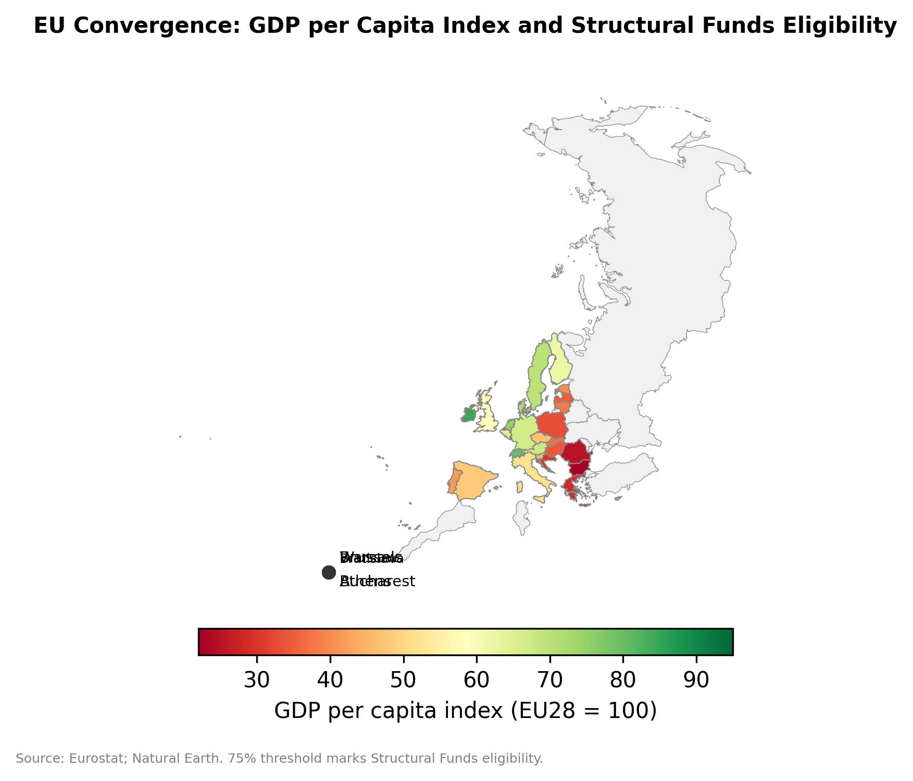

# Chapter 9: The Single Market and the Convergence Machine

*Source: Eurostat; Natural Earth. 75% threshold marks Structural Funds eligibility.*

---

## Introduction: The European Experiment

In 2023, a resident of Bratislava — the Slovak capital, situated on the Austrian border — enjoyed a GDP per capita of approximately 164 percent of the EU average, placing the city among the wealthiest regions in Europe. Four hundred kilometers to the east, in the Prešov region of the same country, GDP per capita stood at roughly 50 percent of the EU average — below the level of Bulgaria's capital and comparable to parts of rural Romania. The two regions share a national government, a legal system, a currency (the euro, since 2009), and membership in the Single Market. What they do not share is the institutional infrastructure — the density of multinational operations, the proximity to the Vienna-Bratislava cross-border agglomeration, the university-industry linkages, the connectivity to Western European supply chains — that transforms membership in an integrated market into rising incomes. Bratislava's convergence is real and rapid; Prešov's is not. The gap between them captures the central tension of the European project: integration generates convergence, but the convergence is spatially selective.

The European Union is the most ambitious experiment in regional economic integration that any group of sovereign states has ever attempted. Its Single Market — established by the 1992 Maastricht Treaty and expanded through successive enlargements — guarantees the "four freedoms": free movement of goods, services, capital, and people across 27 member states with a combined GDP of approximately $18 trillion. No other regional arrangement comes close. USMCA (Chapter 4) liberalizes goods trade but explicitly excludes labor mobility. ASEAN (Chapter 7) pursues economic integration through consensus and gradualism, tolerating wide variation in implementation. The AfCFTA (Chapter 14) aspires to continental free trade but remains in its early implementation phase. Only the EU has built the supranational institutional architecture — a common external tariff, a shared competition authority, harmonized product standards, mutual recognition of professional qualifications, a common currency for 20 of its members, and a directly elected parliament — that transforms a trade agreement into something closer to a single economic space.

The spatial economics question is whether this institutional architecture has delivered convergence. The EU's founding narrative — embodied in the preamble to the Treaty of Rome (1957) and restated in every subsequent treaty — promises that integration will reduce "the differences existing between the various regions and the backwardness of the less favoured regions." The instruments created to deliver this promise — the European Regional Development Fund (1975), the Cohesion Fund (1994), the European Social Fund, and their successors under the Common Provisions Regulation — transfer approximately €392 billion per seven-year programming period from wealthier to poorer member states and regions — roughly €780 per EU citizen, or €3,500 per citizen in the least-developed recipient regions. This is redistribution at a scale that no other international arrangement has achieved, and the spatial economics question is straightforward: has it worked?

The evidence is mixed in ways that illuminate the deepest tensions in spatial economic theory. At the country level, convergence has been remarkable: Ireland's GDP per capita was 64 percent of the EU average when it joined in 1973; by 2023 it exceeded 200 percent. Spain, Portugal, and Greece all experienced substantial catch-up during the 1990s and 2000s. The post-2004 accession states — Poland, the Czech Republic, the Baltics — have been the convergence success story of the 21st century, growing at rates that halved their income gap with Western Europe in less than two decades. But at the sub-national level, the picture is more complicated. The regions that have converged fastest are typically national capitals and major metropolitan areas: Warsaw, Prague, Bratislava, Bucharest, Budapest. The rural peripheries of these same countries — eastern Poland, southern Italy, northern Greece, interior Spain — have often been left behind, creating a pattern where between-country inequality falls while within-country inequality rises. The convergence machine works, but it works unevenly — and Chapter 10 will show what happens politically when the unevenness becomes unsustainable.

This chapter examines the EU's convergence experience through the spatial economics framework developed in Chapters 1–3. Section 9.1 applies the varieties of capitalism framework to understand why the same Single Market generates different spatial outcomes in different institutional environments. Section 9.2 evaluates the economics of EU Structural and Cohesion Funds, engaging the "people versus places" debate. Section 9.3 examines Smart Specialization Strategies (S3) as the EU's attempt to tailor regional industrial policy to local capabilities. Section 9.4 analyzes education integration — the Bologna Process and Erasmus — as a services-trade liberalization mechanism operating through mutual recognition. Section 9.5 confronts the unfinished services market: why the Single Market works far better for goods than for services, and what the Services Directive, the Digital Single Market, and GDPR mean for services trade geography. Section 9.6 connects the analysis to Lab 4's spatial regression discontinuity design for evaluating Cohesion Fund impacts.

---

## 9.1 Varieties of Capitalism and Their Spatial Signatures

### Hall and Soskice at the Sub-National Level

The varieties of capitalism (VoC) framework, developed by Hall and Soskice (2001), distinguishes between Liberal Market Economies (LMEs) — where coordination occurs primarily through competitive markets — and Coordinated Market Economies (CMEs) — where coordination occurs through non-market institutions such as employer associations, trade unions, vocational training systems, and patient capital from relationship-based banking. The canonical LME is the United Kingdom (or, since Brexit, Ireland); the canonical CME is Germany. The framework was developed to explain cross-country differences in economic structure, but within the EU's Single Market it generates distinctive spatial patterns.

In CMEs, the institutional infrastructure for coordination — apprenticeship systems, chambers of commerce, regional development banks, cooperative research institutes — is geographically embedded. Germany's Mittelstand (small and medium-sized manufacturing firms) are not randomly distributed across the country; they cluster in regions where the vocational training system, the Sparkassen (savings banks), and the Fraunhofer institutes create a localized ecosystem of complementary institutions. Baden-Württemberg's automotive cluster, Bavaria's engineering complex, and North Rhine-Westphalia's industrial core are each built on region-specific institutional configurations that took decades to develop and cannot be easily replicated elsewhere. The spatial signature of a CME is strong regional specialization with relatively high inter-regional equality: the institutional infrastructure distributes economic activity across a network of specialized regions rather than concentrating it in a single primate city. The data confirm this pattern sharply. The ratio of GDP per capita between Hamburg (Germany's richest Land) and Mecklenburg-Vorpommern (its poorest) is approximately 1.8:1 — a significant gap, but narrow by international standards. The equivalent ratio in the UK — London to Blackpool, or the City of London to the Welsh Valleys — exceeds 4:1, and by some measures approaches 6:1 when London's financial services output is measured at the borough level (Iammarino, Rodríguez-Pose, and Storper 2019). The German ratio reflects the spatial diffusion mechanisms built into the CME institutional architecture. Approximately 380 Sparkassen — publicly owned savings banks with a legal mandate to serve their local communities — provide patient capital to Mittelstand firms in regions that private commercial banks would consider too small or too peripheral to serve. The 76 Fraunhofer institutes for applied research, distributed deliberately across the federal territory (including 14 in eastern Germany, placed there after reunification as a spatial policy intervention), function as technology transfer nodes that connect local manufacturing firms to frontier research. These institutions are not byproducts of the market; they are designed spatial policy instruments, and they explain why a mid-sized city like Heilbronn or Erlangen can sustain a globally competitive industrial cluster in ways that a comparably sized British city cannot.

In LMEs, coordination through markets rather than institutions produces a different spatial pattern. Market-based coordination rewards agglomeration: financial services concentrate in London because the City's competitive advantages — deep capital markets, English common law, a concentration of specialized legal and accounting talent — generate increasing returns that no other British city can match. The spatial signature of an LME is stronger metropolitan primacy and greater inter-regional inequality: London's dominance of the British economy is far more pronounced than Berlin's role in the German economy or Paris's role in the French economy. France is an instructive intermediate case — what Vivien Schmidt (2002) calls a "state-enhanced" market economy, where the state itself functions as the coordinating institution that employer associations and banks provide in CMEs. The French spatial pattern reflects this: Paris and the Île-de-France region generate approximately 31 percent of national GDP from 19 percent of the national population, a level of metropolitan primacy that exceeds Germany (Berlin produces roughly 5 percent of German GDP) but falls below the UK (London produces approximately 24 percent of UK GDP from 14 percent of the population). The French state's tradition of dirigiste spatial policy — the grandes écoles, the TGV network designed as a radial system emanating from Paris, the decentralization reforms of 1982 and 2015 — has moderated but not eliminated the centripetal forces that pull economic activity toward the capital.

The Single Market interacts with these existing spatial patterns rather than overriding them. Trade integration within the EU intensifies the agglomeration forces that each institutional variety channels differently. For CMEs, deeper integration strengthens the export competitiveness of specialized manufacturing regions (the German Mittelstand thrives on access to 450 million European consumers). For LMEs, deeper integration strengthens the gravitational pull of metropolitan service centers (London's financial services sector served the entire EU before Brexit). The implication is that the Single Market does not produce a single convergence trajectory — it produces multiple trajectories that depend on the institutional environment of each member state and region.

The post-2004 enlargement added a further dimension. The accession of the Visegrád countries (Poland, Czech Republic, Slovakia, Hungary), the Baltic states, Slovenia, and subsequently Romania, Bulgaria, and Croatia introduced economies with institutional configurations that fit none of the established VoC categories cleanly. Nölke and Vliegenthart (2009) have conceptualized these as "Dependent Market Economies," where coordination occurs primarily through the strategic decisions of foreign multinational corporations rather than through domestic institutions or domestic markets — a framework that Chapter 10 explores in detail. The spatial consequence is that the Single Market now encompasses economies with at least four distinct institutional architectures (CME, LME, state-enhanced, and DME), each generating different spatial patterns of economic activity, different distributional outcomes, and different political responses to integration's pressures. The VoC framework's central insight for spatial economics is that institutions are not merely frictions to be overcome by integration — they are the channels through which integration operates, and they determine whether integration produces convergence, polarization, or something in between.

### The Nordic Model and Services Integration

The Nordic countries — Sweden, Denmark, Finland, and to some extent Norway (an EEA member but not in the EU) — represent a variant that combines elements of both LMEs and CMEs with an exceptionally strong public sector. The Nordic model's spatial economics are distinctive: small countries with high urbanization rates, strong intra-national transportation infrastructure, and comprehensive broadband coverage that reduces the disadvantage of peripheral locations. Sweden's technology sector is distributed across Stockholm (fintech, gaming), Gothenburg (automotive tech, advanced manufacturing), and Malmö–Lund (biotech, food technology) rather than concentrated in a single city. The spatial equality of the Nordic model is measurable: Sweden's inter-regional Gini coefficient for GDP per capita is approximately 0.12, compared to roughly 0.28 for the UK — one of the widest gaps in spatial inequality among advanced economies operating within the same Single Market. Denmark's regional Gini is even lower, reflecting a country where no region is genuinely peripheral (the longest distance from Copenhagen to the western coast is barely 300 kilometers, and high-speed rail connects the major cities).

Finland presents a revealing case of how CME institutions cushion spatial adjustment to economic shocks. When Nokia's mobile phone division collapsed after 2008 — at its peak, Nokia accounted for approximately 4 percent of Finnish GDP, 21 percent of exports, and a disproportionate share of Oulu's and Espoo's economic activity — the spatial consequences were severe but managed. Finland's universal education system, active labor market policies, and the flexicurity model (which combines flexible labor markets with generous unemployment insurance and retraining programs) enabled many displaced Nokia engineers to transition into the startup ecosystem that Nokia's collapse inadvertently seeded. Oulu reinvented itself as a 5G technology and health technology hub; Espoo attracted new corporate tenants to the former Nokia campus. The adjustment was painful but institutionally mediated in ways that a pure LME — where displaced workers face weaker safety nets and fewer retraining options — would not have replicated. The broader lesson is that flexicurity's combination of wage compression, universal benefits, and aggressive retraining compresses the spatial variation in adjustment costs that trade shocks generate — precisely the mechanism that Chapter 10's analysis of Brexit identifies as missing in the UK's deindustrialized regions.

The Nordic countries have also been among the most successful at services integration within the Single Market. Denmark exports architectural services, management consulting, and maritime services. Sweden exports IT services, gaming (Spotify, King, Mojang), and design. Finland exports engineering services and education technology. These countries' success in services trade reflects their institutional investments in education, digital infrastructure, and English-language proficiency — the same institutional foundations that Chapter 8 identified as prerequisites for India's IT services exports. The Nordic model thus demonstrates that the VoC framework is not merely a taxonomy but a set of testable predictions about how institutional configurations shape spatial outcomes: strong social insurance compresses regional inequality, high-quality universal education enables services-led growth, and comprehensive digital infrastructure reduces the peripherality penalty that remote locations face in a knowledge economy.

---

## 9.2 Cohesion Funds: Does Top-Down Redistribution Generate Convergence?

### The Scale of EU Regional Transfers

The EU's Cohesion Policy is the world's largest place-based development program. Under the 2021–2027 Multiannual Financial Framework, approximately €392 billion is allocated to three funds: the European Regional Development Fund (ERDF), the European Social Fund Plus (ESF+), and the Cohesion Fund. These funds are targeted at regions classified by GDP per capita relative to the EU average: "less developed" regions (below 75 percent of the EU average) receive the highest per-capita transfers; "transition" regions (75–100 percent) receive intermediate transfers; "more developed" regions (above 100 percent) receive lower transfers focused on innovation and competitiveness.

The geographic distribution of transfers follows predictably from this classification. In the 2021–2027 period, the largest per-capita recipients are regions in eastern Poland (Podkarpackie, Lubelskie, Warmińsko-Mazurskie), southern Italy (Calabria, Campania, Sicily), eastern Romania (Nord-Est, Sud-Muntenia), and Greece (Anatoliki Makedonia, Dytiki Ellada). The largest absolute recipients, reflecting both eligibility and population, are Poland (receiving approximately €76 billion across all funds), Italy, Spain, Romania, and Portugal. Germany, France, and the Netherlands are net contributors, though their less-developed regions (eastern Germany, French overseas territories, northern Netherlands) receive significant transfers.

The political economy of these transfers is worth noting. Net contributions are modest in per-capita terms — Germany's net contribution amounts to approximately €100 per citizen per year, a fraction of what German taxpayers transfer to eastern German Länder through domestic fiscal equalization — but they are politically visible because they cross national borders and are administered by a supranational institution that lacks the democratic legitimacy of a national parliament. The "juste retour" debate (whether each member state should receive back in EU spending what it contributes) has shaped every Multiannual Financial Framework negotiation, and the UK's decision to negotiate a permanent rebate (the "British cheque" obtained by Margaret Thatcher in 1984) set a precedent that continues to distort the allocation process. The tension between efficiency (directing funds to regions where they will have the greatest growth impact) and political acceptability (ensuring that every member state perceives a fair return) is inherent in any international transfer mechanism and explains why the allocation formula has become increasingly complex with each programming period.

### The Convergence Evidence

The empirical literature on Cohesion Fund effectiveness is large, methodologically diverse, and genuinely contested. The central identification challenge is the classic evaluation problem: regions that receive Cohesion Funds differ from regions that do not in ways that are correlated with economic growth, making simple comparisons of treated and untreated regions unreliable.

The most credible evidence comes from spatial regression discontinuity designs that exploit the 75-percent-of-EU-average threshold for "less developed" region classification. Regions just below the threshold receive substantially larger per-capita transfers than regions just above it, but are otherwise similar in their economic characteristics — a sharp discontinuity in treatment that arises from an administrative rule rather than from economic fundamentals. The assignment mechanism is crucial: the 75-percent threshold was chosen for political reasons during the 1988 Delors reform and has remained fixed since, creating a quasi-experimental assignment that researchers can exploit. This is the empirical strategy implemented in Lab 4, and the findings from the literature are instructive.

Becker, Egger, and von Ehrlich (2010, 2013) find positive and statistically significant effects of Objective 1 (now "less developed") funding on GDP per capita growth, with treated regions growing approximately 1.5–2 percentage points faster per programming period than comparable untreated regions. Pellegrini et al. (2013) find similar results for Italian regions. However, the effects are heterogeneous: regions with stronger institutional quality and higher human capital stocks show larger growth responses to the same transfers, suggesting that absorptive capacity mediates the treatment effect. Becker et al. (2013) decompose this heterogeneity and find that the returns to Cohesion Fund spending are roughly twice as large in regions where the share of the population with tertiary education exceeds 15 percent, compared to regions below that threshold — a finding with uncomfortable implications, since the least-educated regions are precisely those the funds are designed to help.

Rodríguez-Pose and Fratesi (2004) push this analysis further by disaggregating Cohesion Fund spending by category. Their central finding is that spending on infrastructure — roads, bridges, ports — has no statistically significant effect on long-run regional growth, while spending on human capital and labor market policies shows positive and significant effects. The result challenges the first-generation ERDF model (Section 9.6's Institutional Spotlight) that emphasized physical infrastructure and suggests that the binding constraint on peripheral regions is not remoteness per se but the absence of the human capital and institutional capacity needed to exploit the market access that infrastructure provides. The implication connects directly to Chapter 2's discussion of absorptive capacity: connectivity is necessary but not sufficient, and the same motorway that allows peripheral firms to reach larger markets also allows core firms to penetrate the periphery more easily — a two-way effect that, absent complementary investments in local capabilities, can accelerate rather than retard spatial concentration.

The counterargument, associated most prominently with Boldrin and Canova (2001), is that Cohesion Fund spending has had no detectable effect on convergence — that the observed convergence would have occurred anyway through market-driven catch-up, and that the transfers may actually retard convergence by subsidizing declining activities and reducing the incentives for structural adjustment. Their counterfactual analysis suggests that the convergence observed between 1980 and 1996 was driven primarily by the macroeconomic stabilization and trade liberalization that accompanied Single Market completion, not by the Structural Funds themselves. On this view, Cohesion Policy is a politically necessary side payment that buys peripheral countries' consent to deeper integration, but its development effects are negligible or even negative. The debate remains unresolved, in part because different methodological approaches (difference-in-differences, synthetic control, RDD) applied to different time periods and outcomes produce different conclusions — and because the counterfactual (what would have happened to these regions without the funds) is inherently unobservable.

### The "People Versus Places" Debate

The deepest policy question raised by Cohesion Funds is whether public investment should target lagging places or mobile people. This debate, which has animated regional economics since Winnick (1966) and been revived by Glaeser and Gottlieb (2008), Kline and Moretti (2014), and Austin, Glaeser, and Summers (2018), takes a distinctive form in the European context.

The "people" side of the argument holds that the most efficient response to regional decline is to facilitate outmigration: improve the education and skills of workers in lagging regions so they can move to more productive locations, rather than subsidizing economic activity in places where the underlying conditions (remoteness, poor infrastructure, depleted resources, unfavorable climate) will always limit productivity. In the EU context, this would mean spending Cohesion Funds on education, retraining, and mobility support rather than on infrastructure and business incentives in lagging regions.

The "places" side holds that there are good economic and political reasons to maintain economic activity across the national territory: agglomeration in metropolitan areas eventually encounters congestion costs that reduce the net benefits of further concentration; the social costs of depopulation in peripheral regions (loss of public services, environmental degradation, cultural erosion) are not captured in GDP figures; and the political consequences of leaving regions behind — Brexit, the rise of populist movements in deindustrialized areas, the geography of discontent that Chapter 10 analyzes — are severe. Austin, Glaeser, and Summers (2018) add a further dimension to the "places" argument, documenting that the spatial concentration of non-employment in the United States — where prime-age men outside the labor force are clustered in Appalachia, the Mississippi Delta, and the deindustrialized Midwest — generates social pathologies (opioid addiction, family dissolution, declining life expectancy) that are place-specific and cannot be resolved by individual mobility alone. The European parallel is the Mezzogiorno, eastern Germany's persistent unemployment, and the former mining communities of northern England and Wales, all of which exhibit the same syndrome: once a critical mass of working-age adults exits the labor force, the local labor market equilibrium shifts in ways that individual-level interventions (retraining vouchers, job search assistance) cannot reverse. The Barca Report (2009), which provided the intellectual foundation for the EU's current place-based approach, frames this as an "institutional trap": lagging regions suffer not only from unfavorable geography or low human capital but from self-reinforcing institutional weakness — corruption, clientelism, weak civil society, low social capital — that prevents them from exploiting the opportunities that integration creates. Breaking out of these traps requires external intervention targeted at institutional reform, not just fiscal transfers or infrastructure spending. The comparison to the US is instructive: the US spends substantially more on people-based transfers (Social Security, Medicare, SNAP, unemployment insurance) and substantially less on place-based development than the EU, yet American regional inequality is wider and more persistent than European regional inequality — a fact that should give pause to advocates of the "people" approach (see Chapter 4).

The European debate has a distinctive feature that the American version lacks: the freedom of movement. Because EU citizens can move freely across member states (and increasingly do — approximately 4 percent of the EU's working-age population lives in a member state other than their country of citizenship), the "people" strategy is not merely theoretical but is happening organically. Romanian doctors work in French hospitals; Polish construction workers build in Germany and Scandinavia; Greek engineers emigrate to the Netherlands and the UK. The question is whether these flows should be encouraged through policy (improving the portability of pensions and social security, reducing language barriers, harmonizing professional qualifications further) or whether they represent a problem to be mitigated — a brain drain from the periphery that compounds its disadvantage and depletes the human capital that place-based strategies depend on.

The EU's revealed preference is firmly on the "places" side. Cohesion Policy is explicitly place-based: funds are allocated to regions, not individuals, and the objective is to raise regional GDP per capita, not to facilitate outmigration. The theoretical justification — articulated most fully in the Barca Report (2009) — is that many lagging regions have untapped potential that market forces alone will not realize because of coordination failures, missing institutions, and information asymmetries that only targeted public intervention can address. The Smart Specialization strategy (Section 9.3) is the operational expression of this philosophy.

---

## 9.3 Smart Specialization: Tailoring Industrial Policy to Regional Capabilities

### The S3 Framework

Smart Specialization Strategies (S3), introduced as an ex ante conditionality for ERDF funding in the 2014–2020 programming period and continued in 2021–2027, represent the EU's most sophisticated attempt to design place-based industrial policy. The concept, developed by Dominique Foray, Paul David, and Bronwyn Hall, starts from the observation that the Product Space (Hidalgo and Hausmann 2007, introduced in Chapter 2) constrains regional diversification: regions can most effectively develop new economic activities that are "nearby" in the Product Space to their existing capabilities, rather than attempting to leap to unrelated activities.

The intellectual origins of S3 lie in what Foray, David, and Hall termed the "European Paradox": Europe invests substantially in basic research (EU-wide public R&D expenditure is comparable to the United States as a share of GDP) but translates that research into commercial innovation less effectively — fewer patents per research dollar, fewer startups per PhD, and a persistent productivity gap in frontier technology sectors. The S3 framework diagnoses this as a coordination failure with a spatial dimension: European research is distributed across hundreds of universities and public research institutes in 240 NUTS-2 regions, but without strategic coordination, regions duplicate each other's efforts, spread resources too thinly across too many priorities, and fail to achieve the critical mass needed to compete globally in any of them. S3 is designed to solve this problem by requiring regions to make choices — to identify the specific domains where they have genuine capability and to concentrate resources there, rather than pursuing a generic "innovation strategy" that covers everything and achieves nothing.

The S3 process requires each NUTS-2 region to conduct an "Entrepreneurial Discovery Process" (EDP): a structured consultation between regional government, firms, universities, and civil society to identify priority domains where the region has existing capabilities and realistic prospects for competitive advantage. The EDP is designed to avoid two pathologies. First, "picking winners" — the central planning error of allocating resources to sectors chosen by government officials without private sector input. Second, "me-too" strategies — regions copying each other's priorities (everyone wants to be a biotech hub, an AI center, or a clean energy cluster) without reference to local capabilities.

### Implementation: Successes and Failures

The implementation record of S3 is mixed. The successes tend to occur in regions with strong institutional capacity, well-functioning university-industry linkages, and a genuine competitive advantage that the S3 process helps to articulate and scale. The Basque Country (Spain) is the most frequently cited success. Its S3 strategy built on existing strengths in advanced manufacturing, energy technology, and biosciences, leveraging a dense institutional ecosystem that Chapter 2's institutional thickness framework would predict: the Mondragon cooperative network (approximately 80,000 worker-members across 95 cooperatives, with a combined revenue exceeding €11 billion), a network of technology centers that invest roughly 9 percent of regional GDP in R&D (compared to an EU average of approximately 2.3 percent), and the Basque Business Development Agency (SPRI), which coordinates S3 implementation through a structured EDP that involves over 4,000 firms, research centers, and civic organizations. The Basque case demonstrates the circularity of institutional thickness: regions that already possess strong institutions are better positioned to execute the institutional process that S3 demands. Lower Austria offers a different model of successful S3 — a predominantly rural region that identified bioeconomy (wood-based construction materials, biochemicals, bioenergy) as a domain where its forestry resources, agricultural research base, and proximity to Vienna's knowledge economy created a genuine comparative advantage. The region's strategy deliberately avoided competing with Vienna in digital technology or advanced services, instead building on a natural resource base that urban regions could not replicate.

Emilia-Romagna (Italy) similarly used S3 to coordinate its existing agri-food, mechatronics, and life sciences clusters into a coherent regional strategy.

The failures tend to occur in regions with weak institutions, fragmented governance, and limited absorptive capacity — precisely the regions that need the most help. Calabria (Italy) is the cautionary case. Despite receiving among the largest per-capita Cohesion Fund transfers in the EU, Calabria's S3 strategy identified twelve priority domains — from logistics to ICT to agri-food to creative industries to health and well-being — spreading resources across so many areas that none achieved the critical mass that S3 was designed to create. The EDP process was captured by existing political networks, priority domains reflected the preferences of incumbent interests rather than competitive analysis, and the monitoring mechanisms were too weak to redirect funds away from failing projects. Calabria is not unique: Foray's own assessment of S3 implementation found that approximately 80 percent of European regions listed health, biotechnology, or ICT among their priority domains — precisely the "me-too" pattern that S3 was designed to prevent. When every region claims to specialize in the same frontier sectors, the specialization is a fiction and the resources are dissipated.

Eastern European regions have faced a different challenge: the S3 framework was designed for Western European institutional environments with established university-industry partnerships, and its application in post-socialist contexts — where universities, firms, and governments had limited experience with strategic collaboration — required substantial adaptation. The institutional preconditions that make S3 work — trust between public and private actors, a tradition of stakeholder consultation, regional governance capacity, independent evaluation — are themselves products of decades of institutional development that cannot be legislated into existence by an EU regulation.

The spatial economics lesson is that place-based policy is only as effective as the local institutions that implement it. S3 is a sophisticated framework, but it requires institutional infrastructure that is itself unequally distributed — creating a paradox where the regions most in need of strategic economic development are the least equipped to design and execute it. This is not a reason to abandon the approach: the alternative — generic, top-down transfers without strategic direction — has an even weaker track record (Section 9.2). But it is a reason for realism about what S3 can achieve in the absence of sustained institutional development, and for designing S3 processes that include explicit capacity-building components for regions that lack the institutional prerequisites.

---

## 9.4 Education as Services Integration: Bologna, Erasmus, and Mutual Recognition

### The Bologna Process

The Bologna Process — launched in 1999 and now encompassing 49 countries beyond the EU — is one of the largest Mutual Recognition Agreements for human capital ever implemented. It harmonized the structure of higher education across participating countries into a three-cycle system (bachelor's, master's, doctoral), introduced a common credit transfer system (ECTS), and established quality assurance standards that make degrees from different European universities comparable and — in principle — mutually recognized.

From a services trade perspective, the Bologna Process is a Mode 2 (consumption abroad) liberalization mechanism. It reduces the institutional barriers that prevent students from crossing borders to consume educational services: a student from Romania can study in the Netherlands, knowing that her bachelor's degree will be recognized when she returns home or moves to a third country. The ECTS credit transfer system functions as a common currency for educational attainment, reducing the transaction costs of cross-border education just as the euro reduces the transaction costs of cross-border commerce.

The scale is substantial: by 2023, approximately 5.6 million students were enrolled in higher education outside their home country within the Bologna area, up from fewer than 2 million in 1999. The Bologna Process did not create cross-border education — European students have studied abroad for centuries — but it reduced the institutional friction dramatically, transforming what had been an elite practice into a mass phenomenon.

The spatial consequences are significant. Student mobility within the Bologna area follows the same gravity patterns as goods and services trade: students are more likely to move to geographically proximate countries, linguistically similar countries, and countries with higher-ranked universities. The dominant flows are from east to west and from south to north: Romanian and Bulgarian students move to Germany, France, and the Netherlands; Spanish and Italian students move to Germany, the Netherlands, and Scandinavia. Romania illustrates the brain-drain risk: approximately 15 percent of Romanian-born university graduates were living abroad by 2020, concentrated in Germany, the UK, and Italy. The outflow has been large enough to create shortages in healthcare, engineering, and IT within Romania — a dynamic that Cohesion Fund transfers cannot easily reverse, because the human capital that leaves is precisely the human capital that the Fund's investments are designed to develop.

The adaptation of host-country universities has been striking. The Netherlands, where virtually all master's programs are now taught in English, expanded its English-language offerings from approximately 200 programs in 2005 to over 1,600 by 2023 — a transformation that has made Dutch universities into magnets for international students but has generated domestic controversy over the displacement of Dutch-language instruction and the capacity constraints that follow from rapid enrollment growth. The result is a brain circulation pattern analogous to the India-to-Silicon Valley pipeline described in Chapter 8, but operating within a framework of institutional harmonization that facilitates return migration and knowledge transfer.

### Erasmus and Network Effects

The Erasmus program (now Erasmus+), which has supported over 13 million exchanges since its founding in 1987, is the most visible component of European educational integration. Erasmus operates primarily through Mode 2 (students moving to consume education abroad) but has Mode 4 dimensions (academic staff mobility) and generates network effects that facilitate future Mode 1 services trade (alumni who studied abroad are more likely to work with partners in their host countries).

The spatial economics of Erasmus are well-documented. Participating students are disproportionately from higher-income families and from metropolitan areas with universities that have strong international partnerships. The most popular destination countries — Spain, France, Germany, Italy — receive far more incoming Erasmus students than they send, while smaller member states and those with less widely spoken languages send more than they receive. The result is a network that connects European metropolitan university cities (Barcelona, Paris, Berlin, Amsterdam, Vienna) into an increasingly dense web of interpersonal connections, while leaving peripheral regions — which have fewer universities, less international connectivity, and lower participation rates — outside the network.

Parey and Waldinger (2011) provide causal evidence on the long-run effects of Erasmus participation, exploiting variation in the timing of Erasmus partnership agreements as an instrument for participation. Their findings confirm a substantial mobility effect: students who participate in Erasmus are significantly more likely to work abroad after graduation, and the effect is concentrated in the host country — that is, Erasmus does not just increase general openness to international mobility but creates specific bilateral connections that persist over careers. The implication for services trade is direct: a German firm seeking to enter the Spanish market is more likely to find employees with Spanish networks, language skills, and institutional knowledge if those employees participated in Erasmus exchanges with Spanish universities. The network effects are cumulative: each cohort of Erasmus alumni expands the web of cross-border professional connections, reducing the information asymmetries and trust deficits that Chapter 2 identified as the primary barriers to services trade. Brexit has severed the UK from the Erasmus network (replacing it with the smaller Turing Scheme, which does not fund incoming students), and the long-run consequences for UK-EU services trade linkages may prove more significant than the more visible trade barriers that have dominated the Brexit debate (see Chapter 10).

This creates a spatial dynamic familiar from earlier chapters: integration benefits those who are already connected. Universities in metropolitan areas attract more Erasmus students, build stronger international partnerships, rise in rankings (which depend partly on international student percentages), and attract more research funding — a virtuous cycle that reinforces metropolitan advantage. Universities in peripheral regions struggle to attract international students, have fewer partnership opportunities, and fall further behind in the competition for talent and resources. The spatial concentration of Erasmus flows is measurable: the top 20 destination cities (out of over 4,000 participating institutions) account for approximately 40 percent of all incoming Erasmus students, while hundreds of universities in smaller cities and peripheral regions receive fewer than 50 incoming students per year — too few to generate the network effects and cultural exchange that the program is designed to create. The result is that Erasmus, despite its universalist aspirations, functions in practice as an integration mechanism for Europe's metropolitan university cities, reinforcing the human capital advantages that these cities already possess.

---

## 9.5 The Unfinished Services Market

### Why the Single Market Works Better for Goods Than for Services

The Single Market's four freedoms are not equally realized. The free movement of goods has been substantially achieved: common product standards (CE marking), the elimination of customs controls at internal borders, and the mutual recognition principle (Cassis de Dijon, 1979) mean that a product legally sold in one member state can generally be sold in all others. The free movement of capital is similarly advanced: the single currency, the Banking Union (for eurozone members), and the Capital Markets Union initiative have created a largely integrated financial space.

The free movement of services lags far behind. The European Commission estimated in 2023 that intra-EU services trade is 30 percent below its potential — a gap that the Commission calculates would be worth approximately 1.8 percent of EU GDP (roughly €300 billion annually) if fully closed. To put this in perspective, the tariff-equivalent of remaining services barriers within the Single Market has been estimated at approximately 45 percent for professional services and 25–35 percent for business services — levels that would be considered outrageous if applied to goods trade, where the EU's internal tariff is zero. The causes are deeply institutional: services regulation is fragmented across national, regional, and professional bodies; professional qualifications are recognized in principle but contested in practice; and regulatory requirements that appear neutral on their face often function as barriers that protect domestic service providers from cross-border competition.

The 2006 Services Directive (Directive 2006/123/EC) was supposed to address these barriers. Its original draft — the controversial "Bolkestein Directive," named after Internal Market Commissioner Frits Bolkestein — proposed a "country of origin" principle: a service provider authorized in one member state would automatically be authorized to provide services in all others, under the regulatory framework of their home state. The principle was revolutionary in its ambition and generated fierce opposition: French critics warned of the "Polish plumber" who would undercut French artisans by operating under less restrictive Polish regulations; German trade unions feared the erosion of collectively bargained standards; and professional associations across Europe objected to the bypassing of national licensing requirements.

The final directive retreated substantially from the country-of-origin principle. It established a right to provide services across borders and required member states to simplify administrative procedures, but it exempted numerous sectors (healthcare, social services, audiovisual services, gambling, most financial services, transportation) and preserved the right of host member states to impose their own regulatory requirements for reasons of public policy, public security, public health, or environmental protection. The result is a directive that reduced some barriers but left the fundamental structure of fragmented services regulation intact. Legal services illustrate the persistence of fragmentation. Despite the Professional Qualifications Directive and the Lawyers' Establishment Directive (98/5/EC), a lawyer qualified in Germany cannot practice French law in France without requalifying — a process that typically requires passing the French bar examination, demonstrating proficiency in French, and completing an adaptation period. The theoretical justification (consumer protection, legal system integrity) is legitimate, but the practical effect is that the cross-border market for legal services within the EU is a fraction of what it would be if lawyers could practice across borders as freely as goods move across borders. The cumulative effect of thousands of such sector-specific barriers — in architecture, engineering, accounting, healthcare, education, and dozens of other regulated professions — is a services market that functions more like 27 national markets with reduced friction than like a genuine single market. This incomplete services integration contributes directly to the EU-US productivity gap that has widened since the mid-1990s: the sectors where the US has pulled ahead most dramatically — digital services, business services, financial services — are precisely the sectors where the EU's internal market fragmentation is most severe.

### The Digital Single Market and GDPR

The Digital Single Market Strategy, launched in 2015, attempted to address the services integration deficit for the digital economy. Its core initiatives — portability of online content, abolition of geo-blocking for e-commerce, harmonized VAT for digital services, and the General Data Protection Regulation (GDPR) — represent a new approach to services integration: rather than removing national regulations, they create a common EU-level regulatory framework that applies uniformly across member states.

GDPR, which took effect in May 2018, is the most significant of these initiatives and the one with the clearest spatial economic implications. By creating a single data protection framework across the EU — with a single set of rules for how personal data can be collected, stored, processed, and transferred — GDPR reduces the regulatory fragmentation that previously required firms to comply with 28 different national data protection regimes. For services firms that operate across the EU (cloud providers, SaaS companies, digital platforms), GDPR replaced 28 compliance obligations with one — a substantial reduction in the institutional distance that Chapter 2 identified as the primary barrier to services trade.

The spatial economics of the Digital Single Market go beyond data regulation. The abolition of geo-blocking for e-commerce (Regulation 2018/302) removed the practice of redirecting consumers to national versions of websites or refusing to sell across borders — a practice that had effectively re-created national market boundaries in the digital space. The harmonized VAT rules for digital services (implemented through the One Stop Shop mechanism) simplified compliance for digital firms selling across borders, reducing a barrier that had been particularly burdensome for small and medium-sized digital enterprises that lacked the administrative capacity to register for VAT in each member state. Collectively, these measures have moved the EU closer to a genuine digital single market — though the extent to which they have actually increased cross-border digital commerce is debated, with estimates suggesting that only 15–20 percent of EU e-commerce transactions are cross-border, compared to essentially 100 percent of physical goods movements across the internal market.

But GDPR also creates new barriers, particularly for cross-border data transfers to non-EU countries. The requirement that personal data can only be transferred to countries with "adequate" data protection — and the Schrems I and II decisions of the European Court of Justice that invalidated successive frameworks for EU-US data transfers — has created uncertainty for transatlantic services trade that affects companies from Indian IT outsourcing firms to American cloud providers. The spatial economics are nuanced: GDPR reduces intra-EU barriers while raising extra-EU barriers, potentially creating a European digital services market that is more internally integrated but more externally segmented.

### London, Brexit, and the APS Command Center

Before Brexit, London was Europe's undisputed Advanced Producer Services command center. The City of London and Canary Wharf hosted the European headquarters of the major global banks, the continent's deepest capital markets, the world's largest foreign exchange market, and a concentration of legal, accounting, consulting, and insurance services that no continental European city could match. London's dominance was built on the institutional foundations described in Chapter 2: English common law (the global standard for financial contracts), the English language (the lingua franca of international business), light-touch financial regulation (which attracted firms seeking operational flexibility), and the agglomeration economies of a critical mass of specialized service providers.

Brexit severed London from the Single Market for services, and the consequences for services geography are still unfolding. Financial services firms have relocated staff and operations from London to Dublin (for English-language access to the Single Market), Frankfurt (for proximity to the ECB), Amsterdam (for its trading infrastructure), Paris (for the French government's aggressive attraction campaign), and Luxembourg (for fund management). The scale of relocation has been significant but not catastrophic: estimates suggest that 7,000–10,000 financial services jobs moved from London to the EU in the first five years after Brexit, with approximately €1 trillion in assets relocated.

The spatial pattern of these relocations reveals the gravitational forces that operate in services trade. Each destination city has attracted a specific functional specialization: Dublin has become the EU base for technology companies and fintech; Frankfurt has attracted banking operations that need ECB proximity; Amsterdam has captured euro-denominated trading; Paris has drawn asset management and advisory functions. No single city has replaced London — the agglomeration economies that made London dominant cannot be replicated — but the forced dis-integration of Brexit has distributed functions across multiple European cities, creating a polycentric financial geography that may prove more resilient than the monocentric model that preceded it. The NEG framework of Chapter 1 provides a useful lens: London's dominance represented a stable equilibrium in a world of low institutional barriers within the Single Market; the imposition of regulatory barriers through Brexit shifted the equilibrium toward polycentricity, and whether the new configuration is stable or transitional depends on whether continental European cities can develop the specialized labor markets, legal infrastructure, and network externalities that sustained London's advantage. The evidence to date suggests that the polycentric structure is self-reinforcing: each city's specialization reduces direct competition among them and creates complementarities (Amsterdam's trading infrastructure feeds Frankfurt's settlement operations, which generate legal work for Luxembourg's fund management), producing a network equilibrium that no single city has an incentive to disrupt.

---

## 9.6 Lab 4 and the Cohesion Fund Evidence

Lab 4 provides the empirical framework for testing whether EU Cohesion Funds generate measurable convergence effects. The spatial RDD strategy exploits the 75-percent threshold: regions with GDP per capita just below 75 percent of the EU average receive substantially larger per-capita transfers than regions just above it. The identification strategy is powerful because the threshold is administratively determined and exogenous to individual regions' growth prospects: a region at 74 percent of the EU average is economically indistinguishable from a region at 76 percent, but the former receives dramatically more funding. This sharp discontinuity in treatment intensity, combined with the continuity of baseline characteristics around the threshold, permits causal inference about the effect of Cohesion Fund spending on regional growth — a substantially stronger identification strategy than the cross-sectional regressions and panel studies that dominated the earlier literature.

A natural extension of the baseline RDD, which students explore in the lab's advanced exercises, is to test whether the treatment effect varies by institutional quality. Becker et al.'s (2013) finding that regions with higher human capital stocks show larger growth responses to the same transfers suggests an interaction between institutional environment and policy effectiveness. Students can operationalize this by splitting the sample at the median of a governance quality index (such as the European Quality of Government Index, available at the NUTS-2 level) and estimating the RDD separately for high- and low-governance regions. A further concern is spatial spillovers: if Cohesion Fund spending in a treated region generates growth that benefits neighboring untreated regions (through demand linkages, labor market spillovers, or infrastructure connectivity), the RDD will underestimate the true treatment effect by attributing some of the spillover benefits to the "control" group. Students can test for this by examining whether untreated regions adjacent to treated regions grow faster than untreated regions far from the threshold.

**Exercise 1: Baseline RDD.** Students construct the running variable (GDP per capita as a percentage of the EU average) for NUTS-2 regions in a selected year and estimate the discontinuity in subsequent GDP growth at the 75-percent threshold. The baseline specification uses a triangular kernel with an optimal bandwidth selected by the Imbens-Kalyanaraman (2012) procedure. The expected finding — based on the real-data specifications already validated in the Lab 4 output — is a positive treatment effect of approximately 1.5–2 percentage points per programming period, though with substantial uncertainty (wide confidence intervals reflecting the modest number of regions near the threshold).

**Exercise 2: Bandwidth Sensitivity.** Students re-estimate the RDD with narrow and wide bandwidths to assess the robustness of the treatment effect. A robust result should be qualitatively similar across bandwidth choices; a result that appears or disappears with small changes in bandwidth signals fragility.

**Exercise 3: Temporal Variation.** Students estimate the RDD for different cross-section years to assess whether the treatment effect varies over time. The 2019 versus 2020 comparison is particularly informative: the COVID-19 shock differentially affected European regions, and comparing pre-COVID and COVID-year treatment effects provides evidence on whether Cohesion Funds helped recipient regions weather the pandemic.

**Exercise 4: Kernel Sensitivity.** Students replace the triangular kernel with a uniform kernel to test whether the weighting scheme affects the estimated treatment effect.

The lab connects directly to the policy debates of this chapter. If the RDD finds a significant positive treatment effect, the implication is that Cohesion Funds are causally effective — not just correlated with convergence but generating it. If the effect is insignificant, the "people versus places" debate tilts toward the skeptics. The real-data results from the existing Lab 4 specifications show statistically significant effects in the 2019 cross-section (τ = 1.88, p = 0.014) but insignificant effects in the 2022 cross-section (τ = 1.95, p = 0.338), consistent with the hypothesis that COVID disrupted the convergence process and that the effects have not yet recovered.

---

## Data in Depth: Measuring EU Regional Convergence

**The question.** Are EU regions converging in GDP per capita, and does Cohesion Fund eligibility accelerate convergence?

**Data sources.**
- **Eurostat** regional economic accounts: GDP per capita at NUTS-2 level, in purchasing power standards (PPS), annual from 2000 to 2022. Available from Eurostat's regional statistics database (nama_10r_2gdp).
- **European Commission DG REGIO** data on Cohesion Policy financial allocations by region, fund, and programming period. Available from the Open Data portal.
- **OECD Regional Database** for complementary indicators: R&D expenditure, education attainment, employment by sector at NUTS-2 level.

**Construction.**
1. Download NUTS-2 GDP per capita in PPS from Eurostat for 2000–2022. Use the NUTS 2016 classification for consistency.
2. Compute each region's GDP per capita as a percentage of the EU-27 average in each year.
3. Identify the treatment threshold: 75 percent of the EU average (or 90 percent, for "transition" region classification).
4. For the RDD, define the running variable as:

$$
X_{it} = \frac{GDP_{it}^{PC,PPS}}{GDP_{EU,t}^{PC,PPS}} \times 100 - 75
$$

so that $$X_{it} = 0$$ at the eligibility threshold, $$X_{it} < 0$$ for eligible regions, and $$X_{it} > 0$$ for ineligible regions.

5. Define the outcome as the annualized growth rate of GDP per capita over the subsequent programming period.

**Expected findings.** The EU-wide σ-convergence trend (declining cross-regional standard deviation of log GDP per capita) reversed during the eurozone crisis (2010–2014), resumed during the mid-2010s, and was disrupted again by COVID-19. The RDD should detect a positive treatment effect at the 75-percent threshold that is robust to bandwidth choice but that varies in magnitude across programming periods.

**Caveats.** The PPS adjustment, while necessary for cross-country comparability, introduces measurement uncertainty — the purchasing power parities used to convert national currencies into a common standard are themselves estimated with error, and revisions to PPP estimates can shift regions across the 75-percent threshold. NUTS-2 boundary changes (see SDC box) add a further layer of complexity. Students should be explicit about which NUTS vintage they use and should test whether their results are sensitive to the exclusion of regions that changed boundaries between classification periods.

**Student exercise.** Construct a spatial weight matrix for NUTS-2 regions (using contiguity or k-nearest-neighbors) and test for spatial autocorrelation in the RDD residuals using Moran's I. If the residuals exhibit significant spatial clustering, estimate a spatial lag extension of the RDD that accounts for spillover effects from neighboring regions' treatment status. Compare the treatment effect estimates with and without the spatial lag term.

---

## Spatial Data Challenge: NUTS-2 Boundary Changes

The European statistical system uses the NUTS (Nomenclature des Unités Territoriales Statistiques) classification to define regions at multiple hierarchical levels. NUTS-2 — the level at which Cohesion Fund eligibility is determined and at which most regional economic data is reported — contains approximately 240 regions across the EU-27. The problem for panel studies is that NUTS boundaries change. Eurostat revises the NUTS classification every three years, and each revision involves boundary changes that affect dozens of regions: municipalities are reassigned, regions are merged or split, and codes are renumbered.

The 2021 NUTS revision (effective January 2021) modified boundaries in 14 member states, directly affecting comparability of time-series data constructed under earlier classifications. Researchers face a choice: use the "NUTS 2016" classification consistently and accept that data for the most recent years may not match, use the latest classification and sacrifice comparability with earlier years, or construct a concordance table that maps observations across classification vintages — a laborious process that involves assumptions about how to allocate data from split or merged regions.

Lab 4 uses Eurostat's 2016 classification with a concordance to the 2021 revision for the most recent data. The running variable for the RDD — GDP per capita relative to the EU average — must itself be constructed from consistent boundary definitions, adding another layer of measurement complexity.

---

## Spatial Data Challenge: Measuring Services Trade Barriers That Exist in Practice but Not in Law

The EU's services integration deficit is difficult to measure precisely because many barriers are regulatory rather than tariff-based. A tariff on imported goods is transparent and quantifiable; a licensing requirement that in practice excludes foreign service providers is opaque and hard to distinguish from legitimate consumer protection. The OECD's Services Trade Restrictiveness Index (STRI) captures de jure barriers — restrictions written into law — but not the de facto barriers created by administrative practices, enforcement patterns, and institutional customs.

For example, the EU's Professional Qualifications Directive (2005/36/EC, amended 2013) establishes a framework for mutual recognition of professional qualifications across member states. In principle, an architect licensed in the Netherlands should be able to practice in France. In practice, the French order of architects requires documentation, language certification, and administrative procedures that can take months and create uncertainty about the outcome — an institutional friction that deters cross-border practice without formally violating the directive. Measuring these "regulatory penumbra" barriers requires researcher surveys, mystery shopper experiments, or structural gravity models that estimate the implied barrier from observed trade flows — none of which produces a precise, comparable measure across sectors and countries.

---

## Institutional Spotlight: The European Regional Development Fund — From Infrastructure to Innovation

The European Regional Development Fund (ERDF), established in 1975, is the EU's primary instrument for reducing regional disparities. Its evolution over five decades reflects the changing understanding of what drives regional development.

**First generation (1975–1988): Infrastructure.** In its early years, the ERDF funded physical infrastructure — roads, ports, water treatment, industrial parks — on the theory that peripheral regions' lack of connectivity and basic services was the binding constraint on their development. The approach was top-down: national governments proposed projects, and the European Commission allocated funds with limited conditionality.

**Second generation (1989–2006): Integrated programming.** The Delors reforms of 1988 transformed the ERDF from a project-by-project fund into a strategic programming instrument. Funds were allocated through multi-year Operational Programmes that required regions to articulate development strategies, set measurable objectives, and demonstrate additionality (that EU funds supplemented rather than replaced national spending). The approach introduced partnership (requiring regional and local authorities to participate in programming) and concentration (directing funds to the neediest regions through the Objective 1/2/3 classification).

**Third generation (2007–present): Innovation and conditionality.** The current ERDF model emphasizes thematic concentration (funds must be directed to a limited number of priorities, primarily innovation, SME competitiveness, low-carbon economy, and digital connectivity) and ex ante conditionalities (regions must meet institutional prerequisites — including having a Smart Specialization Strategy — before they can access funds). The shift from infrastructure to innovation reflects the recognition that physical connectivity is necessary but not sufficient for development: the binding constraint in many lagging regions is institutional capacity, human capital, and innovation capability rather than roads and bridges.

A critical principle that runs through all three generations is **additionality**: EU funds must supplement, not replace, national spending on regional development. In practice, additionality has been difficult to enforce — member states have strong incentives to redirect national spending away from regions that receive EU funds, effectively treating Cohesion transfers as general budget support rather than additional investment. The Commission monitors additionality through ex ante and ex post verification, but the enforcement mechanism is imperfect, and empirical evidence suggests that some member states have reduced national regional spending in periods of high Cohesion Fund receipts. The 2021–2027 programming period has added a new dimension: **climate conditionality**, which requires that at least 30 percent of ERDF spending contribute to climate objectives, and the "do no significant harm" principle, which excludes investments that would undermine environmental sustainability. This evolution parallels the trajectory of development finance globally — from the World Bank's early infrastructure focus through the structural adjustment conditions of the 1980s to the sustainable development framework of the 2020s — and raises the same tension between conditionality (which ensures that funds serve broader policy objectives) and local ownership (which ensures that funds address locally identified needs).

**The spatial lesson.** The ERDF's evolution tracks the evolution of spatial economics itself — from the physical geography determinism of classical location theory (transport costs drive location) through the institutional turn of the 1990s (institutions mediate the effect of economic forces) to the capability-based framework of the 2010s (development depends on the complexity of what regions can produce). Each theoretical advance is reflected in a corresponding change in policy design.

---

## Conclusion: Integration, Convergence, and Their Limits

The EU's Single Market has generated real convergence at the country level, particularly for the post-2004 accession states. Poland, the Baltic states, the Czech Republic, and Slovakia have experienced catch-up growth that validates the theoretical prediction that removing barriers to trade, investment, and labor mobility should allow less-developed economies to exploit their comparative advantages and converge toward the income levels of their richer partners.

But the convergence has been spatially selective in ways that create new political tensions. The regions that have converged most rapidly are metropolitan areas that were already connected to European and global networks — the Warsaws and Pragues, not the Podkarpackies and Lubelskies. The rural peripheries of southern Italy, northern Greece, eastern Romania, and interior Spain have benefited less from integration, and the political consequences of this uneven convergence — from the rise of populist parties in "left-behind" regions to the Brexit vote itself — are the subject of Chapter 10.

The theoretical lesson connects to the NEG framework of Chapter 1: the Single Market has not produced the simple convergence that neoclassical trade theory would predict, nor the complete agglomeration that the most aggressive NEG models would predict, but rather a pattern of selective convergence that reflects the interaction of economic forces (gravity, agglomeration, comparative advantage) with institutional structures (VoC, Cohesion Policy, S3) that vary across the European space. The outcome is a European economic geography that is more integrated than any other multi-state system but less spatially equal than most individual nation-states — a configuration that generates ongoing tension between the efficiency gains of deeper integration and the equity demands of regions that integration has left behind.

The services dimension of the Single Market remains profoundly incomplete. The Four Freedoms are realized for goods and capital but not for services and people. The Services Directive, the Digital Single Market Strategy, and GDPR have made progress, but the fundamental fragmentation of services regulation across 27 member states persists. This fragmentation is not merely a technical problem — it reflects deep differences in institutional traditions, professional cultures, and political preferences that cannot be harmonized by directive. The lesson for other regional integration projects (ASEAN, AfCFTA) is that services integration requires a level of institutional convergence that goes far beyond tariff reduction.

Chapter 10 turns to the stresses that threaten the convergence machine: the eurozone crisis and its devastating spatial consequences for the Mediterranean periphery, the distinctive pattern of post-socialist integration that created "Factory Germany" and a nearshore services belt, and the geography of discontent that culminated in the Brexit vote — the first time a member state chose to reverse integration entirely.

---

## Discussion Questions

1. The varieties of capitalism framework predicts that CMEs and LMEs will generate different spatial patterns of economic activity under the same trade integration regime. Using the evidence from this chapter, compare the spatial concentration of economic activity in Germany (CME) and the UK (LME). How do the Mittelstand model and the London-centric model reflect different institutional approaches to coordination, and what are the implications for regional inequality?

2. The "people versus places" debate asks whether regional policy should invest in lagging regions or facilitate outmigration to productive areas. Using the Cohesion Fund evidence and the Smart Specialization framework, evaluate the EU's revealed preference for place-based policy. Under what conditions is place-based policy likely to succeed, and under what conditions is it likely to waste resources?

3. The Bologna Process and Erasmus are services trade liberalization mechanisms that operate through education rather than commercial regulation. Using the gravity model framework of Chapter 3-B, analyze the determinants of student mobility within Europe. How do language, distance, university quality, and institutional compatibility affect cross-border education flows?

4. The EU's Services Directive retreated from the "country of origin" principle to a weaker "freedom to provide services" framework. Using the institutional analysis of Chapter 2, explain why services regulation is harder to harmonize than product regulation. What specific characteristics of services (intangibility, heterogeneity, co-production) make mutual recognition more difficult for services than for goods?

5. Brexit forced the redistribution of Advanced Producer Services from London to Dublin, Frankfurt, Amsterdam, and Paris. Using the NEG framework of Chapter 1, analyze whether this polycentric redistribution is likely to persist or whether agglomeration forces will eventually reconcentrate financial services in a single European city. What does the London experience tell us about the reversibility of agglomeration?

6. Lab 4's spatial RDD finds significant Cohesion Fund effects in 2019 but insignificant effects in 2022. Propose three hypotheses for why the treatment effect might have weakened during the COVID period. Design an empirical test for at least one of your hypotheses.
