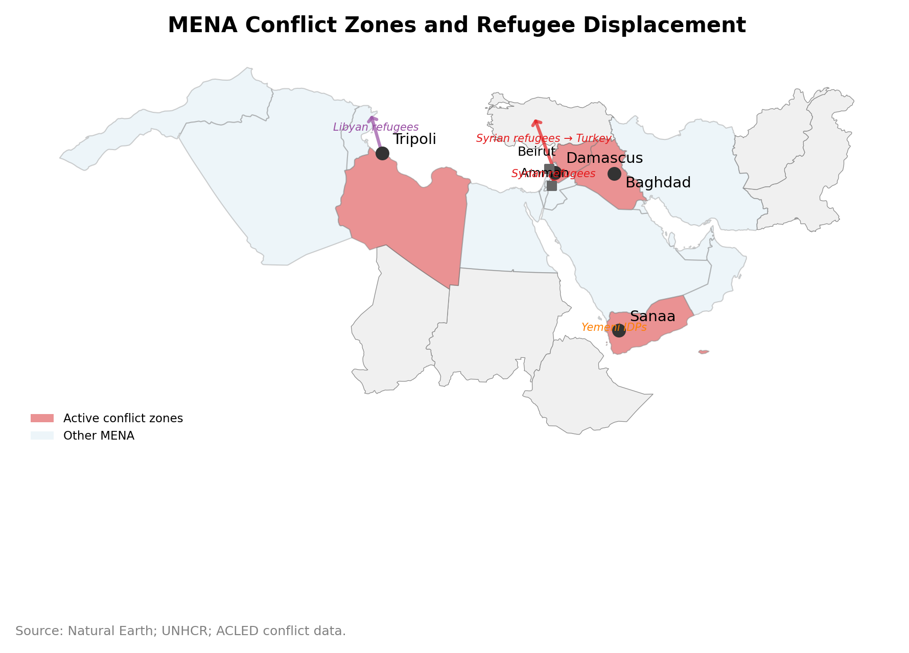

# Chapter 12: Fragile States and Conflict Economics

*Source: Natural Earth; UNHCR; ACLED conflict data.*

---

## Introduction: When Institutions Collapse

In March 2011, Syria's GDP per capita, measured in constant 2015 dollars, was approximately $2,800 (World Bank WDI, accessed 2024) -- comparable to Egypt or the Philippines. By 2015, the economy had contracted by an estimated 60 percent (World Bank 2017), roughly six million Syrians had fled the country, another six million were internally displaced, and the national statistical office had effectively ceased to function. Cities -- Aleppo, Homs, Raqqa, Deir ez-Zor -- were physically devastated. But the deeper destruction was institutional: the bureaucratic apparatus for collecting taxes, enforcing contracts, operating courts, maintaining public health, and producing the economic statistics that make governance possible had been shattered.

Syria is not alone. Yemen's GDP fell by approximately 50 percent between 2014 and 2020 (World Bank 2022); by 2023, an estimated 21.6 million Yemenis required humanitarian assistance (OCHA 2023). Libya's output oscillates not with the business cycle but with the physical control of oil facilities. Standard macroeconomic frameworks have almost nothing useful to say about these economies. The tools that do illuminate them are spatial: synthetic control methods for constructing the counterfactual trajectory that conflict destroyed, gravity models that reveal how violence reconfigures trade flows, night-lights data as a proxy for economic activity when statistical offices have ceased to function.

This chapter examines what happens when Chapter 2's "institutional thickness" -- the courts, registries, banking relationships, and regulatory agencies that constitute the invisible infrastructure of a functioning economy -- is destroyed in months. The consequences are spatial because conflict is spatial: it displaces populations along geographic corridors, destroys infrastructure in specific locations, redraws functional borders, and creates new economic patterns -- smuggling, aid distribution, refugee economies -- that follow the geography of violence rather than the geography of comparative advantage.

---

## 12.1 The Collapse of Institutional Thickness


**The Conflict Trap.** Coined by Collier (2003), the conflict trap describes the self-reinforcing cycle in which poverty increases the risk of civil conflict, conflict destroys economic capacity and deepens poverty, and post-conflict economies face elevated risk of relapse into violence. Approximately 40 percent of post-conflict countries return to conflict within a decade. The trap operates through dis-agglomeration: conflict disperses the talent, capital, and institutional capacity that agglomeration concentrates, and once these fall below a critical threshold, recovery becomes self-defeating.


### How Conflict Destroys Economic Institutions

The institutional destruction wrought by conflict operates through multiple channels, each with distinct spatial characteristics. Physical destruction — the bombing of government buildings, courts, schools, hospitals, power plants, telecommunications infrastructure — eliminates the physical facilities through which institutions operate. But physical reconstruction is the easier part of institutional recovery; the harder part is reconstituting the human capital, organizational knowledge, and social trust that made the institutions function.

**Brain drain and human capital flight.** Conflict triggers the emigration of precisely the professionals — doctors, engineers, teachers, accountants, lawyers, civil servants — whose skills constitute the human infrastructure of institutional thickness. Syria's medical sector illustrates the scale: before the conflict, Syria had approximately 30,000 registered physicians; by 2016, an estimated 15,000 had left the country (WHO 2017). The spatial economics of this flight are non-random: professionals emigrate to specific destinations based on existing diaspora networks, linguistic compatibility, credential-recognition pathways, and immigration policy. Syrian engineers disproportionately moved to Germany, which established accelerated qualification-recognition procedures under the 2012 Recognition Act and whose manufacturing economy valued Arabic-speaking technical talent; Syrian doctors migrated to Gulf states — Saudi Arabia, the UAE, Kuwait — where higher salaries, Arabic as the working language, and streamlined medical licensing made entry comparatively easy; Syrian teachers gravitated toward Turkey and Jordan, where international organizations operating refugee education programs (UNICEF, the Norwegian Refugee Council, Turkish NGOs) hired Arabic-speaking educators to staff camp and community schools. Each corridor drained a specific professional class from specific Syrian cities, and the receiving cities gained human capital that was precisely calibrated to their absorptive capacity.

Syria's brain drain was not without precedent in the region. Iraq's 2003 invasion and subsequent sectarian violence dispersed a generation of academics, engineers, and technocrats: an estimated 40 percent of Iraq's professional class left the country between 2003 and 2008 (Sassoon 2009). Iraqi nuclear scientists resettled in Jordan, petroleum engineers took positions in the Gulf, and university professors scattered across Amman, Damascus, and Cairo — an irony, given that Damascus would itself become an exporter of professionals within a decade. The Iraqi precedent illustrates the compounding nature of regional brain drain: when the same region experiences sequential conflicts, the cumulative loss of human capital across multiple countries hollows out the institutional capacity of the entire neighborhood.

The receiving cities gain human capital; the origin cities lose it permanently, because the professionals who rebuild their careers and families abroad are unlikely to return even if the conflict ends.

**Contract enforcement collapse.** Economic activity depends on the expectation that contracts will be honored and that disputes can be resolved through predictable institutional mechanisms. When courts cease to function, when judges flee or are killed, when property records are destroyed or contested by competing authorities, the institutional foundation for market transactions disappears. Aleppo's textile industry provides a vivid illustration. Before 2011, Aleppo was the center of Syria's garment and textile sector — a $2 billion export industry (World Bank 2011) that supplied European fast-fashion brands, including through subcontracting relationships with Turkish intermediaries. The city's eastern industrial districts housed thousands of small and medium workshops, and the supply chains connecting Aleppo's weavers to retailers in Milan and London depended on enforceable contracts, reliable shipping, and predictable customs clearance. By 2013, eastern Aleppo was a battleground: factories were destroyed by barrel bombs, looted by armed groups on both sides, or simply abandoned as owners and workers fled. The machinery that survived was in many cases dismantled and transported — sometimes by the factory owners themselves, sometimes by looters — across the border to Gaziantep, Turkey, where Syrian entrepreneurs restarted production. Gaziantep's organized industrial zones absorbed hundreds of Syrian-owned textile firms, many of which resumed supplying the same European buyers they had served from Aleppo, now routing shipments through Turkish customs rather than Syrian ones. The spatial relocation of an entire industrial cluster — from Aleppo to Gaziantep, a distance of roughly 100 kilometers — is a case study in how conflict does not merely destroy economic activity but relocates it, transferring agglomeration economies from one jurisdiction to another. The connection to Chapter 6's analysis of supply chain disruption in East Asia is direct: just as geopolitical tensions reshuffled semiconductor supply chains across the Taiwan Strait, armed conflict reshuffled textile supply chains across the Syrian-Turkish border.

The spatial consequence is the fragmentation of the national economy into zones controlled by different authorities — government-held areas, rebel-held areas, areas under the control of foreign powers or non-state actors — each with its own (often informal and unpredictable) mechanisms for enforcing agreements.

**Statistical infrastructure collapse.** The production of economic statistics — national accounts, price indices, trade data, employment surveys, population censuses — requires a functioning bureaucratic apparatus: trained statisticians, survey infrastructure, sampling frames, computational capacity, and the political authority to compel reporting. When this apparatus collapses, the economy becomes unmeasurable by conventional means, creating a data vacuum that impedes both governance and external analysis. The spatial data challenge box in Chapter 11 introduced this problem; this chapter confronts it directly as a defining feature of fragile-state economics.

### Fragmentation of the National Economic Space

Civil conflict fragments what was previously a single national economic space into multiple, partially isolated economic zones. The fragmentation follows the geography of military control: areas controlled by the government, areas controlled by opposition forces, areas contested between them, and areas (in some conflicts) controlled by international forces or peacekeepers. Each zone develops its own economic characteristics.

In Syria, the fragmentation created at least four distinct economic zones by 2016: government-held western Syria (Damascus, Latakia, Tartus), where the formal economy continued to function at a reduced level; Kurdish-controlled northeastern Syria, where the Autonomous Administration of North and East Syria operated a semi-independent economy; opposition-held areas in Idlib and parts of Aleppo province, where local councils and international aid organizations provided basic governance; and ISIS-controlled areas in the east, where a fundamentally different economic model — based on oil smuggling, taxation of populations, and looting — operated.

The borders between these zones were not the official international borders of Syria; they were fluid frontlines that shifted with military operations. But they functioned as economic borders: they impeded the movement of goods and people, created price differentials between zones (the price of bread in Idlib was several times higher than in Damascus), and generated smuggling economies that operated at the intersection of zones. The gravity model of Chapter 3-B applies: trade between zones declined as the effective "distance" (measured in institutional friction, physical danger, and checkpoint delays) increased, even if the geographic distance was trivial.

Syria's fragmentation has parallels across the region. Yemen by 2017 had two competing central banks: the internationally recognized government relocated the Central Bank of Yemen to Aden, while the Houthi authorities in Sana'a continued to operate their own monetary authority. The two institutions issued rival banknotes — the Aden government printed new currency with assistance from a Russian mint, while the Sana'a authority declared the new notes illegal. The result was a dual-currency economy with fluctuating exchange rates between Houthi-controlled and government-controlled zones, a spatial monetary fragmentation unprecedented in modern MENA history. Libya experienced a comparable split in oil governance: the internationally recognized government in Tripoli and the rival administration in the east each claimed authority over oil exports, with the National Oil Corporation caught between them and individual oil facilities switching allegiance (or being seized) as military control shifted.

These fragmentations are not aberrations; they are the predictable spatial manifestation of what Keen (1998) calls "war economies" — self-sustaining economic systems in which armed groups have material incentives to perpetuate violence rather than resolve it. When a militia controls a border crossing and collects customs duties, when a warlord taxes oil smuggling routes, when a checkpoint commander extracts fees from commercial traffic, the conflict itself becomes an income-generating enterprise. The economic geography of violence then reflects not military strategy but revenue geography: armed groups fight over the locations — border crossings, oil fields, ports, major roads — that generate extractable rents. Peace threatens these revenue streams, which is why Keen argues that "ending a war is not simply a matter of bringing people to the negotiating table" but of restructuring the economic incentives that make war profitable.

**Property rights destruction.** Among the most enduring legacies of conflict is the destruction of property rights — the legal infrastructure that establishes who owns what. In Syria, land registries in many districts were maintained as Ottoman-era paper records that had never been digitized; when registry offices were bombed or burned, the documentary basis for property ownership was lost entirely. Iraq's de-Baathification program after 2003 reshuffled property rights by dispossessing former regime affiliates, creating layers of competing claims that courts are still adjudicating two decades later. ISIS imposed its own property regime in areas it controlled, confiscating homes and businesses belonging to religious minorities, "redistributing" them to fighters and loyalists, and issuing its own title documents — documents that post-liberation authorities do not recognize but that current occupants nonetheless invoke. The consequence for post-conflict recovery is severe: property restitution becomes a binding constraint on return migration, because displaced families will not return to communities where their homes have been occupied by strangers with competing claims and where no functioning court exists to adjudicate disputes. The spatial economics of reconstruction cannot proceed until the spatial economics of ownership are resolved — a process that, as the Palestinian and Bosnian cases demonstrate, can take generations.

---

## 12.2 Conflict as Spatial Shock: Displacement, Borders, and Remittances

### The Geography of Displacement

Armed conflict is the world's largest generator of forced displacement. The United Nations High Commissioner for Refugees (UNHCR) estimated that at the end of 2023, approximately 117 million people worldwide were forcibly displaced — including 37 million refugees who had crossed an international border and 62 million internally displaced persons (UNHCR 2024) (IDPs) who had been uprooted within their own countries. The MENA region accounted for a disproportionate share: Syria (6.5 million refugees, 6.8 million IDPs), Yemen (4.5 million IDPs), Iraq (1.2 million IDPs) (UNHCR 2024), Libya (displaced populations of uncertain size), and Sudan (which by 2024 had generated the world's largest displacement crisis).

Displacement is a spatial economic event with measurable consequences for both origin and destination communities. In the origin community, displacement removes population, labor, and consumer demand — sometimes permanently, as in the depopulation of eastern Aleppo, the destruction of Raqqa, or the emptying of entire villages in Darfur. The spatial pattern of depopulation is not random: urban areas with strategic significance experience the most intense destruction and the largest outflows, while remote rural areas may be bypassed by the conflict entirely. Sudan, which erupted into civil war in April 2023, illustrates the velocity at which displacement can reshape economic geography: within eighteen months, an estimated 10 million people had been displaced — roughly 20 percent of the population (UNHCR 2024) — making it the world's largest displacement crisis and emptying Khartoum, the country's economic center and seat of what remained of its institutional apparatus, of much of its population.

In destination communities — the cities and camps where displaced populations concentrate — the economic effects are complex and contested. The short-run effects are typically negative: displaced populations increase demand for housing, healthcare, education, and basic services, straining local capacity and generating host-community resentment. The empirical evidence on labor market effects is more nuanced than popular discourse suggests. Tumen (2016) finds that Syrian refugees in Turkey displaced informal Turkish workers from low-wage jobs but had negligible effects on formal-sector wages; Del Carpio and Wagner (2015) find that the refugee inflow actually increased Turkish formal employment by pushing Turkish workers up the occupational ladder. The effects are spatially heterogeneous: border provinces (Gaziantep, Kilis, Hatay) experienced larger labor market adjustments than interior cities, and the adjustment mechanism — whether displaced workers are complements or substitutes for native workers — depends on local sectoral composition and skill distributions.

Refugee camps (Za'atari in Jordan, Dadaab in Kenya, Cox's Bazar in Bangladesh) create instant urban agglomerations that function as informal economies — with shops, restaurants, markets, and service providers operating within the camp — but without the institutional infrastructure of a formal city.

The longer-run effects depend on policy and institutional context. Turkey's experience is the most extensively studied large-scale refugee hosting in the modern era. With approximately 3.6 million Syrians under its Under Temporary Protection (UTP) framework (UNHCR 2023) — a legal status created in 2014 that grants access to healthcare, education, and (from 2016) work permits — Turkey is the world's largest refugee-hosting country in absolute terms. The UTP framework stopped short of granting formal refugee status under the 1951 Convention (Turkey maintains a geographic limitation that restricts Convention refugee status to Europeans) but provided a pragmatic alternative that balanced humanitarian obligation against domestic political constraints. The economic consequences have been substantial and spatially concentrated. By 2020, Syrians had established approximately 15,000 formally registered businesses in Turkey (TEPAV 2020), concentrated in Istanbul, Gaziantep, Mersin, and Hatay — the cities with the largest Syrian populations. These firms employed both Syrians and Turkish workers, generated tax revenue, and connected Turkish manufacturing to Syrian and broader Arab markets.


**Key Finding: Conflict Relocates Agglomeration.** The Aleppo-to-Gaziantep textile corridor demonstrates that conflict does not merely destroy economic activity — it spatially relocates it. Syrian factory owners dismantled machinery, transported it 100 km across the border, and resumed production for the same European buyers. Gaziantep absorbed an entire industrial cluster, gaining the agglomeration economies (labor pooling, supplier networks, knowledge spillovers) that Aleppo lost.


Gaziantep deserves particular attention as a spatial economic case study. Before 2011, Gaziantep was already a prosperous industrial city with extensive cross-border trade with Aleppo — the two cities are separated by roughly 100 kilometers and had complementary specializations (Gaziantep in food processing and machinery, Aleppo in textiles and garments). The conflict severed the cross-border trade relationship but delivered to Gaziantep a population of over 500,000 Syrians, including factory owners, skilled workers, and entrepreneurs who had operated the very industries that Gaziantep had previously traded with. The result was a remarkable spatial recomposition: rather than trading with Aleppo's factories, Gaziantep absorbed them. Syrian-owned textile firms relocated machinery from Aleppo to Gaziantep's organized industrial zones, hired Syrian workers at wages below Turkish market rates, and resumed production for both Turkish domestic consumption and export — including, eventually, to reconstruction-oriented demand in regime-held Syria. The city's industrial output grew, its population surged, and its economic geography was permanently altered by the forced agglomeration of Syrian entrepreneurial capital.

Jordan pursued a different model. The Za'atari refugee camp, established in 2012 in the northern desert, grew within a year to a population that peaked at approximately 120,000 (UNHCR 2013) — briefly making it Jordan's fourth-largest city. Za'atari developed an elaborate informal economy: over 3,000 shops lined its main commercial thoroughfare, dubbed the "Champs-Élysées" by residents, selling everything from mobile phones to wedding dresses. The camp had its own electricity grid (initially improvised from generators, later formalized with international assistance), schools, medical clinics, and a spatial structure that residents organized by neighborhood of origin in Syria. But Za'atari's economy remained fundamentally constrained by its camp status: residents could not legally leave to work, businesses could not formally export, and the infrastructure — while impressive for a camp — could not support the industrial activity that Gaziantep's Syrian firms achieved. The Jordan Compact of 2016 attempted to address this constraint: the EU offered Jordan preferential trade access for goods produced in designated economic zones employing a minimum percentage of Syrian refugees, explicitly linking refugee policy to trade policy. The Compact was conceptually innovative — it recognized refugees as potential economic contributors rather than purely humanitarian burdens — but implementation was slow, and by 2020 only a fraction of the envisioned refugee work permits had been issued.

Lebanon represents the extreme case. With an estimated 1.5 million Syrians in a country of 4.5 million (UNHCR 2023) — Syrians constituted roughly 25 percent of the pre-crisis population — Lebanon chose neither Turkey's formalized integration nor Jordan's camp-based containment. The Lebanese government refused to establish formal refugee camps, leaving Syrians dispersed across urban areas, agricultural regions (particularly the Bekaa Valley), and informal tented settlements. Without legal work authorization, most Syrians entered Lebanon's large informal economy, competing with low-wage Lebanese workers in construction, agriculture, and services. The fiscal burden of hosting — increased demand for water, electricity, schools, healthcare — fell on a state whose institutional capacity was already eroding, contributing to the economic pressures that culminated in Lebanon's financial collapse beginning in October 2019. Lebanon's experience demonstrates that the spatial economics of displacement cannot be analyzed in isolation from the institutional economics of the host country: a fragile host absorbing a massive displaced population may itself become fragile.

### Diaspora Remittances as Spatial Lifeline

For conflict-affected populations, diaspora remittances often become the primary economic connection to the global economy — more important than trade, investment, or aid. The World Bank estimated that remittance flows to fragile and conflict-affected states exceeded $60 billion in 2023 (World Bank 2023), though the true figure is substantially higher because informal transfer mechanisms (hawala networks, hand-carried cash, cryptocurrency) are not captured in official statistics.

The spatial economics of remittances are distinctive. Remittances flow from specific diaspora concentrations (Somalis in Minneapolis, Syrians in Berlin, Yemenis in Dearborn) to specific origin communities (not to the country as a whole, but to the villages, neighborhoods, and families from which the emigrants departed). The flows are highly targeted: a Somali family in Minneapolis sends money to a specific relative in Mogadishu, who uses it to pay rent, buy food, cover school fees, and — in many cases — to fund a small business. The aggregate effect of millions of such targeted transfers is a spatial pattern of remittance income that reflects the pre-conflict geography of emigration rather than the post-conflict geography of need.

The Somalia corridor illustrates the macroeconomic significance of these flows. Somalia receives an estimated $1.6 billion in annual remittances — equivalent to roughly 25–30 percent of GDP — making diaspora transfers the country's single largest source of foreign exchange, exceeding exports, foreign direct investment, and official development assistance combined (World Bank 2022). The flows originate primarily from Somali communities in the United States (Minneapolis, Columbus, Seattle), the United Kingdom (London, Bristol, Manchester), and the Gulf states (UAE, Saudi Arabia), and are channeled through a handful of Somali-owned money transfer operators — Dahabshiil, Amal Express, Taaj — that serve as the financial infrastructure of a country whose formal banking system barely functions. These remittances are not merely consumption support; they finance livestock purchases, small-scale trade, school fees, and urban real estate — the building blocks of whatever economic normalcy Somalia possesses.

But this lifeline is under regulatory threat. The post-9/11 intensification of anti-money-laundering and counter-terrorism financing (AML/CTF) regulations has led Western banks to "de-risk" by closing correspondent banking relationships with remittance operators that serve conflict-affected countries. Between 2012 and 2015, Barclays, HSBC, and several other major banks terminated the accounts of Somali and other remittance companies, threatening to sever the financial connection between diasporas and their origin communities entirely. The logic is perversely spatial: the same conflict that creates the need for remittances also creates the regulatory perception that remittance corridors are high-risk for illicit finance, and the regulatory response — cutting off formal channels — pushes transfers into informal and untraceable mechanisms that are, ironically, more difficult to monitor. Mobile money has emerged as a partial technological solution, particularly in East Africa: Somalia's own mobile money ecosystem (EVC Plus, operated by Hormuud Telecom) processes an estimated $2.7 billion in annual transactions, and the cross-reference to Chapter 13's analysis of M-Pesa in Kenya illustrates how mobile payment infrastructure can substitute for absent formal banking in fragile-state contexts.

Hawala networks — informal money transfer systems that operate through trust relationships between brokers in different locations — are the dominant mechanism for remittance delivery in many conflict-affected economies. The spatial economics of hawala are fascinating: the network's geography follows diaspora settlement patterns, creating dense connectivity between specific diaspora cities and specific origin communities, while leaving areas with smaller diaspora populations less well-connected. A Somali town with many emigrants in the UK receives more and cheaper remittance services than a town whose emigrants are scattered across multiple small diaspora communities — a network effect that reinforces existing inequalities.

---

## 12.3 Human Capital, Youth Bulges, and Spatial Mismatch


**Youth Bulge and Instability.** The MENA region's youth bulge — approximately 30 percent of the population aged 15-29, with youth unemployment rates exceeding 25 percent region-wide and 50 percent in some countries — is not merely a labor market problem but a spatial mismatch: educated young people are concentrated in locations (secondary cities, peripheral towns) where no labor market exists to absorb them, while the barriers to internal migration (housing costs, weak networks, credential non-recognition) prevent spatial reallocation. The Arab Spring was, in part, the political combustion of this mismatch.


### The Youth Bulge as Spatial Economic Challenge

The MENA region has one of the highest youth population shares in the world: approximately 30 percent of the population is between 15 and 29 years old (World Bank 2024), and youth unemployment rates routinely exceed 25 percent (ILO 2023) — reaching 50 percent or more in countries like Tunisia, Jordan, and the Palestinian territories. The "youth bulge" — the demographic surge of working-age young people produced by decades of high fertility rates that have only recently begun to decline — is a spatial economic challenge because the youth are concentrated in locations that do not have the economic activity to absorb them.

The spatial mismatch operates at multiple scales. At the national scale, young people are concentrated in countries (Egypt, Iraq, Yemen, the Palestinian territories) with weak private sectors, bloated public sectors, and limited capacity to create formal employment. At the sub-national scale, young people within these countries are concentrated in secondary cities and towns where educational attainment is rising (thanks to expanded access to schooling) but where the local economy offers no jobs that match their qualifications. The university-educated young person in Sidi Bouzid (the Tunisian town where the Arab Spring began) has credentials but no local labor market in which to deploy them — and the barriers to internal migration (housing costs in the capital, weak social networks, credential non-recognition) prevent the spatial reallocation that a well-functioning labor market would produce.

The Arab Spring itself was the political combustion of this spatial mismatch. Mohamed Bouazizi, the Tunisian street vendor whose self-immolation on December 17, 2010 triggered region-wide protests, was not an illiterate laborer but a university graduate who had been unable to find employment commensurate with his qualifications and had resorted to selling vegetables from an unlicensed cart — a cart that municipal officials confiscated, reportedly after he could not pay the expected bribe. His death in Sidi Bouzid, a town in Tunisia's impoverished interior that the coastal economic boom had bypassed, catalyzed protests precisely because his story resonated with millions of educated young people across the region who faced the same structural exclusion: credentials acquired through expanding educational systems, but no productive economy to absorb them.

Egypt exemplifies the scale. Approximately 700,000 university graduates enter the Egyptian labor market annually, but the private sector — concentrated in Cairo, Alexandria, and the Suez Canal zone — generates nowhere near enough formal jobs to absorb them (Assaad 2014). The public sector, which under Nasser's social contract guaranteed employment to every university graduate, can no longer do so: the state payroll is already bloated and fiscally unsustainable. The spatial mismatch is acute in Upper Egypt, where youth unemployment rates exceed 40 percent (ILO 2023) and where the nearest labor markets offering graduate-level employment are in Cairo, 500 or more kilometers to the north. Internal migration is constrained by the prohibitive cost of Cairo housing, by social norms that discourage unmarried women from living alone in distant cities, and by the informal networks (wasta) that govern access to formal employment — networks that are spatially concentrated in the capital and its suburbs.

### Education Disruption and the Lost Generation

Conflict disrupts education with spatial precision. Schools in active conflict zones are destroyed, commandeered as military positions, or simply empty as families flee. UNICEF estimated that in 2023, approximately 12 million children across the MENA region were out of school due to conflict (UNICEF 2023), displacement, or economic collapse. The spatial pattern of education disruption follows the geography of conflict: children in government-controlled Damascus can attend school (with reduced quality); children in Idlib face intermittent school closures due to bombing; children in camp settings receive education through NGO-run programs of variable quality; and children in areas controlled by non-state armed groups may receive no education at all, or education that is ideologically rather than academically oriented.

The Syrian case is the most documented. UNICEF estimated that 2.4 million Syrian children were out of school at the height of the crisis (UNICEF 2016), with enrollment rates in some opposition-held areas falling below 30 percent. Refugee children face a "double disadvantage": their schooling has already been disrupted by the conflict itself (months or years of missed instruction, often compounded by psychological trauma), and they now confront a language barrier in host countries where instruction is conducted in Turkish, German, or French rather than Arabic. In Turkey, where the government commendably established Temporary Education Centers offering Arabic-language instruction, transition rates to Turkish public schools have been slow — by 2019, only about 63 percent of Syrian children of school age in Turkey were enrolled in any form of education (UNICEF 2019). In Lebanon, where the public school system adopted a double-shift model (Lebanese students in the morning, Syrian students in the afternoon), resource constraints and teacher shortages have undermined quality in both shifts.

The economic cost of this human capital destruction can be estimated, at least in order of magnitude. Psacharopoulos and Patrinos (2018) estimate global average returns to schooling at approximately 9 percent per year of education — that is, each additional year of schooling increases lifetime earnings by roughly 9 percent. Apply this estimate to a cohort of 2.4 million Syrian children who have lost, conservatively, five years of schooling, and the lifetime earnings loss for this single cohort exceeds $10 billion in present-value terms — a figure that dwarfs the cost of the educational programs that could have prevented it. The calculation is crude, but the order of magnitude is robust, and it does not account for the spillover effects: lower human capital in one generation reduces the human capital investment in the next (because less-educated parents invest less in their children's education), creating a dynastic poverty trap with spatial dimensions.

The long-run spatial consequences of education disruption are severe. Human capital is the foundation of the agglomeration economies described in Chapter 1: knowledge spillovers, labor market pooling, and innovation all depend on a workforce with adequate education and skills. A generation of children who miss five, eight, or twelve years of schooling — the "lost generation" — will lack the human capital needed to participate in the knowledge economy, even if peace is restored and physical infrastructure is rebuilt. The spatial implication is that conflict-affected regions will be trapped in low-skill, low-productivity equilibria for decades after the fighting ends, because the human capital destruction is slower to reverse than the physical destruction.

*Source: Author's calculations based on UNHCR Global Trends (2023) and IDMC GRID (2023).*

---

## 12.4 The Climate-Conflict Nexus

### Water, Agriculture, and the Spatial Origins of Violence

The relationship between climate stress and armed conflict has been extensively debated in the political science and climate science literatures, with a growing body of evidence supporting the hypothesis that environmental degradation — particularly water scarcity, agricultural failure, and extreme heat — increases the probability of conflict, especially in societies with weak institutions and pre-existing political grievances.

The Syrian case has been cited as the most prominent evidence for the climate-conflict hypothesis, and the key reference is Kelley et al. (2015), whose study in the Proceedings of the National Academy of Sciences traced the causal chain from anthropogenic climate change through drought to agricultural collapse to internal migration to political instability. Between 2006 and 2010, Syria experienced the worst drought in its instrumental record — a multi-year event that Kelley et al. linked, using climate modeling, to the long-term drying trend in the eastern Mediterranean that is attributable to human greenhouse gas emissions. The agricultural consequences were devastating, particularly in the Jazira — the northeastern breadbasket region spanning Hasakah, Raqqa, and Deir ez-Zor provinces that produced most of Syria's wheat and barley. Wheat production in the affected areas fell by approximately 50 percent (Kelley et al. 2015); rain-fed agriculture, which sustained hundreds of thousands of smallholder families, effectively ceased. The livestock sector collapsed: an estimated 85 percent of livestock in the worst-affected areas perished or were sold at distress prices (Kelley et al. 2015), wiping out the accumulated capital of pastoral communities. An estimated 1.5 million people (Kelley et al. 2015) — predominantly small-scale farmers, herders, and agricultural laborers — abandoned their land and migrated to the urban periphery of Damascus (particularly Douma and the towns of Eastern Ghouta), Daraa, Aleppo, Homs, and Deir ez-Zor city, joining informal settlements on the margins of cities that were already struggling with inadequate housing, unemployment, and crumbling public services. The drought did not cause the uprising that began in 2011, which had political roots in decades of authoritarian governance and specific grievances about corruption and repression. But the spatial concentration of economically desperate, recently displaced rural populations on the margins of overcrowded cities created the social conditions in which political grievances could mobilize rapidly. It is not coincidental that Daraa, where the first major protests erupted in March 2011, was among the cities that had absorbed large drought-displaced populations.

Lake Chad illustrates the same nexus at a different spatial scale. The lake — shared by Chad, Nigeria, Niger, and Cameroon — shrank from approximately 25,000 square kilometers in the 1960s to roughly 1,350 square kilometers by the 2010s (UNEP 2018), a 95 percent reduction that ranks among the most dramatic environmental collapses of the modern era. An estimated 30 million people (UNEP 2018) depend on the Lake Chad basin for fishing, farming, and pastoralism, and the shrinkage has displaced hundreds of thousands, destroyed livelihoods, and intensified competition for diminishing resources. The security consequence has been measurable: Boko Haram and its splinter faction, the Islamic State West Africa Province (ISWAP), have recruited heavily from communities around the lake's receding shores, where unemployed young men with no economic prospects are offered salaries, purpose, and identity by armed groups. The spatial pattern of recruitment maps onto the spatial pattern of environmental loss — the most degraded areas produce the most recruits — a correlation that does not prove causation but that is consistent with the grievance-exploitation mechanism.

Yemen adds yet another dimension: water scarcity not as a recent climate shock but as a chronic structural condition. Sana'a, Yemen's capital, may become the first national capital in the world to exhaust its groundwater reserves — the aquifer beneath the city is being depleted at roughly five times its recharge rate. Across Yemen, qat cultivation — the mildly narcotic leaf that is central to Yemeni social life — consumes an estimated 40 percent of all irrigation water, diverting resources from food crops in a country that imports 90 percent of its wheat (World Bank 2024). The conflict has prevented any coordinated response to the water crisis, and the water crisis in turn deepens the conflict by making agricultural livelihoods unsustainable in rural areas, driving migration to cities where services have already collapsed.

The policy and security establishments have converged on what the US Department of Defense and the EU Global Strategy both call the "threat multiplier" framing: climate change does not cause conflict directly, but it amplifies existing grievances by intensifying resource competition, undermining agricultural livelihoods, and straining the institutional capacity of states that are already fragile. The spatial economics implication is that climate adaptation and conflict prevention are not separate policy domains but a single analytical challenge — one that the spatial methods of this book (gravity models for migration flows, spatial econometrics for spillover effects, synthetic control for counterfactual estimation) are uniquely equipped to address.

The climate-conflict nexus has spatial implications beyond the initial trigger. Climate stress in the Sahel — the semi-arid belt stretching from Senegal to Eritrea — has contributed to pastoral-farmer conflicts (as shrinking grazing land forces herders into agricultural areas), to the southward migration of populations from the arid north to the more productive south, and to the expansion of armed groups that exploit environmental grievances to recruit fighters. The spatial pattern is one of cascading displacement: climate stress displaces rural populations, who move to towns and cities, which lack the institutional capacity and economic activity to absorb them, creating the social instability that armed groups exploit. Burke, Hsiang, and Miguel (2015), in a meta-analysis covering 55 studies, estimate that each one-standard-deviation increase in temperature is associated with a 14 percent increase in intergroup conflict — an effect size large enough, if the relationship is causal, to imply significant increases in conflict risk as global temperatures rise over the coming decades.

### The Spatial Economics of Climate Adaptation in Fragile States

The cruel irony of the climate-conflict nexus is that the states most vulnerable to climate stress are also the least equipped to adapt. Climate adaptation — building drought-resistant infrastructure, diversifying water sources, developing heat-tolerant crop varieties, constructing sea walls, redesigning urban areas for extreme heat — requires institutional capacity, financial resources, and long-term planning. Fragile states, by definition, lack all three.

The spatial dimension of this adaptation deficit is stark. Wealthy, institutionally strong states (the Gulf countries, Israel, Australia) can invest in desalination, water recycling, and precision agriculture to manage scarcity. Poor, institutionally fragile states (Yemen, Somalia, South Sudan, Chad) cannot, and their populations face the unmediated impact of climate change — crop failure, water shortage, heat stress, flooding — without the institutional buffers that convert a climate event into a manageable challenge rather than a humanitarian catastrophe. The adaptation gap is measurable: the UN Environment Programme estimates that developing countries need $140-300 billion per year in climate adaptation financing by 2030, but actual flows are approximately $20 billion (UNEP 2023) — and the fragile states that need adaptation most urgently receive the least, because donors perceive them as too risky and too institutionally weak to manage adaptation investments effectively.

The spatial economics of this adaptation failure are compounding. When a drought strikes a well-governed state — Israel, for instance, or Jordan before its fiscal crisis — the state can mobilize emergency food distribution, activate social safety nets, and invest in long-term water infrastructure (Israel's national water carrier, its desalination plants along the Mediterranean coast). When the same drought strikes a fragile state, the government cannot respond, populations self-organize through displacement, and the displacement itself further weakens the state's capacity. The result is a ratchet effect: each climate shock leaves the fragile state weaker than before, reducing its capacity to withstand the next shock and increasing the probability that the next shock triggers conflict. This ratchet mechanism helps explain why fragile states in climate-vulnerable regions tend to experience not single conflicts but cycles of conflict — a pattern that conventional economic models, which assume that institutions are exogenous and stable, are poorly equipped to explain.

---

## 12.5 Lab 5 and the Cost of Conflict


**Synthetic Control Method (SCM).** Developed by Abadie and Gardeazabal (2003), the synthetic control constructs a counterfactual version of a treated unit (e.g., Syria without conflict) as a weighted combination of untreated donor units whose pre-treatment trajectories closely match the treated unit. The gap between the synthetic control and the actual post-treatment outcome estimates the causal effect. For conflict economics, SCM answers the question: "How much GDP did the war destroy?" by comparing observed outcomes against the trajectory the country would plausibly have followed in peace.


Lab 5's synthetic control methodology provides the framework for estimating what fragile-state economies would have looked like without conflict. The connection to this chapter is direct: the economic cost of conflict is measured as the gap between the actual trajectory and the counterfactual trajectory that the synthetic control constructs.

**The methodological challenge.** Constructing a synthetic control for a conflict-affected country requires finding a weighted combination of donor countries that closely matches the treated country's pre-conflict economic trajectory. For MENA fragile states, this is difficult because (a) the pre-conflict data may be of low quality (as discussed in the spatial data challenge above), (b) the donor pool of comparable non-conflict MENA countries is small (Jordan, Tunisia, Morocco, and the Gulf states are the main candidates, but they differ substantially in economic structure), and (c) the conflict itself may have been partly caused by the same economic factors (poverty, inequality, unemployment) that the model uses as matching variables, creating endogeneity concerns.

**The findings from the literature.** Existing synthetic control studies estimate that the Syrian conflict reduced GDP by approximately 60–70 percent relative to the no-conflict counterfactual by 2016 (Hinnebusch 2018, various IMF and World Bank estimates). The Yemen conflict is estimated to have reduced GDP by approximately 50 percent by 2020. The Libyan conflict's economic impact is more difficult to estimate because Libya's pre-conflict economy was dominated by oil production that fluctuated with global prices, making it hard to separate the conflict effect from the commodity price effect.

**The donor pool problem for MENA.** Abadie, Diamond, and Hainmueller (2010) emphasize that the synthetic control method works best when the donor pool contains units that are "similar" to the treated unit in observable characteristics. For MENA fragile states, this requirement is hard to satisfy. The pool of non-conflict MENA countries is small — Jordan, Tunisia, Morocco, Oman, and the Gulf states are the principal candidates — and each differs from the treated countries in ways that may contaminate the synthetic control. Gulf economies are oil-dependent rentier states with per capita incomes ten times higher than Yemen's; Tunisia and Morocco have Mediterranean economies oriented toward Europe; Jordan is itself affected by spillovers from the Syrian conflict. Expanding the donor pool to include non-MENA comparators (the Philippines, Colombia, Sri Lanka) introduces geographic and institutional heterogeneity that may violate the assumption that the donor countries would have followed similar trajectories in the absence of treatment. Lab 5 asks students to systematically explore how their estimates change as the donor pool is expanded, contracted, or reweighted — an exercise in understanding how sensitive causal inference is to researcher discretion.


**Night-Lights as Economic Proxy.** When statistical offices cease to function, satellite-measured night-light intensity (from VIIRS or DMSP sensors) serves as a proxy for economic activity. Henderson, Storeygard, and Weil (2012) demonstrated that changes in night-light intensity are strongly correlated with GDP growth, particularly in countries with low-quality national accounts. For conflict zones like Syria, Idlib, or Houthi-controlled Yemen where no GDP data exists, night-lights may be the only available indicator of economic conditions on the ground.


**Night-lights validation.** A promising extension, explored in Lab 5's advanced exercises, uses VIIRS night-lights data to validate synthetic control GDP estimates for conflict zones where official GDP data is unavailable or unreliable. The logic is straightforward: if the synthetic control estimates that Syria's GDP should have been $$X in 2016 but was actually $$Y, and night-lights data (calibrated from countries with reliable GDP data) independently suggests economic activity consistent with $$Y rather than $$X, the two sources triangulate to increase confidence in the conflict-cost estimate. For zones where no GDP data exists at all — Idlib, Raqqa, Houthi-controlled Yemen — night-lights may be the only available proxy for economic activity, and the synthetic control framework provides the counterfactual against which to measure the damage. Chapter 13 develops the night-lights methodology in greater detail; Lab 5 provides the first applied exercise.

**Student exercises.** Lab 5 asks students to construct their own synthetic controls, to evaluate the sensitivity of their estimates to the choice of donor pool and matching variables, and to conduct placebo tests that assess whether the estimated conflict cost is statistically distinguishable from the variation in the donor pool. The exercise develops the student's ability to work with imperfect data, to make explicit the assumptions that underlie causal inference, and to communicate uncertainty honestly — skills that are essential for anyone working on fragile-state economics.

---

## Data in Depth: Estimating Conflict Costs via Synthetic Control

**The question.** What would Syria's (or Yemen's) GDP have been in the absence of civil conflict?

**Data sources.**
- **World Bank WDI:** GDP per capita (constant 2015 USD) for MENA and comparator countries, 2000–2010 (pre-conflict period) and 2011–2023 (conflict period, where available).
- **IMF World Economic Outlook:** GDP estimates for conflict-affected countries (with caveats about data quality).
- **UNHCR:** Refugee and IDP population data, by country of origin and country of asylum.
- **ACLED (Armed Conflict Location and Event Data):** Georeferenced conflict events for spatial diffusion analysis.

**Construction.**
1. Select the treated country (e.g., Syria) and define the treatment year (2011 for Syria, 2015 for Yemen).
2. Select a donor pool of non-conflict MENA and comparator economies. For Syria, candidates include Jordan, Tunisia, Morocco, Egypt, Turkey, and potentially non-MENA comparators (Philippines, Colombia).
3. Define matching variables: pre-conflict GDP per capita, GDP growth rate, population growth, trade openness (trade as % of GDP), and sectoral composition (agriculture, industry, services as % of GDP).
4. Construct the synthetic control as a weighted combination of donor countries that minimizes the pre-treatment prediction error for the treated country's GDP trajectory.
5. Plot the treated country's actual GDP against the synthetic control's GDP from the treatment year forward. The gap is the estimated causal impact of the conflict.
6. Conduct placebo tests: apply the synthetic control to each donor country and compare the magnitude of the treated country's gap to the distribution of placebo gaps.

**Expected findings.** The synthetic control should track Syria's pre-2011 GDP trajectory closely (validating the method) and show a large divergence after 2011. The estimated cumulative GDP loss should be in the range of 200–300 percent of pre-conflict annual GDP over the first decade of conflict.

**Caveats and sensitivity.** SCM estimates are sensitive to choices that the researcher must make: which matching variables to include, what weights to assign to pre-treatment periods, which countries to admit to the donor pool, and how to handle missing data in both the treated unit and donor units. Ferman, Pinto, and Possebom (2020) demonstrate that different implementations of the Abadie method can produce substantially different estimates for the same intervention; Kaul et al. (2022) show that including all pre-treatment outcome lags as matching variables can render other covariates irrelevant. For conflict settings, an additional concern is anticipation effects: if the pre-conflict GDP trajectory was already affected by political instability, sectarian tensions, or sanctions (as in Syria during 2009-2010), the method may underestimate the true counterfactual by fitting to an already-depressed trajectory.

**Student exercise: Night-lights triangulation.** Download VIIRS annual composite night-lights data for Syria and its synthetic control donors for 2008-2020. Calculate the total light intensity within Syrian borders for each year, and compare the trajectory of light output to the GDP trajectories estimated by the synthetic control. Do the two measures agree on the timing and magnitude of economic collapse? Where they diverge, consider what might explain the discrepancy — population displacement reduces light in origin areas but increases it in destinations; military activity can produce light signatures unrelated to economic activity; and post-conflict reconstruction may restore electricity before it restores GDP. This exercise develops the student's ability to triangulate between data sources in environments where no single source is reliable.

---

## Spatial Data Challenge: When Does a Statistical Office Stop Functioning?

The standard practice in empirical economics is to treat data from national statistical offices as given — imperfect, perhaps, but produced by institutions with professional norms, quality control procedures, and a degree of independence from political interference. In fragile states, this assumption fails. The question is not just whether the data is accurate but whether the data exists at all.

The deterioration of statistical capacity follows a recognizable sequence. First, survey operations are curtailed: field enumerators cannot access conflict zones, response rates decline as populations are displaced, and sampling frames based on pre-conflict population distributions become obsolete. Second, administrative data degrades: tax records become incomplete as the formal economy contracts, customs data becomes unreliable as borders become porous, and civil registration (births, deaths, marriages) becomes sporadic as registrars flee or offices are destroyed. Third, the statistical office itself — its staff, its computational infrastructure, its institutional memory — erodes as funding is diverted to the military, as skilled statisticians emigrate, and as the political value of accurate statistics declines relative to the political value of propaganda.

The result is a data gap that standard economic analysis cannot fill. Researchers studying Syria's economy after 2011 must rely on a patchwork of sources: World Bank estimates (which acknowledge substantial uncertainty), IMF Article IV consultations (which were suspended for Syria), NGO assessments (which focus on humanitarian indicators rather than macroeconomic aggregates), and satellite data (which provides proxies for economic activity but not the detailed sectoral and distributional data that policy analysis requires). Yemen's statistical office, which had been producing GDP estimates and household surveys through 2014, effectively ceased regular operations after 2015; the GDP figures that appear in international databases for subsequent years are extrapolations and imputed estimates rather than measured outputs. Libya's case is perhaps the most telling: the country produces oil export data (because oil shipments are tracked by international commodity markets regardless of the statistical office's condition) but has not conducted a household survey since 2012, meaning that poverty, inequality, and labor market conditions are essentially unknown. For the researcher, the practical implication is that any quantitative analysis of fragile-state economies must begin with an honest assessment of data provenance — a discipline that Lab 5 instills through its emphasis on documenting data quality, flagging imputed values, and reporting the sensitivity of results to data assumptions.

---

## Institutional Spotlight: UNHCR and the Spatial Governance of Displacement

The United Nations High Commissioner for Refugees (UNHCR), established in 1950 to address the displacement caused by World War II, has become the primary international institution for the spatial governance of displacement — the management of populations who have been forced across international borders by conflict, persecution, or environmental catastrophe.

**The spatial governance challenge.** UNHCR operates in 135 countries and manages (or co-manages) approximately 600 refugee camps and settlements worldwide. Each camp is a spatial economic entity: a concentration of population in a specific location with specific economic characteristics (dependence on food aid, limited formal employment, informal market activity, remittance inflows). The governance of these camps involves decisions that are fundamentally spatial: where to locate camps (balancing proximity to the border for potential repatriation against proximity to local markets for economic integration), how large to allow them to grow (large camps achieve economies of scale in service delivery but create environmental pressure and host-community tension), and whether to pursue camp-based or urban-refugee models (camps concentrate displaced populations in controlled environments; urban settings allow integration into existing labor markets but make service delivery more difficult).

**The funding constraint.** UNHCR's budget (approximately $10.7 billion in 2023) (UNHCR 2024) is funded almost entirely by voluntary contributions from governments, with the United States, Germany, the EU, Japan, and the UK providing the largest shares. The budget is chronically insufficient: UNHCR consistently reports that its programs are less than 60 percent funded, meaning that the services it provides to refugees — shelter, healthcare, education, legal protection — are rationed by financial constraint rather than by need. The spatial allocation of this insufficient funding compounds the problem: high-profile crises (Syria, Ukraine) attract disproportionate donor attention, while protracted and less-visible displacement situations (the Democratic Republic of the Congo, Burundi, the Rohingya) are systematically underfunded. The result is a humanitarian attention economy with spatial characteristics: proximity to Europe, media visibility, and geopolitical salience determine funding levels more than the scale of need.

**The durable solutions framework.** UNHCR's mandate identifies three "durable solutions" for refugees: voluntary repatriation (return to the country of origin), local integration (permanent settlement in the country of asylum), and resettlement (relocation to a third country). Each solution has different spatial economics. Repatriation reverses the displacement but requires that conditions in the origin country have improved sufficiently — which, for protracted conflicts like Syria, may not occur for decades. Local integration creates permanent immigrant communities in host countries, with long-run economic effects (positive, if integration is well-managed; negative, if refugees are confined to camps without employment rights). Resettlement transfers displaced populations to distant countries (Canada, Australia, the US, European states), creating new diaspora communities that generate remittance flows back to the region of origin.

**UNRWA and the political economy of permanent displacement.** The institutional contrast between UNHCR and the United Nations Relief and Works Agency for Palestine Refugees (UNRWA) is instructive. UNRWA was established in 1949 — a year before UNHCR — to serve the approximately 700,000 Palestinians displaced by the 1948 war. Seventy-five years later, 5.9 million registered Palestine refugees (UNRWA 2024) live in 58 recognized camps across Jordan, Lebanon, Syria, the West Bank, and Gaza. What began as emergency tent settlements have become permanent urban neighborhoods: Shatila in Beirut, originally a camp of canvas shelters, is now a dense multi-story concrete district indistinguishable in its built form from surrounding neighborhoods, though sharply distinguishable in its legal status, service provision, and residents' civil rights. Balata, near Nablus, houses over 30,000 people in 0.25 square kilometers — one of the highest population densities on earth. The Palestinian case is the limiting example of what happens when "temporary" displacement becomes multigenerational: camps develop their own governance structures, internal markets, educational institutions, and spatial dynamics that resemble those of cities but without the legal recognition, fiscal base, or infrastructure investment that cities receive. The institutional economics of protracted displacement — who governs, who provides services, who owns property, who has the right to work — becomes a subject in its own right, one that UNHCR increasingly confronts as the average duration of refugee situations extends.

**The refugee economy.** Betts and Collier (2017) argue that the humanitarian model — which treats refugees as passive recipients of aid — fundamentally mischaracterizes the economic reality of displacement. Refugees are economic agents: they work, trade, save, invest, and innovate, often under extraordinary institutional constraints. In Kakuma refugee camp in Kenya, refugees from Somalia, South Sudan, and the Congo have established businesses that trade with surrounding Turkana communities and with Nairobi through mobile-money networks. In Za'atari, the "Champs-Élysées" market street generates estimated monthly turnover exceeding $10 million. The concept of the "refugee economy" — an economy created by and for displaced populations, embedded within but partially autonomous from the host economy — has spatial dimensions that connect directly to the agglomeration theory of Chapter 1: refugee concentrations generate the density, diversity, and market access that enable economic activity, even in the absence of formal institutional support. The policy implication is that humanitarian agencies should invest not only in basic needs but in the economic infrastructure (market access, financial services, skills training, legal work authorization) that allows refugee economies to function productively.

**The spatial policy lesson.** UNHCR's experience demonstrates that displacement is not a temporary disruption but a long-term spatial reallocation that reshapes the economic geography of entire regions. The average duration of a refugee situation is now approximately 20 years — meaning that "temporary" camps become permanent settlements, "emergency" aid becomes a structural feature of the local economy, and the displaced populations develop economic relationships with their host communities that are difficult to reverse. Managing these long-duration spatial reallocations requires institutional capacity that goes beyond humanitarian response: it requires economic planning, labor market integration, infrastructure investment, and the political management of host-community relations.

---

## Conclusion: The Spatial Economics of Fragility

Conflict and fragility create spatial economic patterns that are the inverse of the agglomeration economies described in earlier chapters. Where agglomeration concentrates talent, capital, and institutional capacity to produce increasing returns, conflict disperses talent (through emigration and displacement), destroys capital (through physical destruction and capital flight), and dismantles institutional capacity (through the collapse of statistical offices, courts, schools, and administrative systems). The result is a negative agglomeration dynamic — what we might call "dis-agglomeration" — in which the forces that drive economic geography operate in reverse. Once institutional thickness falls below a critical threshold, recovery becomes self-defeating: the professionals needed for reconstruction have emigrated, the investors who could finance recovery perceive too much risk, the statistical infrastructure needed to guide policy does not exist, and the property-rights vacuum prevents even willing returnees from reestablishing themselves. Collier (2007) identified the "conflict trap" as one of the fundamental mechanisms perpetuating global poverty; the spatial economics of this trap operate through precisely these dis-agglomeration channels.

The climate-conflict nexus adds a forward-looking dimension to these concerns. As climate change intensifies water scarcity, degrades agricultural productivity, and increases the frequency of extreme weather events in the MENA region and the Sahel, the spatial economics of fragility will expand: more populations will be displaced, more institutions will be stressed, and more economies will enter the negative spiral of conflict and institutional collapse.

The reconstruction challenge, when it eventually arrives, will itself be a spatial economics problem. Post-conflict reconstruction is not simply a matter of replacing destroyed physical capital — rebuilding the bridges, hospitals, power plants, and housing that were damaged — but of reconstituting the institutional thickness that made economic coordination possible. The sequencing problem is acute: which institutions must be rebuilt first? Property rights and courts, so that investors face predictable rules? Central banking and fiscal institutions, so that the government can collect revenue and manage a currency? Statistical offices, so that policymakers can measure outcomes and allocate resources rationally? Education systems, so that the human capital deficit does not compound further? Each requires the others, and all require a minimum level of security that only a functioning state (or an effective international presence) can provide. The experiences of post-2003 Iraq, post-Dayton Bosnia, and post-genocide Rwanda suggest that the sequencing of institutional reconstruction determines whether recovery follows a virtuous circle (security enables governance, governance enables investment, investment enables employment, employment consolidates security) or a vicious one (institutional gaps perpetuate insecurity, insecurity deters investment, lack of investment perpetuates unemployment, unemployment fuels renewed conflict). The spatial dimension is inescapable: reconstruction does not proceed uniformly across national territory but concentrates in secure zones — typically the capital and a few major cities — while peripheries remain underserved, creating the center-periphery inequalities that may seed the next cycle of grievance.

How do these dynamics play out in a region where urbanization is accelerating without the industrial base that historically accompanied it? Sub-Saharan Africa faces different but related challenges — urbanization without industrialization, data scarcity, and the transformative potential of the AfCFTA — that define its spatial economic landscape. The connection is not merely geographic: many of the fragile-state dynamics analyzed in this chapter — displacement, institutional collapse, climate vulnerability, youth unemployment — are shared between the MENA region and Sub-Saharan Africa, and the analytical methods developed here (synthetic control, night-lights proxies, spatial diffusion models) apply with equal force south of the Sahara. Indeed, the Sahel — the semi-arid belt that stretches from Mauritania to Eritrea — is the geographic seam where MENA and Sub-Saharan dynamics converge, and the conflicts that have erupted there (Mali, Burkina Faso, Niger, Nigeria's northeast) combine the institutional fragility analyzed in this chapter with the urbanization and data challenges that Chapter 13 will address. The student who has mastered the analytical tools of Chapters 11-12 will find them immediately applicable to the African cases that follow.

---

## Discussion Questions

1. The Syrian conflict destroyed an estimated 60–70 percent of GDP relative to the no-conflict counterfactual. But GDP measures only market economic activity, not the value of destroyed institutions, lost human capital, or fractured social trust. Design a broader framework for measuring the "total economic cost" of conflict that includes institutional destruction. What would you measure, and how would you value it?

2. Diaspora remittances are the primary economic lifeline for many conflict-affected populations. Using the spatial economics framework of this chapter, analyze whether remittances are likely to promote or retard post-conflict economic recovery. Under what conditions do remittances support productive investment, and under what conditions do they sustain consumption dependence?

3. The climate-conflict nexus suggests that environmental stress increases the probability of violent conflict. Using the evidence from the Syrian drought and Sahel pastoralist conflicts, evaluate the strength of this relationship. Is climate a direct cause of conflict, a contributing factor that interacts with political grievances, or a correlated variable that does not have independent causal force?

4. Refugee camps create instant urban agglomerations with their own economic dynamics. Using the urbanization framework of Chapter 13, compare the economic characteristics of a planned refugee camp (Za'atari in Jordan) with those of an unplanned urban settlement in Sub-Saharan Africa. What are the similarities and differences in terms of institutional thickness, economic activity, and development prospects?

5. The "lost generation" of children whose education was disrupted by conflict will lack the human capital needed for knowledge-intensive economic activity. Using the brain circulation framework of Chapter 8, analyze whether diaspora communities can substitute for domestic human capital development. Under what conditions might diaspora professionals return to contribute to reconstruction, and what institutional conditions would facilitate their return?

6. The synthetic control method requires a donor pool of comparable non-conflict countries. For a country like Yemen — low-income, resource-dependent, with a history of internal fragmentation predating the current conflict — constructing an appropriate donor pool is challenging. Propose an alternative identification strategy for estimating the economic cost of the Yemeni conflict that does not rely on cross-country comparisons.

---

## Data Sources for Factual Claims

The quantitative claims and statistics cited in this chapter draw on the following primary sources:

- **Assaad (2014)** — Academic research on labor markets, youth unemployment, and economic exclusion in the Middle East
- **ILO (2023)** — International Labour Organization data on labor force participation, employment conditions, and refugee labor market integration
- **Kelley et al. (2015)** — Academic research on the relationship between climate change, drought, and the onset of the Syrian civil war
- **OCHA (2023)** — UN Office for the Coordination of Humanitarian Affairs data on humanitarian needs assessments, aid flows, and population displacement in Yemen and other conflict zones
- **Sassoon (2009)** — Academic research on Iraq's institutional collapse and the economic consequences of the Ba'athist state's destruction
- **TEPAV (2020)** — Economic Policy Research Foundation of Turkey data on Syrian refugee economic integration and labor market impacts in Turkey
- **UNEP (2018, 2023)** — UN Environment Programme data on environmental degradation in conflict zones, resource competition, and climate-conflict linkages
- **UNHCR (2013, 2023, 2024)** — UN High Commissioner for Refugees data on refugee populations, displacement flows, camp demographics, and protection statistics
- **UNICEF (2016, 2019, 2023)** — UN Children's Fund data on education disruption, child health indicators, and the humanitarian impact of conflict on children
- **UNRWA (2024)** — UN Relief and Works Agency data on Palestinian refugee populations, services delivery, and economic conditions in camps
- **WHO (2017)** — World Health Organization data on healthcare system destruction, facility attacks, and health workforce displacement in conflict zones
- **World Bank (2011, 2017, 2022, 2023)** — World Development Indicators and country-specific reports providing GDP estimates, poverty data, and economic trajectory analysis for conflict-affected states
