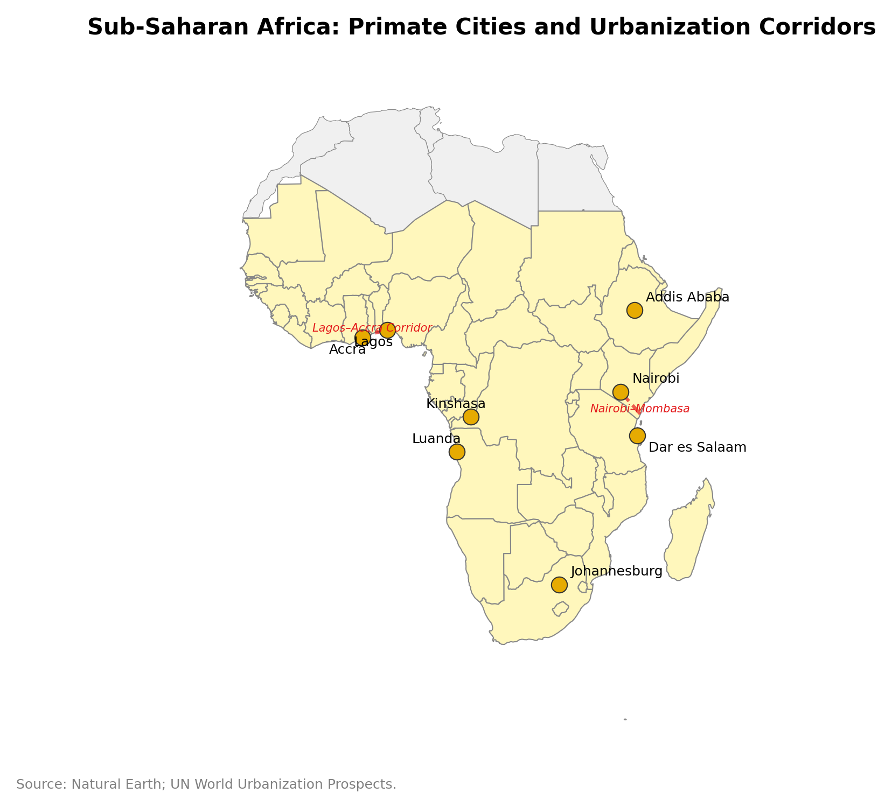

# Chapter 13: Urbanization Without Industrialization — Density, Service Capacity, and the African Urban Transition

---

## Introduction: The Cities That Industry Forgot

Lagos will be home to roughly 24 million people by 2030, placing it among the fifteen largest cities on earth. It already generates approximately 30 percent of Nigeria's GDP. Yet Lagos has no steel mill, no globally competitive automobile plant, no semiconductor fab, and no pharmaceutical complex of international significance. Its economy is overwhelmingly services -- banking, telecommunications, logistics, entertainment, and the vast informal sector that employs most of its workforce.

The standard model of structural transformation -- codified by Lewis (1954) -- assumed urbanization and industrialization were the same process. Workers move from fields to factories; factories generate productivity gains through scale and specialization; productivity gains raise wages; higher wages finance the services that characterize a modern economy. Sub-Saharan Africa has broken this sequence. The region urbanizes at approximately 4 percent per year -- faster than any other region in history at a comparable income level -- but manufacturing's share of GDP has remained flat or declined since the 1990s.

This chapter argues that the puzzle has an institutional resolution. Urbanization raises productivity only where municipal service capacity and trade-corridor connectivity convert density into lower transaction costs. Where institutional capacity is weak, density scales congestion and informality without generating agglomeration gains. The same process -- rural-urban migration -- produces Silicon Valley in one institutional environment and Lagos's Oshodi Market in another.

*Source: Natural Earth; UN World Urbanization Prospects.*

---

## 13.1 The African Urban Transition in Numbers

### Scale and Speed

Sub-Saharan Africa's urban population was approximately 150 million in 2000. By 2025, it exceeded 600 million. By 2050, the UN projects it will reach 1.2 billion — an eightfold increase in half a century. This is the fastest urbanization in human history, measured by absolute numbers if not by percentage rates. The speed is driven by two forces: natural population growth (Africa's fertility rate, though declining, remains the highest of any continent) and rural-urban migration (driven by declining agricultural returns, land fragmentation, and the pull of urban opportunities, however informal).

The urbanization is spatially concentrated. Ten metropolitan areas — Lagos, Kinshasa, Luanda, Dar es Salaam, Nairobi, Addis Ababa, Abidjan, Johannesburg, Accra, and Dakar — will account for a disproportionate share of total urban growth. These cities are already megacities or near-megacities, and their growth is generating infrastructure deficits that existing institutions cannot close: Kinshasa, with 17 million people, has no modern integrated mass rapid transit system; Lagos has a road network designed for a city one-quarter its current size; Dar es Salaam's port handles three times its designed throughput.

**The spatial pattern is also multipolar.** Unlike Europe (where Paris, London, and a few other primate cities dominate national urban systems) or East Asia (where mega-corridors like the Pearl River Delta and Seoul-Incheon concentrate the majority of urban economic activity), Africa has a remarkably dispersed urban geography. Nigeria has three mega-cities (Lagos, Kano, Ibadan) and dozens of cities above one million. The DRC has Kinshasa but also Lubumbashi, Mbuji-Mayi, and a dozen regional capitals. Tanzania has Dar es Salaam but also Mwanza, Arusha, and Dodoma. This multipolarity creates both opportunity (multiple potential growth poles, reducing dependence on a single dominant city) and challenge (the institutional capacity needed for effective urban governance must be built in many places simultaneously, not just one).

But the majority of African urbanization is occurring not in megacities but in secondary cities — places with populations between 100,000 and 1 million. These cities are growing faster than the megacities in percentage terms, and they are almost entirely invisible in the international development literature. A secondary city in the Democratic Republic of Congo — Lubumbashi, Mbuji-Mayi, Kananga — may have the population of a mid-sized European city but the infrastructure and institutional capacity of a large village. The planning frameworks, building codes, tax administrations, and land registries that enable functional urban management do not exist in most of these cities. Their growth is unplanned, unmanaged, and uninstrumented — which is why satellite-derived data (VIIRS night-lights, Sentinel-2 land cover) are essential for understanding their economic geography.

### Urbanization Without Structural Transformation

The historical norm, documented by Kuznets (1966) and numerous subsequent studies, is that urbanization accompanies a shift in employment from agriculture to manufacturing and eventually to services. Manufacturing is the bridge: it absorbs labor from agriculture at higher productivity, generates the income that finances demand for services, and produces the capital goods (machinery, transport equipment, communications infrastructure) that raise productivity across all sectors.

Sub-Saharan Africa is largely skipping the bridge. Between 1990 and 2020, manufacturing's share of GDP in the region declined from approximately 15 percent to 10 percent — the same premature-deindustrialization pattern that Chapter 5 documented for Latin America, but from an even lower starting point. The labor displaced from agriculture (or added to the labor force by population growth) is absorbed not by manufacturing but by services — and overwhelmingly by informal services.

Diao, McMillan, and Rodrik (2019) computed the "structural change bonus" — the contribution of labor reallocation across sectors to aggregate productivity growth — for African countries between 2000 and 2015. They found that the bonus was positive but small: labor was moving from low-productivity agriculture to somewhat-higher-productivity services, generating modest productivity gains. But the gains were much smaller than those experienced by East Asian countries during their structural transformations, because the destination sector (informal services) was far less productive than the destination sector in Asia (export-oriented manufacturing).

The implication for cities is stark. African cities are growing because people are arriving, not because the cities are generating the productivity gains that would justify their size. The agglomeration economies that Chapter 1 described — sharing of indivisible inputs, matching of workers to firms, learning through knowledge spillovers — require institutional preconditions: functioning labor markets (for matching), intellectual property protection and research institutions (for learning), and reliable infrastructure and contractual frameworks (for sharing). Where these preconditions are absent, density produces congestion — longer commutes, higher rents, greater pollution, more crime — without the compensating productivity gains.

Gollin, Jedwab, and Vollrath (2016) — the paper that gives this chapter its title — draw a distinction that the standard narrative often elides: between "production cities" driven by manufacturing productivity and "consumption cities" driven by resource rents. Many of Africa's fastest-growing metropolises fall squarely into the second category. Lagos, Luanda, and Libreville expanded not because firms located there for agglomeration reasons but because oil wealth circulated through the capital, generating demand for non-tradeable services — banking, construction, retail, legal and security services — that in turn attracted migrants. This mechanism explains why Lagos supports a thriving telecommunications and financial sector despite negligible manufacturing: the demand originates in resource revenue, not factory wages. The distinction carries sharp policy implications. A production city's growth is self-sustaining through manufacturing productivity gains and export earnings; a consumption city's growth is hostage to the commodity price cycle and will stall — or reverse — when the resource declines. Equatorial Guinea's Malabo, which boomed on oil revenue in the 2000s and stagnated when prices collapsed after 2014, is the cautionary case.

### The East Asian Contrast

The comparison with East Asia sharpens the puzzle. South Korea urbanized from 28 percent urban in 1960 to 82 percent in 2000 — a faster transition than Africa's — but every stage of Korean urbanization was accompanied by manufacturing growth. The Masan Free Trade Zone (1970), the Gumi Industrial Complex (1973), and the Ulsan automobile corridor (1960s–1980s) absorbed millions of rural workers into formal manufacturing employment. The factories generated the tax revenue that financed urban infrastructure: Seoul's subway system (opened 1974), Busan's port expansion, and the nationwide expressway network that connected industrial cities to ports and markets.

China's urbanization since 1990 followed a similar pattern: the Special Economic Zones (Shenzhen, Dongguan, Xiamen) attracted hundreds of millions of rural workers into factory employment, and the tax revenue and foreign exchange from manufacturing exports financed urban infrastructure at a scale unprecedented in human history.

African urbanization has no equivalent engine. Without manufacturing employment to absorb incoming workers, without factory tax revenue to finance infrastructure, and without export earnings to justify port and road construction, African cities must build the institutional and physical infrastructure of a modern city while operating a pre-modern economy. This is the "urbanization without industrialization" trap: the city needs industry to finance its infrastructure, but industry needs infrastructure to locate in the city. Breaking the circular trap requires external intervention — public investment, foreign aid, or institutional reform — that substitutes for the missing industrial tax base.

### The Informal Economy as Urban Equilibrium

The informal economy in African cities is not a transitional phenomenon that will disappear as development proceeds. It is a structural equilibrium — the form that economic activity takes when formal institutions are absent or inaccessible. Chapter 5 documented this logic for Latin America; it applies with even greater force in Africa, where informality rates reach 80–90 percent of non-agricultural employment in many countries.

The scale of Africa's informality challenge is inseparable from its demographics. The continent's median age is approximately 19 — the youngest of any region on earth — and the urbanization pressure is accordingly not merely a structural-transformation problem but a demographic absorption problem: cities must integrate the world's fastest-growing youth cohort at the same time that rural push factors are accelerating arrival rates. The ILO estimates that Sub-Saharan Africa needs to create roughly 12 million new formal-sector jobs per year to absorb labor-market entrants; no African economy is remotely approaching that target. The arithmetic is relentless: with formal-sector job creation running at perhaps 3 million per year continent-wide, the remaining 9 million are absorbed entirely by the informal economy. This is why informality rates are not declining even as urbanization accelerates and GDP per capita inches upward — the denominator (new workers) is growing faster than the numerator (formal jobs). The youth bulge will peak around 2050, meaning that the absorption pressure will intensify for another quarter-century before demographics begin to ease.

The urban informal economy in Africa encompasses an extraordinary range of activities, from subsistence-level street vending (earning less than $2 per day) to sophisticated trading networks that move millions of dollars' worth of goods across borders without any formal documentation. The Alaba International Market in Lagos — a single market complex — generates an estimated $2 billion in annual transactions, entirely outside the formal banking and tax systems. The traders in Alaba import electronics from China, distribute them across West Africa through ethnic networks (predominantly Igbo), and operate a parallel financial system (community-based credit associations) that provides the working capital that formal banks will not extend to informal businesses.

This institutional framework is not chaos — it is an adaptation to an environment where formal institutions fail. Contract enforcement in Nigerian courts can take seven years; Alaba's internal dispute resolution takes days. Bank loans require collateral and documentation that informal businesses do not possess; community credit associations lend on the basis of social capital and reputation. Business registration costs time and money and exposes the registrant to extractive taxation; informality preserves autonomy at the cost of growth constraints (informal firms cannot access formal supply chains, formal credit, or government procurement).

The spatial consequence is a dual urban economy that mirrors the dual national economy of Chapter 5: a formal sector (banking, telecommunications, government, large-scale manufacturing) concentrated in specific districts with adequate infrastructure and institutional support, and an informal sector (the rest) distributed throughout the metropolitan area in patterns that reflect social networks, transport routes, and market access rather than zoning or planning.

### Climate Migration and the Sahel Urban Push

The urban transition documented above is driven partly by economic pull — the search for wages, services, and opportunities in cities — and partly by rural push: the erosion of agricultural viability in regions where climate change, land degradation, and conflict make staying impossible. In the Sahel, the push component has become the dominant driver of urbanization for an entire arc of territory stretching from Senegal through Mali, Burkina Faso, Niger, Chad, and into Sudan.

The Sahel agricultural belt is contracting. Rising temperatures, shifting rainfall patterns, and intensified drought frequency since the 1980s have pushed the viable rainfed agriculture zone southward by an estimated 50–100 kilometers over the past four decades. The desertification of the Sahel margin is not uniform — localized "greening" in some areas has been documented via satellite NDVI (normalized difference vegetation index) data — but the macro-trend is one of declining water availability, shortening growing seasons, and increasing year-to-year rainfall variability that makes smallholder farming progressively unviable. Dell, Jones, and Olken (2012) estimate that a 1°C increase in annual temperature reduces GDP growth by approximately 1.1 percentage points in poor countries; Sahel temperatures have risen by 1.5–2°C since 1950, implying a persistent annual growth drag of 1.5–2 percentage points — a figure that, compounded over decades, transforms the economics of rural livelihoods.

The climate-conflict nexus amplifies the displacement effect. The Lake Chad basin — once Africa's sixth-largest freshwater body, supporting 30 million people with fishing, agriculture, and pastoral livelihoods — experienced a dramatic contraction from roughly 26,000 km² in the 1960s to a low of approximately 2,000 km² of open water in the mid-1980s. Satellite data since the 1990s show partial recovery and stabilization: the lake's total area (including seasonal wetlands and marshes) now fluctuates around 14,000 km², though the open-water surface remains far below its 1960s extent. The ecological and economic impact has been severe regardless of the precise current measurement: the productive fisheries, irrigated agriculture, and pastoral systems that depended on a stable shoreline have been permanently disrupted. The contraction has produced fierce competition between farmers and pastoralists over the remaining arable and pastoral land. Hsiang, Meng, and Cane (2011) document a robust empirical association between El Niño-driven rainfall anomalies and civil conflict onset in the tropics; in the Sahel, the climate-conflict mechanism operates specifically through resource competition: herders whose grazing routes have been disrupted by drought push into farmland, generating Fulani-farmer conflict that in northern Nigeria, Mali, and the Central African Republic has claimed tens of thousands of lives since 2015. Boko Haram and affiliated jihadist groups in the Lake Chad basin have exploited the resulting institutional vacuum, recruiting from displaced pastoral populations who have lost their livelihoods and their political connection to the formal state.

The spatial consequence is a form of urbanization that Chapter 1's framework does not easily accommodate. The NEG model and Duranton and Puga's Marshallian trinity describe urbanization driven by the productivity pull of agglomeration — workers move to cities because wages and opportunities are better there. Sahel urbanization is increasingly driven by the opposite: workers are leaving because the rural option has become untenable, not because the urban option has become attractive. This "distress urbanization" produces a distinctive spatial pattern. The arriving populations are asset-poor, skill-poor, and traumatized by conflict or climate shock; they enter cities not into formal employment but into the lowest tier of the informal economy — construction labor, petty trading, domestic service. They settle in the periphery, where land is cheap and services are absent. They are urbanizing in the statistical sense — moving to cities — but not in the economic sense that the structural-transformation literature implies.

Niamey (Niger), Ouagadougou (Burkina Faso), N'Djamena (Chad), and Bamako (Mali) are growing faster than cities with equivalent income levels in any other region of the world, absorbing displaced populations from the Sahel margin without commensurate growth in formal employment. The night-lights data in Lab 6 will show these cities brightening — more people, more generators, more street activity — but the brightness does not correspond to productivity gains. It corresponds to population concentration without productive agglomeration, which is precisely the "urbanization without industrialization" pattern this chapter analyzes. The climate-migration variant is, in this sense, the limiting case: urbanization in its most decoupled form, driven entirely by displacement rather than opportunity.

---

## 13.2 When Density Produces Productivity — and When It Does Not

### The Institutional Threshold

Not all African cities fail to generate agglomeration economies. Nairobi, Johannesburg, and, increasingly, Kigali and Accra demonstrate that density can be productive in the African institutional context. What distinguishes these cities from Lagos, Kinshasa, and Luanda?

The answer is institutional capacity — specifically, the capacity to provide three urban services without which agglomeration economies cannot operate:

**Reliable electricity.** Manufacturing requires continuous power. A factory that loses power for four hours per day (the average for Nigerian manufacturers, according to World Bank Enterprise Surveys) operates at roughly 70 percent capacity, cannot run precision equipment, and loses perishable inputs. Service firms — call centers, data processing, financial services — similarly require uninterrupted connectivity. Nairobi's relatively high grid connectivity (above 90 percent in the urban area, supported by geothermal baseload) (supported by geothermal baseload and a well-managed utility, Kenya Power) is a foundational competitive advantage over Lagos's 50–60 percent reliability. The night-lights data in Lab 6 are, in part, a proxy for this variable: brighter regions are regions with more reliable electricity, and the correlation between night-lights intensity and economic productivity is partly mediated by power reliability.

**Functional transport.** Agglomeration economies require that workers can reach firms and that goods can reach markets within a reasonable time and cost. In Johannesburg, the Gautrain rapid rail and extensive highway network keep average commute times below 45 minutes for formal-sector workers. In Lagos, average commute times exceed 90 minutes, and freight transport within the metropolitan area costs more per kilometer than freight transport between Lagos and London by sea. The transport deficit converts density from an asset (proximity to markets and labor) into a liability (congestion that raises the effective cost of every transaction).

**Contract enforcement and regulatory predictability.** The Marshallian matching mechanism requires that firms and workers can enter into reliable agreements: employment contracts, supplier agreements, lease arrangements, intellectual property licenses. Where contract enforcement is weak — where a supplier cannot reliably sue a buyer who fails to pay, or a landlord cannot reliably evict a tenant who defaults — firms internalize transactions that would otherwise be conducted through the market. The result is vertical integration (firms doing everything in-house because they cannot trust external suppliers), which forecloses the specialization and division of labor that are the core source of agglomeration productivity.

Kigali's rapid improvement on all three dimensions — Rwanda's electricity grid, despite starting from a low base, has reached 60 percent household connectivity with improving reliability; the government has invested heavily in road infrastructure; and Rwanda consistently ranks among the top three African countries for ease of doing business — explains why the city is emerging as an East African services hub despite being landlocked, small, and resource-poor. The institutional threshold is not a fixed quantity; it depends on the sector (light manufacturing requires less reliable power than semiconductor fabrication) and the function (logistics requires transport more than electricity; finance requires contract enforcement more than transport). But the general principle holds: below a minimum institutional capacity, density is unproductive.

### The Congestion Penalty

Above the institutional threshold, density produces agglomeration economies. Below it, density produces what urban economists call the "congestion penalty" — the costs of crowding that are not offset by productivity gains. The congestion penalty includes:

- **Housing costs.** Urban land markets in African cities are distorted by weak property rights, informal settlements, and speculative holding by elites. The result is that housing costs rise with density (as in any city), but the quality of housing does not improve commensurately. Nairobi's Kibera — one of the world's largest informal settlements — has population densities exceeding 100,000 per square kilometer, far higher than Manhattan (27,000) or Hong Kong (45,000), but with housing that consists of corrugated-iron shacks with no sanitation, no running water, and no electricity connections. Density without infrastructure is not urbanization in any economically meaningful sense.

The "weak property rights" that distort African urban land markets have a specific institutional structure that generic governance indicators miss: the conflict between customary (communal/traditional) land tenure and formal state titling systems. In most African cities, a substantial share of urban land is held under customary arrangements administered by traditional chiefs or clan elders, while the formal state system recognizes individual titled ownership — and the two systems overlap, contradict, and paralyze each other. Investors cannot obtain clear title because customary claims shadow state allocations; infrastructure projects stall in disputes between formal and customary authorities; and low-income households cannot use their dwellings as collateral because they hold customary rights rather than formal title. This is De Soto's "dead capital" problem (Chapter 2) in its specifically African form — not institutional absence but institutional conflict, where two legitimate property-rights systems coexist without a reconciliation mechanism. Accra's peri-urban fringe, where stool lands administered by Ga chiefs collide with state-issued leases, is the canonical case: developers build anyway, but without bankable title, at scales too small to capture agglomeration returns.

- **Health costs.** Dense informal settlements with inadequate water and sanitation produce disease externalities — cholera, typhoid, respiratory infections — that reduce labor productivity and increase healthcare costs. The COVID-19 pandemic demonstrated the vulnerability: dense African settlements experienced rapid transmission that formal public health systems could not contain, because containment requires the ability to identify, isolate, and trace contacts — institutional capacities that are absent in most informal settlements.

- **Crime and insecurity.** Dense, poorly governed urban areas produce higher crime rates, which in turn raise the cost of doing business (security expenditure, insurance, theft losses) and reduce the willingness of formal firms to locate in the city. Johannesburg's inner-city decline in the 1990s and 2000s — driven by crime that drove formal businesses and middle-class residents to the suburbs — is a case study in how insecurity can reverse agglomeration.

The balance between agglomeration benefits and congestion costs determines whether urbanization is growth-enhancing or growth-neutral. The institutional framework of this chapter predicts that the balance tips toward agglomeration only when municipal service capacity exceeds a threshold. Lab 6's Moran's $$I$$ analysis provides a spatial test: if economic activity (night-lights) clusters more strongly in regions with better governance (higher Afrobarometer scores), the agglomeration-congestion balance favors the institutionally strong regions.

### Case Study: Nairobi vs. Lagos

A paired comparison of Nairobi and Lagos illuminates the institutional threshold in practice.

**Nairobi (population ~5 million, Kenya).** Nairobi's M-Pesa revolution — the mobile money platform launched by Safaricom in 2007 — exemplifies how institutional innovation can substitute for missing formal infrastructure. M-Pesa allows millions of Kenyans to transfer money, pay bills, and save without bank accounts. By 2024, M-Pesa processed transactions equivalent to roughly 50 percent of Kenyan GDP. The platform works because Kenya's telecommunications regulator (the Communications Authority of Kenya) created a regulatory framework that allowed mobile operators to offer financial services — an institutional choice that Uganda, Tanzania, and other EAC countries replicated, but that Nigeria's central bank resisted for nearly a decade (protecting incumbent banks).

Nairobi's technology sector (dubbed "Silicon Savannah") has grown to include over 200 startups, several unicorns (one of Africa's earliest prominent unicorns, Jumia, was initially Africa-focused but listed in New York), and a cluster of international tech firms (Google, Microsoft, IBM) that use Nairobi as their East African headquarters. The city's advantages — English-speaking workforce, time zone convenient for serving both European and Asian markets, reliable internet connectivity, and relatively low office costs — are real, but they are institutional achievements, not natural endowments.

**Lagos (population ~16 million, Nigeria).** Lagos has more people, more money, more entrepreneurial energy, and more cultural influence than Nairobi. But its institutional deficits are staggering. Electricity supply from the national grid (TCN/DisCos) meets roughly 30–40 percent of demand; the rest is met by private diesel generators at costs 3–5 times higher than grid power. Traffic congestion costs the Lagos economy an estimated billions of naira per day in lost productivity (World Bank, 2019). Port congestion at Apapa adds weeks to container clearance times. Land title registration in Lagos state requires over 100 days and multiple interactions with agencies that demand informal payments.

Lagos succeeds *despite* its institutions, not because of them. The city's economy is powered by the sheer scale of its consumer market (16 million people with rising incomes), the entrepreneurial resilience of its informal sector, and the cultural gravity of Nollywood, Afrobeats, and Nigeria's diaspora networks. But the institutional deficits cap Lagos's productivity at a level far below what its population density and market size should generate. The agglomeration premium — the wage boost that workers receive from locating in a dense city — is estimated at roughly 10–15 percent for Nairobi (similar to European secondary cities) but less than 5 percent for Lagos (comparable to small African towns), despite Lagos being three times Nairobi's size.

The comparison confirms the chapter's thesis: density is a necessary but not sufficient condition for agglomeration economies. The institutional environment determines whether density is converted into productivity or into congestion.

### The Digital Services Frontier: Beyond "Low-Productivity Services"

The Nairobi case points toward a deeper revision of the "urbanization without industrialization" narrative. The standard formulation assumes that services are uniformly low-productivity and non-tradable — that workers who move from agriculture to street vending or motorcycle-taxi driving are not structurally transforming. But Nairobi's M-Pesa ecosystem is not street vending. It is a tradable digital financial service that processes transactions equivalent to half of Kenya's GDP, has been replicated across East Africa and beyond, and generates significant export revenue through licensing and consulting fees. Safaricom's M-Pesa platform is, by any reasonable measure, a globally competitive services export.

Suri and Jack (2016) demonstrated in a rigorous longitudinal study that M-Pesa had measurable long-run effects on poverty reduction and female economic empowerment in Kenya — effects transmitted through improved spatial access to finance. Mobile money reduced the effective distance between rural households and financial services, enabling consumption smoothing, remittance flows, and small-business investment that formal banking infrastructure could not reach. This is a spatial economics story: a digital service changed the geography of financial access, with measurable welfare consequences.

The M-Pesa story is not isolated. Nairobi's "Silicon Savannah" now includes fintech companies (M-Kopa, Branch, Tala), logistics platforms (Sendy, Lori Systems), agritech firms (Twiga Foods, Apollo Agriculture), and health-tech startups (mPharma, Zipline's drone delivery) that are genuinely tradable — they serve markets across East and West Africa, and increasingly compete globally. Lagos, despite its infrastructure deficits, hosts Flutterwave, Paystack (acquired by Stripe), and Andela, which export financial technology and software development services to US and European clients. Kigali — the smallest of the three — has positioned itself as a BPO and IT hub for francophone Africa, leveraging its governance reputation and low operating costs.

These are not marginal phenomena. Africa's technology sector attracted over $5 billion in venture capital in 2022, concentrated overwhelmingly in Nairobi, Lagos, Cape Town, and Cairo. The spatial concentration is striking — and it is precisely the kind of agglomeration that Chapter 1's framework predicts: knowledge spillovers, thick labor markets for software developers and product managers, and the synergies of Haskel and Westlake's (2018) intangible economy operating in African cities.

Does this mean that some African cities can bypass manufacturing entirely and build productive economies through digital services? The honest answer is: possibly, but the evidence is too early and too spatially concentrated to generalize. The digital services clusters are genuine — they produce tradable output, generate tax revenue, and create local multiplier effects (Moretti-style: one tech job in Nairobi generates consumption demand for local non-tradable services). But they employ a tiny fraction of the urban workforce compared to manufacturing-led urbanization in East Asia. Nairobi's tech sector employs perhaps 50,000–100,000 people directly in a metro area of 5 million. Lagos's tech ecosystem employs a similar number in a city of 16 million. The manufacturing sector in Shenzhen employs millions.

The question is whether the digital services path can scale — whether the multiplier effects and knowledge spillovers can expand from a thin elite stratum to the broader urban workforce — or whether it will remain an enclave: a small, globally competitive sector surrounded by the same informal, low-productivity services economy that defines the "urbanization without industrialization" pattern. The institutional framework of this chapter suggests that the answer depends on whether the same service-capacity investments (electricity, transport, contract enforcement) that enable manufacturing agglomeration can also enable services agglomeration at scale. The early evidence from Nairobi — where reliable power, functional transport, and institutional stability support both manufacturing and services clustering — is encouraging. The evidence from Lagos — where infrastructure deficits constrain both — is cautionary.

### E-Government and the Spatial Politics of Digital Inclusion

The M-Pesa narrative and the broader digital-services story raise a second question: if digital platforms can substitute for missing market institutions (as mobile money substituted for absent banking), can digital government services substitute for missing state infrastructure? The answer turns out to be spatially conditional in ways that compound the inequalities this chapter has documented.

Rwanda's Irembo platform, launched in 2014, digitized government service delivery — business registration, building permits, tax filing, birth certificates, police clearances, visa applications — through a single web portal and a network of 1,500 citizen service centers (designated shops and cooperatives serving as physical access points in areas without internet). By 2024, Irembo processed over 100 million transactions and served more than 3 million unique users, in a country of 14 million. The platform meaningfully reduced the time and cost of formal transactions for businesses and citizens. A building permit that formerly required 14 office visits and three months now requires two online submissions and three weeks. The compliance cost of formalization dropped — which, in the framework of Chapter 5, should increase the formal employment share.

But Rwanda is exceptional. Its high-bandwidth fiber network (one of the highest rural fiber penetration rates in Sub-Saharan Africa), its effective local government system (the Umurenge Sacco network), and its political commitment to digital transformation under President Kagame created conditions that most African governments cannot replicate. Elsewhere, digital government platforms have advanced more unevenly.

Nigeria's Bank Verification Number (BVN) and National Identity Number (NIN) systems attempted to create a unified digital identity infrastructure, but implementation has been characterized by exclusion rather than inclusion: as of 2023, an estimated 40 percent of Nigeria's adult population lacked valid BVN or NIN credentials, disproportionately in rural northern states (Zamfara, Katsina, Kebbi) with low formal banking penetration and limited NIN registration infrastructure. Citizens without digital IDs cannot access mobile money platforms tied to BVN, cannot receive government cash transfers (NSIP) linked to NIN, and cannot formally register businesses. The digital identification system has effectively created a new spatial gradient of state access — BVN/NIN holders in urban southern Nigeria are included; BVN/NIN-absent households in rural northern Nigeria are excluded. Ganapati and Ravi (2023), studying India's Aadhaar biometric ID system, document a parallel dynamic: digital identification systems can dramatically reduce the cost of service delivery (subsidies that previously leaked to intermediaries now reach beneficiaries directly), but the implementation gradient determines whether they are instruments of inclusion or new mechanisms of exclusion.

The spatial consequences in Africa are predictable from the institutional framework of this chapter. Digital government platforms require the same three urban-service capacities that condition productive urbanization generally: reliable electricity (for servers, access terminals, and user devices), functional telecommunications infrastructure (for internet connectivity and mobile data), and institutional accessibility (literacy, language, proximity to registration points). Where these conditions exist — Nairobi, Accra, Kigali, Johannesburg — digital government can significantly reduce transaction costs and increase formal-sector participation. Where they are absent — Sahelian secondary cities, rural DRC, informal settlements in Lagos — digital platforms are accessible in theory and inaccessible in practice, adding a new layer of exclusion on top of existing ones.

The policy implication is not that digital government is bad — the Rwandan evidence clearly shows its potential — but that its deployment must be paired with the analog investments that make digital access meaningful: charging stations, community service centers, digital literacy training, and vernacular-language interfaces. The spatial digital divide will otherwise reproduce, and in some cases widen, the institutional gradients that determine which African cities generate productive urbanization and which do not.

---

## 13.3 Night-Lights as Measurement Innovation

### The Data Scarcity Problem

The fundamental challenge for African economic geography is measurement. Most Sub-Saharan African countries produce national GDP estimates with multi-year lags and large revision bands. Subnational GDP data are available for only a handful of countries (South Africa, Nigeria, Kenya, Ethiopia) and are often unreliable. Employment data from labor force surveys cover formal employment but miss the informal sector, which accounts for 70–90 percent of employment in most SSA countries. Price data are collected in capital cities but not in secondary cities or rural areas.

This measurement gap has real analytical consequences. You cannot estimate a spatial econometric model — SAR, SEM, or SDM — if you do not have a spatially referenced outcome variable. You cannot compute Moran's $$I$$ if you do not have a variable to compute it on. The conventional approach is to work with national-level data (WDI, PWT) and forgo subnational analysis, but this misses exactly the within-country variation that this chapter argues is most important.

### Night-Lights as Alternative Activity Measure

Satellite-based nighttime light intensity provides a solution. The VIIRS sensor, mounted on the Suomi NPP satellite (launched 2011), measures radiance at approximately 750-meter resolution on a nightly basis. Annual composites — averaged over cloud-free nights — provide a stable, globally consistent, freely available measure of light intensity at every point on the earth's surface.

Henderson, Storeygard, and Weil (2012) established the foundational relationship: log GDP and log night-lights intensity are positively correlated, with an elasticity of approximately 0.3 at the country level (a 10 percent increase in light intensity is associated with a 3 percent increase in GDP). The relationship holds at the subnational level and across time, making night-lights a viable proxy for economic activity in data-sparse environments.

The night-lights proxy has specific strengths and limitations:

**Strengths.** Night-lights capture both formal and informal economic activity (any activity that generates light — residential, commercial, industrial — registers). They are available at high spatial resolution (750 meters for VIIRS), enabling subnational and even intra-urban analysis. They are produced by a single sensor with consistent calibration, eliminating the cross-country measurement incomparabilities that plague GDP data. They are available in near-real-time, enabling "nowcasting" of economic conditions months or years before official statistics are released.

**Limitations.** Night-lights are a proxy, not a direct measure. They capture light, not value — and the relationship between light and economic value varies across contexts. Agricultural activity generates little light (farmers work during the day); mining generates concentrated light at the extraction site but does not capture the value chain; service activities generate light proportional to their energy intensity, not their economic productivity. Night-lights are subject to sensor saturation in very bright areas (city centers) and to interference from gas flaring (Nigeria, Angola), fishing boats at sea, and moonlight reflection. Careful processing — background subtraction, gas-flare masking, saturation correction — is necessary, and Lab 6's preprocessing pipeline handles these steps.

### Calibration and Validation

The night-lights-GDP relationship requires calibration for the African context. Henderson, Storeygard, and Weil's (2012) original elasticity of 0.3 was estimated on a global sample. African-specific estimates vary: Michalopoulos and Papaioannou (2013) found elasticities of 0.3–0.5 for ethnic homelands within Africa, suggesting that the night-lights-GDP relationship may be stronger (not weaker) in Africa than globally — perhaps because a larger share of African economic activity is directly visible as light (market trading, informal commerce, residential activity) than in rich countries, where much economic value is generated in offices that emit less light per dollar of GDP.

Validation against known quantities is essential. South Africa provides the best test case: it has both high-quality subnational GDP data (from Statistics South Africa) and VIIRS night-lights coverage. Comparing night-lights-predicted GDP with actual GDP at the provincial level reveals where the proxy works and where it fails. Gauteng province (Johannesburg-Pretoria) is typically overpredicted by night-lights (the metropolitan area is very bright, but much of the value generated there — financial services, mining headquarters, government administration — is knowledge-intensive and generates relatively little light per dollar). Limpopo province is typically underpredicted (agricultural and mining activity generates economic value but limited night-lights). Understanding these systematic biases is critical for interpreting Lab 6's results.

Nigeria provides a complementary validation. Since Nigeria's GDP rebasing in 2014 (which roughly doubled measured GDP overnight by updating the base year and including previously unmeasured sectors), the country's night-lights-GDP relationship has shifted — the pre-2014 and post-2014 series imply different elasticities. This is a reminder that night-lights capture physical activity, while GDP captures statistical choices. When the two diverge, the analyst must determine whether the discrepancy reflects measurement error in GDP, measurement error in night-lights, or a genuine change in the relationship between light and economic value.

### The Nowcasting Application

Lab 6 frames the night-lights analysis not merely as a data-scarcity workaround but as a measurement innovation with value even in data-rich environments. GDP nowcasting — using high-frequency indicators (satellite data, mobile phone records, shipping container volumes, electricity consumption) to estimate current GDP before official statistics are released — is an active research frontier. Night-lights provide a spatially granular nowcasting signal that is particularly valuable for disaster response (how much economic activity was lost in a flood zone?), conflict monitoring (has economic activity recovered in a post-conflict area?), and policy evaluation (did a new road change the spatial distribution of economic activity?).

For this chapter, the nowcasting framing is important because it elevates Lab 6 from a "we use night-lights because GDP data are bad" exercise to a "night-lights reveal spatial dynamics that GDP data miss even when available" exercise. South Africa has excellent subnational GDP data, but those data are reported annually with a two-year lag. VIIRS composites are available within months. The analytical question is not "are night-lights better than GDP?" but "what can night-lights tell us that GDP cannot, and on what timescale?"

---

## 13.4 Lab 6 and the Governance-Activity Nexus

### The Two-Step Procedure

Lab 6's analytical design tests a specific hypothesis: the spatial clustering of economic activity in Sub-Saharan Africa is partly explained by the spatial pattern of governance quality. The procedure is:

**Step 1: Raw Moran's $$I$$.** Compute the global Moran's $$I$$ on night-lights radiance using an adjacency-based spatial weight matrix (countries that share a border are neighbors, with optional border-length weighting). A positive, significant $$I$$ indicates that economic activity clusters spatially — bright countries tend to be near bright countries.

**Step 2: Governance-residualized Moran's $$I$$.** Regress night-lights radiance on Afrobarometer's trust-in-local-government score (or an alternative governance measure). Compute Moran's $$I$$ on the residuals. If $$I_\text{residual} < I_\text{raw}$$, then governance quality explains some of the spatial clustering — the "institutional geography" is doing real work.

The magnitude of the decline — $$\Delta I = I_\text{raw} - I_\text{residual}$$ — measures the share of spatial autocorrelation that is attributable to governance. If $$\Delta I$$ is large (say, 30–50 percent of $$I_\text{raw}$$), institutional geography is a major determinant of economic geography. If $$\Delta I$$ is small (less than 10 percent), the spatial pattern is driven by physical geography — coastlines, rivers, resource deposits — rather than institutions.

### Connecting to the Chapter's Thesis

The two-step result directly tests this chapter's core argument. If urbanization-without-industrialization is an institutional phenomenon — if density is productive only where governance capacity is adequate — then we would expect:

1. **Positive raw Moran's $$I$$**: economic activity clusters geographically (confirmed on synthetic data in Lab 6; to be validated on real data).

2. **Significant governance-residualization effect**: the clustering is partly explained by the spatial distribution of governance quality.

3. **Heterogeneity by urbanization level**: the governance effect should be stronger in more urbanized countries (where the agglomeration-congestion tradeoff is operative) than in rural countries (where the tradeoff is less relevant).

These predictions are testable with the existing Lab 6 scaffold once real VIIRS and Afrobarometer data are acquired. The robustness runner (`run_real_africa_specs.py`, planned) will extend the analysis to test sensitivity to alternative weight matrices (border-length vs. binary, k-nearest-neighbor), alternative governance measures (service delivery quality, corruption perceptions, tax compliance), and alternative night-lights preprocessing (with and without gas-flare masking, with and without saturation correction).

### The Weight Matrix Choice for Africa

The spatial weight matrix for Lab 6 deserves particular attention because Africa's political geography creates unusual challenges.

**Contiguity.** African borders are the result of European colonial partition (the Berlin Conference of 1884–1885) and bear limited relationship to economic geography. The DRC shares borders with nine countries — more than any other African state — but many of these borders are drawn through dense forest or across lakes, with minimal economic interchange. Conversely, some non-contiguous countries (e.g., South Africa and Kenya, which are not neighbors) have deep economic ties through supply chains, investment, and migration. Contiguity $$W$$ captures physical adjacency but misses economic reality.

**Border-length weighting.** Lab 6's default $$W$$ optionally weights neighbors by shared border length (in kilometers). This is more informative than binary contiguity: Tanzania and Kenya share a long border (approximately 700 km) with substantial cross-border trade, while Tanzania and Malawi share a short border (approximately 160 km) with less interchange. But border length is an imperfect proxy for economic interaction — some long borders run through uninhabited terrain (the Chad-Libya border, approximately 1,000 km of Sahara Desert) while some short borders carry enormous traffic (the Kenya-Tanzania border at Namanga).

**K-nearest-neighbor.** With $$k = 5$$ or $$k = 6$$, this approach gives every country the same number of neighbors, addressing the problem that island nations (Madagascar, Mauritius) and peninsular nations (Somalia) have few or no contiguity neighbors. It also handles the DRC problem (too many contiguity neighbors) and the Lesotho problem (exactly one contiguity neighbor).

**Trade-weighted.** Intra-African trade data from Comtrade could be used to construct economic $$W$$, but the data quality is poor: mirror statistics diverge by 50 percent or more for many African bilateral pairs, reflecting customs under-reporting, ICBT, and limited statistical capacity. A trade-weighted $$W$$ built on unreliable data may introduce more noise than signal. Lab 6's robustness checks should compare geographic and trade-weighted specifications and interpret the differences cautiously.

---

## 13.5 The Corridor Dimension

Cities do not exist in isolation. They are nodes in transport networks, and their economic function depends on their connectivity to other nodes — ports, markets, resource sites, and other cities. In Africa, where overland transport costs are the highest in the world (approximately $0.05–0.10 per ton-kilometer compared to $0.01–0.03 in Asia), the location of a city relative to a trade corridor is a primary determinant of its economic viability.

The "functional corridor" concept — developed by the World Bank's Africa Transport team and by TradeMark Africa — holds that the corridor, not the country, is the natural unit of economic integration in Africa. The Northern Corridor (Mombasa–Kampala–Kigali), the Central Corridor (Dar es Salaam–Dodoma–Kigali), the Abidjan-Lagos Corridor, and the North-South Corridor (Durban–Lusaka–Dar es Salaam) are economic arteries along which trade, investment, and urbanization concentrate. Cities on these corridors — Nairobi, Kampala, Arusha, Lusaka — are integrated into regional and global supply chains. Cities off the corridors — inland towns in the DRC, the Sahel, or Madagascar — are effectively isolated, with transport costs that make manufactured exports uncompetitive and imported inputs unaffordable.

Lab 6's spatial analysis can test the corridor hypothesis directly. If economic activity (night-lights) clusters along corridors — with high radiance on the corridor and a steep decay away from it — the corridor is the organizing geography of African economic activity. If governance quality conditions this relationship (stronger clustering along corridors with better border governance, weaker clustering along poorly governed corridors), then institutional reform of corridor management is the highest-return spatial policy intervention available to African governments. Chapter 14 examines this possibility in detail through the lens of the AfCFTA and the functional-corridor model.

---

## Data in Depth: Night-Lights, Governance, and the Urban Productivity Gradient

**Setting.** Compute the relationship between night-lights intensity (log average radiance) and governance quality (Afrobarometer trust-in-local-government, aggregated to national level) for 30+ Sub-Saharan African countries.

**Protocol.** (1) Scatter plot of log night-lights vs. governance score, with population-weighted regression line. (2) Compute Moran's $$I$$ on raw night-lights using adjacency $$W$$. (3) Residualize night-lights on governance and compute Moran's $$I$$ on residuals. (4) Report $$\Delta I$$ and interpret.

**Expected findings.** The scatter plot should show a positive relationship (better governance → more night-lights), but with substantial dispersion reflecting the role of geography, resources, and other factors. $$I_\text{raw}$$ should be positive and significant (geographic clustering of economic activity). $$I_\text{residual}$$ should be smaller (governance explains some clustering), with a $$\Delta I$$ of 15–35 percent providing evidence for the institutional-geography thesis.

**Student exercise.** Using the Lab 6 scaffold, replicate the analysis with a different governance measure (Afrobarometer service delivery quality, World Bank governance indicators, or Transparency International corruption perceptions index). Does the $$\Delta I$$ vary across governance measures? If so, which dimension of governance — trust, service quality, transparency — has the strongest spatial signature?

---

## Spatial Data Challenge: When the Map Lies — GDP Rebasing, Gas Flares, and the Limits of Night-Lights

Nigeria's 2014 GDP rebasing is the canonical illustration of how official economic statistics in Sub-Saharan Africa can misrepresent economic reality by large margins. When the Nigerian National Bureau of Statistics updated its benchmark year from 1990 to 2010 and expanded coverage to include previously unmeasured sectors — Nollywood (the world's second-largest film industry by volume), telecommunications, e-commerce, fashion, and other service activities that had grown dramatically since 1990 — measured GDP jumped from $270 billion to $510 billion overnight. Nigeria became Sub-Saharan Africa's largest economy by a statistical revision, not by real growth. The same economic activity had been occurring for years; it simply had not been counted. Similar rebasing exercises in Ghana (2010), Kenya (2014), and Senegal (2014) each increased measured GDP by 25–60 percent.

**What this means for spatial analysis.** Cross-country comparisons of African economic activity that rely on official GDP data before and after rebasing exercises will produce spurious temporal patterns. A researcher using Nigerian national accounts data from 2005 and 2015 will observe a massive "growth" in 2014 that reflects measurement change, not economic change. Growth regressions, convergence tests, and spatial panel models using pre-rebasing data for pre-rebasing periods and post-rebasing data for post-rebasing periods will show structural breaks that are artifacts of statistical methodology rather than economic reality. Lab 6's use of night-lights as an alternative activity measure partially addresses this problem — the satellite observes what exists, not what is counted — but introduces its own systematic biases.

**Night-lights limitations in the African context.** Three failure modes are specific to Africa:

*Gas flaring.* Nigeria's Niger Delta, Angola's Cabinda enclave, and Libya's oil fields produce enormous volumes of associated gas that is flared at production sites, generating intense thermal radiation that saturates VIIRS sensors within a radius of 10–20 kilometers. The Nigeria VIIRS composite shows the Niger Delta as one of the brightest regions in Sub-Saharan Africa — not because it is prosperous, but because it is on fire. Gas-flare masking (using supplementary datasets that identify flare locations) is essential preprocessing for Nigerian data; without it, night-lights regressions will grossly overestimate economic activity in the Niger Delta and underestimate it in densely populated but gas-flare-free areas.

*Sensor saturation.* In very bright areas — downtown Johannesburg, Lagos Island, central Nairobi — VIIRS radiance saturates: the sensor measures the maximum value it can record rather than the actual brightness. This creates a ceiling effect that suppresses the measured difference between moderately dense and very dense economic activity. Correcting for saturation requires either using a different spectral band (the VIIRS DNB panchromatic band has a wider dynamic range than the VIIRS M-band) or applying a cross-sensor calibration against higher-resolution commercial satellite data (such as Planet Labs imagery).

*Subsistence activity.* Much of rural Sub-Saharan Africa's economic activity — rain-fed agriculture, animal husbandry, artisanal fishing, informal market trade conducted during daylight hours — generates no nighttime light at all. Regions with high subsistence activity and good livelihoods but no electricity will appear economically inactive in night-lights data, confounding any analysis that treats night-lights as an unbiased GDP proxy. The night-lights methodology is best suited for comparing formal-sector economic activity across locations; it systematically understates total economic activity in subsistence-dominated areas.

**The practical implication for Lab 6.** Before running any regression or Moran's $$I$$ calculation, the VIIRS composite requires: (a) gas-flare masking using the NOAA VIIRS Boat Detection or CSIRO flare catalog; (b) saturation correction in the DNB band; and (c) background noise subtraction to remove low-level atmospheric and lunar reflection. Lab 6's preprocessing pipeline (`prepare_lab6_inputs.py`) handles these steps; the documentation explains each correction and its rationale. The sensitivity of results to alternative preprocessing choices should be reported as robustness checks — this is the night-lights equivalent of the spatial econometrician's obligation to test results across alternative weight matrices.

---

## Institutional Spotlight: The Northern Corridor and the Digital Customs Revolution

The Northern Corridor — stretching 1,700 kilometers from the port of Mombasa, Kenya, through Nairobi, across the Ugandan border at Malaba, through Kampala, and onward to Kigali, Rwanda, and Bujumbura, Burundi — is the lifeline of East African trade. It carries roughly 60 percent of the region's imports and exports.

In 2010, moving a standard container from Mombasa to Kigali took an average of 22 days. Customs clearance at the Kenya-Uganda border (Malaba) alone required 3–4 days, with documentation processed manually, fees collected in cash, and physical inspections conducted on every consignment. The effective trade cost — including bribes, detention fees, and spoilage of perishable goods — exceeded the freight cost itself.

The Northern Corridor Transit and Transport Coordination Authority (NCTTCA), supported by TradeMark Africa (TMEA), implemented a series of institutional reforms between 2012 and 2023:

**Electronic Cargo Tracking System (ECTS).** GPS-enabled seals on containers allow customs authorities to track goods in transit without physical inspection at intermediate points. This eliminated the "stop-and-inspect" regime that produced delays and created corruption opportunities at every checkpoint.

**Single Customs Territory (SCT) pilot.** Goods destined for Uganda or Rwanda are cleared at the port of Mombasa under a single declaration, rather than being cleared separately at each border. The SCT reduces the number of customs interactions from four (Mombasa export, Malaba import, Malaba export, Kigali import) to one — an institutional simplification with enormous practical effect.

**One-Stop Border Posts (OSBPs).** At Malaba and other crossings, Kenyan and Ugandan customs officers now operate from a shared facility, processing outbound and inbound documentation simultaneously rather than sequentially. This reduced border crossing time from 3–4 days to under 24 hours.

The cumulative effect was dramatic: average transit time from Mombasa to Kigali fell from 22 days to 6 days by 2023. Trade volumes on the corridor increased by approximately 40 percent. Night-lights data along the corridor show measurable brightening at border posts and logistics hubs, consistent with increased economic activity driven by reduced trade costs.

The Northern Corridor reforms illustrate the chapter's central argument: institutional process reform — not infrastructure construction, not tariff reduction — was the binding constraint on regional trade. The roads were adequate (though not excellent); the ports were congested but functional; the tariffs were already low under the EAC Customs Union. What was missing was the institutional software — digital systems, harmonized procedures, coordinated governance — that allowed the hardware to function at capacity. This is the institutional complement to the hardware-centric development model, and it is the logic that the AfCFTA will need to replicate at continental scale.

---

## Conclusion: Density as Opportunity and Threat

Africa's urban transition is the largest demographic event of the twenty-first century. Whether it produces prosperity or crisis depends on institutions — specifically, on whether municipal and national governments can build the service capacity that converts density into productivity before density produces intolerable congestion.

The evidence of this chapter suggests that the outcome will be spatially uneven. Cities with adequate institutional capacity — Nairobi, Kigali, Accra, Johannesburg — will generate agglomeration economies that justify their growth. Cities without it — Kinshasa, Luanda, many secondary cities across the Sahel and the Great Lakes region — will grow anyway, driven by demographics, but the growth will produce congestion without proportionate productivity gains.

Lab 6's Moran's $$I$$ analysis offers a spatial diagnostic: if governance quality explains a significant share of the spatial clustering of economic activity, then the institutional thesis has empirical support. If it does not — if night-lights cluster for purely geographic reasons (coastal access, resource deposits, river systems) that governance cannot explain — then the policy prescription shifts from institutional reform to infrastructure investment and geographic targeting.

The spatial tools of this book — particularly Lab 6's Moran's $$I$$ analysis with governance residualization — offer a framework for monitoring the outcome. If governance-residualized Moran's $$I$$ declines over time (governance becomes a weaker predictor of spatial clustering), it may indicate that institutional reform is succeeding — economic activity is becoming less dependent on governance quality and more determined by market forces and geographic fundamentals. If it increases (governance becomes a stronger predictor), institutional inequality is deepening, and the urban transition is producing winners and losers along governance lines.

The policy stakes could not be higher. By 2050, one in four humans will live in Africa, and the majority will live in cities. Whether those cities look like Nairobi (productive, connected, institutionally capable) or like Kinshasa (congested, disconnected, institutionally weak) will determine not just Africa's economic trajectory but the global economy's center of gravity. Productive African urbanization would add hundreds of millions of consumers and workers to the global economy. Unproductive urbanization would create a humanitarian crisis of unprecedented scale — billions of urban residents trapped in congested cities without the infrastructure, governance, or economic opportunity to build decent lives.

The next chapter examines the continental-scale institutional response to this challenge: the African Continental Free Trade Area and the functional-corridor model of regional integration. If Chapter 13 asks why some African cities are productive and others are not, Chapter 14 asks whether continental-scale institutional reform can raise the floor — connecting the productive cities to each other and giving the unproductive ones a path to institutional upgrading.

One external force is already reshaping the spatial calculus. China's Belt and Road infrastructure — the standard-gauge railways (Kenya's Mombasa-Nairobi SGR, Ethiopia's Addis Ababa-Djibouti line) and the Special Economic Zones (Hawassa Industrial Park, the Zambia-China zone in Chambishi) — is altering African urban geography in real time. New railway stations generate instant land-value gradients; SEZs produce satellite urban nodes; and Chinese-built residential developments like Kilamba, Angola — 750 apartment blocks for 500,000 residents — create entire districts by fiat. The question is the same one Chapter 14 poses for AfCFTA corridors: do these investments generate genuine spatial development with backward linkages, or do they function as enclaves connected to Chinese supply chains but institutionally disconnected from their host cities? Early evidence from Hawassa is mixed: over 30,000 garment workers, but most inputs are imported and most output exported, with limited local procurement. Whether BRI infrastructure catalyzes productive urbanization or becomes a new form of enclave depends, as this chapter's framework predicts, on host governments' institutional capacity to integrate externally financed infrastructure into their own spatial planning.

---

## Discussion Questions

1. Gollin, Jedwab, and Vollrath (2016) document "urbanization without industrialization" in Africa. Is this pattern a temporary phase (Africa will eventually industrialize, just later than Asia) or a permanent structural feature (the global economy no longer requires large-scale industrial urbanization)? What would the spatial evidence look like under each scenario?

2. Night-lights are a proxy for economic activity, not a direct measure. Identify three economic activities that are important in Sub-Saharan Africa but poorly captured by night-lights. For each, propose an alternative remote-sensing or survey-based indicator that could complement the night-lights analysis.

3. Kigali is often cited as an African urban success story — clean, well-governed, economically dynamic. But Rwanda's governance model includes significant state control over economic activity and limited political competition. Can the "institutional threshold" for productive urbanization be met by authoritarian as well as democratic governance? What evidence would help answer this question?

4. The Lab 6 two-step procedure (raw Moran's $$I$$ → governance-residualized Moran's $$I$$) assumes that governance quality is exogenous to economic activity. This assumption is questionable — economic activity may cause governance quality (through tax revenue, demand for public services, or civic engagement) rather than the other way around. How would you address this endogeneity concern? What instrument or identification strategy would you propose?

5. Secondary cities — places with populations between 100,000 and 1 million — are growing faster than megacities in Africa but receive almost no policy attention. Using the frameworks of Chapters 1 and 2, argue either that secondary cities represent the best opportunity for productive urbanization in Africa (because they can reach the institutional threshold more easily than megacities) or that megacities will dominate (because agglomeration economies are self-reinforcing once established).

6. Nairobi's M-Pesa ecosystem and Lagos's fintech sector suggest that some African cities may be generating productive agglomeration through digital services rather than manufacturing. Using the Grossman and Rossi-Hansberg (2008) "trading tasks" framework (see Chapter 3-B), analyze which service tasks are most likely to cluster in African cities (and why), and which will remain anchored in established service hubs (London, New York, Bangalore). Is the "services leapfrogging" hypothesis a viable development path for Africa, or an enclave phenomenon limited to a few cities with exceptional institutional capacity? What spatial evidence would help distinguish between these possibilities?

7. Suri and Jack (2016) show that M-Pesa reduced poverty by improving spatial access to financial services. This is a services trade story: a digital financial service changed the effective economic distance between rural households and financial intermediation. Design a spatial econometric test (using the tools of Chapter 3-A) to measure whether mobile money adoption reduces the spatial autocorrelation of poverty — that is, whether it "flattens" the geography of financial exclusion. What data would you need, and what threats to identification would you face?
