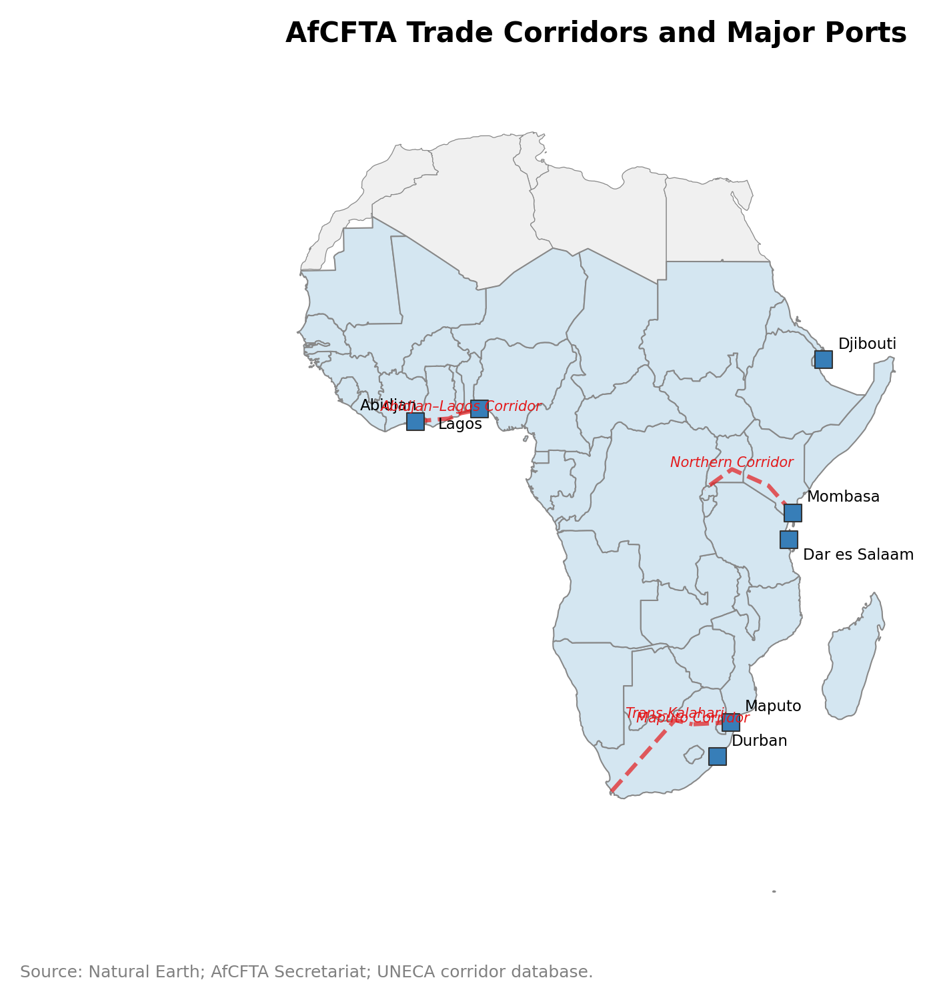
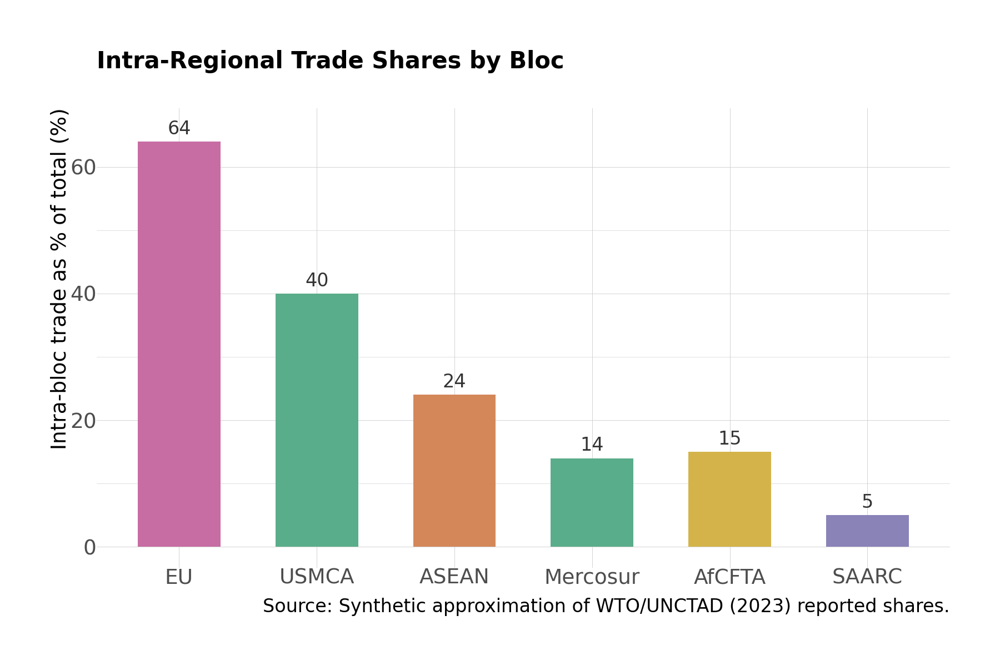

# Chapter 14: The AfCFTA, Regional Hegemons, and Functional Corridors

*Source: Natural Earth; AfCFTA Secretariat; UNECA corridor database.*

---

## Introduction: The Container That Cannot Cross the Continent

Shipping a standard 20-foot container from Durban, South Africa, to Mombasa, Kenya -- about 4,500 kilometers by sea along the African coast -- cost $1,800 in 2023 and took 18--22 days (World Bank LPI 2023). Shipping the same container from Durban to Rotterdam -- 11,000 kilometers via the Cape of Good Hope or the Suez Canal -- cost $1,200 and took 16--18 days (Freightos 2023). The absolute figures fluctuate with global freight markets, but the relative pattern is structural: it was cheaper and faster to send goods from Africa to Europe than from one African port to another.

This is not a shipping anomaly. It is a condensed expression of Africa's fundamental spatial-economic problem: internal connectivity is worse than external connectivity, and the cause is institutional, not geographic. The Durban-Rotterdam route operates on standardized contracts with electronic documentation, customs pre-clearance, and predictable port handling. The Durban-Mombasa route involves fewer direct services, smaller vessels, less frequent schedules, port congestion at both ends, and customs procedures that vary by country.

The African Continental Free Trade Area, which entered implementation in January 2021, is the most ambitious attempt to fix this. With 54 signatories, 1.4 billion people, and $3.4 trillion in combined GDP (AfCFTA Secretariat 2023), it is the world's largest free trade area by membership. It is also the most complex trade agreement ever attempted, because it must nest within -- and partially supersede -- eight existing Regional Economic Communities, each with its own tariff schedules, rules of origin, and institutional architecture.

---


**Functional Corridor.** A functional corridor is not merely a transport route but an integrated institutional system: a set of agreements, procedures, enforcement mechanisms, and infrastructure investments that together determine how easily goods and people can move between two or more countries along a specific geographic path. The concept --- developed by the World Bank's Africa Transport practice and TradeMark Africa --- holds that the corridor, not the country or the continent, is the natural unit of institutional reform for African trade. The Northern Corridor (Mombasa--Kampala--Kigali) is the canonical example: its reforms reduced transit time from 22 days to 6 days through process changes, not new roads.


## 14.1 Africa's Border Effect: Institutional, Not Tariff-Based

### The Puzzle of Low Intra-African Trade

Intra-African trade — the share of total African exports destined for other African countries — was 15 percent in 2023 (UNCTAD 2024). This is the lowest continental share in the world. The AfCFTA is expected to increase intra-African trade by nearly 52 percent by 2035 (UNECA 2024). For comparison, intra-European trade is around 68 percent, intra-Asian trade is 58 percent, and intra-North American trade is 40 percent (UNCTAD 2024). Even intra-South American trade (20 percent) exceeds the African figure, despite South America's smaller population and more limited institutional integration.

The standard explanation is that African countries produce similar primary commodities (oil, minerals, agricultural raw materials) for which the natural trading partners are industrial economies in Europe, North America, and Asia, not other primary producers. There is truth in this: Nigeria, Angola, and Equatorial Guinea all export crude oil; Ghana, Côte d'Ivoire, and Cameroon all export cocoa; Zambia, the DRC, and South Africa all export copper and other base metals. The gravity model predicts that trade is proportional to the product of GDPs and inversely proportional to distance and trade costs — and when GDPs are small and trade costs are high, the predicted bilateral trade volumes between African neighbors are correspondingly small.

But this explanation is incomplete. It does not account for the potential trade in manufactured goods and processed agricultural products that *would* flow between African countries if the trade costs were lower. The UN Economic Commission for Africa (UNECA) estimates that intra-African trade in manufactured goods is 60 percent below the level predicted by a gravity model that controls for income, distance, and product composition. The gap is the border effect — the additional cost of crossing an African border beyond what distance and income would predict — and it is the largest border effect for any continental grouping.

### Decomposing the Border Effect

The border effect in African trade decomposes into three components that are analytically distinct but empirically intertwined:

**Tariffs.** Tariffs on intra-African trade are already low under existing Regional Economic Communities (RECs). The East African Community (EAC) eliminated internal tariffs on most goods by 2010. The Southern African Development Community (SADC) has a free trade area covering 85 percent of intra-SADC trade. The Economic Community of West African States (ECOWAS) operates a common external tariff and a trade liberalization scheme. The AfCFTA's Protocol on Trade in Goods commits signatories to eliminate tariffs on 90 percent of tariff lines (with 7 percent "sensitive" and 3 percent "excluded" categories), but since most intra-African trade already occurs under REC preferences, the marginal tariff reduction from AfCFTA implementation is modest — the World Bank estimated in 2020 that full AfCFTA tariff liberalization would increase intra-African trade by 15–25 percent (World Bank 2020), a meaningful but not transformative gain.


**Rules of Origin: The Hidden Barrier.** Rules of origin (ROOs) determine whether a product qualifies for preferential tariff treatment under a trade agreement. A product must demonstrate that it was substantially produced within the free trade area, not merely transshipped from outside. For small and medium African enterprises, the documentation burden of proving origin --- certificates, value-addition calculations, supplier records --- can exceed the value of the tariff preference itself. The AfCFTA's ROO negotiations for key product categories (textiles, automotive, processed foods) remain among the most contested elements of Phase I implementation, because they determine which countries' firms can actually benefit from tariff liberalization.


**Non-tariff barriers (NTBs).** These are the main impediment. NTBs include divergent product standards (a product certified for sale in Kenya may not be accepted in Tanzania without separate testing), sanitary and phytosanitary measures (agricultural exports face different pest-control and food-safety requirements at every border), rules of origin (proving that a product qualifies for preferential treatment requires documentation that many small and medium enterprises cannot produce), import licensing (some countries require advance permits for specific products), and government procurement preferences that exclude firms from other African countries. The AfCFTA's Annexes on NTBs, Technical Barriers to Trade, and Sanitary/Phytosanitary Measures address these barriers on paper — but implementation requires national regulatory agencies to harmonize their standards, recognize each other's certifications, and build the testing and inspection infrastructure that mutual recognition demands.


**One-Stop Border Posts (OSBPs).** An OSBP replaces the traditional sequential border-crossing model --- stop at Country A's exit post, drive to Country B's entry post, repeat documentation --- with a single shared facility where both countries' customs, immigration, and standards agencies operate side by side. Traders stop once, present documents once, and receive clearance from both countries simultaneously. The OSBP at Malaba (Kenya--Uganda) reduced average crossing time from 2--3 days to 4--8 hours. OSBPs are the most visible institutional innovation on Africa's reformed trade corridors.


A barrier at least as significant as tariffs is currency fragmentation. Intra-African trade is conducted across more than 40 national currencies, most of which are not directly convertible. A Nigerian manufacturer paying an Ethiopian supplier must typically convert naira to dollars and then dollars to birr — paying two foreign exchange spreads and bearing settlement risk at each stage. The Pan-African Payment and Settlement System (PAPSS), launched in January 2022 by Afreximbank, aims to address this by enabling direct currency-to-currency settlement across African central banks, potentially saving the continent an estimated $5 billion annually in transaction costs (Afreximbank 2022). Whether PAPSS achieves the adoption threshold needed to become the default settlement infrastructure — rather than another institutional initiative that exists on paper but not in practice — will depend on whether African central banks are willing to cede the foreign exchange revenue they currently earn from dollar-intermediated transactions.

**Trade facilitation costs.** Even when tariffs are zero and regulatory standards are harmonized, goods must physically cross the border — and this is where Africa's institutional deficit is most acute. Customs clearance at major African borders averages 5–7 days, compared to 2–3 days in ASEAN and under 24 hours in the EU (World Bank LPI 2023). The delay is produced by manual documentation (paper manifests, handwritten inspection reports), duplicative inspections (the same consignment is inspected on both sides of the border), unpredictable procedures (which documents are required, and in what format, may change without notice), and informal payments — the "facilitation fees" that customs officers, police, and other officials extract from traders at border posts, roadblocks, and weigh stations. TradeMark Africa estimated in 2019 that informal payments add about $500–$1,500 per truck per border crossing on the major East African corridors (TradeMark Africa 2019) — a tax that falls disproportionately on small traders and perishable goods.

The AfCFTA's Protocol on Trade Facilitation and the African Union's Programme for Infrastructure Development in Africa (PIDA) address these costs. But the implementation gap between protocol text and border-post reality is vast. The protocol requires electronic customs declarations, risk-based inspection (inspecting only high-risk consignments rather than everything), and coordinated border management (joint processing by both countries' agencies at a single facility). These are exactly the reforms that the Northern Corridor implemented between 2012 and 2023, reducing transit times from 22 days to 6 days. The question is whether the Northern Corridor experience can be replicated at continental scale — across 107 land borders, dozens of languages, and 54 different legal and regulatory traditions.

### The Gravity Model Evidence

The gravity model provides the standard framework for measuring border effects. In its structural form (Anderson and Van Wincoop, 2003), bilateral trade between countries $$i$$ and $$j$$ is:

$$
X_{ij} = \frac{Y_i \cdot Y_j}{Y_W} \cdot \left(\frac{t_{ij}}{P_i \cdot P_j}\right)^{1-\sigma}
$$

where $$Y_i$$ and $$Y_j$$ are GDPs, $$Y_W$$ is world GDP, $$t_{ij}$$ is the bilateral trade cost, $$P_i$$ and $$P_j$$ are multilateral resistance terms (each country's average trade cost with all partners), and $$\sigma$$ is the elasticity of substitution.

The border effect is the estimated coefficient on a dummy variable for whether $$i$$ and $$j$$ share a land border, controlling for distance, GDP, and multilateral resistance. For African country pairs, the border coefficient implies trade costs equivalent to a tariff of 40–80 percent — far above the actual tariff rates, which average 5–15 percent. The difference between the implied tariff-equivalent border cost and the actual tariff is the institutional border effect: the cost of customs delays, NTBs, informal payments, and regulatory uncertainty.

The Data in Depth box at the end of this chapter extends this analysis by introducing corridor-specific fixed effects. The key finding is that country pairs connected by a functional trade corridor (the Northern Corridor, the Trans-Kalahari, the Maputo Development Corridor) have significantly lower border effects than non-corridor pairs at comparable distances — and the difference measures what this chapter calls the "corridor-governance dividend."

### The Cost Anatomy: What the Container Actually Pays

To make the border effect concrete, consider the cost of moving a standard 20-foot container from Nairobi to Kigali — 1,400 kilometers by road, crossing two international borders.

**Post-reform (2023):** Freight charges: $1,500–$2,000. Port handling, customs brokerage, and documentation: $400–$750. Total formal cost: $2,000–$2,800 per TEU.

**Pre-reform (2010):** Freight charges were similar, but total cost doubled. Customs brokerage required separate agents at four customs events: $400–$800. Detention charges at border posts (3–4 days at Malaba): $500–$1,200. Informal payments at 15–25 roadblocks: $200–$800. Spoilage for perishable goods over a 22-day transit: routinely $500+. Total effective cost: $3,500–$5,500 per TEU.

The cost reduction was achieved entirely through institutional reform. The road, the trucks, and the distance are unchanged. What changed was the number of times the container was stopped, inspected, documented, and subjected to extraction. This is the institutional border effect in its purest form.

---

## 14.2 Informal Cross-Border Trade: An Institutional System, Not a Residual

### The Scale of the Invisible

Official trade statistics capture only the formal economy — goods that pass through customs, are documented on manifests, and enter the statistical record. In much of Africa, this represents a fraction — sometimes a small fraction — of the actual cross-border economic exchange. Informal cross-border trade (ICBT) encompasses all commercial activity that crosses international borders without being captured by customs administration: small-scale traders carrying agricultural produce, manufactured goods, and consumer items across borders on foot, bicycle, or small vehicle, without formal customs declarations.

ICBT is not marginal. In the Great Lakes region (the DRC-Rwanda-Uganda-Burundi quadrilateral), ICBT accounts for an estimated 30–70 percent of total cross-border economic exchange, depending on the border post and the methodology used to estimate it. The UN World Food Programme estimated in 2018 that ICBT in staple foods across the DRC-Rwanda border at Goma-Gisenyi exceeded $100 million annually — a flow that is invisible in UN Comtrade data but critical to food security in both countries. In the Sahel (the Nigeria-Niger-Cameroon-Chad quadrilateral), ICBT in livestock, grain, and consumer goods is estimated to equal or exceed formal trade in the same products. In West Africa more broadly, the ECOWAS Commission estimated in 2020 that ICBT accounts for nearly 40 percent of total intra-ECOWAS trade.

These are not precise numbers. ICBT estimation relies on indirect methods — surveys of traders at border posts, comparison of official trade statistics with consumption data (the "mirror statistics" approach), observation studies that count traders and estimate the value of their goods — and the confidence intervals are wide. But the qualitative conclusion is robust: any analysis of African cross-border trade that relies only on official statistics is missing a substantial, perhaps dominant, share of the actual economic activity.

### ICBT as Institutional Adaptation

The analytical error that most policy discussions commit is to treat ICBT as a problem to be eliminated — either by formalization (bringing traders into the customs system) or by enforcement (preventing them from crossing borders outside official posts). This framing misunderstands what ICBT is.

Informal cross-border trade operates through non-state institutional frameworks that provide the core functions of any trade system: contract enforcement, information, credit, and dispute resolution. In the Great Lakes region, much ICBT is organized through ethnic and kinship networks that span national borders — networks that predate the borders themselves, which were drawn by European colonial powers with no regard for existing economic geographies. A trader in Goma (DRC) who buys agricultural produce from suppliers in rural North Kivu and sells it in Gisenyi (Rwanda) operates within a network of Congolese and Rwandan Hunde, Nande, or Hutu traders who know each other, trust each other (or know the social consequences of betraying trust), and can extend credit, resolve disputes, and share market information across the border.

Aker (2010) documented a parallel system in West Africa: mobile phone adoption among grain traders operating across the Niger-Nigeria border reduced price dispersion by 10–16 percent and reduced information asymmetries that had previously made small-scale cross-border trade costly and risky. Subsequent work on ethnic trade networks (particularly Hausa traders operating across the Nigeria-Niger border) has shown that these networks reduce information asymmetries and contract-enforcement costs that make formal trade prohibitively expensive for small traders — traders within the same ethnic network obtain better prices, trade in larger volumes, and experience fewer losses from default or fraud than traders operating outside ethnic networks (Fafchamps 2004). The ethnic network functions as an informal institution — a set of shared norms, enforcement mechanisms, and information channels — that substitutes for the formal legal and regulatory institutions that are absent or inaccessible at the border.

Community-based credit systems — the East African *Salongo* cooperatives, the Yoruba *esusu*, the Hausa *adashi* — reinforce these networks by pooling savings and extending rotating credit in environments where formal banks will not lend to informal businesses.

### Policy Implications

The policy implication is stark: any AfCFTA implementation strategy that criminalizes or ignores ICBT destroys institutional capital without replacing it. The more productive approach, exemplified by the Simplified Trade Regime (STR) piloted in the EAC and COMESA, creates a low-cost entry point to the formal system. The STR allows traders moving goods below $2,000 per consignment to clear customs using a simplified certificate of origin and a single-page declaration. This is institutional design that works *with* the existing informal system rather than against it.

The right metric for AfCFTA success is not the elimination of ICBT but its gradual integration: as formal trade costs fall, more traders will voluntarily use formal channels because the cost of formalization drops below the cost of informality. The persistence of high ICBT shares after implementation would signal that formal institutions remain too costly or too unreliable to attract voluntary compliance.

### The Gender Dimension

Any analysis of ICBT that ignores gender is analytically incomplete. Women account for an estimated 70–80 percent of informal cross-border traders in Sub-Saharan Africa (UNCTAD 2019). The proportion is highest for agricultural products — women dominate the cross-border trade in staple foods (maize, beans, cassava, vegetables) in the Great Lakes and Southern African regions — and for small-scale consumer goods. Men dominate the higher-value informal trade in electronics, fuel, and vehicles.

The gendered structure of ICBT reflects the gendered structure of the formal economy. Women have less access to the capital, documentation, and institutional connections required for formal trade. They are more likely to lack national identification documents (a prerequisite for customs clearance in many countries), bank accounts (required for duty payment in formal channels), and the social networks with customs officials that facilitate rapid clearance. The result is that women traders bear a disproportionate share of the costs of Africa's institutional border effect — they wait longer at borders, pay more in informal fees relative to the value of their goods, and are more vulnerable to harassment and extortion by border officials.

The AfCFTA's gender provisions — the Declaration on Women in Trade and the commitment to gender-responsive trade facilitation — acknowledge this reality. But implementation requires specific institutional measures: designated fast-track lanes for small-scale traders at border posts (which several COMESA borders have piloted); elimination of requirements that are disproportionately burdensome for women traders (such as multiple identity documents, which women in some countries are less likely to possess); and safe market facilities near border posts that reduce the vulnerability of traders who must wait overnight for customs processing.

The STR's potential impact is particularly significant for women traders, who are disproportionately represented among the small-scale traders who qualify for simplified procedures. If the STR reduces the cost and risk of crossing a border for a woman carrying $500 of agricultural produce — which it demonstrably does where implemented — it addresses both a trade-facilitation objective and a gender-equity objective simultaneously. This is not an add-on to the AfCFTA agenda; it is central to whether the agreement improves the livelihoods of the populations most affected by Africa's border effect.

---

## 14.3 Regional Hegemons and Asymmetric Spillovers

### The Hub-Spoke Structure

Three countries dominate their sub-regional economies in a manner that shapes the political economy of continental integration: South Africa in SADC, Nigeria in ECOWAS, and Kenya in the EAC. Each functions as a regional hegemon — a disproportionately large economy whose firms, banks, and institutions structure economic activity across neighboring countries. The hegemon's relationship with its neighbors is not symmetric partnership but hub-spoke dominance: trade flows, investment, and institutional standards radiate outward from the hegemon, and the neighbors' economies are structured in relation to the hegemon rather than in relation to each other.

**South Africa and SADC.** South Africa's GDP (around $380 billion in 2023) (World Bank 2024) exceeds the combined GDP of all other SADC members. Its firms dominate regional markets in retail (Shoprite operates over 2,900 stores across close to 11 African countries (having exited Nigeria and Kenya), with the majority in SADC), banking (Standard Bank and FirstRand are the largest banks in multiple SADC countries), mining (Anglo American, Gold Fields, Impala Platinum), telecommunications (MTN, Vodacom), and media. The Southern African Customs Union (SACU) — the world's oldest customs union, established in 1910 — integrates Botswana, Lesotho, Namibia, Eswatini, and South Africa into a single customs territory, but the terms of integration overwhelmingly favor South Africa: the common external tariff is set by South Africa's industrial policy, the revenue-sharing formula distributes customs receipts based on a methodology that South African Treasury administers, and the smaller members' industrial development is constrained by competitive pressure from South African firms that have scale advantages, superior logistics, and preferential access to South African capital markets.

**Nigeria and ECOWAS.** Nigeria's economy ($360–390 billion in 2023 at post-float exchange rates; the naira's sharp depreciation in 2023–2025 reduced the dollar-denominated figure substantially, though the economy remains the largest in Africa by any measure) dominates West Africa by sheer size, but its institutional spillovers are more chaotic than South Africa's. Nigerian firms — particularly in petroleum, telecommunications (MTN Nigeria, Globacom), and banking (Access Bank, Zenith Bank, UBA) — are expanding across ECOWAS members. But Nigeria's economic dominance is tempered by its institutional weaknesses: the naira's chronic instability (multiple devaluations and a dual exchange rate), regulatory unpredictability (sudden import bans, foreign exchange restrictions), and infrastructure deficits (the Lagos-Abidjan corridor remains one of the most congested and poorly maintained trade routes in West Africa despite connecting the region's two largest economies). Nigeria's informal border trade with Niger, Cameroon, and Benin is enormous — smuggling of petroleum products, rice, and used vehicles across Nigeria's borders is estimated to exceed $10 billion annually (ECOWAS Commission 2020) — but this informal integration coexists with formal trade barriers that Nigeria periodically raises (as with the unilateral border closure of August 2019–December 2020, which disrupted trade across the entire region).

**Kenya and the EAC.** Kenya's economy (about $110 billion) is smaller than South Africa's or Nigeria's, but its institutional influence within the EAC is disproportionate. Kenyan banks (Equity Bank, KCB Group, Cooperative Bank) are the dominant financial institutions in Uganda, Rwanda, and South Sudan. Kenyan agricultural firms and processors (Del Monte, Bidco, Brookside Dairy) are the largest in the region. Nairobi's role as the regional technology hub — hosting the offices of Google, Microsoft, IBM, and dozens of international organizations — gives Kenya an information and services advantage that no EAC partner can match. The Northern Corridor (Mombasa-Nairobi-Kampala-Kigali) is Kenya's economic artery and, simultaneously, the lifeline for landlocked Uganda, Rwanda, and Burundi, creating a dependency relationship in which the landlocked countries' trade costs are substantially determined by Kenya's port efficiency, customs administration, and road quality.

### Asymmetric Integration: The Enclave Problem

The common feature across all three hegemons is that their regional economic integration generates asymmetric spillovers. The hegemon's firms enter regional markets, capture market share, and repatriate profits — but the backward linkages to local suppliers, the technology transfer to local firms, and the employment generation in neighboring countries are weak. This replicates, at the continental scale, the enclave dynamics that Chapter 5 documented for resource extraction in Latin America.

South African retailers in SADC illustrate the pattern. Shoprite's expansion into Zambia, Mozambique, Angola, and the DRC brought modern retail formats, reliable cold chains, and consumer access to a broader product range. But the stores' supply chains run overwhelmingly back to South Africa: processed foods, household goods, and consumer electronics are sourced from South African producers and distributors. Local suppliers in the host countries are squeezed out by the price and quality competition from South Africa's larger, more efficient firms. The result is a retail corridor that connects South African producers to African consumers, with limited productive integration of the host-country economy. The employment generated is primarily low-wage retail work; the value addition — processing, packaging, logistics management — remains in South Africa.

Nigerian banks in ECOWAS show a similar pattern. Access Bank, UBA, and Zenith Bank operate across West Africa, but their lending in host countries is concentrated in trade finance (facilitating imports and exports) and government securities (buying sovereign debt), with limited lending to local manufacturing, agriculture, or SMEs. The banks' risk management systems, technology platforms, and skilled employees are based in Lagos; the host-country operations are branch offices that collect deposits and channel them into activities that serve the bilateral trade relationship with Nigeria rather than the host country's structural transformation.

The asymmetry is not merely commercial — it is institutional. When South African or Kenyan firms enter a regional market, they bring their home-country institutional expectations (contract terms, accounting standards, corporate governance practices) and impose them on local counterparts. This can raise institutional quality in the host country (a Zambian supplier that meets Shoprite's quality standards is better positioned to enter other supply chains). But it can also create a dual institutional environment — a formal, internationally connected sector operating under the hegemon's standards, and an informal, locally oriented sector operating under traditional norms — that mirrors the dual economies described in Chapters 5 and 12.

### Quantifying the Asymmetry

The trade data bear out the hub-spoke pattern. In the EAC, Kenya's exports to Uganda, Tanzania, and Rwanda combined exceed the reverse flows by a factor of 2.5, with Kenya exporting higher-value-added manufactures while importing primary commodities. In SADC, South Africa runs persistent trade surpluses with every member except Angola and the DRC.

The investment asymmetry reinforces the trade asymmetry. South African FDI in SADC is overwhelmingly in services and resource extraction, not in manufacturing or agriculture in the host countries. Employment generated is primarily low-wage retail and extractive work; profits are repatriated; technology remains proprietary; supply chains run back to South African producers. The pattern mirrors what dependency theorists observed in Latin America — center-periphery integration that develops the center at the expense of the periphery — but with an African center (Johannesburg, Lagos, Nairobi) rather than a North Atlantic one.

### Hegemonic Rivalry and the AfCFTA

The political economy of the AfCFTA is shaped by the tension between these three hegemons and the smaller countries' fear of asymmetric integration. South Africa, Nigeria, and Kenya each want the AfCFTA to expand their firms' access to continental markets, but each resists provisions that would expose their domestic markets to competition from the other hegemons. Nigeria was the last major economy to sign the agreement (in July 2019, six months after the initial signing ceremony), in part because of fears that South African manufacturers and Kenyan service providers would undercut Nigerian firms in the West African market.

Smaller countries face a dilemma: they need the hegemons' capital, technology, and market access, but they fear being reduced to dependent peripheries in a hub-spoke system controlled from Johannesburg, Lagos, or Nairobi. The AfCFTA's institutional architecture — particularly its rules of origin, investment protocols, and competition policy — will determine whether continental integration is a rising tide that lifts all members or a mechanism that entrenches hegemonic advantages. The historical precedent is not encouraging: NAFTA/USMCA, as Chapter 4 documented, integrated Mexico into North American supply chains but concentrated the high-value-added activities in the United States and Canada. The European Union's structural and cohesion funds — the explicit transfers from rich to poor members that Chapter 9 examines — have no equivalent in the AfCFTA framework, which relies on market forces rather than fiscal redistribution to distribute the gains from integration.

The hegemon analysis above is incomplete without North Africa's two largest economies. Morocco has developed automotive value chains — anchored by Renault-Nissan's Tangier plant and Stellantis's Kenitra facility — that produce 535,000 vehicles in 2023 (OICA 2024), with capacity targets approaching 700,000, making it Africa's largest automobile manufacturer and a potential anchor for continental automotive supply chains under AfCFTA rules of origin. Egypt's manufacturing base in textiles, petrochemicals, and construction materials, combined with its Suez Canal logistics position, gives it a natural hub role linking African, Asian, and European trade. Neither country fits the Sub-Saharan hegemon typology: Morocco's industrial integration runs north to Europe, not south into ECOWAS; Egypt's trade orientation is Mediterranean and Gulf-facing. But the AfCFTA's transformative potential lies precisely in creating manufacturing linkages between North and Sub-Saharan Africa — the intra-African trade in manufactured goods that Section 14.1 identifies as 60 percent below gravity-model predictions. If Moroccan automotive components or Egyptian building materials flow south under AfCFTA preferences, the agreement will have achieved something no existing REC has delivered: productive integration across the Saharan divide.

*Source: Author's calculations based on UNCTAD (2023) and WTO Regional Trade Agreements database.*

Figure 14.3 compares intra-regional trade shares across major trading blocs — EU, ASEAN, NAFTA/USMCA, Mercosur, and Africa — highlighting the persistent gap between African intra-regional trade and the levels achieved by other regional integration arrangements.

*Source: Author's calculations based on UNCTAD and WTO data.*

---

## 14.4 Functional Corridors: The Unit That Works

### Why Corridors Outperform Countries

The trade corridor is not merely a transport route. It is an institutional system: a set of agreements, procedures, enforcement mechanisms, and infrastructure investments that together determine how easily goods and people can move between two or more countries along a specific geographic path. The "functional corridor" concept — developed by the World Bank's Africa Transport practice and by TradeMark Africa — holds that the corridor, not the country and not the continent, is the natural unit of institutional reform for African trade.

The logic is straightforward. Continental-scale reform (the AfCFTA) requires agreement among 54 countries with vastly different institutional capacities, political systems, and economic interests. National-scale reform depends on domestic political economy factors that vary enormously. But corridor-scale reform involves a small number of countries (typically 2–5) that share a specific economic interest — the efficient functioning of the corridor — and can negotiate targeted agreements that address the specific bottlenecks on that corridor. The corridor is large enough to generate meaningful trade-cost reductions but small enough to be institutionally manageable.

### The Evidence: Four Corridors

**The Northern Corridor (Mombasa–Nairobi–Kampala–Kigali–Bujumbura).** The most documented case of corridor-level institutional reform, detailed in this chapter's Institutional Spotlight. The NCTTCA and TradeMark Africa's reforms — electronic cargo tracking, single customs territory, one-stop border posts — reduced transit time from 22 days (2010) to 6 days (2023). Trade volumes increased by 40 percent (NCTTCA 2023). Night-lights data along the corridor show measurable brightening at border posts and logistics hubs, consistent with economic expansion driven by trade-cost reduction. The Northern Corridor demonstrates that institutional process reform — not infrastructure construction, not tariff reduction — was the primary barrier.

**The Maputo Development Corridor (Johannesburg–Maputo).** The 600-kilometer corridor connecting South Africa's Gauteng industrial heartland to Mozambique's Maputo port was rehabilitated in the late 1990s through a public-private partnership: the N4 toll road (the first cross-border PPP toll road in Southern Africa), the Maputo Port Development Company (a concession that modernized the port), and a bilateral agreement on customs coordination. The corridor's economic impact was substantial: Maputo port throughput increased from 1.5 million tons (1997) to over 20 million tons (2023) (MPDC 2023); industrial investment along the corridor (particularly the Mozal aluminum smelter) attracted billions in FDI; and the border post at Komatipoort-Ressano Garcia became one of the most efficient in Africa. The Maputo corridor demonstrates that corridor-level institutional reform can attract private investment and generate developmental spillovers — but also that the gains are concentrated along the corridor, with limited diffusion to the Mozambican hinterland.

**The Trans-Kalahari/Trans-Caprivi Corridor (Walvis Bay–Windhoek–Gaborone–Gauteng/Zambia).** Namibia's Walvis Bay port has been deliberately positioned as an alternative to South Africa's congested ports (Durban and Cape Town) for cargo destined for Botswana, Zambia, and the DRC. The corridor's success depends on institutional coordination between Namibia, Botswana, and South Africa — a coordination that the SACU framework facilitates. The Trans-Caprivi extension to Zambia has been slower to develop, partly because the Zambia-Namibia border crossing involves more complex regulatory coordination. But Walvis Bay's throughput has increased from 2 million tons (2010) to over 8 million tons (2023), demonstrating the viability of the corridor model even for less-heralded routes.

**The Abidjan-Lagos Corridor.** This 1,000-kilometer coastal route connects the two largest economies in West Africa through Ghana, Togo, and Benin. Unlike the East African corridors, which have benefited from significant institutional reform, the Abidjan-Lagos corridor remains plagued by the problems this chapter has documented: multiple customs inspections (goods crossing from Côte d'Ivoire to Nigeria pass through four borders), informal payments at roadblocks (the West Africa Trade Hub estimated over 30 roadblocks between Abidjan and Lagos in 2019), and incompatible vehicle and axle-load regulations that force transshipment at some borders. The corridor's unrealized potential — connecting 350 million consumers in the world's most rapidly urbanizing coastal zone — is the strongest argument for the AfCFTA's trade facilitation agenda. If the Abidjan-Lagos corridor could achieve the institutional efficiency of the Northern Corridor, the trade-creation effects would be transformative for West Africa.

| Corridor | Route | Key Products | Status |
|---|---|---|---|
| Northern Corridor | Mombasa--Nairobi--Kampala--Kigali--Bujumbura | Manufactures, fuel, agricultural goods | Reformed: transit time cut from 22 to 6 days (2010--2023); trade volumes up ~40% |
| Maputo Development Corridor | Johannesburg--Maputo (~600 km) | Aluminum, minerals, manufactured goods | Operational PPP; port throughput from 1.5M to 20M+ tons; enclave risk (Mozal) |
| Trans-Kalahari / Trans-Caprivi | Walvis Bay--Windhoek--Gaborone--Gauteng / Zambia | Bulk cargo, transit goods for landlocked states | Growing: Walvis Bay throughput 2M to 8M+ tons (2010--2023); Zambia extension slower |
| Abidjan--Lagos | Abidjan--Accra--Lomé--Cotonou--Lagos (~1,000 km) | Consumer goods, agricultural products, fuel | Unreformed: 4 borders, 30+ roadblocks, incompatible regulations; vast unrealized potential |

The contrast between the Northern Corridor and the Abidjan-Lagos Corridor is itself a natural experiment in institutional reform. Both are similar in length and connect economies of comparable size, but the Northern Corridor has benefited from two decades of sustained reform while the Abidjan-Lagos Corridor has not. A spatial difference-in-differences approach — comparing economic activity trajectories along the two corridors before and after the Northern Corridor reforms — could estimate the treatment effect of institutional reform on corridor-adjacent clustering.

### The Spatial Decay Function: How Far Does the Corridor Reach?

A critical question is how far from a trade corridor the economic benefits extend. Along the Northern Corridor, VIIRS night-lights data show a clear radiance gradient: average light intensity within 25 kilometers is nearly 3-5 times the intensity at 100 kilometers, controlling for urban status and population density. The gradient is steepest near border posts and logistics nodes and flatter in rural stretches, suggesting that the corridor's economic effect operates primarily through nodes — the places where goods are loaded, processed, stored, or transshipped — rather than through the road itself.

The Maputo Corridor illustrates the enclave risk: the Mozal aluminum smelter was attracted by corridor infrastructure but imports alumina from Australia, processes it with dam electricity, and exports ingots through Maputo port — generating GDP without diffuse economic activity. This is the corridor version of the resource-curse enclave described in Chapter 5.

The policy implication is that corridors need complementary interventions to broaden their impact: agricultural market linkages connecting smallholders to export supply chains, and industrial parks at corridor nodes. The corridor provides the transport backbone; the complementary institutions provide the productive connections to the hinterland.

### The Corridor-Governance Dividend


**The Corridor-Governance Dividend.** The difference in border-effect magnitude between corridor-connected country pairs and non-corridor pairs at comparable distances and income levels. If a functional corridor reduces trade costs through institutional quality at the border --- electronic cargo tracking, one-stop border posts, coordinated customs --- rather than through shorter distances or different products, then the dividend measures the pure institutional contribution of corridor governance to trade facilitation. The Northern Corridor's reforms demonstrate that process improvements alone (not new roads or tariff cuts) can cut transit times by two-thirds.


The concept of a "corridor-governance dividend" is the analytical bridge between this chapter's institutional argument and Lab 6's spatial econometric framework. The dividend is defined as the difference in border-effect magnitude between corridor-connected country pairs and non-corridor country pairs at comparable distances and income levels. If the corridor reduces trade costs by improving institutional quality at the border — not by reducing distance or changing the products traded — then the dividend measures the pure institutional contribution of corridor governance to trade facilitation.

The gravity model framework makes this testable. Augmenting the standard gravity equation with corridor-connection indicators and corridor governance measures (LPI customs sub-scores, UNCTAD facilitation indicators, TMEA dwell-time data), the analyst can estimate whether corridor-connected pairs trade more than non-corridor pairs after controlling for income, distance, and product composition. The Data in Depth box at the end of this chapter provides the estimation protocol.

The institutional variable for this chapter — `corridor_governance_index_rt` — operationalizes this concept by combining:

- Afrobarometer trust-in-local-government and service-delivery quality responses, aggregated to country-year level.
- Logistics Performance Index (LPI) customs sub-score, measuring formal border-crossing efficiency.
- UNCTAD Digital and Sustainable Trade Facilitation survey indicators for digital customs, single-window implementation, and transit facilitation.
- Corridor-specific dwell-time data from TradeMark Africa where available.

The spatial interaction term `corridor_governance_index_rt × W*night_lights_rt` tests whether governance quality conditions the spatial clustering of economic activity along trade corridors. If the interaction is positive and significant, good corridor governance amplifies the agglomeration benefits of corridor proximity — the institutional complement to the infrastructure.

### Eco-Tourism Corridors: Services, Conservation, and Cross-Border Governance

Eco-tourism is the most spatially fixed of Africa's services exports — its supply is literally anchored to landscapes that cannot be relocated. The Serengeti-Masai Mara ecosystem, the KAZA Transfrontier Conservation Area (spanning five Southern African countries), and the Virunga gorilla habitat (spanning Rwanda, the DRC, and Uganda) all require cross-border institutional coordination to realize their economic potential.

The KAZA UniVisa, introduced in 2014, is the most direct example of tourism-corridor institutional design. By allowing visitors to cross between member states on a single $50 visa, the UniVisa removed administrative friction that had made multi-country wildlife itineraries prohibitively cumbersome, with independent estimates attributing a 15-20 percent increase in corridor-wide arrivals to the reform (KAZA Secretariat, 2015). Revenue sharing remains the governance challenge the UniVisa did not solve. Kenya's community conservancy model allocates lodge fees directly to Maasai landowners, aligning incentives with conservation; Tanzania's national-park model concentrates revenues within TANAPA, contributing to persistent human-wildlife conflict along the Serengeti boundaries (Homewood et al., 2009).

The Virunga gorilla-trekking tri-border illustrates both the potential and fragility of eco-tourism corridors. Rwanda's mountain-gorilla permits ($1,500 per person) generate around $20 million annually, while the DRC's Virunga National Park — home to one-third of the world's remaining mountain gorillas — has been unable to generate comparable revenues due to persistent armed conflict in North Kivu. The same natural asset produces radically different economic outcomes depending on the security and governance environment.

The AfCFTA's Protocol on Trade in Services covers tourism as a priority sector, but the specific governance instruments that eco-tourism corridors require — joint conservation trusts, coordinated permitting systems, and revenue-sharing formulae — are functional, corridor-specific arrangements that resemble the NCTTCA model for goods trade.

---

## 14.5 The Protocol on Trade in Services: Integration Beyond Goods

### Why Services May Matter More Than Goods

The AfCFTA's Protocol on Trade in Goods has attracted most analytical attention, but there is a credible case that the Protocol on Trade in Services (PTSS) — approved in framework form in 2019 and under sector-by-sector negotiation since — will be more economically transformative. The argument rests on the structural profile of African urban employment. As Chapter 13 documented, African cities are generating service-sector jobs faster than manufacturing jobs, and the services that are growing — mobile finance, digital platforms, logistics, professional services, and tourism — are more readily tradable across borders than the agricultural and light-manufacturing activities that dominated earlier development models.

The PTSS covers five priority sectors: business services (including professional services such as engineering, accounting, and legal services), communication services (including telecommunications and broadband infrastructure), financial services (banking, insurance, and mobile money), tourism (accommodation, travel agencies, and the eco-tourism corridors discussed above), and transport services (freight, logistics, and air connectivity). These sectors were not chosen arbitrarily — they represent the activities where existing barriers impose the largest welfare costs and where regional integration would most rapidly expand Africa's traded-services base. (Chapter 8's analysis of India's STPI model and Mode 1/4 taxonomy provides a comparative framework for assessing Africa's services trade potential.)

### Financial Services and Mobile Money Interoperability

Financial services is where the gap between the PTSS's formal ambitions and Africa's existing digital-finance reality is most instructive — and where the policy stakes are highest. African mobile money platforms have already achieved a depth of cross-border financial integration that conventional bank regulation has not matched. M-Pesa (Kenya), MTN Mobile Money (operating across 16 African countries), and Orange Money (12 countries) facilitate remittances, merchant payments, and working-capital transactions at a scale that formal bank transfers cannot approach. The GSMA estimated that mobile money platforms processed $836 billion in transactions across Sub-Saharan Africa in 2022 (GSMA 2023) — a figure that dwarfs intra-African formal bank-to-bank transfers.

But this informal integration is structurally fragile. Mobile money interoperability across national borders depends on bilateral agreements between platform operators, which are inconsistently in place: a trader in Kigali can send funds to Nairobi via M-Pesa, but sending from Kigali to Kampala requires a different pathway, and sending to Dakar involves multiple intermediary steps that add cost and latency. The PTSS's most consequential financial-services contribution would be a regulatory framework for mobile money interoperability that closes these bilateral gaps — creating a continental payment infrastructure that extends the seamless transaction capability of domestic systems to cross-border commerce. The African Union's Continental Data Policy (2022) addresses a related precondition: the data-localization requirements imposed by many member states fragment the digital infrastructure that seamless cross-border financial services require, and harmonizing data-flow rules — without abandoning privacy protection — is architecturally necessary for any continental payment network.

The most significant institutional response to this fragmentation is the Pan-African Payment and Settlement System (PAPSS), launched by Afreximbank and the AfCFTA Secretariat in January 2022. PAPSS enables African traders to settle cross-border payments in local currencies, bypassing the correspondent-banking circuit through London or New York that previously made even simple transactions expensive and slow. Before PAPSS, an Ivorian cocoa exporter selling to a Ghanaian processor converted CFA francs to dollars through a European correspondent bank, then converted dollars to cedis — a round-trip that added 3–5 days of settlement lag and extracted exchange-rate margins at each conversion. PAPSS allows direct CFA-cedi settlement, compressing both cost and time. By late 2024, the system was operational across most ECOWAS member states and expanding into East and Southern Africa. Within this chapter's framework, PAPSS is a corridor-governance tool: it reduces institutional friction in cross-border trade without requiring the politically intractable step of currency union or exchange-rate harmonization — achieving through payment infrastructure what monetary integration has failed to deliver.

### Banking Mode 3: Regional Integration Through Commercial Presence

Mode 3 services trade — commercial presence — already describes how South African and Kenyan banks have structured their continental expansion. Standard Bank operates across 20 African countries; Equity Bank (Kenya) in 7; Ecobank in 33. These institutions provide the skeletal framework of an emerging continental financial system, but they operate under a patchwork of national banking regulations that impose duplicative capital requirements and inconsistent prudential standards.

The PTSS's Mode 3 commitments would, in principle, allow banks authorized in one AfCFTA member to establish branches in others with streamlined licensing — the African equivalent of the EU's banking passport. Equity Bank's expansion carried the M-Shwari savings-and-loan model to markets where conventional banks found retail lending unprofitable; lower Mode 3 barriers would accelerate comparable expansions. But the asymmetric-spillover risk from Section 14.3 applies: without technology-transfer provisions or local-partnership requirements in the investment protocol, services liberalization risks integrating African cities into a South African or Kenyan financial system while leaving local institutional capacity underdeveloped.

### Professional Services and Mutual Recognition

The professional services component of the PTSS addresses barriers that prevent African engineers, doctors, accountants, and lawyers from practicing across borders. These barriers are substantial. An engineer trained at the University of Cape Town cannot practice in Nigeria without re-sitting Nigerian professional examinations; a physician from the University of Nairobi requires additional certification to practice in Ghana; a lawyer admitted to the Rwandan bar cannot appear before Ugandan courts. These restrictions partly reflect legitimate consumer-protection concerns, but they also protect domestic professional associations from regional competition and prevent the spatial arbitrage in human capital that regional labor markets could otherwise generate.

Mutual Recognition Arrangements (MRAs) — the PTSS instrument for professional services — follow the EU model: rather than harmonizing national training programs, they allow competent authorities to recognize qualifications granted by accredited institutions in other member states. The SADC has achieved modest MRAs for engineers and nurses; the EAC has a nursing mobility framework; continent-wide professional MRAs remain absent. The stakes are high in health care above all: Sub-Saharan Africa averages close to 2 physicians per 10,000 population, against the WHO's minimum target of 23 health workers (physicians, nurses, and midwives combined) per 10,000 needed to achieve basic primary care coverage, and the distribution is highly unequal — South Africa, Kenya, and Egypt approach middle-income physician densities while most of West and Central Africa remains far below the threshold (World Bank, 2023). A functioning continental MRA for physicians would allow licensed practitioners from well-endowed systems to serve the most underserved populations — a spatial redistribution of human capital that faces primarily regulatory, not transport, barriers.

---

## 14.6 Lab 6 and the Corridor-Activity Nexus

### Extending the Two-Step Procedure

Chapter 13 introduced Lab 6's two-step Moran's $$I$$ procedure: (1) compute global Moran's $$I$$ on raw night-lights radiance to measure spatial clustering of economic activity, then (2) residualize night-lights on governance quality and re-compute Moran's $$I$$ to measure the institutional contribution to clustering. The decline $$\Delta I = I_\text{raw} - I_\text{residual}$$ measures the share of spatial autocorrelation attributable to governance.

This chapter proposes a corridor extension. The hypothesis is that governance quality matters more for economic clustering *along corridors* than *away from them*. The logic is that corridors are the channels through which spatial spillovers actually operate in Africa — the trade route through which one country's economic activity stimulates demand for another country's exports. If governance quality at the border determines how efficiently the corridor transmits spillovers, then governance should have a stronger effect on clustering in corridor-adjacent regions than in regions distant from any corridor.

The test requires an additional variable: corridor proximity. For each observation (country or sub-national region, depending on the spatial resolution), define a binary or continuous measure of proximity to a major trade corridor. Lab 6's adjacency-based weight matrix $$W$$ can be augmented with corridor-connectivity weights: the weight $$w_{ij}$$ between countries $$i$$ and $$j$$ is higher if they are connected by a functional corridor than if they share a border but lack corridor infrastructure.

The extended analysis would proceed in three steps:

**Step 1: Raw Moran's $$I$$.** As in Chapter 13 — compute global $$I$$ on night-lights radiance. This establishes the baseline: economic activity clusters spatially.

**Step 2: Governance-residualized Moran's $$I$$.** As in Chapter 13 — residualize on governance quality and recompute. The decline measures the governance contribution.

**Step 3: Corridor-conditional analysis.** Split the sample into corridor-adjacent and non-corridor observations. Compute $$\Delta I$$ for each subsample. If $$\Delta I_\text{corridor} > \Delta I_\text{non-corridor}$$, governance explains more clustering along corridors than away from them — supporting the functional-corridor thesis.

An alternative specification avoids splitting the sample by including a triple interaction in a spatial regression framework: night-lights intensity as a function of governance quality, corridor proximity, and their interaction — all mediated by the spatial weight matrix. This is computationally more demanding but statistically more efficient and avoids the loss of power from sample splitting.

### Interpreting the Results in Context

The Lab 6 analysis should be interpreted with appropriate caution. Country-level analysis has limited statistical power (48-54 observations); sub-national analysis using VIIRS at the district level would increase the sample size but requires geocoded governance data and sub-national corridor mapping. The weight matrix choice matters: the adjacency-based $$W$$ from Chapter 13 captures physical proximity but not economic connectivity. A corridor-augmented $$W$$ that gives higher weight to corridor-connected pairs would sharpen the analysis but introduces researcher judgment. Lab 6's robustness runner should compare results across multiple $$W$$ specifications.

The analysis connects to Chapter 13's urbanization thesis. The city provides density (agglomeration); the corridor provides connectivity (trade facilitation). A city on a corridor can specialize in tradable goods and services because it can reach regional markets at manageable cost. A city off a corridor faces transport costs that confine it to local markets. The interaction between urban density and corridor connectivity is the spatial mechanism through which institutional reform translates into economic growth.

The corridor analysis faces an endogeneity challenge: corridors connect places that already had economic activity. Most major African trade corridors follow colonial-era transport routes designed for extraction, not for intra-African trade — a path-dependence effect (Chapter 2's framework). The Northern Corridor reforms channeled new investment along a pre-existing colonial route, reinforcing spatial concentration. Disentangling these effects requires temporal variation — before-and-after analysis of corridor reforms — which is feasible for the Northern Corridor (2010-2023) and the Maputo Corridor (1997-present).

---

## Data in Depth: Estimating the Corridor-Governance Dividend with Gravity Models

**Setting.** Estimate the border effect in intra-African bilateral trade using a structural gravity model, and test whether corridor-connected country pairs have lower border effects than non-corridor pairs.

**Datasets.** (1) UN Comtrade bilateral trade flows for all African country pairs (latest available year). (2) WDI GDP for income controls. (3) CEPII distance data (geodesic distance between capital cities) for the distance control. (4) LPI customs sub-scores for trade facilitation quality. (5) UNCTAD Trade Facilitation indicators for digital customs and single-window implementation. (6) A corridor-connection indicator: binary variable equal to 1 if the country pair is connected by a major trade corridor (Northern, Central, Trans-Kalahari, Maputo, Abidjan-Lagos, North-South).

**Protocol.**

Step 1: Estimate the baseline gravity model with PPML (Poisson Pseudo-Maximum Likelihood, which handles zero trade flows — a significant issue for African bilateral pairs, many of which report zero trade):

$$
X_{ij} = \exp\left[\beta_1 \ln Y_i + \beta_2 \ln Y_j + \beta_3 \ln d_{ij} + \beta_4 \text{Border}_{ij} + \gamma_i + \gamma_j\right] + \epsilon_{ij}
$$

where $$\gamma_i$$ and $$\gamma_j$$ are exporter and importer fixed effects (capturing multilateral resistance). The coefficient $$\beta_4$$ on the border dummy measures the average border effect in intra-African trade. Its tariff-equivalent is $$[\exp(-\beta_4 / (\sigma - 1)) - 1] \times 100\%$$, where $$\sigma$$ is calibrated from the trade literature (typically 4–8 for African trade).

Step 2: Add the corridor-connection indicator and its interaction with the border dummy:

$$
X_{ij} = \exp\left[\dots + \beta_4 \text{Border}_{ij} + \beta_5 \text{Corridor}_{ij} + \beta_6 (\text{Border}_{ij} \times \text{Corridor}_{ij})\right] + \epsilon_{ij}
$$

If $$\beta_6 > 0$$ (a positive interaction), corridor-connected pairs have a lower border effect than non-corridor pairs. The magnitude of $$\beta_6$$ relative to $$\beta_4$$ measures the corridor-governance dividend: the share of the border effect eliminated by corridor-level institutional reform.

Step 3: Replace the binary corridor indicator with the continuous `corridor_governance_index_rt` to test whether *governance quality* within the corridor drives the dividend, not merely the existence of the corridor infrastructure.

**Expected findings.** The baseline border effect ($$\beta_4$$) should be large and negative (implying tariff-equivalent costs of 40–80 percent). The corridor interaction ($$\beta_6$$) should be positive and significant, reducing the effective border cost for corridor-connected pairs by 20–40 percent. The governance-quality specification should show that the corridor dividend is concentrated in well-governed corridors (Northern, Maputo) and absent or small in poorly governed corridors (Abidjan-Lagos), confirming the institutional thesis.

**Student exercise.** Using UN Comtrade data (accessible through the `comtradeapicall` R package or the Comtrade API), replicate the gravity model for a specific REC (ECOWAS, EAC, or SADC) rather than the full continent. Does the within-REC border effect differ from the cross-REC border effect? If so, what does this tell you about whether RECs have succeeded in reducing institutional barriers among their members?

---

## Spatial Data Challenge: Mirror Statistics and the Measurement Trap in Intra-African Trade

Every gravity model analysis of intra-African trade — including the exercises recommended in the Data in Depth section — confronts a fundamental data quality problem. Intra-African bilateral trade statistics are systematically unreliable, and the gaps are correlated with exactly the research questions that economists and policymakers most want to answer.

**Mirror statistics divergence.** The most direct diagnostic is the mirror-statistics comparison: contrasting what country $$i$$ reports as exports to country $$j$$ against what country $$j$$ reports as imports from $$i$$. After adjusting for the systematic CIF/FOB difference (imports are typically recorded at cost-insurance-freight values, exports at free-on-board values, generating a predictable 10–15 percent gap), the two figures should approximate each other. For intra-African trade, they frequently do not. UNCTAD's analysis of 2015–2020 UN Comtrade data finds that African bilateral mirror-statistic divergence exceeds 50 percent of reported trade value in over 40 percent of country-pair observations — substantially worse than Africa-Europe or Africa-Asia pairs. For the DRC and its neighbors, the divergence routinely reaches 100–200 percent, reflecting weak or absent customs recording on at least one side of the border.

**What the gap measures.** Mirror-statistics divergence conflates three analytically distinct phenomena: (1) genuine statistical errors — different commodity classification systems, different recording timestamps, different boundary-definition practices; (2) informal trade flows — ICBT that one country records as an import (because the goods emerge at a formal market) but the other never records as an export (because no customs event occurs at origin); and (3) deliberate under-reporting — invoice manipulation, customs fraud, and transfer mispricing for tax avoidance. These have different policy implications: statistical errors call for capacity-building; informal flows call for the STR formalization strategy outlined in Section 14.2; deliberate fraud calls for enforcement. From outside the customs administration, looking at Comtrade alone, they are indistinguishable.

**Zero trade flows.** A related complication is the high frequency of zero trade flows in the intra-African Comtrade matrix. 35–40 percent of African bilateral country-pair observations report zero trade in a given year. Some are genuine zeros — no trade occurs. Many are recording zeros — trade occurs but customs administration lacks the capacity to process and transmit the records to Comtrade. The PPML estimator (recommended in the Data in Depth section) handles zeros in the dependent variable without bias, but it cannot reconstruct information about flows that never entered customs records in the first place. Gravity estimates for African corridors should therefore be interpreted as lower bounds on the true trade-cost reduction, since the measured trade understates actual activity.

**Remediation strategies.** Working with African trade data requires active quality management: (1) use the mirror-statistics divergence as a screening diagnostic, flagging pairs with divergence above 50 percent for sensitivity analysis or exclusion; (2) supplement Comtrade with UNCTAD's Informal Cross-Border Trade survey series for selected corridors (Great Lakes, SADC, and EAC have the best coverage); (3) use VIIRS night-lights intensity along the corridor as a proxy for actual economic activity in robustness checks, while respecting the gas-flare masking and saturation limitations documented in Chapter 13's Spatial Data Challenge box; and (4) report gravity estimates alongside a transparency statement on which observations were dropped or downweighted and why.

Lab 6's data-preparation pipeline (`prepare_lab6_inputs.py`, planned) will include a mirror-statistics divergence calculator for the African bilateral trade pairs used in the corridor-governance analysis. The script flags high-divergence pairs and outputs both a full dataset and a cleaned dataset that either excludes or downweights flagged observations, allowing students to assess how sensitive the corridor-governance estimates are to data quality decisions.

---

## Institutional Spotlight: TradeMark Africa and the Northern Corridor Revolution

The Northern Corridor Transit and Transport Coordination Authority (NCTTCA) was established by treaty in 1985 by Kenya, Uganda, Rwanda, Burundi, and the DRC. For its first 25 years, it was a paper organization — a secretariat that convened meetings, produced reports, and had negligible impact on the actual movement of goods along the corridor. The corridor remained one of the most expensive and slowest trade routes in the world: average transit time from Mombasa to Kigali was 22 days in 2010, of which only 3–4 days were actual driving time. The rest was waiting — waiting at the port for clearance, waiting at the border for inspection, waiting at roadside checkpoints for police to complete their extraction.

The transformation began in 2010 when TradeMark Africa (TMEA), a multi-donor development agency funded by the UK, US, Denmark, Finland, and other development partners, began a systematic program of institutional reform along the corridor. TMEA's approach was distinctive in two respects.

**First, it focused on process, not infrastructure.** The conventional approach to African trade facilitation was to build roads, expand ports, and construct border facilities — the assumption being that the physical bottleneck was the fundamental obstacle. TMEA's diagnostic was different: the roads were adequate (though maintenance was deferred), the ports had capacity (though it was badly managed), and the border posts had buildings (though the procedures conducted within them were absurdly inefficient). The binding constraint was institutional: the rules, procedures, and enforcement mechanisms that governed how goods moved through the physical infrastructure.

**Second, it worked at the corridor scale, not the national or continental scale.** TMEA negotiated specific agreements among 2–4 countries (Kenya-Uganda, Kenya-Uganda-Rwanda, or all Northern Corridor member states) on specific procedural changes at specific border posts. This allowed reforms to be tailored to the particular bottleneck — the customs IT system at Mombasa port required different solutions than the inspection regime at Malaba border post — and avoided the lowest-common-denominator problem that plagues continent-wide negotiations.

The reforms were implemented sequentially:

**Electronic Cargo Tracking System (ECTS), 2012–2014.** GPS-enabled electronic seals were attached to containers at Mombasa port. Customs authorities in Kenya, Uganda, and Rwanda could monitor the container's location in real time, eliminating the need for physical inspection at intermediate checkpoints. The ECTS reduced the average number of police and customs checkpoints encountered on the Mombasa-Kigali route from over 40 to fewer than 5, with each remaining checkpoint taking minutes rather than hours because the seal's integrity could be verified electronically.

**Revenue Authority Digital Cargo Processing, 2013–2016.** The Kenya Revenue Authority (KRA), Uganda Revenue Authority (URA), and Rwanda Revenue Authority (RRA) implemented interconnected electronic customs declaration systems. A declaration filed at Mombasa was transmitted electronically to the destination country's revenue authority, allowing pre-arrival clearance — the goods could be assessed and duties calculated before the truck reached the border, rather than after arrival (which had required the truck to park and wait while manual processing occurred). This single reform reduced border-crossing time at Malaba from 3–4 days to 6–12 hours.

**One-Stop Border Posts (OSBPs), 2014–2018.** At Malaba (Kenya-Uganda), Gatuna/Katuna (Uganda-Rwanda), and other crossings, the traditional sequential border crossing — stop at Country A's exit post, drive to Country B's entry post, repeat all documentation — was replaced by a single facility where both countries' customs, immigration, and standards agencies operated side by side. Traders now stop once, present documents once, and receive clearance from both countries simultaneously. The OSBP at Malaba reduced average crossing time from 2–3 days to 4–8 hours.

**Single Customs Territory (SCT) pilot, 2014–present.** The most radical reform: goods destined for Uganda or Rwanda are cleared once, at Mombasa port, under a single customs declaration assessed by the destination country's revenue authority operating remotely. The goods then move under electronic seal to the destination country without any further customs interaction. The SCT reduces the number of customs events from four (Mombasa export, Malaba import, Malaba export, destination import) to one — and shifts the entire clearance process from the border (where delays compound) to the port (where the goods are already waiting for ship discharge).

**Results.** Average transit time from Mombasa to Kigali fell from 22 days (2010) to 6 days (2023). Dwell time at Mombasa port fell from 11 days to 3 days. Informal payments at roadside checkpoints fell by an estimated 70 percent (because ECTS monitoring made it risky for police to delay sealed containers). Trade volumes on the Northern Corridor increased by about 40 percent between 2010 and 2023 (NCTTCA 2023).

The spatial evidence is visible from space. VIIRS night-lights composites for the border-post towns along the corridor — Malaba (Kenya-Uganda), Busia (Kenya-Uganda), and Gatuna (Uganda-Rwanda) — show statistically significant brightening between 2012 and 2023 relative to comparable small towns not located on the corridor. New warehousing, fuel stations, and service facilities have been built at the reformed border posts, generating local economic activity that is directly attributable to the institutional reform. The Northern Corridor experience is the strongest single piece of evidence in this book that institutional process reform can outperform both infrastructure investment and tariff liberalization as a development strategy — and it is the model that the AfCFTA must replicate at scale.

---

## Conclusion: The AfCFTA as Institutional Experiment

The African Continental Free Trade Area is the most ambitious institutional experiment in the history of African economic integration. Its success or failure will turn not on tariff schedules — which are already largely liberalized under existing RECs — but on whether it can reduce the institutional border effect that makes intra-African trade the most expensive in the world.

This chapter has argued that three conditions must be met:

**First, trade facilitation reform must prioritize corridors over countries.** The Northern Corridor experience demonstrates that targeted institutional reform — electronic cargo tracking, single customs territory, one-stop border posts — at specific bottlenecks produces larger trade-cost reductions than continent-wide tariff liberalization. The AfCFTA Secretariat should focus resources on replicating the Northern Corridor model along the Abidjan-Lagos, North-South, and Central corridors, rather than pursuing uniform implementation across all 107 land borders simultaneously.

**Second, informal cross-border trade must be integrated, not criminalized.** ICBT is an institutional system that provides contract enforcement, credit, and information to millions of traders who cannot access formal institutions. The Simplified Trade Regime provides a model for low-cost formalization that preserves the social capital of informal networks while gradually bringing traders into the formal system. Full formalization will follow naturally as formal trade costs fall below informal trade costs — but this requires the formal system to be faster, cheaper, and more reliable than the informal alternatives.

**Third, the asymmetric-spillover problem must be addressed institutionally.** The AfCFTA's competition policy protocol, investment protocol, and dispute settlement mechanism are the instruments through which smaller countries can protect themselves from hegemonic extraction. But these instruments require institutional capacity that many African countries lack — the capacity to investigate anti-competitive behavior, to negotiate investment agreements that include technology-transfer and local-content requirements, and to bring and defend cases before the AfCFTA dispute settlement body. The AfCFTA's success as a developmental (rather than merely commercial) agreement depends on building this capacity in the countries that need it most.

### The Implementation Timeline and Political Economy

The AfCFTA's implementation is phased: Phase I covers goods and services trade; Phase II covers investment, competition policy, and intellectual property; Phase III will address e-commerce and the digital economy. As of early 2026, Phase I remains incomplete — tariff offers have been submitted by most signatories, but rules of origin for key product categories remain contested, and the AfCFTA Secretariat in Accra (100 staff) has coordination mandate but limited enforcement authority.

The political economy of implementation is the decisive variable. At the border post, reform requires customs officers to change daily practices that sustain informal income, and national standards authorities to accept mutual recognition that erodes regulatory mandates. The Northern Corridor reforms succeeded through sustained political support, dedicated external financing (TMEA's $1.2 billion cumulative budget), and tight geographic focus. Replicating these conditions at continental scale is the central challenge.

The Guided Trade Initiative (GTI), launched in October 2022, offers concrete evidence that this challenge can be navigated. A pilot group of eight countries began trading specific products under AfCFTA preferences before continent-wide implementation, facilitating trade in over 100 product categories by 2024. The GTI's design echoes the corridor logic: concentrating institutional effort on a tractable subset, building operational experience, and using demonstrated success to recruit additional participants.

The spatial evidence from Lab 6 will provide an ongoing diagnostic. If economic activity clusters more strongly along well-governed corridors — if $$\Delta I_\text{corridor}$$ is large and grows over time as corridor reforms are implemented — the functional-corridor model is working. If clustering remains driven by geographic fundamentals (coastal access, resource deposits) rather than institutional quality, the AfCFTA's institutional ambitions are not translating into spatial economic change. The tools are in place; the monitoring question is whether the political will to implement institutional reform at the border — the mundane, unglamorous work of digitizing customs forms, training inspectors, and harmonizing product standards — can match the visionary ambition of a continental free trade area.

The AfCFTA's most consequential long-run test may be whether it can facilitate an African green minerals strategy. The DRC holds some 70 percent of global cobalt reserves; South Africa possesses the world's largest manganese deposits; Mozambique and Tanzania have significant graphite resources; Zimbabwe has substantial lithium. These minerals are critical inputs for batteries, electric vehicles, and renewable energy systems — and they are currently exported overwhelmingly as raw ore to Chinese and European refineries, replicating the commodity-export pattern that has defined African trade for centuries. An AfCFTA-coordinated strategy to process these minerals within Africa — building refining and battery-precursor capacity in mineral-rich states, with preferential continental market access for the processed output — would represent a decisive break from the extractive model. The precedent is Indonesia's 2020 nickel-ore export ban, which forced downstream processing domestically and attracted over $15 billion in smelter investment by 2024. Whether African mineral-rich states can replicate this strategy through continental coordination rather than unilateral action — pooling regulatory capacity, harmonizing environmental standards, and negotiating collectively with multinational miners — is the green industrialization question for the AfCFTA's second decade.

Chapter 15 will take the analysis beyond Africa to ask how climate change is redrawing the global economic map — and whether the institutional frameworks developed in this and preceding chapters can help regions adapt to a world in which the fundamental geography of economic advantage is shifting.

---

## Discussion Questions

1. The AfCFTA covers 54 countries with vastly different institutional capacities — from Mauritius (which ranks 13th globally on the World Bank's Ease of Doing Business index) to South Sudan (which ranks near the bottom on every governance measure). Can a single continental agreement effectively reduce trade barriers across such institutional heterogeneity, or would a "variable geometry" approach — different levels of integration for different groups of countries — be more effective? What are the political-economy risks of each approach?

2. Informal cross-border trade (ICBT) is estimated at 30–70 percent of total trade in the Great Lakes and Sahel regions. If the AfCFTA succeeds in reducing formal trade costs, will ICBT decline (because traders voluntarily formalize) or persist (because the informal institutional networks serve functions beyond cost minimization — social cohesion, risk sharing, political protection)? Design an empirical test that would distinguish between these hypotheses.

3. South Africa, Nigeria, and Kenya generate asymmetric spillovers in their sub-regional economies. Compare this pattern to the US role in NAFTA/USMCA (Chapter 4). What institutional features of the US-Mexico-Canada relationship mitigate (or fail to mitigate) hegemonic extraction? Could any of these features be adapted for the African context?

4. The Northern Corridor reforms reduced transit time from 22 to 6 days between 2010 and 2023. But the reforms were implemented with substantial donor funding (TMEA's budget of $600 million over 2010–2023 was financed primarily by European development agencies). Is the donor-funded corridor-reform model sustainable, or does it create dependency? What alternative financing mechanisms (user fees, PPPs, regional development levies) could sustain corridor governance without donor support?

5. Lab 6's Moran's $$I$$ analysis tests whether governance quality explains the spatial clustering of economic activity. The corridor extension proposed in this chapter tests whether this relationship is stronger along trade corridors. Propose an alternative spatial econometric approach — using the SAR, SEM, or SDM frameworks from Chapter 3-A — that could estimate the causal effect of corridor-governance reform on economic clustering. What identification strategy would you use to address the endogeneity of corridor location?

6. The AfCFTA's Protocol on Digital Trade addresses data flows, electronic commerce, and digital payments across African borders. Given that M-Pesa and other mobile money platforms already facilitate billions of dollars in informal cross-border transactions (Chapter 13's Nairobi case study), is the protocol addressing a real barrier or formalizing a transition that is already occurring? What additional spatial analysis would help answer this question?

---

## Data Sources for Factual Claims

The quantitative claims and statistics cited in this chapter draw on the following primary sources:

- **AfCFTA Secretariat (2023)** — Official data on African Continental Free Trade Area tariff schedules, rules of origin, services protocols, and implementation progress
- **Anderson and Van Wincoop (2003)** — Academic research on gravity model estimation of trade costs and border effects
- **ECOWAS Commission (2020)** — Economic Community of West African States data on regional trade, integration benchmarks, and cross-border governance
- **Fafchamps (2004)** — Academic research on market institutions, trader networks, and informal exchange in African economies
- **Freightos (2023)** — Global freight rate data and shipping cost comparisons for African and international trade routes
- **Homewood et al. (2009)** — Academic research on pastoralist economies, cross-border livestock trade, and informal economic networks in East Africa
- **KAZA Secretariat (2015)** — Kavango-Zambezi Transfrontier Conservation Area data on cross-border conservation, tourism corridors, and community economic impacts
- **MPDC (2023)** — Maputo Port Development Company data on port throughput, corridor logistics, and southern African trade infrastructure
- **OICA (2024)** — International Organization of Motor Vehicle Manufacturers data on automotive production and assembly in African markets
- **TradeMark Africa (2019)** — Data on trade corridor reform outcomes, border post efficiency, and transit time reductions in East and Southern Africa
- **UNCTAD (2019, 2024)** — UN Conference on Trade and Development data on intra-African trade volumes, non-tariff barriers, and trade facilitation indicators
- **World Bank (2020, 2023, 2024)** — World Development Indicators and Logistics Performance Index data on trade costs, infrastructure quality, and economic integration in Africa
- **World Bank LPI (2023)** — Logistics Performance Index data on shipping costs, customs efficiency, and trade infrastructure quality across African countries
